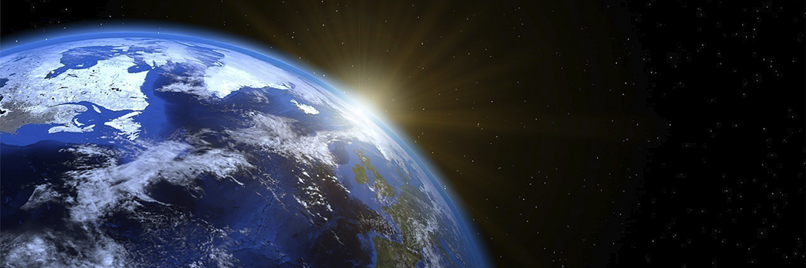

# Allah is the Creator of all things

- **Category:** 
- **Date:** 24/03/2013
- **Author:** 
- **Source:** https://www.quranproject.org/Allah-is-the-Creator-of-all-things-442-d

## Content

“Allah is the Creator of all things, and He is the Wakil (Trustee, Disposer of all affairs, Guardian) over all things.”
(I)
This blessed ayah comes at the beginning of the last fifth of
Surah Az-Zumar
, which is a Makkan Surah composed of 75 ayahs after the “Basmallah”.
The Surah is called
Az-Zumar
(The Groups) because it refers to the groups of disbelievers and polytheists entering into Hell, and the groups of devout believers entering into Paradise on the Day of Judgment.
The main theme of the
Surah
is creed. Nevertheless, in some of the ayahs it also refers to the nature of humans, the destiny of the believers and (the) disbelievers in the hereafter, and what has befallen the disbelievers of previous nations. The
Surah
gives many parables and signs of creation that proves the Omnipotence of the Divine Ability in creating the universe and resurrecting the dead.
Signs of creation in
Surah Az-Zumar
:
"He created the heavens and the earth with truth. He makes the night to go in the day, and makes the day to go in the night. And He has subjected the sun and the moon. Each running (on a fixed course) for an appointed term. Verily, He is the All-Mighty, the Oft-Forgiving"
[5]
"He created you (all) from a single person (Adam); then made from him his wife (Hawwa (Eve)). And He has sent for you of cattle eight pairs (of the sheep, two male and female; of the goats, two, male and female; of the oxen, two, male and female; and of the camels, two, male and female). He creates you in the wombs of your mothers; creation after creation in three veils of darkness. Such is Allah, your Lord. His is the Kingdom. La ilaha illa Huwa (none has the right to be worshipped but He). How then are you turned away?”
[6]
See you not that Allah sends down water(rain) from the sky, and causes it to penetrate the earth,(and then makes it to spring up)as water-springs, and afterward thereby produces crops of different colours, and afterward they wither and you see them turn yellow; then He makes them dry and broken pieces. Verily, in this is a Reminder for men of understanding.”
[21]
"Verily you (O Muhammad) will die, and verily they (too) will die”
[30]
"It is Allah Who takes away the souls at the time of their death, and those that die not during their sleep. He keeps those (souls) for which He has ordained death and sends the rest for a term appointed. Verily, in this are signs for a people who think deeply"
[42]
"Say (O Muhammad): "O Allah! Creator of the heavens and the earth! All-Knower of the Ghaib (unseen) and the seen! You will judge between Your slaves about that wherein they used to differ.”
[46].
“Allah is the Creator of all things, and He is the Wakil (trustee, Disposer of all affairs, Guardian) over all things.”
[62]
“They made not a just estimate of Allah such as is due to Him. And On the Day of Resurrection the whole of the earth will be grasped by His Hand and the heavens will be rolled up in His Right hand. Glorified be He, and High be He above all that they associate as partners with Him.” [
67].
“And the earth will shine with the light of its Lord (Allah, when He will come to judge among men): and the Book will be placed (open); and the Prophets and the witnesses will be brought forward; and it will be judged between them with truth; and they will not be wronged” [
69].
Each ayah of the previously mentioned ayahs requires its own special analysis to explain the scientific wonders in it. Surely, it would not be proper to analyse all nine ayahs in one article. So, I will confine this article to discussing the seventh ayah only. Before I begin, I find it necessary to introduce some scholars' interpretations of this ayah.
Interpretations of this ayah by some scholars:
"Allah is the Creator of all things, and He is the Wakil (trustee, Disposer of all affairs, Guardian) over all things.”
[62]
The author of “
Fi Zilal Al-Qur’an
” says: This last section of the Surah presents the truth of monotheism concerning the Oneness of the Creator and the Owner of all things. It puts an end to the disbelievers' offer, which was to worship the God of the Prophet (peace be upon him) if he would worship their gods in return. This was a strange offer since Allah is the Creator of all things, the Owner of the heavens and earth, the One who has no partners. How could He be worshipped along with someone else while everything on earth and in heavens belongs to Him Alone?
Scientific implications in this ayah:
The holy ayah states that everything that exists in both the visible and the hidden worlds is a creation of Allah. He has created all things with His knowledge, wisdom, and power, and protects this creation with His mercy. If the universe was left to its own care for even a twinkle of an eye, it would collapse and perish. Among the creatures of the hidden world the Qur'an mentions the angels and the jinn. The creatures of the visible world are human beings, animals, plants (all animate creatures), the different types of matter and energy (inanimate), and the different regions and places that are dimensions of the material world.
The process of creation itself with its three stages—the creation of the universe, living things, and then man—was a hidden operation that was not witnessed by man. Consequently, Allah the Almighty says in the Qur'an
"I (Allah) made them (Iblis and his offspring) not to witness (nor took their help in) the creation of the heavens and the earth and not (even) their own creation; nor was I (Allah) to take the misleaders as helpers." (II)
In addition, Allah also says
"Say: "Travel in the land and see how (Allah) originated the creation; and then Allah will bring forth the creation of the Hereafter (i.e. resurrection after death).Verily, Allah is Able to do all things."
[III]
Putting these two holy ayahs together makes it clear that although man did not witness the process of creation since it preceded his existence, Allah the Almighty has left for him in the earth's rocks and sky many perceptible clues to help the believer reach a correct idea about the process of creation.
As for the disbeliever, he sees the perceptible clues, touches it with his hands but in his attempt to assign the creation to someone other than Allah, he is lead astray by a flood of hypotheses and theories that lead him anywhere but to the truth.
That’s why Allah confirms what can be translated as:
“Allah is the Creator of all things, and He is the Wakil (trustee, Disposer of all affairs, Guardian) over all things”
[IV]
Moreover, many other Qur'anic ayahs emphasize the truth about creation so that the believers would not be deluded by the puzzles set up by the disbelievers and polytheists who are lead, and still lead people, astray even in our current scientific age. As a matter of fact, the verb "create" and its many derivations appear in the Qur'an 252 times emphasize that Allah is the Creator of all things.
The disbelievers' quandary concerning the age of the universe and the evolution of life on earth
In an attempt to deny the creation and the existence of the Creator, disbelievers from ancient times claimed that the world is eternal. Scientific explorations proving the extreme antiquity of the universe and life on earth were thought by atheists to support such a claim. Moreover, the evolutionary process in creation has been discovered, starting from the creation of primary cells in substances to the creation of animate organisms, plants, and animals until, at the very end, it was all crowned by the creation of man as such an honored creature. Still, disbelievers used such discoveries in supporting their false claims of “random creation” which has no proof. Allah's creations were created over prolonged intervals. It is only Him Who has the power to say to something, “Be.” and it happens. This is for two obvious reasons:
First: Allah wanted to give those who contemplate nature a chance to figure out His laws that govern this universe so that they would use them in establishing a good life on earth. Moreover, this will help them to recognize part of the Creator's great power, knowledge, and wisdom which will lead them to prostrate to Him in worship and obedience. It will also help them to observe the harmony in building the universe which declares Allah's Oneness, to see the duality of all his creatures, from the one celled organism to the human being, which prove Allah's Perfection and Oneness, having no partners or rivals. He created all things. How dare anyone assign himself to His level?
"Surely, disbelievers are those who said:" Allah is the third of the three (in a Trinity)." But there is no Ilah (god) (none who has the right to be worshipped) but One Ilah (God-Allah).And if they cease not from what they say, verily, a painful torment will befall on the disbelievers among them.”
[V]
Second: Time is a boundary made by Allah, a boundary that limits Allah’s creatures. It is essentially a creature, and a creature could never limit its creator. No matter how much time progresses it is always within the controlling fingers of Allah, dependant upon His will. Instead of understanding the issue this way, materialistic people rush into denying the process of creation and its Creator by claiming that this universe is eternal and random, contradicting all scientific observations found in the earth and the skies. But the Qur'anic ayah we are dealing with, along with hundreds of other ayahs, prove that Allah is the Creator of all things refute the claims about the random and eternal universe.
The antiquity of the universe and the refutation of its eternity proves the truth of creation
Scientific observation of the known universe proves that heat energy transfers from bodies of greater temperature to bodies of lower temperature. If the universe were eternal as they claim, hot and cold bodies would have become the same temperature and this universe would have ended long time ago. The existence of the universe until today with the continuation of heat transfer refutes the claim of its eternity and infinity and proves that it is nothing but a creation that has a beginning (more than 10 billion years ago—scientists estimate approximately 14 billion years) and must have an end one day, that only Allah knows. The current laws governing the universe indicate that this end is inevitable, yet they cannot predict when it will happen. For example, the sun loses 4.6 million tons of energy from its mass every second and the same applies on the rest of the stars. So, our universe is definitely on its way to an end at a moment which only Allah the Almighty specifies. Allah says in His holy book what can be translated as:
"They ask thee about the Hour (Day of Resurrection): "when will be its appointed time?" Say: "The knowledge thereof is with my Lord (Alone). None can reveal its time but He. Heavy is its burden through the heavens and the earth. It shall not come upon you except all of a sudden." They ask you as if you have a good knowledge of it. Say:" the knowledge thereof is with Allah (Alone), but most of mankind know not."
[VI]
(I) Surah Az-Zumar (The Groups): 62
(II) Surah Al-Kahf (The Cave): 51
(III) Surah Al-Ankaboot (The Spider): 20
(IV) Surah Az-Zumar (The Groups): 62
(V) Surah Al-Ma'ida (The Table spread with Food): 73
(VI) Surah Al-A`raf (The Heights): 187
Source: Dr. Zaghloul El-Naggar [External/non-QP]