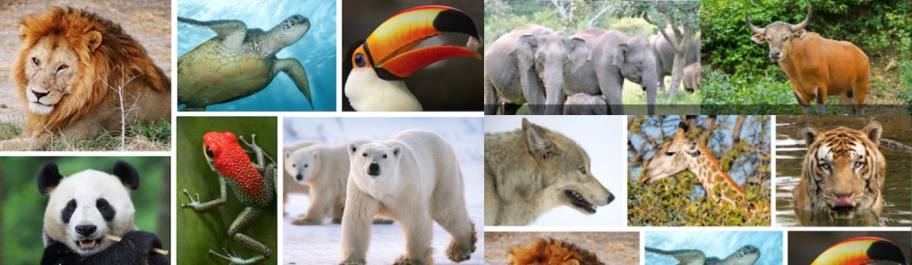

# Behavioural Patterns of Species are like Humans

- **Category:** 
- **Date:** 08/11/2023
- **Author:** 
- **Source:** https://www.quranproject.org/Behavioural-Patterns-of-Species-are-like-Humans-648-d

## Content

وَمَا مِنْ دَابَّةٍ فِي الْأَرْضِ وَلَا طَائِرٍ يَطِيرُ بِجَنَاحَيْهِ إِلَّا أُمَمٌ أَمْثَالُكُمْ
“And there is no creature on [or within] the earth or bird that flies with its wings except [that they are] communities like you”
Qur’ān 6:38
Key words – إِلَّا أُمَمٌ أَمْثَالُكُمْ – ‘communities like you [i.e. humans]’ – Here the Creator informs us  that the community structure and behavioural patterns of every single set of species in existence [as God does not exclude any] is similar مثل to how we as human beings are –  some of us live as married couples, single parents, groups of small family, large tribes, etc.
God has made some animals smart and resourceful and others relaxed and trusting. Some insects store a year’s worth of food for themselves, and others rely on the fact that daily provision is guaranteed for them. Some do not know their offspring at all; some look after their own offspring but not others; some never acknowledge their offspring once they become independent.
Some recognise and appreciate kind treatment, whilst for others it does not mean a thing. Some prefer others to themselves, whilst others, if they gain enough to provide for an entire community of their species, will not let any other come near it. Some animals will not harm unless severely provoked, whilst others will hurt without provocation.
Some bear grudges and never forget if someone hurts them, whilst others do not remember at all. Some never get angry, whilst others get angry quickly and are not easily calmed. Some have very precise knowledge of things which most people know nothing about, and some do not know about anything at all. Some learn quickly and some learn slowly.  All this points to the similarities of the behavioural patterns of humans and the various species.
Sufyan ibn Uyaynah, an early Muslim scholar, said, “there is no human being on Earth who does not resemble animals in some way...some run like wolves, some bark like dogs and some flaunt themselves like peacocks. Some people resemble pigs in that if you offer them good food they will not touch it, but if a man gets up from defecating, they will come and roll in it. Hence, you find some people who, if they hear fifty words of wisdom they will not remember anything of that, but if a man does one thing wrong, that will stay in their memory.”
The Qur’ān describes the Creator as –
الَّذِي أَعْطَىٰ كُلَّ شَيْءٍ خَلْقَهُ ثُمَّ هَدَىٰ
“...He who gave everything its creation and then guided [it].”
Qur’ān 20:50
Note - كُلَّ شَيْءٍ – every single entity – From the stars in the galaxies to every living species, to every different type of cell in an organism to the molecular level of an atom - every single entity has its function and role that is inherent within it - i.e. created and then guided.
Those who study how species behave, will know that in their own ecosystems, every animal from the lion, the snake to the butterfly - each of them has been born with inherent and instinctive patterns of behaviour that drives and guides them in all aspects of their lives from seeking food to seeking a mate.
The monarch butterfly, for example, who is born never meeting its parents - yet knows exactly what to eat, where to fly to, how to attract a mate and fly back to the ancestral home of its great great grandparent in a single season.
Read more here -
Scientific Truths and the Qur'an