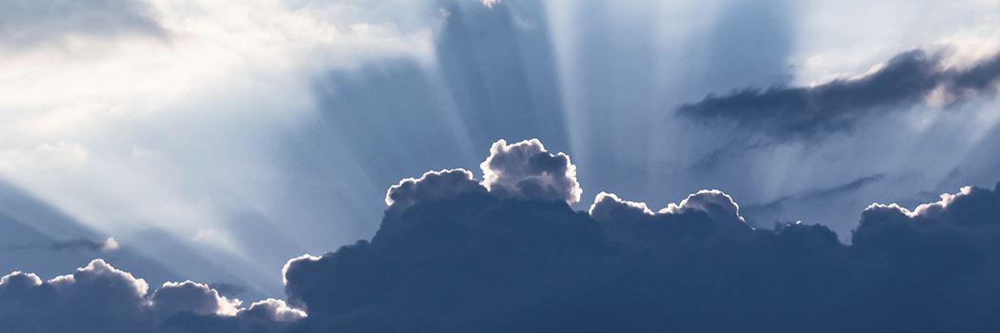

# Belief in Angels

- **Category:** 
- **Date:** 24/02/2013
- **Author:** 
- **Source:** https://www.quranproject.org/Belief-in-Angels-376-d

## Content

In common folklore, angels are thought of as good forces of nature, hologram images, or illusions.  Western iconography sometimes depicts angels as fat cherubic babies or handsome young men or women with a halo surrounding their head.  In Islamic doctrine, they are real created beings who will eventually suffer death, but are generally hidden from our senses.
They are not divine or semi-divine, and they are not God’s associates running different districts of the universe.  Also, they are not objects to be worshipped or prayed to, as they do not deliver our prayers to God.  They all submit to God and carry out His commands.
In the Islamic worldview, there are no fallen angels: they are not divided into ‘good’ and ‘evil’ angels.  Human beings do not become angels after death.  Satan is not a fallen angel, but is one of the jinn, a creation of God parallel to human beings and angels.
Angels were created from light before human beings were created, and thus their graphic or symbolic representation in Islamic art is rare.  Nevertheless, they are generally beautiful beings with wings as described in Muslim scripture.
Angels form different cosmic hierarchies and orders in the sense that they are of different size, status, and merit.
The greatest of them is Gabriel. The Prophet of Islam actually saw him in his original form.  Also, the attendants of God’s Throne are among the greatest angels.  They love the believers and beseech God to forgive them their sins.  They carry the Throne of God, about whom the Prophet Muhammad, may the mercy and blessings of God be upon him, said:
“I have been given permission to speak about one of the angels of God who carry the Throne.  The distance between his ear-lobes and his shoulders is equivalent to a seven-hundred-year journey.” (Abu Dawood)
They do not eat or drink.  The angels do not get bored or tired of worshipping God:
“They celebrate His praises night and day, nor do they ever slacken.”
(21:20)
The Number of Angels
How many angels there are? Only God knows.  The Much-Frequented House is a sacred heavenly sanctuary above the Kaaba, the black cube in the city of Mecca.  Every day seventy thousand angels visit it and leave, never returning to it again, followed by another group.[1]
The Names of Angels
Muslims believe in specific angels mentioned in the Islamic sources like Jibreel (Gabriel), Mika'eel (Michael), Israfeel, Malik - the guard over Hell, and others. Of these, only Gabriel and Michael are mentioned in the Bible.
Angelic Abilities
The angels possess great powers given to them by God.  They can take on different forms.  The Muslim scripture describes how at the moment of Jesus’ conception, God sent Gabriel to Mary in the form of a man:
“…Then We sent to her Our angel, and he appeared before her as a man in all respects.”
(19:17)
Angels also visited Abraham in human form.  Similarly, angels came to Lot to deliver him from danger in the form of handsome, young men.  Gabriel used to visit Prophet Muhammad in different forms.  Sometimes, he would appear in the form of one of his handsome disciples, and sometimes in the form of a desert Bedouin.
Angels have the ability to take human forms in some circumstances involving common people.
Gabriel is God’s heavenly messenger to mankind.  He would convey the revelation from God to His human messengers.  God says:
“Say: whoever is an enemy to Gabriel - for he brings down the (revelation) to your heart by God’s will...”
(Quran 2:97)
Tasks of the Angels
Some angels are put in charge of executing God’s law in the physical world.  Michael is responsible for rain, directing it wherever God wishes.  He has helpers who assist him by the command of his Lord; they direct the winds and clouds, as God wills.  Another is responsible for blowing the Horn, which will be blown by Israafeel at the onset of the Day of Judgment.  Others are responsible for taking souls out of the bodies at the time of death: the Angel of Death and his assistants.  God says:
“Say: the Angel of Death, put in charge of you, will (duly) take your souls, then shall you be brought back to your Lord.”
(32:11)
Then there are guardian angels responsible for protecting the believer throughout his life, at home or traveling, asleep or awake.
Others are responsible for recording the deeds of man, good and bad.  These are known as the “
honorable scribes
.”
Two angels, Munkar and Nakeer, are responsible for testing people in the grave.
Among them are keepers of Paradise and the nineteen ‘guards’ of Hell whose leader is named ‘Malik.’
There are also angels responsible for breathing the soul into the fetus and writing down its provisions, life-span, actions, and whether it will be wretched or happy.
Some angels are roamers, traveling around the world in search of gatherings where God is remembered.  There are also angels constituting God’s heavenly army, standing in rows, they never get tired or sit down, and others who bow or prostrate, and never raise their heads, always worshipping God.
As we learn from above, the angels are a grandiose creation of God, varying in numbers, roles, and abilities. God is in no need of these creatures, but having knowledge and belief in them adds to the awe that one feels towards God, in that He is able to create as He wishes, for indeed the magnificence of His creation is a proof of the magnificence of the Creator.
Footnotes:
[1] Saheeh Al-Bukhari.
Source:  islamreligion.com [External/non-QP]