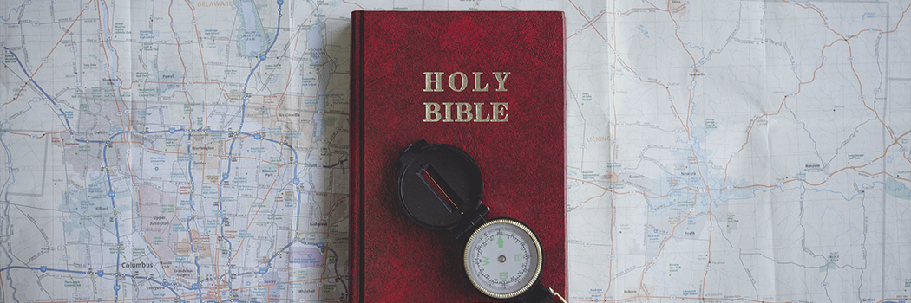

# Bible: A Closer Look

- **Category:** 
- **Date:** 24/02/2013
- **Author:** 
- **Source:** https://www.quranproject.org/Bible-A-Closer-Look-314-d

## Content

First of all, let me begin by saying that I am a former Christian, preacher, minister of music and organist for a  long number of years in the Disciples of Christ Church, Baptist, Methodist churches and The Church of God.  I totally and completely accepted the teachings and concepts of salvation within the Christian church many  years ago. My parents were very religious and their parents were also very instrumental in building and  supporting the work of the church throughout their entire lives. So, it is not my aim to discredit the efforts of  those who came before me whatsoever. This is totally the opposite of my purpose in this presentation.
Second, I am still most active in the spreading of the True Word of God as much as HE will allow me to be. I  have found that some of the teachings of the translations of the Bible contain errors and mistakes which  must be examined and thought through so as to bring about a better understanding for both the Christians  and the non-Christians, especially those of the Muslim (Islam) faith.
Third, I am presently an institutional chaplain and I hold the position of Delegate to the United Nations  Peace  Conference for the World's Religious Leaders. As such I hold all the leaders of other religions in proper  regard and with due respect. Many of my associates and co-workers are from the Catholic, Protestant,  Jewish and Hindu faiths.
Therefore, it is not my intention to cause people to lose their belief in God, His divinely-inspired prophets  and messengers, or the holy scriptures that they brought. I humbly request all who read and study these  pages to be considerate of those who are committed to believe in the scriptures of the Bible and not use  this  material as a tool for attacking and harming the faiths of others. The opposite is what I request the reader to  do. Please take time to learn the materials and then share in a positive light with those whom you honestly  feel can handle a discussion on this topic without being confrontational.
May Almighty God guide all of us the all truth, amen.
An examination of the Bible is necessary today because of the many questions being raised by religious  people of all circles, including Jews and Christians, as to its inconsistency with contemporary church  teachings as well as its inconsistency within itself.
Today, there are thousands of different versions of the Bible in circulation and the transcript has been freely  translated from one language to another numerous times. According to Bible scholars themselves, the  original scripture is no longer extant. It is nowhere to be found. We have no idea if what we are reading and  implementing into our lives and belief system is, indeed, God's teaching.
Muslims believe in the same Omnipotent, All-powerful, Unseen God that the Jews have believed in since  Adam. However, unlike the Jews, Muslims join in with the Christians by also believing in Jesus as the  "Christ"; "Messiah"; "Logos"; and "Miraculous Conception"; as well as all the previous Biblical prophets and  their original scriptures that they brought. Muslims also believe that God is merciful and just to His creatures.  So, they deny the concept of the 'Original Sin' [all children are born into the sins of their parents] and the  'Sacrificial Lamb' concept which requires the blood of Jesus, peace be upon him, to atone for the sins of the  sinners. This being the case, how can Muslims say that God is just and that His revelation, the Bible, is  corrupted? Where is it in God's great plan that His revelation loses all credibility? These are all very  excellent questions.
It is a known fact that Jesus was regarded by his followers as a prophet and that what he preached was  written down into physical form by his disciples. However, God placed the responsibility on humans to  preserve the integrity of this message over time. When the people failed in their duty, it was made necessary  for the Holy Quran to come into existence in order to correct the teachings that were changed. By God's  mercy He revealed His will once again to Muhammad over 600 years later, and his companions similarly  wrote it down and compiled it into what became known as The Holy Quran. By God's justice He promised  that He would preserve it therefore making it the last revelation to humanity. Today an actual seventh  century Quran, complete and intact, is on display in a museum in Istanbul, Turkey.
Amazing Revelation
Strange as it may seem I came across astonishing information By Allah's Mercy I have learned the Arabic  language sufficient enough to read the Holy Quran in the original language. I have found the answers to  problems of understanding meanings of scriptures in the Bible while studying the Holy Quran.
Every Arabic Quran in the world today is, letter for letter, identical to this ancient script. Due to this  preservation, the Quran exists today exactly as it did over 1,400 year ago in a language which is still alive  today. I have found the Quran's teachings to be quite clear, consistent, and practical for application even in  today's so called "modern world."
The whole idea behind this work is to present the clear truth about the Bible, the Quran and the two religions  of Islam and Christianity. If you do not have a good Bible, it would be a good idea to acquire at least two.  Namely, the King James Version (based on the 1611 AD edition) and the Revised Standard Version  (published in 1953). As you go through the many Biblical inconsistencies which I will be referring to in this  material, please refer back to your Bible and examine it objectively.
Do not let pride, ego, bias or prejudice affect your judgment as you review the pages. If you do not free your  mind and heart from these obstructions, then it will be near to impossible to see the light of truth to which we  will be referring so often.
Bear in mind also, that if a book were revealed from Almighty God to the humans, it should not have even a  single mistake or error anywhere in it. Otherwise, it would indicate that it is not from a Perfect God, but  rather from an imperfect human.
While traveling around the world, I have found that many Jews and Christians are opening their eyes to this  fact and are wilfully accepting Islam and the Last and Final Testament of Almighty God (the Holy Quran)  wholeheartedly.
We have to examine the facts in order to be able to better understand the value of this information on our  society today. One statement that is clear and repeated often these days is that Islam is the fastest growing  religion in the world today and the largest religion in the world today with over 1.5 billion souls claiming to be  Muslims. The word of God has been preserved in the Holy Quran and has been changed in the Bible.
So, I  am merely attempting to produce material which will help to clarify the matter. Due to the many years of  traditional religious teachings and upbringing, it may be very difficult for you to accept this. If you are sincere  in your heart and pray to the One Who Created you in the first place, then it will be totally up to Him to Guide  you to all truth, not me. Islam is a complete Way of Life and it is based on total surrender to Almighty God,  submission to Him in complete obedience and sincerity and in peace.
Chapter 1:
Is 'King James' Version the Actual Bible?
Note: The word "Bible" comes from the Koine Greek word "biblios" and it simply means the same as the  word "book" in English. Nowhere in the Bible do we find the word "Bible." However, it is interesting to note  the word "kitab" (Bible in Arabic) appears many times in the Quran, referring to the Bible and the People of  the Book (Jews and Christians).
Let me begin by saying that the King James "version" of the Bible is in English. There was no English  language until the year 1066 AD when the Normans invaded the Saxons. Therefore the English Bible  cannot be anything like what any of the prophets spoke or understood, as it did not exist in their times.
Next, my grandfather, who was a devout and wonderful Christian man gave a gift of the Holy Bible to my  sisters and I almost fifty years ago. It was an authorized version of the Bible, being The Revised Standard  Version of the Bible which was a revised version of the American Standard Version, published in 1901,  which was a version of the King James Version, published in 1611, which was revised and corrected for the  first time in 1612, etc. I was very much impressed with the easier to read text and clarification of some of the  wording which was presented in this version and began to read the Bible on a daily basis for hours at a  time.
The removal of the Elizabethton English terms, phrases and expressions made the Bible a more accessible  and understandable and intimate Book for me. But that is not all the RSV did for me and many others, as  well.
My love and respect for the Word of God increased the more that I spent time reading and understanding the message. The Bible became my most prized and respected book in my life. I often turned to it  throughout the rest of my life in times of joy, happiness, sadness, troubles and pain. It was my compass, my  road map, my weather vane and my friend. However, there were still some problems with this IMPROVED  VERSION of the Holy Bible. It began to disturb and concern me to the extent that I made consultation with  my father, who was also an ordained minister and student of the Bible since childhood. Based on his  research and background in the origin and sources for modern day Christianity, I began to go deeper into  the problems which had plagued my thinking and faith since childhood.
I prayed to Almighty God and then found the answers to some of the problems were spelled out very clearly  in the very beginning of the exact same book. I have that book lying in front of me on my desk as I write this  article and would like to quote to you from some of the Preface page iii and iv:
"The King James Version has with good reason been termed 'the noblest monument of English prose.' Its   revisers in 1881 expressed admiration of 'its simplicity, its dignity, its power, its happy turns of express... the  music of its cadences, and the felicities of its rhythm.' It entered, as no other book has, into the making of  the  personal character and the public institutions of the English-speaking peoples. We owe to it an incalculable  debt."
"Yet the King James Version has grave defects. By the middle of the nineteenth century, the development of  Biblical studies and the discovery of many manuscripts more ancient than those upon which the King James
Version was based, made it manifest that these defects are so many and so serious as to call for a revision  of the English translation. The task was undertaken, by authority of the Church of England, in 1870. The  English Revised Version of the Bibles was published in 1881-1885; and the American Standard Version, its  variant embodying the preferences of the American scholars associated in the work, was published in 1901."
"Because of the unhappy experience with unauthorized publications in the two decades between 1881 and  1901, which tampered with the text of the English Revised Version in the supposed interest of the American  public, the American Standard Version was copyrighted, to protect the text from unauthorized changes. In  1928 this copyright was acquired by the International Council of Religious Education, and thus passed into  the ownership of the churches of the United States and Canada which were associated in this Council  through their boards of education and publication."
".... decision was reached that there is need for a thorough revision of the version of 1901..""In 1937  the  revision was authorized by vote of the Council."
"Thirty-two scholars have served as members of the Committee charged with making the revision, and they  have secured the review and counsel of an Advisory Board of fifty representatives of the co-operating  denominations."
"Each section has submitted its work to the scrutiny of the members of the charter of the Committee requires  that all changes be agreed upon by a two-thirds vote of the total membership of the Committee."  "The problem of establishing the correct Hebrew and Aramaic text of the Old testament is very different from  the corresponding problem in the New Testament."
"For the New Testament we have a large number of Greek manuscripts, preserving many variant forms of  the text. Some of them were made only two or three centuries later than the original composition of the  books."
"For the Old Testament only late manuscripts survive, all (with the exception of the Dead Sea Texts of Isaiah  and Habakkuk and some fragments of other books) based on a standardized form of the text established  many centuries after the books were written."
"The present revision is based on the consonantal Hebrew and Aramaic text as fixed early in the Christian  era and revised by Jewish scholars (the 'Masoretes') of the sixth to ninth centuries. The vowel signs, which  were added by the Masoretes, are accepted also in the main, but where a more probable and convincing  reading can be obtained by assuming different vowels, this has been done."
"... vowel points are less ancient and [less] reliable than the consonants."
"Departures from the consonantal text of the best manuscripts have been made only where it seems clear  that errors in copying had been made before the text was standardized."
"Most of the corrections adopted are based on the ancient versions [translations into Greek Aramaic,  Syriac,  and Latin], which were made before the time of the Masoretic revision and therefore reflect earlier forms of  the text."
"Sometimes it is evident that the text has suffered in transmission, but none of the versions provides a  satisfactory restoration. Here we can only follow the best judgment of competent scholars as to the most  probable reconstruction of the original text."
"Many difficulties and obscurities, of course, remain."
"Where the choice between two meanings is particularly difficult or doubtful, we have given an alternative  rendering in a footnote."
"If in the judgment of the Committee the meaning of a passage is quite uncertain or obscure, either  because  of corruption in the text or because of the inadequacy of our present knowledge of the language, that fact is  indicated by a note."
"It should not be assumed, however, that the Committee was entirely sure or unanimous concerning  every  rendering not so indicated."
"To record all minority views was obviously out of the question."
"The King James Version of the New Testament was based upon a Greek text that was marred by  mistakes,  containing the accumulated errors of fourteen centuries of manuscript copying."
"It was essentially the Greek text of the New Testament as edited by Beza, 1589, who closely followed that  published by Erasmus, 1516-1535, which was based upon a few medieval manuscripts."
"The earliest and best of the eight manuscripts which Erasmus consulted was from the tenth century, and  [yet] he made the least use of it because it differed most from the commonly received text; Beza had access  to two manuscripts of great value, dating from the fifth and sixth centuries, but he made very little use of  them because they differed from the text published by Erasmus."
"We now possess many more ancient manuscripts of the new Testament, and are far better equipped to  seek to recover the original wording of the Greek text. The evidence for the text of the books of the New   Testament is better that for any other ancient book, both in the number of extant manuscripts and in the  nearness of the date of some of these manuscripts to the date when the book was originally written."
The words are in plain English. The second paragraph says it all, "Yet, the King James Version has grave  defects.
Therefore, we must conclude the "King James Version" is NOT the Actual Bible sent by God to mankind.
Chapter 2:
Contradictions in the Bible?
First and foremost, let me be perfectly clear on the position of Muslims regarding the authenticity of the Holy  Bible. It is a condition of faith for believers to believe in all of God's Books and scripture as stipulated by the  Quran, the Last and Final Testament from Almighty God to mankind, that the previous scriptures, including  of course the Old Testament (Arabic = Torah), the Psalms (Arabic = Zabur) and the New Testament (Arabic  = Injeel) were all from Almighty God (Arabic = Allah) in their original form. The beginning verses of the  Quran clearly spell out the position of the 'Believer' with regard to these scriptures. As the translation from  Arabic may be rendered regarding the conditions of believers:
"And they (believers) believe in what is being sent down to you (Muhammad, peace be upon him) and  they  believe in what has been sent down before (previous Holy scriptures to Abraham, Moses, David, Solomon,  and of course Jesus, peace be upon them all)."
[Quran 2:2,3]
Therefore, it must be established that Muslims do accept that Almighty Allah did send down many Holy  Books and he did allow the people to alter, change, delete and make additions to these Books, and as  such,  they can not longer be considered as the "Word of God" in their present condition. This is something  immediately agreed upon by all qualified Biblical scholars.
Incidentally, there is sufficient evidence in the Quran to prove the remainder of the Bible still contains many  of the original teachings and sayings of the prophets to whom the various scriptures were revealed.
From the previous chapter we can easily determine that the original source of the Bible, both the Old and  New Testaments have been lost and are no longer extant in any language. What has remained and been  referred to for translations, is in fact nothing more than old copies that do not necessarily agree with each  other and there does exist in them obvious corruption in additions and deletions. Additionally, they are  not  complete and do not have full agreement of the scholars of the Bible as to their meanings.
Just to offer a few of the many contradictions and errors of that which is being presented as the "Word of  God" in the Bible I would like to quote the research of scholars of the Bible:
Verses that contradict themselves.
Genesis 6:3 and Genesis 11:11 - Life limited to 120 years?  Genesis 32:30 and Exodus 33:20 - Jacob's life was preserved?  Exodus 4:22 and Jeremiah 31:9 - Who was God's firstborn?  Numbers 23:19 and Genesis 6:6-7 - Does God repent or not?  2 Samuel 6:23 and 2 Samuel 21:8 - Did Michael have children?  2 Samuel 8:4 and 1 Chronicles 18:4 - 700 or 7000 horsemen?
2 Samuel 8:9-10 and 1 Chronicles 18:9-10 - Toi or Tou? Hadadezer or Hadarezer? Joram or Hadoram?  2 Samuel 10:18 and 1 Chronicles 19:18 - 700 or 7000 charioteers? 40,000 horsemen or footmen? Captain's   name?
2 Samuel 24:1 and 1 Chronicles 21:1 - Who provoked David?  2 Samuel 24:9 and 1 Chronicles 21:5 - 800,000 or 100,000?  2 Samuel 24:13 and 1 Chronicles 21:11-12 - 7 or 3 years?  1  Kings 4:26 and 2 Chronicles 9:25 - 40,000 or 4,000 stalls?  1 Kings 5:15-16 and 2 Chronicles 2:2 - 3300 or 3600?  1 Kings 7:26 and 2 Chronicles 4:5 - 2000 or 3000 baths?  2 Kings 8:26 and 2 Chronicles 22:2 - 22 or 42 years old?
2 Kings 24:8 and 2 Chronicles 36:9 - 18 or 8 years old? 3 months or 3 months and 10 days?  Ezra 2:65 and Nehemiah 7:67 - 200 or 245 singers?
Matthew 1:12 and Luke 3:27 - Who was Salathiel's father?  Matthew 1:16 and Luke 3:23 - Who was Joseph's father?  Matthew 9:18 and Mark 5:22-23 - Dead or not?  Matthew 10:5-10 and Mark 6:7-8 - Bring a staff or not?
Matthew 15:21-22 and Mark 7:24-26 - The woman was of Canaan or Greece?  Matthew 20:29-30 and Mark 10:46-47 - One or two beggars?
Matthew 21:1-2 and Mark 11:1-2 - What happened to the ass?  Matthew 26:74-75 and Mark 14:72 - Before the cock crow once or twice?  Matthew 27:5 and Acts 1:18 - How did Judas   die?
John 3:16 and Psalms 2:7 - Only begotten son?  John 5:31 and John 8:14 - Was Jesus' record true or not?
Verses that contradict the Trinitarian Doctrine and/or the divinity of Jesus.
Exodus 33:20, John 1:18, 1 Timothy 6:16 - No one saw God.  Isaiah 42:8 - Do not praise and worship images.
Isaiah 45:1 - "Anointed" does not mean "God".  Matthew 14:23, 19:13, 26:39, 27:46, 26:42-44 - Jesus prayed.  Matthew 24:36 - Jesus was not all-knowing.
Matthew 26:39 - Jesus and God had different wills.  Matthew 28:18 - All power was given to Jesus.  Mark 1:35, 6:46, 14:35-36 - Jesus prayed.
Mark 10:17-18 and Luke 18:18-19 - Jesus denied divinity.
Mark 12:28:29 - God is one   Mark 13:32- Jesus was not all-knowing.
Mark 16:19 and Luke 22:69 - Jesus at the right hand of God.  Luke 3:21, 5:16, 6:12, 9:18, 9:28, 11:1-4, 22:41 - Jesus prayed.  Luke 4:18, 9:48, 10:16 - Jesus was from God.
Luke 7:16, 13:33, 24:18-19 - Jesus was a prophet.  Luke 10:21 - Jesus gave thanks.
Luke 23:46 - The spirit of Jesus was commended to God.  John 4:19 - Jesus was a prophet.
John 4:23-24 - Worship in spirit and truth.  John 14:28 - One was greater than the other.  John 5:19, 5:30, 7:28, 8:28 - Jesus was helpless.  John 5:20 - The Father showed the son.
John 5:30 and 6:38 - Jesus and God had different wills.  John 5:31-32 - Jesus' witness was not true.
John 6:11 and 11:41-42 - Jesus gave thanks.  John 6:32 - The Father was the provider, not the son.  John 7:29, 16:5, 16:28 - Jesus was from God.
John 7:16, 12:49, 14:24, 17:14 - Jesus' words were not his.  John 8:42 - Jesus did not come of himself.
John 10:29 - "My Father, which gave them me, is greater than all."  John 14:1 - Jesus said, "...believe also in me."
John 14:16, 17:1, 17:9, 17:11, 17:15 - Jesus prayed.  John 14:31 and 15:10 - Jesus followed commands.
John 17:6-8 - "I have given unto them the words which thou gavest me."  John 20:17 - Jesus had a god.
Acts 2:22 - Jesus was "a man approved of God."  Romans 8:34 - Jesus was an intercessor.
1 Timothy 2:5 - Jesus was the mediator between God and humans.
Incidentally, these are really only some selections of contradictions and inaccuracies found in the modern  versions of the Bible. There are many more but for the sake of time and space we have limited ourselves to  those listed above.
Again I would like to repeat, the Muslim must believe in all original texts coming from Almighty God. The only subject being discussed here is whether or not the Bible being offered today in the English language is in  fact, the real "Bible".
Chapter 3:
Who is the God of the Bible?
"ONE" - 'should not be taken literally'
Mark 10:6-9 and John 14:20, 15:1-7, 17:11, 17:18-23, 17:26
There are many verses in the Bible that speak of Jesus and God as being "one".
But does this necessarily mean that Jesus is God? If you read the six selections above then you will see that  we cannot take the word "one" so literally. If we do, then we are God, as Jesus said, "...they also may be  one in us" and "...they may be one, even as we are one." What the Bible means when it says that Jesus is  "one" with God is that he is extremely close to god, "as if" they are one. John 17:18-23 tells how we normal  human beings can attain this "oneness" (or "closeness") with God by being "sanctified through the truth."  Aside from this, neither the word "trinity" appears anywhere in the Bible nor any explanation of such a thing.
"Lord" Does not necessarily mean "God"
Matthew 18:23-34, Luke 19:11-21, and John 20:26-29
Many of Jesus' disciples referred to Jesus as "Lord". Even Jesus himself said that he is their Lord. But does  this mean that he is their God? If you read the three short stories above then you will realize that back in the  Biblical time period most servants referred to their masters as "lord". This was a common practice because it  showed honor and respect for a person of such high stature.
"Lord" - A Lofty Title
Even today in many countries around the world such as England, "lord" is used in referring to kings, princes,  and others who deserve such a lofty title. The disciples and followers of Jesus viewed him as their earthy master and themselves as his servants. He was a man from God who brought them God's message of truth,  justice, and peace. Who could be more deserving of the title "lord" than Jesus Christ? Besides, "lord" is  defined by Webster in many curious ways.A few of them are as follows:
1. A man of high rank in a feudal society.
2. A king.
3. A general masculine title of nobility or rank.
4. A man of renowned power.
5. A man who has mastery in a given activity or field.
Commenting on the word's history, Webster says that "lord" literally means 'guardian of the bread'". He  continues, "Since such a position would be the dominant one in the household, lord came to denote a  man  of authority and rank in society at large."
In The Holy Quran also uses "lord" in the same context (see 12:23 and 12:41-42). This was simply the  language of the time.
The word "lord" does not render the person which it is being applied to as God. If this were the case, then  many human beings in the Bible would have to be considered God.
Chapter 4 : Does Bible Say 'Jesus is God'?
Jesus Denied Divinity
Mark 10:17-18 and Luke 18:18-19
These verses are most indicative of Jesus' position and real nature. The verse in Mark reads:
"As he [Jesus] was setting out on a journey, a man ran up and knelt before him, and asked him, 'Good  Teacher, what must I do to inherit eternal life?' Jesus said to him, 'Why do you call me good? No one is  good but God alone."
If you analyze this verse in truth you will see that Jesus, quite simply, is not God. If he was, why then would  he say "No one is good but God alone"? Jesus did not want to be called "good" because he was not God.  That title, as Jesus admits, belongs to none but God.
This subject was actually a part of another book that I have been in the process of writing for a number of  years. Considering the fact that I may never finish it, I have taken the liberty to put some of it down on paper  and then compared it to findings of other Christian preachers who have come to Islam and you can read  that  online at:
http://www.911bible.com/son_of_who.php
Chapter 5: What Does it all Mean?
Conclusion
If all of this has confused you it's probably because you've been trying to justify your belief in the Trinity. To  believe in the Trinity goes against all of the teachings of Jesus, as well as the Bible. This is because the
Trinity is a man-made doctrine that was drawn up several hundred years after Jesus. In this time period  different  interpretations of the Bible were causing serious debates among Christians. The various  interpretations were, undoubtedly, due to human perversion of the original scriptures, poor preservation,  and/or shoddy translations. One of the main things being questioned was the nature of God and Jesus. Was  Jesus actually God, the son of God, or just a messenger? The Council of Nicea was formed in an attempt to  settle this dispute, and the Nicea Creed (the Trinitarian doctrine) was subsequently hammered out.
Again, as I stated in the beginning, this writing has not been complied to put down or destroy the true  teachings of the Bible and the Prophets. I would like to quote from a version of the Bible wherein Jesus is  represented as saying:
"Think not that I came to destroy the Law [Torah] and the Prophets [prophethood]. I did not come to  destroy  them, but rather to fulfill them. For truly, I say to you, not an iota, not a dot, will pass from the Law until all is  accomplished. Whoever then relaxes one of the least of these commandments [from the Law] and teaches  men so, shall be called least in the Kingdom of heaven; but he who does them and teaches  them shall be  called great in the Kingdom of heaven. For I tell you, unless your righteousness exceeds that of the scribes  and Pharisees, you will never enter the kingdom of heaven." [Matt. 5:17]
It is wrong to assume that our beliefs are true simply because our teachers, preachers and parents have  taught us something passed down to them by generations of forefathers before them. What I would invite all  of us to do is to do research for ourselves and learn from reliable sources what is the origin of modern  Christianity and what should be our perspective on true belief in general. We can only achieve this with open  minds and hearts.
So, may the Great God of the Universe guide us all with His perfect Guidance to all truth, Ameen.
Chapter 6: What to do Now?
It is not at all logical to simply accept a belief system because it was passed down to you by your parents.  After all, what if it is not correct? A system for belief should be based upon sound principles of reasoning  and understanding, rather than feelings and emotions.
As regards the Muslims treatment of Jesus, peace be upon him, it should be kept in mind that, although they  do not hold him to be the 'son of god' in Christianity, he is definitely held in high esteem as great prophet,
'Miraculous birth'
and also believe in the same unseen God that he referred to as
"Your Lord and my Lord,  your God and my God."
Please take time to read the articles on this site. Print them out and share with others. Write to us and visit  our website for more information about the world's largest and most compatible religions; Islam and  Christianity. Research for yourself the Council of Nicea and the preservation of the Bible, or lack thereof.
There are a number of books which are easily accessible written by experts and scholars on the Bible which  are very enlightening on this subject:
"Who Wrote the Bible" - Richard Elliott Friedman [excerpts]
"Who Wrote the Dead Sea Scrolls?" - Norman Golb
"The Book of 'J'" - Harold Bloom & David Rosenberg
"The Text of the New Testament - Its Transmission, Corruption, & Restoration" - Bruce M. Metzger
Islam is truly and simply a complete way of life and set of rules taught by all the Prophets to mankind, similar  to Biblical teachings that were revealed to humankind after Jesus through the last and final Prophet  Muhammad.
Source:  missionislam.com  [External/non-QP]