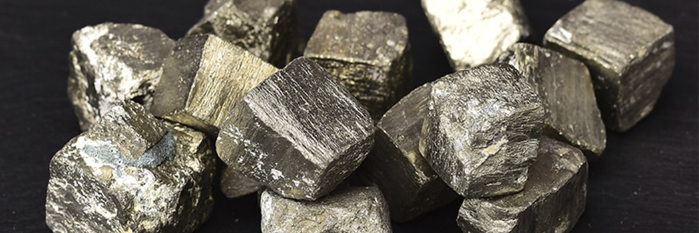

# Brought forth Iron into the earth

- **Category:** 
- **Date:** 23/03/2013
- **Author:** 
- **Source:** https://www.quranproject.org/Brought-forth-Iron-into-the-earth-438-d

## Content

The Glorious Qur'an contains a distinct "Surah" (Chapter) entitled "
Al-Hadid
" (The Iron) which emphasizes in one of its verses (Verse 25) the following two facts:
1.That iron was sent down to Earth i.e. it is of a celestial (extra-terrestrial) origin.
2.That iron is mighty strong and has many benefits for mankind.
This Qur'anic verse reads:
"..And We brought forth iron wherein is mighty power (in matters of war), as well as many benefits for mankind…" (i)
We now know that iron is the most abundant element in the total composition of the Earth (>35% of its total mass) and the fourth abundant element in its crust (5.6%). This observation has led to the logical conclusion that the majority of the Earth's iron must be hidden bellow its crust (i.e. within both its cores and mantles). If this is the case, how could this element be send down to Earth as stated in the above mentioned Qur'anic verse? And how could it have penetrated from the outer crust of the Earth to its inner zones of mantle and core?
To answer these questions, the Earth must be treated as part of the total cosmos from which it was separated, not merely as an isolated entity. In this context, recent cosmological discoveries have proved that:
Hydrogen (the simplest and the lightest known element) is by far the most abundant element in the observed universe (constituting about 74%).
This predominant, universal hydrogen is followed in abundance by helium (the second in the periodic table of elements) which is less abundant than hydrogen (constituting about 24%).
These two, simple nuclei of hydrogen and helium constitute together the greatest percentage of the observed universe (> 98%), while heavier elements are only represented by traces that do not exceed 1-2% of its total mass, and are only locally concentrated in certain heavenly bodies.
These fundamental discoveries have led to the important conclusion that hydrogen nuclei are the basic building blocks from which all the other were and are currently being created by the process of the nuclear fusion. This process (of the nucleosynthesis of elements by nuclear fusion) is self- sustaining, generally highly exothermic (i.e. releases excessively large quantities of energy) and is the source of the very hot and glowing nature of all stars. However, when the process reaches the level of producing iron, it becomes endothermic (i.e. energy consuming) and hence, the star either explodes or condenses on itself and fades out gradually to complete dimming and absolute darkness (a stage generally known as the Black Hole).
Nuclear Fusion within our sun mainly produces helium, with a very limited number of slightly heavier elements. The percentage of iron in the sun is estimated to be in the order of 0.0037%. Knowing that the Earth as well as all other planets and satellites in our solar system were actually separated from the sun, which does not generate iron, another question was raised:
Where had the immense quantity of iron in our Earth come from?
Our sun is a modest star, with a surface temperature of about 6,000 degrees Celsius, and an inner core temperature of about 15,000,000 degrees Celsius. Such figures are far below the calculated temperatures for the production of iron by the process of nuclear fusion (which exceeds 5 X 109 K). Consequently, other sources much hotter than the sun were sought for as possible sites for the generation of iron in the observed universe. One of the suggested sources of excessive heat was the "Big Bang" explosion of the initial singularity from which our universe was created. However all speculations about this event suggest that shortly after the "Big Bang" matter was in such an elementary stage that only hydrogen and helium (with possible traces of lithium) could have been generated. Again, if any traces of iron were produced at that stage, iron would have been more evenly distributed in the observed universe, which is not the case.
One second after the "Big Bang", the temperature of the early universe is calculated to have been in the range of ten billion degrees Celsius. At this stage, the early universe is visualized to have been in the form of a steadily expanding, huge cloud of smoke, mainly composed of elementary forms of both matter and energy such as neutrons, protons, electrons, photons, neutrinos and their counter particles (or anti-particles). Radiations in the form of photons from this very hot early stage of the universe had been predicted by Gamow and others (1948) to be still in existence around the observed universe, coming from all directions with equal intensity. This prediction was later proved to be true by both Penzias and Wilson (1965) through their discovery of the cosmic microwave background radiation coming from all directions in the observed universe with equal intensity, together with a remnant temperature reduced to only a few degrees above the absolute zero (-2730C).
During the first three minutes of the history of our universe, the neutrons are believed to have either decayed into protons and electrons, or combined with other neutrons to produce deuterium (or heavy hydrogen), which could combine to form helium. In its turn, helium nuclei could partly fuse to produce traces of lithium (the third element in the periodic table), but nothing heavier than this element is believed to have been generated as a result of the "Big Bang" explosion. Consequently, all of the universal hydrogen and most of the helium are believed to have been created immediately after the "Big Bang", while the rest of the universal helium is believed to have been steadily generated from the burning of hydrogen in the interiors of "Main-Sequence Stars" like our Sun. After the "Big Bang" explosion gravitation is believed to have pulled together clouds of smoke to form giant clusters of matter. Continued contraction of these eventually increased their temperature due to the interaction of colliding particles and the pressures created by the large gravitational attraction. As the temperature approached 15 million degrees Celsius, the electrons in the formed atoms were ripped off to create a plasma state. Continued contraction proceeded until the particles in the plasma moved with such high velocities that they began to fuse hydrogen into helium, producing stars with enough energy to generate an outward push (pressure) that reached equilibrium with the inward pull of gravity.
Most recently, elements heavier than lithium have been proved to be currently synthesized by the process of nuclear fusion in the cores of massive stars (at least ten times the mass of our sun) during their late stages of development. Such massive stars are seen burning helium to carbon, oxygen, silicon, sulphur and finally into iron when elements of the iron group are produced, the process of nuclear fusion cannot proceed any further. Elements heavier than iron (and its group of elements) are believed to have been created in the outer envelopes of super giant stars or during the explosion of nova in the form of supernova through the process of capturing elementary particles by the chattered iron cores of the exploding stars.
Consequently, it has been proved that stars are cosmic reactors in which most of the known elements are created from hydrogen and/or helium by the process of nuclear fusion. At the same time the staggering energy of stars comes from this process of intra-stellar nucleosynthesis of elements, which involves the combining of light elements into heavier ones by nuclear fusion (nuclear burning). This process requires a high speed collision which can only be achieved at very high temperatures. The minimum temperature required for the fusion of hydrogen into helium is calculated to be in the range of 5,000,000 degrees Celcius. With the increase in the atomic weight of the element produced by nuclear fusion, this temperature increases steadily to several billions of the degrees. For example, the nuclear fusion of hydrogen into carbon requires a temperature of about one billion degrees Celsius.
Burning (fusing) hydrogen into helium occurs during most of the stars' lifetime. After the hydrogen in the star's core is exhausted (i.e. fused to helium), the star either changes into a" Red Giant" then into a "Dwarf" or changes into a "Red super giant", then into a "Nova", when it starts to burn helium, fusing it into progressively heavier elements (depending on its initial mass) until the iron group is reached. Up to this point, the process of nucleosynthesis of elements is highly exothermic (i.e. releases excessive quantities of energy), but the formation of the iron group elements is highly endothermic (i.e. requires the input of excessive quantities of energy). The explosions of "Nova" in the form of "Supernova" result from the exhaustion of the fuel supplies in the cores of such massive stars and the burning of all elements there into the iron group. Heavier nuclei are thought to be formed during the explosions of the supernova.
The nucleosynthesis of the iron group of elements in the inner cores of massive stars such as the "Nova" is the final stage of the process of nuclear fusion. Once this stage is reached, the "Nova" explodes in the form of a "Supernova", shattering its iron core to pieces that fly into the universal space, providing other celestial bodies with their requisite iron. With this analysis the celestial (extra-terrestrial) origin of iron in both our Earth and the rest of the solar system is confirmed.
Nucleosynthesis of Elements and the Development of Stars as a supporting Evidence for the Extra-Terrestrial Origin of Iron.
The nucleosynthesis of elements takes place in the inner cores of stars according to their initial masses as well as to how much mass they lose along the way of their development. This has been proved by following the thermonuclear reactions in the cores of the "Main Sequence-Stars" as follows:
A "Main Sequence Star" with an initial mass close to that of our sun stars with the fusion of its hydrogen nuclei to produce helium. Then the gradual increase in the amount of the produced helium nuclei pushes the remaining, non-fused hydrogen nuclei outwardly in the form of a burning hydrogen front around a helium core. In this core, gravity dominates over the outward pressure, leading to the further contraction of the helium nuclei and the further expansion of the outward, burning hydrogen front, and hence this "Main Sequence Star" changes into what is known as a "Red Giant". Further contraction of the "Red Giant's" helium core and expansion of its outer burning front, will cause a mild core collapse and eventually will lead to the depletion of its mass to about 20% of the original mass, changing into what is known as a "White Dwarf" (the size of the Earth but the mass of the sun). With subsequent slow gravitational contraction, shrinking, cooling and dimming, the "White Dwarf" changes into what is described as a "Brown Dwarf" or a "Black Dwarf". This process of core collapse, gradual shrinking, cooling and darkening is the natural result of a winning inward pull of gravity over a decreasing outward push fusion process due to the consumption of its hydrogen fuel.
Similar to the light stars, massive "Main Sequence stars" (ten or more times the mass of our sun) also pass by the "Red Giant" phase, where they are described as "Red Super giants", but they have a quite different evolutionary path. Shrinking of the helium core of a "Red super giant" creates greater forces that restart its nuclear fusion, with a much larger gravitational pull to the centre of the core (due to its greater mass) and much more active internal collisions. The combined effect of contraction and collision results in tremendously high temperatures capable of the gradual generation of progressively heavier atomic nuclei such as carbon, oxygen, silicon and iron through the process of nuclear fusion. A nature massive star will have an iron core surrounded outwardly by shells of silicon, oxygen, carbon, helium and hydrogen. When the "Red Super giant's" core is changed into carbon, excessive quantities of energy are released, and these lead to the outward push of a second burning front of helium towards the first and enveloping hydrogen front.
With the following contraction of the carbon core, its temperature rises excessively to allow the fusion the carbon nuclei into a chain process that passes by magnesium, followed by aluminium, then silicon.
The silicon core changes gradually heavier nuclei during similar episodes of contraction of the core and expansion of the surrounding fronts, releasing more energy and changing the "Red Super giant" into a "Nova", where iron starts to form. The generation of iron in the core of "Nova" starts to consume its energy, because the fusion of silicon into iron is highly endothermic (i.e. consumes excessive quantities of energy). As the core of the "Nova" changes into iron, it explodes in a form of "Supernova", ejecting its gaseous envelopes and shattering its core to pieces that fly out into space to reach other celestial bodies that need iron. During its space journey, iron may fuse with one or more of the elementary particles that fill the universe to form heavier nuclei.
When the core of the "Red Super giant" becomes eventually changed into iron the process of nuclear fusion will cease to function since the nuclear structure of iron does not allow its fusion to heavier elements as this fusion requires the input of excessive quantities of energy. With the cessation of the process of nuclear fusion, the outward pressure of the “Red Super giant" will vanish, and it will immediately go through a process of rapid gravitational collapse (in less than a second) which will lead to the rising of its temperature to 100 billion degrees Celsius and hence described as a "Nova". Since the nucleons (Protons and neutrons) present in this collapsing star are being forced very close together, they create a tremendous repulsion of the positively charged nuclei from one another. This repulsion causes the star's core to recoil into an unimaginable and immeasurable explosion which is known as a "Supernova". Fragments released from this explosion fly out into space to eventually form new stars, planets and other celestial bodies. The nuclei of isotopes with masses heavier than iron are believed to be produced and distributed throughout the universe by such explosions, which put the processed stellar materials back into the interstellar medium for the next generation of stars to use. In a supernova explosion, neutrons bombard nuclei and build up very heavy elements such as gold, uranium, etc.
Some of the remaining cores of the very largest types of the "Red Super giants" an form "Neutron Stars" if the intense pressure from the gravitational attraction can result in a fast core collapse that forces electrons to combine with or be assimilated into nearby protons, forming neutrons. Such "Neutron Stars" can either be non-pulsating or pulsating (Pulsars).
Another possibility for the heaviest cores of exploding supernova is their very fast core collapse with so much gravitational attraction and escape velocity that even light cannot be liberated from their immeasurable gravitational pulls, hence these disappear as "Black Holes" are produced when the mass of the core of the "Red Super Giant" is greater than 4 times the mass of the sun. In this case, even nuclear "Pressure" cannot halt the collapse of the core, and gravity ends it into a Black Hole.
An ACE (Advanced Composition Explorer) spacecraft was launched in August, 1997 to detect many of the heavier isotopes which have been originated and are currently generated during the formation, evolution and subsequent explosion of stars. The comparative number of different isotopes found in any galaxy is believed to be related to the life cycle of the massive stars in that galaxy. The chemical composition of our Earth and of the rest of our solar system, of the whole galaxy, and indeed of the observed universe at large, has been changing and rearranging throughout the past ten billion years or so, since the creation of the universe.
These very recent discoveries have led to the logical conclusion that on separation from the sun, the primitive Earth was no more than a heap of ash, containing nothing heavier than the elements aluminium and silicon. Then this heap of ash was bombarded by a great shower of iron meteorites. This bombardment caused the heap of ash to heat up rapidly by the heat of settlement of the impacting bodies and their trapping energy, by gravity compression and by the excessive heat emanation from the decaying of their accompanying radioactive elements.
As the temperature of the primitive Earth exceeded the melting point of iron (2000oC), this and other heavy elements such as nickel started to melt, developing mega drops that penetrated the heap of ash, reaching its centre to form its mainly iron-nickel core. This process has changed the primitive Earth from a more or less homogeneous heap of ash to a distinctly zoned body of seven Earths established on the basis of seismological data as follows:
1: An inner solid core with great density (10-13.5 gm/cm3) and a radius of 1170km, being mainly composed of iron (90%) and nickel (9%), with minor quantities of lighter elements such as sulphur, silicon or phosphorus (1%).
2: An outer molten core of a similar composition, with a thickness of 2300 km (from the depth of 2900km to the depth of 5200km). Both the inner and outer cores of theEarth constitute about 31% of its total mass.
3-6: Four layers of mantle, separating the Earth's core from its crust (from an average depth of about 20km to a depth of 2900km) and constituting about 68% of the total mass of the Earth. These mantle layers are in the form four shells about2880km thick, extending from the base of the Earth's crust (the Mohorovivic Discontinuity or the Moho) to the upper limit of the molten outer core. These shells are composed of hot, solid rocks, which under excessive pressures exhibit the ability to flow, particularly so in the upper mantle which is a semi-molten, viscous state, hence the name "Zone of Weakness" (or Asthenosphere). This Asthenosphere is directly below the sub crust. Both the crust and the sub crust are solid and are collectively included under the name: outer rocky layer of the Earth (or lithosphere).
7: The Earth's crust constituting about1% of its total mass with an average thickness of 20km (about 5km for the oceanic crust and 35km for the continental crust, which greatly thicken sunder high mountains), being mainly composed of light silicates with relatively low melting points.
This differentiation of the Earth's material represents one of the most significant events in the history of our planet, without which it could have never been inhabitable. It led to the formation of its distinctive zones, with an outer rocky cover (lithosphere), the eventual rifling of the lithosphere and the onset of the dynamism of the Earth in the form of plate tectonics and the mountains' building movements. With the onset of the Earth's dynamism, continents were formed, both the atmosphere and the hydrosphere of the Earth were out gassed from within its interior and lithospheric plates were progressively stabilized by the building of mountains.
The above-mentioned discussion proves beyond doubt the celestial (extra-terrestrial and extra-solar) origin of iron in our solar system. This fact is further substantiated by the calculated energy for the production of one single atom of iron (by the process of nucleosynthesis) which is about four times the total energy of the entire solar system.
In view of the fact that such knowledge is only a few decades old, and that the Glorious Qur'an was revealed more than fourteen centuries ago, the precedence of this Noble Book with the explicit assertion that iron was physically sent down to Earth is one of the multifarious miraculous aspects of this Holy Book and a living testimony for both its Divine purity and the authentic Messengerhood of Prophet Muhammad (peace be upon him) who had received such Divine revelation.
The Qur'anic account of the celestial origin of iron is coupled by another miraculous aspect which is represented by the fact that the number of both the Qur'anic chapter on iron and of the verse that mentions this element in the same chapter precisely correspond to both the atomic weight(55.847 or roughly 56) and the atomic number (26) of iron, respectively.
Indeed the number of Surat Al-Hadid (the Qur'anic Chapter on Iron) is "57" and the number of the verse is "25", but the Qur'an in its text
"..And We brought forth iron where in is mighty power (in matters of war), as well as many benefits for mankind…"(i)
Separates its introduction (Surat Al-Fatihah or the Opening) from the rest of the Book, and considers the "Bismillah" (In the Name of Allah, The Most Gracious, The Most Merciful) as a Qur'anic verse at the beginning of this Surah (Al-Fatihah) and of every other Qur'anic Surah where it is mentioned. Taking this Qur'anic direction into consideration, the number of Surat Al-Hadid becomes "56" which is the closest figure to the atomic weight of the most abundant iron isotope (55.847), and the number of the verse becomes "26" which is the exact atomic number of iron. The existence of an iron isotope with the atomic weight of 57 also fits very well with the current numbering of the chapter on iron in the Glorious Qur'an. Their on (57) isotope is a direct product of the process of radioactive decay of cobalt (57), while the iron (56) isotope can be a direct product of the radioactive decay of the cobalt (56) isotope.
As to the mighty strength of iron which the Qur'anic verse describes, we understand this now by the fact that iron is the most stable element. It has the highest binding energy per nucleon, hence is the most stable of all nuclei. Because iron has the most strongly bound nucleus it has the highest magnetic properties among all known elements. Iron is resistant to atmosphere corrosion, its melting point is (K) 2000°, and its boiling point is (K) 3023°and it has a density of 7874 kg /m3at 293°K. We need excessive quantities of energy to fuse silicon nuclei into iron or to either split up the iron nucleus or to add to it. For elements lighter than iron, nuclear fusion releases energy, but for both iron and elements heavier than iron only fission can release energy. Enough to mention that the process of nuclear fusion in the cores of massive stars ends at the production of iron, so that astronomers of today claim that the universe is slowly turning to iron.Such unique qualities of iron are reflected in numerous other physical and chemical characteristics that are beyond the scope of this paper.
As to its many benefits to mankind, iron has a vital role in making the Earth inhabitable. It was the drawing down by gravity of iron to the centre of the primeval earth that generated the heat which caused the initial chemical differentiation of the Earth, the out gassing of the early atmosphere, and the ultimate formation of the hydrosphere. Acting like a gigantic dynamo, the Earth's solid iron core, surrounded by its molten outer core generates the Earth's magnetic field. It is due to this magnetic field that the Earth is protected from many destructive agents such as the high –energy – penetrating cosmic radiation. The great mass of iron in both the core and the mantle of the Earth contributes enormously to its stability as a planet, revolving (spinning) around its own axis and running (swimming) in its own orbit. It also contributes to the generation of the gravitational force of our planet (g). The constant value of this force is essential for holding the Earth's atmosphere, hydrosphere and biosphere, and maintaining for the Earth an optimum distance from the sun. This is essential for life in general, and for many geological processes to take place such as the water-oxygen- and carbon dioxide-cycles.
Iron is also an important constituent of both human and many animals' blood, of all living tissues of plants, animals and human beings.In all green plants, iron is an important constituent of the chloroplasts which carry out the function of chlorophyll production although in the chlorophyll molecule (which has the same .0.0.0.0structure of the haemoglobin molecule) a magnesium atom takes the central position of the iron atom. Besides being a vital process for the life of plants, of both herbivorous and omnivorous animals as well as of all human beings, this process is the only means of storing the solar energy in the form of chemical bonds that link chemical compounds together in all forms of living tissues. These chemical bonds are the original sources of all forms of energy in living beings as well as in many recent and fossil forms of fuels. The intimate relationship between life and iron indicates both the relevance of elements to biology and the biocentricity of the cosmos.
Iron is a highly malleable, tough, silver grey and magnetic metal. It is the second most abundant metal and the fourth mostabundant element in the Earth's crust. It has very many uses such as the production of structural steels, alloys, magnets, dyes, pigments, inks, blueprint papers, abrasives and haemoglobin, to mention only a few. Consequently, iron is the backbone of most military and civil industries, henceof many benefits to mankind.
(i): Surah Al-Hadid (The Iron): Verse25
Source: Dr. Zaghloul El-Naggar [External/non-QP]