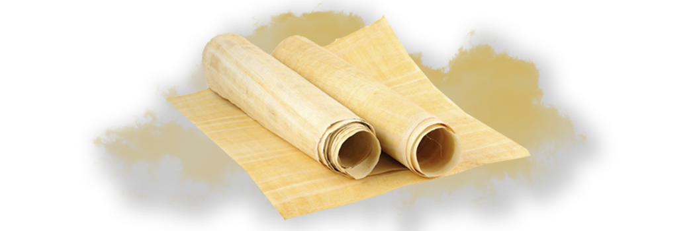

# Buddhist Scriptures

- **Category:** 
- **Date:** 24/02/2013
- **Author:** 
- **Source:** https://www.quranproject.org/Buddhist-Scriptures-292-d

## Content

Gautama Buddha was the founder of Buddhism. His original name was Siddharth (meaning one who has accomplished). He was also called Sakyamuni, i.e. the sage of the tribe of Sakya. He was born in the year 563 B.C. in the village of Lumbini near Kapila Vastu, within the present borders of Nepal.
According to legend, an astrologer foretold his father, the king, that young Gautama would give up the throne and luxury and renounce the world the day he would see four things (i) an old man, (ii) a sick man, (iii) a diseased man and (iv) a dead man. Hence, the king confined Gautama in a special palace which was provided with all worldly pleasures. He was married at the age of sixteen to Yasoddhra.
At the age of 29 after the birth of his first son, Gautama on the same day saw an old man, a sick man, a diseased man and a dead man. The impact of the dark side of life made him renounce the world that same night and he left his wife and son and became a penniless wanderer.
He studied and practised Hindu discipline initally, and later, Jainism. For several years he observed rigorous fasting along with extreme self-mortification. On realising that tormenting his body did not bring him closer to true wisdom, he resumed eating normally and abandoned asceticism.
At the age of 35, one evening as he sat beneath a giant fig tree (Bodh tree), he felt that he had found the solution to his problem and felt that he had attained enlightenment. Thus, he came to be known as ‘Gautama’, ‘The Buddha’, or 'The Enlightened One'.
Later, he spent 45 years in preaching the truth that he felt he had discovered. He travelled from city to city bare-footed, clean-headed, with nothing more on his self than his saffron robe, walking stick and begging bowl. He died at the age of 80 in the year 483 BC.
Buddhism is divided into two sects viz. Hinayana and Mahayana.II
Buddhist Scriptures
Historical criticism has proved that the original teachings of Buddha can never be known. It seems that Gautama Buddha’s teachings were memorized by his disciples. After Buddha’s death a council was held at Rajagaha so that the words of Buddha could be recited and agreed upon. There were differences of opinion and conflicting memories in the council. Opinion of Kayshapa and Ananda who were prominent disciples of Buddha were given preference. A hundred years later, a second council at Vesali was held. Only after 400 years, after the death of Buddha were his teachings and doctrines written down. Little attention was paid regarding its authenticity, genuineness and purity.
Buddhist Scriptures can be divided into Pali and Sanskrit Literature:
Pali Literature :
The Pali literature was monopolized by the Hinayana sect of Buddhism.
Tri Pitaka
The most important of all Buddhist scriptures is the
Tri-Pitaka
which is in Pali text. It is supposed to be the earliest recorded Buddhist literature which was written in the 1st Century B.C.
The
Tri-pitaka
or Three Baskets of law is composed of 3 books:
Vinaya Pitaka
: ‘Rules of Conduct’  this is a book of discipline and mainly deals with rules of the order.
Sutta Pitaka
: ‘Discourses’  It is a collection of sermons and discourses of Gautama Buddha and the incidents in his life. It is the most important Pitaka and consists of five divisions known as Nikayas. Dhammapada is the most famous Pali literature and contains aphorisms and short statements covering the truth.
Abhidhamma
: ‘Analysis of Doctrine’  This third basket contains meta physical doctrines and is known as Buddhist meta physicals. It is an analytical and logical elaboration of the first two pitakas. It contains analysis and exposition of Buddhist doctrine.
Sanskrit Literature:
Sanskrit literature was preferred by the Mahayana. Sanskrit literature has not been reduced to a collection or in Cannon like the Pali literature. Thus much of the original Sanskrit literature has been lost. Some were translated into other languages like Chinese and are now being re-translated into Sanskrit.
Maha vastu
: ‘Sublime Story’  Mahavastu is the most famous work in Sanskrit which has been restored from its Chinese translation. It consists of voluminous collection of legendary stories.
Lalitavistara -
Lalitavistara is one of the holiest of the Sanskrit literature. It belongs to the first century C.E., 500 years after the death of Buddha. It contains the miracles which the superstition loving people have attributed to Buddha.
Teachings of Buddha
Noble Truths:  The principal teachings of Gautama Buddha can be summarised in what the Buddhists call the ‘Four Noble Truths’:
First – There is suffering and misery in life .
Second – The cause of this suffering and misery is desire.
Third – Suffering and misery can be removed by removing desire.
Fourth – Desire can be removed by following the Eight Fold Path.
The Noble Eight Fold Path:
(i) Right Views
(ii) Right Thoughts
(iii) Right Speech
(iv) Right Actions
(v) Right Livelihood
(vi) Right Efforts
(vii) Right Mindfulness
(viii) Right Meditation
Nirvana
:
Nirvana' literally means "blowing out" or "extinction". According to Buddhism, this is the ultimate goal of life and can be described in various words. It is a cessation of all sorrows, which can be achieved by removing desire by following the Eight Fold Path.
Philosophy of Buddhism is self-contradictory
As mentioned earlier, the main teachings of Buddhism are summarised in the Four Noble Truths:
(i) There is suffering and misery in life.
(ii) The cause of suffering and misery is desire.
(iii) Suffering and misery can be removed by removing desire.
(iv) Desire can be removed by following the Eight Fold Path.
This Philosophy of Buddhism is self-contradictory or self-defeating because the third truth says ‘suffering and misery can be removed by removing desire’ and the fourth truth says that 'desire can be removed by following the Eight Fold Path'.
Now, for any person to follow Buddhism he should first have the desire to follow the Four Noble Truths and the Eight Fold Path. The Third great Noble Truth says that desire should be removed. Once you remove desire, how can we follow the Fourth Noble truth i.e. follow the Eight Fold Path unless we have a desire to follow the Eight Fold Path. In short desire can only be removed by having a desire to follow the Eight Fold Path. If you do not follow the Eight Fold Path, desire cannot be removed. It is self contradicting as well as self-defeating to say that desire will only be removed by continuously having a desire.
Concept of God
Buddha was silent about the existence or non-existence of God. It may be that since India was drowned in idol worship and anthropomorphism that a sudden step to monotheism would have been drastic and hence Buddha may have chosen to remain silent on the issue of God. He did not deny the existence of God. Buddha was once asked by a disciple whether God exists? He refused to reply. When pressed, he said that if you are suffering from a stomach ache would you concentrate on relieving the pain or studying the prescription of the physician. "It is not my business or yours to find out whether there is God – our business is to remove the sufferings of the world".
Buddhism provided Dhamma or the ‘impersonal law’ in place of God. However this could not satisfy the craving of human beings and the religion of self-help had to be converted into a religion of promise and hope. The Hinayana sect could not hold out any promise of external help to the people. The Mahayana sect taught that Buddha’s watchful and compassionate eyes are on all miserable beings, thus making a God out of Buddha. Many scholars consider the evolution of God within Buddhism as an effect of Hinduism.
Many Buddhists adopted the local god and thus the religion of ‘No-God’ was transformed into the religion of ‘Many-Gods’ – big and small, strong and weak and male and female. The ‘Man-God’ appears on earth in human form and incarnates from time to time. Buddha was against the caste-system prevalent in the Hindu society.
Muhammad
[peace be uponj him]
in the Buddhist Scriptures
Buddha prophesised the advent of a Maitreya:
Almost all Buddhist books contain this prophecy. It is in
Chakkavatti Sinhnad Suttanta
D. III, 76:
"There will arise in the world a Buddha named Maitreya (the benevolent one) a holy one, a supreme one, an enlightened one, endowed with wisdom in conduct, auspicious, knowing the universe: What he has realized by his own supernatural knowledge he will publish to this universe. He will preach his religion, glorious in its origin, glorious at its climax, glorious at the goal, in the spirit and the letter. He will proclaim a religious life, wholly perfect and thoroughly pure; even as I now preach my religion and a like life do proclaim. He will keep up the society of monks numbering many thousands, even as now I keep up a society of monks numbering many hundreds".
According to Sacred Books of the East volume 35 pg. 225:
"It is said that I am not an only Buddha upon whom the leadership and order is dependent. After me another Buddha maitreya of such and such virtues will come. I am now the leader of hundreds, he will be the leader of thousands."
According to the Gospel of Buddha by Carus pg. 217 and 218 (From Ceylon sources):
"Ananda said to the Blessed One, ‘Who shall teach us when thou art gone?'
And the Blessed one replied,
'I am not the first Buddha who came upon the earth nor shall I be the last. In due time another Buddha will arise in the world, a holy one, a supremely enlightened one, endowed with wisdom in conduct, auspicious, knowing the universe, an incomparable leader of men, a master of angels and mortals. He will reveal to you the same eternal truths, which I have taught you. He will preach his religion, glorious in its origin, glorious at the climax and glorious at the goal. He will proclaim a religious life, wholly perfect and pure such as I now proclaim. His disciples will number many thousands while mine number many hundreds.'
Ananda said, 'How shall we know him?'
The Blessed one replied,
'He will be known as Maitreya'."
The Sanskrit word ‘
Maitreya
’ or its equivalent in Pali ‘
Metteyya
’ means loving, compassionate, merciful and benevolent. It also means kindness and friendliness, sympathy, etc. One Arabic word which is equivalent to all these words is ‘Rahmat’. In Surah Al-Anbiya:
"We sent thee not, but as a mercy for all creatures."
[Al-Qur’an 21:107]
Prophet Muhammad (pbuh) was called the
merciful
, which is ‘
Maitri
’.
The words Mercy and Merciful are mentioned in the Holy Qur’an no less than 409 times.
Every chapter of the Glorious Qur’an, except Chapter 9, i.e. Surah Taubah begins with the beautiful phrase, '
Bismillah Hir-Rahman Nir-Rahim'
, which means '
In the name of Allah, Most Gracious, Most Merciful'.
The Word Muhammad is also spelt as ‘
Mahamet
’ or ‘
Mahomet
’ and in various other ways in different languages. The word ‘
Maho
’ or ‘
Maha
’ in Pali and Sanskrit mean Great and Illustrious and ‘
Metta
’ means mercy. Therefore ‘
Mahomet
’ means ‘Great Mercy’.
Buddha’s doctrine was Esoteric and Exoteric:
According to Sacred Books of the East, volume 11, pg. 36 Maha-Parinibbana Sutta chapter 2 verse 32:
"I have preached the truth without making any distinction between exoteric and esoteric doctrine, for in respect of truths, Ananda, the Tathagata has no such thing as the closed fist of a teacher, who keeps something back".
Muhammad (pbuh) on the commandment of Almighty God delivered the message and doctrine without making any distinction between esoteric and exoteric. The Qur'an was recited in public in the days of the Prophet and is being done so till date. The Prophet had strictly forbidden the Muslims from hiding the doctrine
Devoted Servitors of the Buddhas:
According to Sacred Books of the East volume 11 pg. 97 Maha-Parinibbana Sutta Chapter 5 verse 36:
"Then the Blessed one addressed the brethren, and said, ‘Whosoever, brethren have been Arahat-Buddhas through the long ages of the past, they were servitors just as devoted to those Blessed ones as Ananda has been to me. And whosoever brethren shall be the Arahat-Buddhas of the future, there shall be servitors as devoted to those Blessed ones as Ananda has been to me’."
The Servitor of Buddha was Ananda. Muhammad (pbuh) also had a servitor by the name Anas (r.a.) who was the son of Malik. Anas (r.a...) was presented to the Prophet by his parents. Anas (r.a...) relates:
"My mother said to him, 'Oh Messenger of God, here is your little servant'."
Further Anas relates,
"I served him from the time I was 8 years old and the Prophet called me his son and his little beloved"
. Anas (r.a...) stayed by the Prophet in peace and in war, in safety as well as in danger till the end of his life.
Anas (r.a.), even though he was only 11 years old stayed beside the Prophet during the battle of Uhud where the Prophet’s life was in great danger.
Even during the battle of Hunain when the Prophet was surrounded by the enemies who were archers, Anas (r.a) who was only 16 years old stood by the Prophet.
Anas (r.a) can surely be compared with Ananda who stood by Gautam Buddha when the mad elephant approached him.
Six Criteria for Identifying Buddha:
According to the Gospel of Buddha by Carus pg. 214:
"The Blessed one said, ‘There are two occasions on which a Tathagata’s appearance becomes clear and exceedingly bright. In the night Ananda, in which a Tathagata attains to the supreme and perfect insight, and in the night in which he passes finally away in that ultra passing which leaves nothing whatever of his earthly existence to remain.’ "
According to Gautam Buddha, following are the six criteria for identifying a Buddha.
A Buddha attains supreme and perfect insight at night-time
On the occasion of his complete enlightenment he looks exceedingly bright
A Buddha dies a natural death.
He dies at night-time.
He looks exceedingly bright before his death.
After his death a Buddha ceases to exist on earth.
Muhammad (pbuh) attained supreme insight and Prophethood at night-time.
According to Surah Dukhan:
"By the books that makes thing clear – We sent it down during a blessed night."
[Al-Qur'an 44:2-3]
According to Surah Al-Qadar:
"We have indeed revealed this (message) in the night of power."
[Al-Qur'an 97:1]
ii)
Muhammad (pbuh) instantly felt his understanding illumined with celestial light.
iii)
Muhammad (pbuh) died a natural death.
iv)
According to Ayesha (r.a.), Muhammad (pbuh) expired at night-time. When he was dying there was no oil in the lamp and his wife Ayesha (r.a.) had to borrow oil for the lamp.
v)
According to Anas (r.a.), Muhammad (pbuh) looked exceedingly bright in the night of his death.
vi)
After the burial of Prophet Muhammad (pbuh) he was never seen again in his bodily form on this earth.
5.
Buddhas are only Preachers:
According to Dhammapada, Sacred Books of East volume 10 pg., 67:
"The Jathagatas (Buddhas) are only Preachers."
The Qur’an says in Surah Ghashiya:
"Therefore do thou give admonition, for thou art one to admonish. Thou art not one to manage (men's) affairs."
[Al-Qur'an 88:21-22]
Identification of
Maitreya
by Buddha:
According to Dhammapada, Mattaya Sutta, 151:
"The promised one will be:
i) Compassionate for the whole creation
ii) A messenger of peace, a peace-maker
iii) The most successful in the world.
The
Maitreya
as a Preacher of morals will be:
i) Truthful
ii) Self-respecting
iii) Gentle and noble
iv) Not proud
v) As a king to creatures
vi) An example to others in deeds and in words".
Source: missionislam.com  [External/non-QP]