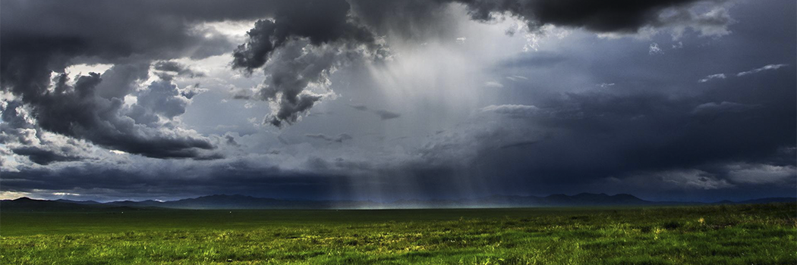

# "By Heaven with its returning system"

- **Category:** 
- **Date:** 02/04/2013
- **Author:** 
- **Source:** https://www.quranproject.org/By-Heaven-with-its-returning-system-447-d

## Content

"By Heaven with its returning system"
The Scientific Facts
The atmosphere returns vaporized water in the form of rain.
The atmosphere receives many meteors and returns them to outer space.
The atmosphere returns the harmful rays that kill living creatures and pushes them away from the earth.
The atmosphere returns short and medium radio waves back to the earth. Therefore, the atmosphere is like a reflecting mirror that reflects rays and electromagnetic waves. Also, it returns television and wireless waves after being reflected through the Ionosphere. This is how television and radio broadcasting works around the earth.
The atmosphere is like a reflecting mirror that reflects heat; it works like an armor against the sun's heat during the day and prevents the heat of the earth from scattering at night. If this system became unbalanced, life on earth would be impossible because of either extreme heat or cold.
Facets of Scientific Inimitability:
This honourable verse indicates that the most prominent characteristic of the sky is that it is a returning system. Previously, people thought that this verse meant the return of water in the form of rain, but modern science added many additional meanings to the word "returning" that were previously unknown. The sky here means the atmosphere and this verse shows that the sky has a surrounding cover that returns every useful thing to the earth and hinders every harmful thing from reaching it.
Therefore, the word "returning" has many indications; more than just the return of rain. Without the benefits of the returning system, life on earth would be impossible.
Thus, the Ever-Glorious Qur'an revealed many modern discoveries in one word, many centuries ago.
Surah At-Tariq
Source: International Commission on Scientific Signs in the Qur'an and the Sunnah [External/non-QP]