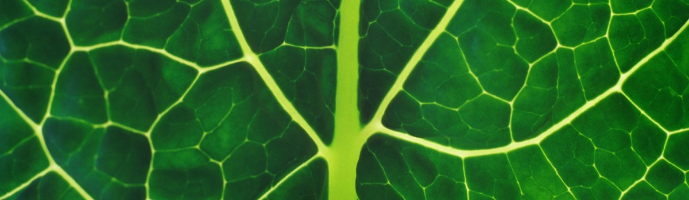

# Chlorophyll - The Green Pigment

- **Category:** 
- **Date:** 08/11/2023
- **Author:** 
- **Source:** https://www.quranproject.org/Chlorophyll---The-Green-Pigment-643-d

## Content

‘Chlorophyll’ is the only ‘factory’ on Earth that produces food: it is the green pigment that converts energy from the sun’s energy, carbon dioxide and water to produce food for man and animals and this is referred to as ‘chlorophyll a’. ‘Chlorophyll b’ has a different molecular structure and converts light energy from the sun, followed by a complex chemical reaction that produces sugar and then starch. Therefore, the basis of the formation of seeds and fruits is this green ‘factory’.
وَهُوَ الَّذِي أَنْزَلَ مِنَ السَّمَاءِ مَاءً فَأَخْرَجْنَا بِهِ نَبَاتَ كُلِّ شَيْءٍ فَأَخْرَجْنَا مِنْهُ خَضِرًا نُخْرِجُ مِنْهُ حَبًّا مُتَرَاكِبًا
“And it is He who sends down rain from the sky, and We produce thereby the growth of all things. We produce from it [khadran] greenery from which We produce grains arranged in layers....”
Qur’ān 6:99
Scholars of Qur’ānic exegesis said ‘khadran’ means something green. Qurtubi, a classic scholar of Qur’ānic commentary, explained the verse, “We brought forth from the plants something green” and Ibn al-Jawzi further explains, “We bring forth from it, that is – from the green thing – clustered grains like wheat and barley [etc].” So from this ‘green substance’ are the fruits and seeds produced.
Read more here -
Scientific Truths and the Qur'an