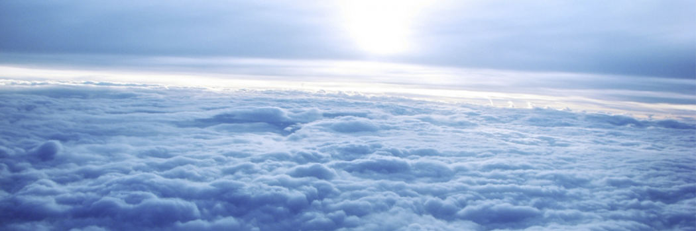

# Constriction of breasts in the sky

- **Category:** 
- **Date:** 02/04/2013
- **Author:** 
- **Source:** https://www.quranproject.org/Constriction-of-breasts-in-the-sky-449-d

## Content

Allah, the Almighty, says:
“And whomsoever Allah wills to guide, He opens his breast to Islam; and whomsoever He wills to send astray, He makes his breast closed and constricted, as if he is climbing up to the sky” (I)
The Scientific Facts:
The formation of the atmosphere was unknown until Pascal proved its existence in 1648. He proved that air pressure decreases as we go higher above sea level.
Later on it was discovered that air in the lower layers of the atmosphere is denser. About 50 % of the air mass is located between the surface of the earth and 20,000 feet above sea level, and 90% is located between the surface of the earth and 50,000 feet above sea level.
Therefore, density decreases vertically until air reaches its utmost rarefaction (minimum pressure) in the higher layers of the atmosphere before it completely vanishes in outer space.
When a human being goes higher than ten thousand (10,000) feet above sea level, it does not cause him any serious problem, as the respiratory system can handle the height of 10,000 to 25,000 feet above sea level; however, if a person goes into outer space, the amount of pressure and oxygen decrease causing the closing of the chest and dyspnea (shortness of breath). Then, the breathing process becomes difficult because of the lack of oxygen (oxygen starvation) and the respiratory system completely fails, causing death.
Facets of Scientific Inimitability:
It is well-known that the different layers of the atmosphere were unknown at the time the Ever-Glorious Qur'an was revealed. Consequently, the low pressure and the decrease of oxygen, which is necessary for man's life, in the higher layers, were also unknown. People at that time did not know these facts; on the contrary they believed that whenever man goes higher, he will feel more serenity and happiness and enjoy the breeze.
This honourable verse clearly indicates two facts that have been only discovered lately by modern science: the first one is that dyspnea occurs when a person goes higher in the layers of the atmosphere because of the lack of oxygen and the decrease in air pressure. The second is the state that precedes choking leading to death that occurs when a person goes more than 30,000 feet above sea level. This is caused by the drastic decrease in air pressure and an extreme lack of oxygen.
It is important to note the miraculous nature of the word (climb) that indicates the difficulty of this state and describes the pain and suffering attached to it.
This is a sure indication that these words are truly from the All-Knowing and the All-Aware.
(I): Surah Al-An`am: 125
Source: International Commission on Scientific Signs in the Qur'an and the Sunnah [External/non-QP]