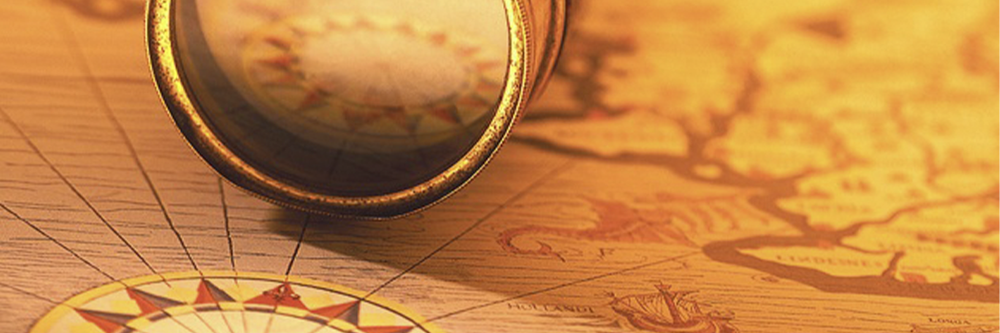

# Contributions of early muslims to the field of earth sciences

- **Category:** 
- **Date:** 21/04/2013
- **Author:** 
- **Source:** https://www.quranproject.org/Contributions-of-early-muslims-to-the-field-of-earth-sciences-477-d

## Content

Despite the magnificent contributions of Early Muslims to the field of Earth Sciences, it has been wrongly assumed that the birth of such sciences did actually take place in 1830 A.C. by the publication of Charles Lyell’s book “Essentials of Geology”.
It is true that the field has since been broadened to accommodate many specializations, has gradually advanced with big leaps and great strides, has been met with world-wide recognition and placed to widespread economic applications, but contributions of generations before Lyell cannot be ignored. Some knowledge of the earth and of its resources must have been flourishing long before Lyell’s time, as quarrying for building and decorative stones, ore-mining and metal extraction, exploration for gems and gemstones as well as their industries were developed in all ancient civilizations. The techniques used must have been simple and primitive, but were definitely based on some knowledge and experience, particularly with miner’s gemmologists, quarrymen, professionals in ore prospection and extraction, specialists in other industries and trades dealing in minerals and rocks, scientists, philosophers and even clergymen. As mentioned above, most of the civilizations prior to the advent of Prophet Muhammad (PBUH) had already lost their divine guidance, and hence, deviated to irrational thoughts and misconceptions, and their legacies were flooded with such as mythologies, magic, mysticism, superstitious and sceptic views about the universe, peculiar ideologies, queer dogmas and strange beliefs.
Consequently, the synthesis and theorization of the collected information about the earth were distorted by such strange beliefs, despite marked successes in the applied field. Tracing the origin of Geological knowledge in such peculiar explanations of classic times, or jumping from there to Renaissance, overlooking the “Golden Age” of the Islamic civilization is a gross historical and scientific mistake. Ancient Greek and Roman writers - like their predecessors in ancient Egypt, Mesopotamia, India and China - pondered about the origin of the earth and of the rest of the universe, but their conclusions were nothing more than a number of facts borrowed from previous revelations, highly twisted and corrupted by conjectural speculations and presumptions, without much observational or experimental deductions. Luckily enough most of their writings are lost and-indeed-what is left makes such a loss. It was described by Schwarz (1968) under the correct title “The Failure of Geological Attempts by the Ancient Greeks from Old Ages to the Reign of Alexander". Indeed some ancient Greek and Roman writers assumed the presence of fire at the earth’s centre and recognized the remains of animals and plants in rocks of the earth’s crust, the rise and subsidence of land areas and a number of other geological phenomena, but failed to rationalize their explanations for such assumptions and observations as myths normally pre-occupied any systematic thinking in their minds.
Consequently, their contribution to Earth Sciences is, indeed scanty and of little worth. Zittel mentioned this in what is translated in the following lines: Not a single writer on these subjects in the ancient world had examined the rocky crust of the earth with a view to ascertain its composition, nor conceived that fossils in the sedimentary succession can afford clues to the history of the earth. The aims and objectives of modern geological and paleontological studies were absolutely unknown to the ancients, for baseless hypotheses and haphazard observations cannot be considered as a foundation for scientific achievement. However, if such generalization applies to the legacy of the Greco-Roman civilization, it definitely does not apply to the contributions of the Early Muslims. These contain a wealth of scientific knowledge experiences and procedures for the identification of minerals and rocks, including physical and chemical properties (such as specific gravity, colour lustre, transparency, impurities, streak, hardness, fractures, cleavage, fusibility, refractivity, crystallinity and crystal form, reaction to both heat and acids, etc.); as well as certain pertinent information about the occurrence, association, genesis, classification, extraction and uses of economic minerals and rocks ( such as gems and gemstones, gold, silver copper mercury; , lead and zinc, iron, borax, alum, rock salt, corals; crude oil and oil seeps, tar, coal, asbestos etc. The tables constructed by Muslim scholars for the classification and physical properties (such as specific gravity) of minerals and rocks hardly differ from modern readings. Muslim scholars also carried elaborate experimentation in chemical reactions, acid treatment, heating and calcinations, etc. And hence were pioneers in introducing experimentation in the examination and extraction of minerals and ores. Early Muslims’ contributions to Earth Sciences also include the description of the shape of the earth, proving its sphericity and rotational movements; the measurement of its dimensions (radius, circumference and volume with an error of no more than 3% ), the notion to the presence of most of its mass at its centre; description of the geomorphologic features of its surface and the processes shaping such features; the distribution of land and sea and the description of many oceanographic characteristics (such as shoals and shoal deposits, islands and peninsula, coral reefs, tides and tidal effects, etc.) ; the rational description of both internal and external forces of the earth and their associated processes and phenomena ( e.g. earthquakes, volcanic eruptions, orogenic movements, faults and surface collapses, other catastrophic events, the processes of both weathering and erosion and their products etc.); the rising of temperature towards the centre of the earth and the rising of mountains from within oceans and seas (an early notion to the ocean/continent’ cycle); the recognition and classification of both meteors and meteorites; the suggestion of a scale of hardness for determining the relative hardness of minerals [ 8 centuries before Fredrich Mohs ( 1773-1839) introduced his scale] ; the rock cycle or the formation of igneous rocks from molten magma and their disintegration by weathering into sediments and sedimentary rocks, the precise definition for the textural characteristics of both sediments and the later compaction of such.
Sediments into sedimentary rocks; the recognition of beds, bedding planes and the law of superposition of strata [ centuries before both James Hutton ( 1726 - 1797) and William Smith ( 1769 - 1839) who are wrongly acclaimed as the fathers of Geology]; the understanding of metamorphism and its processes; the rational explanation of a large number of geological phenomena ( e.g. the transgression and regression of seas and oceans; the water cycle and the gushing of fresh, saline and hot-water springs; the formation of sabkhas, salt pans and playas; evaporation of water from the earth’s surface, cloud formation, and condensation, rain, hail, snow, lightening, thunder storms, rainbow formation, and other meteorological observations; the river cycle, desertification, etc.); the correct interpretation of the true nature of fossils and the process of fossilization, as well as the use of such information for paleogeographic reconstructions and paleo­ecologic interpretations; the recognition of the very slow pace of the geologic processes and the gradual development of creation with time from matter to plant life, then animal life and finally humans; recognition of the antiquity of the earth and providing a sound basis for the estimation of its age; the development of instruments of such extraordinary power such as the telescope, the microscope, the alidade, the compass etc., which opened the gates of knowledge in front of the human eye; precise geographic descriptions, measurements and mapping, geodetic surveying techniques, etc. All this wealth of information was written in a superb language where scientific terms are precisely defined to the extent that linguistic dictionaries such as that of Ibn Sayydeh (D. 458 A.I-I. = 1066 A.C.) contained a whole chapter on geologic terminology. These contributions are well within the core of Earth Sciences, and hence cannot be overlooked or credited to others, as wrongly practiced by European scholars who have - undoubtedly - made some use of this sound scientific knowledge, and ascribed it to Greek authors. Such wealth of geologic information is not only ignored in writings about Earth Sciences or about the History of Sciences, but the names of eminent Muslim scholars have been Latinized to mystify their identity.
Indeed, numerous Arabic manuscripts have been translated into Latin and Greek, and referred to other European authors. The case of Ibn Sina’s section on “Minerals” in his famous book “Al-Shifaa” (or the Book of Remedy) is only one of the many shameful practices by Europeans during Renaissance. This chapter was partly translated and partly abridged under the Latin title “De Mineralibus” and wrongly attributed to Aristotle. Another manuscript in the same field by Jaber bin Hayyan was also translated into Latin under a similar title and attributed to Garlandius. For the names of distinguished Muslim scholars who have contributed elaborately to the field of Earth Sciences, for the titles of their works and to the analysis of their contributions reference is made to Al-Sukkary (1973), Ahamd (1978), E1-Naggar & Al-Daffaa (1988) and other references on the history of sciences, but the names in the following list are only given as selected examples:
Selected Examples of Muslim Scholars Distinguished in the area of Earth Sciences
Imam J’aafar Al-Sadeq (died 148 A.H - 765 A.C.) who wrote a manuscript on mineralogy, that was published by Ruska (1924). Original Arabic Name Latinized Name Ibn Rushde Ibn Bajah Ibn Zuhre Ibn Sina Ibn al-Haytham Jaber bin Hayyan Al-Razy Al-Zerqaly Abu Ma’ashar Al-Khuwarazrny Al-Farghany A1-Battany Al-Bitujy Bin Maymoun Al-Faraby Averroes Avempace Avenzoar Avicena Al-Hazan Geber Rhazes Arzachel Albumasar Algorithm Alfraganus Albertagnius Albetragnius Maimonides Al pharahius : Examples of Muslim Scholars’ names which have been Latinized by Westerners in an attempt to mystify their identity.
Jabir bin Hayyan (died 160 A.H. - 776 A.C.) who was basically a chemist, and a medical scientist, was the first to synthesize minerals from natural ingredients (e.g. Cinnabar from mercury and sulphur), and to classify them on the basis of their physical properties. He suggested the possibility of transformation of base metals such as tin, lead and iron into precious metals such as gold and silver, and described in a professional manner the operations of calcinations, oxidation, evaporation, filtration, sublimation, melting, distillation and crystallization, as well as the solubility of gold in a mixture of acids (aqua regia). Jabir innovated a theory on the geological formation of metals, observed the imponderability of magnetic force, and emphasized the importance of experiment in scientific research. He wrote a number of treatises on chemistry and mineralogy of which we know at least 3, selections of which have been translated by Julius Ruska & Paul Kraus (1935). Many of his works were also translated into Latin and referred to Greek authors such as his manuscript on minerals (Mineralibus) which was wrongly ascribed to Garlandius.
Al-Haseb (died 206 A.H - 821 A.C.) who wrote a book on the uses of rocks.
Ibn Masaweeh (died 215 A.H. - 830 A.C.) who wrote a book on rocks.
Al-Khuwarizme (died 235 A.H. - 852 A.C.) who wrote 3 treatises on the shape of the earth and its geography. A manuscript copy of his book “The Image Of The Earth” is preserved at Strassbourg, France and was edited and translated into Italian by Nallino and into German by Hans Mzik.
Al-Kindy (died 252 A.H. - 866 A.C.) who wrote 7 treatises on geological issues including one on gems and semi-precious stones, a second on tides and a third on thunder storms, lightening, snow, hail and rain.
Al-Razy (died 320 A.H. - 932 A.C.) who wrote 7 treatises on minerals, rocks and the origin of the earth. His book "The Secret of Secrets" was fully translated by Ruska and reviewed by Mieli (1938).
Al-Hamadany (died 334 A.H. - 945 A.C. ) who wrote a treatise on gold and silver that was revised and published in Uppsala, Sweden by C. Toll (1968), another on “The Description Of the Arabian Peninsula, And A Third On Routes and Kingdoms”.
Al-Masaudy (died 346 A.H. - 957 A.C.) who wrote 4 treatises on subjects related to the earth, including one on gold and gemstones, that was translated into English by Springer (1841) and into French by Barbier de Meynard & Pavet de Corteille ( 1861-1877).
Al-Maqdisy (died 381 A.H. - 992 A.C.) who wrote a wonderful book on geographic provenance.
Ikhwan Al-Safa (4th century A.H. - 11th A.C.) who wrote three theses on Earth Sciences out of a collection of 52 (the 4th, the 5th and the 19th). These theses were translated completely into Persian, Hindustani and Turkish and partly into German and French by Dieteric (1861- 1886) and Forbes & Rieu (1861), respectively.
Al-Yanbuay, Abou Dilfe (4th Century A.H. - 11th A.C.) who wrote a treatise on minerals that was revised by Minorsky and published in Cairo (1955).
Ibn Al-Jazzar (died 400 A.H. - 1009 AC.) who wrote a book on rocks.
Ibn Sina (died 428 A.H. - 1037 A.C.) who wrote 3 chapters on geological subjects in his treatise entitled “The Book of Remedy”, one on minerals and meteorological phenomena, a second on natural forces and a third one on properties of the equator. The chapter on minerals was translated into Latin and ascribed wrongly to Aristotle. It was translated into German by Ruska (1912) and into French by Holmyard & Mandeville (1927).
Al-Bayrouny (died 443 A.H. - 1051 A.C.) who wrote at least 13 treatises on subjects related to the earth, including: gems and gemstones, minerals, specific gravity of minerals and precious stones, the relationship between metals and gems, shadows, the determination of the direction of Qiblah, the determination of locations by means of the intersection between latitudes and longitudes and a scientific discussion on both the formation of mountains and the estimation of the age of the earth. His book on gems and gemstones was reviewed by Clement -Mullet ( 1858), revised and published by Stapleton (1905), Kramkov (1907), Sachau (1898, 1910), and was translated into German by Wiedemann and published serially since the beginning of the 20th century A.C. The book was also translated into Persian by an anonymous person and this translation was rendered into English by Ahmad (1929). This last translation was reviewed by Lippmann (1931). The book was also translated into Russian by Byelenskiy.
Al-Jirjany (died towards the end of the 5th century A.H. - beginning of the 11th century A.C.) who wrote a book on rocks that was reviewed by Ritter (1935).
Al-Bakry (died 487 A.H. - 1095 A.C.) who wrote an encyclopaedic work on the geography of the earth and a glossary to explain the necessary terminology.
Al-Tughr’aiy (died 515 A.H. - 1121 A.C.) who wrote two treatises on the transformation of minerals, that were translated into Latin.
Al-Zamakhshary (died 538 A.H. - 1151 A.C.) who wrote a treatise on “Mountains, Places and Water”.
Al-Idreesy (died 560 A.H - 1164 AC.) who wrote 4 treatises on the earth, its shape, morphologic features, maps, routes and kingdoms.
Al-Hamawi Al-Baghdady (died 627 A.H. - 1230 A.C.) who wrote two geographic glossaries, one on countries and the other on places.
Al-Demashquy, Al-Misri, Ibn Al-Awwam (the last half of the 6th century A.H. - 12th A.C.) who wrote elaborately on minerals, rocks and soils; most of their original writings could not be located but has been reviewed by a large number of subsequent writers.
Al-Sweedy (died 601 A.H. - 1291 A.C.) who wrote a book on gems and gemstones.
Al-Teefach (died 651 A.H. - 1253 AC.) who wrote two elaborate treatises on geology, one dealing with minerals and rocks ( mainly with gems and gemstones) and the other on the observations of natural phenomena. The mineral book was abridged and published by Raphius (1784) in Utrecht, Holland. The book was previously translated into Latin and a number of other European languages since the early days of the Renaissance. A copy of the Arabic text with an Italian translation was published in Florence, Italy in the year 1818 A.C. under the auspices of Count Antonio Reineri, and was reprinted in Bologne, Italy in 1906 A.C. Copies of the manuscript are kept in Leiden, Paris, Guteh, Cairo and Kuwait.
Al-Khaziny (died in the 6th century A.H. l2the century A.C.) who wrote a book on mechanical contrivances, but it contains tables and methods of determinations of specific gravity for a large number of gems, minerals and rocks, with great precision. The book was reviewed by Koenikoff (1879), Wiedemann (1911) and by Mieli & Brunet (in Mieli, 1938).
Al-Toosy (died 672 A.H. - 1274 A.C.) who wrote a book on rocks.
Al-Qabajaky (died towards the end of the 7th century A.H. - 13th century A.C.) who wrote a book on rocks, recognizing the magnetite mineral and advocating the use of the magnetic needle.
Al-Qazweeny (died 682 A.H. - 1283 A.C.) who wrote at least 6 treatises in areas related to Earth Sciences including: gold and gemstones; on the geologic profession; on the order of the universe; countries and geographic provinces; archaeology and history; strange creatures and peculiar creations. The latter is an encyclopaedic work that discusses many things on Earth and in the universe. It was published by Wustenfeld (1848) in Germany, was partly translated into German by Hermann Ethe (1878), by Ruzka (1896) and by Wiedmann (1911), and into French by Mercier, and by both Chezy & De Sacy.
Al-Iraquy ( the 7th century A.H. - the 13th A.C.) who wrote elaborately on geological topics including two manuscripts, one on precious stones and the other on gold. His works were reviewed by Ruska (1929) and translated into English by Holmyard (1923)
Al-Kamily (the 7th century A.H. - the 13th A.C.) who wrote monumental work on minting the Egyptian coins, where various metallurgical aspects are discussed. The book was reviewed by Holmyard (1931).
Al-Kashany (died 700 A.H. - 1301 A.C.) who wrote a manuscript on precious stones, essences, pottery ceramics and china, where a large number of minerals and rocks are discussed. The book was reviewed by Mieli (1938).
Al-Demashquy, Al-Soufy (died 726 A.H. - 1326 A.C.) who wrote a selection on peculiarities of both land and sea, where 700 minerals and rocks are described.
Al-Jaldaki (died 743 A.H. - 1342 A.C.) who wrote a manuscript on rocks.
Ibn Al-Akfany (died 749 A.H. - 1348 A.C.) who wrote a treatise on gems and gemstones.
Al-Telemsany Al-Miqury (died 1041 A.H. - 1631 A.C.), who wrote a book on minerals in Andalusia. These names are only a selection from a long list that cannot possibly be included here. Other scholars mentioned under Astronomy, as most of the Muslim astronomers had interest in the Earth, and their names need not to be repeated. Each of these authors also quoted, in his preserved manuscripts, a much larger list of references and of authors of whose works we know absolutely nothing today, either due to their loss during the sacking of Baghdad and of many other centres of learning throughout the Islamic World, or due to the fact that such manuscripts are still lying in the darkness of library cellars in both Western and Eastern countries. However, this modest list shows clearly the great interest of Muslims in sciences of the earth and its applications for exploring, prospecting and exploiting its wealth, as well as for discovering the properties of our planet and forces influencing it.
Source: Dr. Zaghloul El-Naggar [External/non-QP]