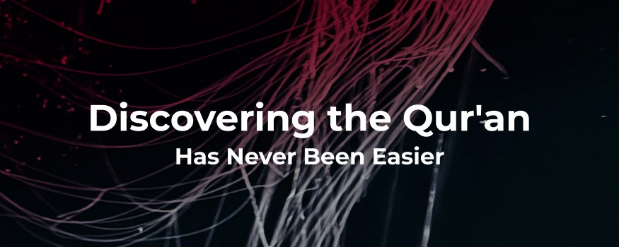

# Discovering the Qur'an Has Never Been Easier

- **Category:** 
- **Date:** 23/12/2025
- **Author:** 
- **Source:** https://www.quranproject.org/Discovering-the-Quran-Has-Never-Been-Easier-687-d

## Content

For many people, the Qur'an remains a mystery. It's one of the most influential texts in human history, shaping the lives of nearly two billion people worldwide, yet for those outside the Muslim faith or newly exploring Islam, it can seem distant and difficult to approach.
Where do you start? How do you understand the context? What if you have questions as you read?
These are the challenges that have kept countless seekers at arm's length from a book that could provide answers to their deepest questions about life, purpose, and meaning.
That's why we created the Qur'an Project App.
A Bridge to Understanding
The Qur'an Project has spent years making the Qur'an accessible to people across more than 80 countries. We've placed free copies in the hands of seekers, students, and anyone curious about what this sacred text actually says. Now, we're bringing that same trusted resource to your smartphone.
The Qur'an Project App isn't just another digital book. It's a carefully designed tool that removes the barriers between you and understanding. Whether you're
exploring Islam for the first time
or you've recently embraced the faith and want to deepen your knowledge, this app meets you exactly where you are.
Designed With You in Mind
If you've ever felt intimidated by the Qur'an, you're not alone. It's a substantial text, organized differently from most books you're familiar with, and without context, it can be challenging to navigate.
That's why we've included features specifically for newcomers:
Clear English Translation:
The app uses a trusted, easy to understand English translation that has been shared with seekers worldwide. No archaic language. No confusing terminology. Just clear, accessible text that communicates the meaning faithfully.
Surah Introductions:
Before you dive into each chapter, you'll find an introduction that explains the context, themes, and key messages. Think of it as having a knowledgeable guide walking beside you, helping you understand what you're about to read and why it matters.
Helpful Appendices:
The app includes background information that answers common questions and provides historical and cultural context. This means you're never left wondering about references or concepts that might be unfamiliar.
Easy Navigation:
The Qur'an is organized into 114 chapters called Surahs. The app makes it simple to explore any part of the text, bookmark your progress, and return to passages that resonate with you.
Read Anywhere, Anytime:
Whether you have five minutes during your lunch break or an hour before bed, the Qur'an is always accessible. The app works offline, so you can read even without an internet connection.
Why the Qur'an Matters
You might be wondering: why should I read the Qur'an?
The Qur'an addresses the fundamental questions humans have asked throughout history. Questions about existence, purpose, morality, suffering, death, and what comes after. It speaks directly to the human condition in a way that transcends time and culture.
For those exploring spirituality, the Qur'an offers a perspective that is both intellectually satisfying and spiritually profound. It doesn't ask you to abandon reason. Instead, it invites you to think, reflect, and examine the evidence around you.
For those who have recently embraced Islam, the app becomes an essential companion on your journey. New Muslims often feel overwhelmed by how much there is to learn. This app gives you a reliable, accessible way to grow in knowledge at your own pace, building a strong foundation in the primary source of Islamic guidance.
Your Journey, Your Pace
One of the beautiful aspects of the Qur'an Project App is that it respects your individual journey. There's no pressure, no judgment, no prerequisite knowledge required. You can start anywhere. You can read as much or as little as you like. You can return to passages multiple times. You can take your time.
Some people prefer to read from beginning to end. Others jump to topics that interest them. Some read a few verses each day for reflection. However you choose to engage, the app supports your approach.
Completely Free, Always Accessible
Just as we've provided free physical copies of the Qur'an to seekers worldwide, the app is completely free. No subscriptions. No hidden costs. No
advertisements
interrupting your reading. Just unrestricted access to one of the most significant texts in human history.
Start Your Exploration
The Qur'an Project App launches on February 6, 2026, on both Android and iOS platforms. Whether you're simply curious about what the Qur'an says, actively exploring different faith traditions, or newly Muslim and eager to learn, this app was built with you in mind.
Sometimes the most important journeys begin with a single step. Sometimes that step is simply opening a book and starting to read.
Download the Qur'an Project App and discover what millions have found within these pages: guidance, wisdom, and answers to the questions that matter most.
For more information, visit www.quranproject.org