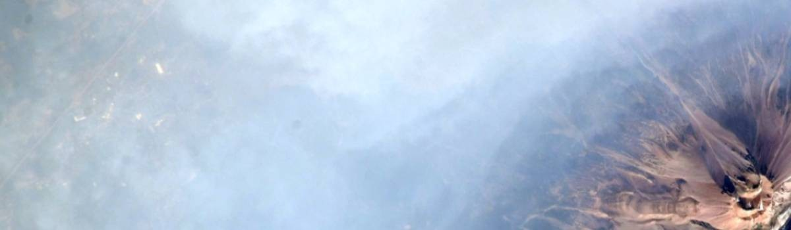

# Early Universe in a state of Smoke

- **Category:** 
- **Date:** 30/10/2023
- **Author:** 
- **Source:** https://www.quranproject.org/Early-Universe-in-a-state-of-Smoke-635-d

## Content

Early Universe in a state of ‘Smoke’
The science of modern cosmology, observational and theoretical, clearly indicates that, at one point in time, the whole universe was nothing but a cloud of ‘smoke’ [i.e. an opaque highly dense and hot gaseous composition].  This is one of the undisputed principles of standard modern cosmology.  Scientists now can observe new stars forming out of the remnants of that ‘smoke’
The illuminating stars we see at night were, just as was the whole universe, in that ‘smoke’ material. God has said in the Qur’ān:
ثُمَّ اسْتَوَى إِلَى السَّمَاء وَهِيَ دُخَانٌ
“Then He directed Himself to the heaven while it was smoke...” Qur’ān 41:11
As the earth and the heavens above (the sun, the moon, stars, planets, galaxies, etc.) have been formed from this same ‘smoke,’ we conclude that the earth and the heavens were one connected entity.
We know that our world, the sun and the stars did not come about immediately after the primeval explosion. Rather, the universe was in a gaseous state before the formation of the stars. This gaseous state was initially made of hydrogen and helium. Condensation and compression shaped the planets, the earth, the sun and the stars that eventually became the products of the gaseous state. The discovery of these processes was made possible thanks to successive findings, observations and theoretical developments.
The knowledge of all contemporary communities at the time of the Prophet did not suggest that the universe had once been in a gaseous state. The Prophet himself did not claim to be the author of the statements in the Qur’ān as is often mentioned, declaring that he is simply a messenger of God.
تِلْكَ مِنْ أَنبَاءِ الْغَيْبِ نُوحِيهَا إِلَيْكَ ۖ مَا كُنتَ تَعْلَمُهَا أَنتَ وَلَا قَوْمُكَ مِن قَبْلِ هَـٰذَا ۖ فَاصْبِرْ ۖ إِنَّ الْعَاقِبَةَ لِلْمُتَّقِينَ
“That is from the news of the unseen which We reveal to you, 
[O Muhammad]. You knew it not, neither you nor your people, before this. So be patient; indeed, the [best] outcome is for the righteous.”
Qur’ān 11:49