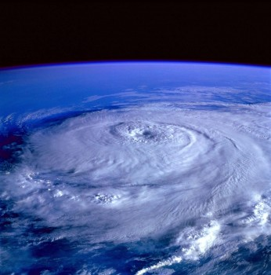

# Fine-Tuning and the Laws of Nature - Part 2

- **Category:** 
- **Date:** 19/01/2026
- **Author:** ByA.B. al-Mehri
- **Source:** https://www.quranproject.org/Fine-Tuning-and-the-Laws-of-Nature---Part-2-703-d

## Content

The extraordinary coordination of Earth's protective mechanisms and physical conditions, each precisely calibrated within narrow tolerances necessary for life, reveals not accidental convergence but purposeful divine calibration, as even slight deviations in these integrated systems would render our planet uninhabitable.
Ozone Layer in the Stratosphere
Condition:
Earth has an ozone layer that absorbs most
of the Sun's harmful ultraviolet (UV) radiation.
Fine-Tuning:
Without the ozone layer, Earth would be
bombarded with intense UV radiation, which can damage DNA and other cellular
structures, making it difficult for life to survive.
Implication:
The ozone layer allows life to thrive on
land by blocking harmful radiation while still permitting enough
sunlight
for photosynthesis
.
Presence of Water in All
Three States (Solid, Liquid, Gas)
States:
Earth has the perfect conditions for water
to exist as ice, liquid, and vapour.
Fine-Tuning:
The range of temperatures and pressures on
Earth allows water to move through the hydrological cycle (evaporation,
condensation, precipitation). If temperatures were consistently higher or
lower, water would not be able to cycle through all three states.
Implication:
This cycle is crucial for regulating
climate, distributing heat around the planet, and supporting diverse
ecosystems.
Earth's Axial Tilt
(Obliquity)
Current position:
Earth's axial tilt is about 23.5 degrees,
which causes seasonal variations.
Fine-Tuning:
A greater tilt would result in more
extreme seasons, with hotter summers and colder winters, potentially disrupting
ecosystems. A smaller tilt would reduce seasonal variation, possibly leading to
a more uniform climate that might limit biodiversity.
Implication:
An increased tilt would amplify seasonal
variations, leading to more extreme summers and winters, which could disrupt
ecosystems. Conversely, a decreased tilt would result in weaker seasons.
Earth's Liquid Iron Core
Current state:
Earth has a liquid iron outer core that
generates its magnetic field through the dynamo effect.
Fine-Tuning:
If the core were solid, the dynamo process
would not function, and Earth's magnetic field would be much weaker or
non-existent, exposing the atmosphere to erosion by solar wind.
Implication:
The liquid iron core maintains a strong
magnetic field, which protects the atmosphere and allows for conditions
suitable for life.
Transparency of Earth's
Atmosphere
Current State:
Earth's atmosphere allows visible light to
reach the surface while blocking harmful radiation.
Fine-Tuning:
If the atmosphere were less transparent,
less sunlight would reach the surface, reducing the energy available for
photosynthesis and cooling the planet. If it were more transparent, harmful
ultraviolet (UV) rays could penetrate more easily, increasing the risk of
genetic damage in living organisms.
Implication:
The right level of transparency allows for
adequate sunlight for photosynthesis while providing protection against UV
radiation, supporting life on Earth.
Divine Calibration
We have seen the
"fine-tuning" of the universe evident in numerous examples, each
precisely calibrated to sustain life. Even the slightest deviation in these fundamental
constants would render the universe lifeless. Despite the immense complexity
and diversity of physical phenomena, the laws of nature operate in remarkable
harmony, forming an integrated and coherent system. This naturally leads to a
profound question: Where do these precise numbers/values come from? There
are only two possible explanations: either they arose by mere chance, or they
are the result of deliberate calibration and calculations of a supremely
intelligent Creator. The extraordinary harmony among the laws of nature points
to a unifying principle behind the universe, one that reflects design,
intention, and purpose. As Oxford University philosopher Richard Swinburne
writes,
"The very success of science in showing us how deeply
ordered the natural world is provides strong grounds for believing that there
is an even deeper cause of that order."
(1)
Isaac Newton, who
discovered the law of universal gravitation, wrote,
"This most
beautiful system of the sun, planets, and comets could only proceed from the
counsel and dominion of an intelligent and powerful Being."
(2)
Newton's
belief that the harmony of the cosmos reflected a divine order and that these
laws can be understood as expressions of a Divine mind. Others like Galileo,
Kepler, and Einstein have expressed similar sentiments. It is therefore
rational to believe that existence, order, and consistency of the laws of
nature, coupled with their fine-tuning, point to an intelligent cause rather
than a random or purposeless origin. Belief in God provides a coherent and
rational explanation for the fine-tuning of the universe, accounting for the
origin, design, and consistent operation of the laws of nature that enable
intelligent life.
Conclusion
The data from both the vast laws of physics and the specific conditions of Earth converge on a single reality: the universe is a masterpiece of precision. In Part 1, we saw that the immaterial "code" of physical constants must be set to a near-impossible accuracy for matter to exist. In Part 2, we observed how the Earth’s unique features, from its magnetic shield to its liquid core, form an integrated fortress for life.
Mathematically, the probability of these interdependent systems aligning by chance is zero. Such deep, universal order does not arise from randomness; it points to a Transcendent Intelligence. As reason and science both affirm, the universe is not an accident, it is an intentional creation. Truly, God exists, and there is no doubt!
(Taken
from the book:
‘God: There is
No Doubt!’
)
Footnotes
(1) Richard Swinburne, Is There a God? Oxford University Press, p. 7.
(2) Isaac Newton, Philosophiæ Naturalis Principia Mathematica.