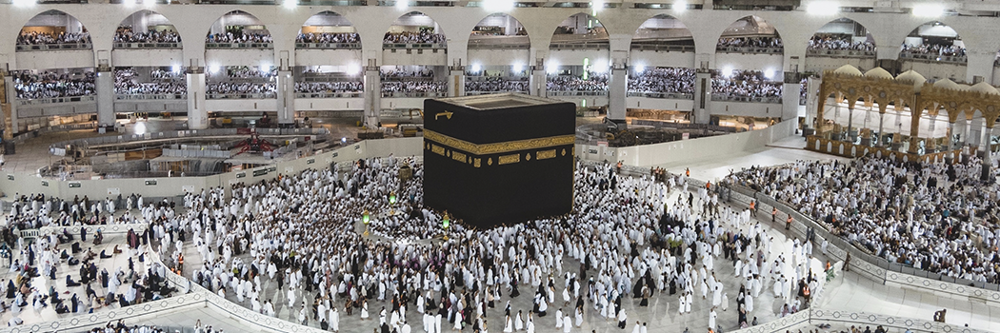

# First House of Worship on Earth

- **Category:** 
- **Date:** 20/04/2013
- **Author:** 
- **Source:** https://www.quranproject.org/First-House-of-Worship-on-Earth-471-d

## Content

“Verily, the first House (of worship) appointed for mankind was that at Bakkah (Makkah), full of blessing, and a guidance for Al-‘Âlamîn (mankind and jinn)”(I)
This Holy ayah comes in the middle of Surah Al-Imran; which is a Madinan Surah and one of the longest Surahs in Holy Qur'an as it consists of two hundred ayahs after the “Basmallah”. This Surah is named Al-Imran as it contains a reference to the family of Maryam (Mary) the daughter of Imran, and the mother of Jesus (peace be upon him and our Prophet Muhammad).
On this subject Allah says:
“Allah chose Adam, Nûh (Noah), the family of Ibrâhîm (Abraham) and the family of ‘Imran above the 'Âlamîn (mankind and jinn) (of their times).Offspring, one of the other, and Allah is All-Hearer, All-Knower"(II)
This Surah relates the story of Imran's wife, and their daughter Maryam the mother of Jesus (peace be upon them). The Surah also relates the story of the miraculous birth of Jesus without having a father, and sheds light on the miracles bestowed on him by Almighty Allah. The Surah further contains references to Prophet Zakariyh (Zachariah) and his son Yahia (John the Baptist), whom Allah blessed him with when he was very old. The Surah also contains a detailed description of the battle of Uhud.
The main theme of this Surah is its dialogue with the People of the Scripture (those who believe in the Gospel and the Torah). This dialogue highlights and defines a number of tenets of the Islamic Faith.
Tenets of faith in Surah Al-Imran:
The Tenets of Faith mentioned in Surah Al-Imran can be summarized in the following points:
First
: Belief in Allah as the sole God, worshipping Him only, with no partners, peers or rivals; refraining from using any description for Him (glory be to our Lord) that does not befit His Excellence and Majesty (such as claiming that Allah may have a wife or a son, which is a quality of creatures of Allah and does not befit His Majesty).
Belief that Almighty Allah is the Ever-Living, the One who sustains and protects all that exists, the One who knows everything in heavens and earth. Belief that Glorious Allah is the One who shapes fetuses in the wombs of their mothers as He wills. That He is the All-Mighty, the All-Wise, that Allah is All-Seer of the (His) worshippers; and that Allah is the Possessor of the dominion, giving power to whom He wills, and taking power from whom He wills. That Allah endows with honor those whom He wills, and He humiliates whom He wills, and that He is the source of goodness. Belief that Allah is Able to do all things; that He knows what is in the heavens and what is in the earth; that victory only comes with His guidance; and that He supports whom He wills with victory. Belief that right guidance is the Guidance of Allah; that all bounties are from Allah, and that Allah is All-Sufficient for His creatures’ needs, All-Aware. He selects for His Mercy (Islam and the Qur'an with Prophethood) whom He wills and Allah is the Owner of Great Bounty. Allah is full of kindness to (His) worshippers, and at the same time He is, All-Able of Retribution, and that He never breaks (His) Promise.
Second:
Belief in Divine Revelation revealed by Almighty Allah to His Messengers, in order to guide people; and that He compiled, finished and preserved it in His final ultimate Message (The Holy Qur'an and Prophet Muhammad’s Sunnah), and that this final Message confirms what came before it of Divine revelation and is dominant over them all. In this respect, belief in the Messengers of Allah is an essential part in the belief in Divine Revelation.
Third:
Belief that the Holy Qur'an contains ayahs that are explicit (the foundations of the Book), and others that are vague (Allah being the only One that knows their true interpretation).
Fourth:
Belief that every person will die one day, and that Almighty Allah will definitely gather all people in a day that is beyond any doubt. In other words, the belief in the truth of the Afterlife and Day of Judgment, and in major incidents they include; such as resurrection and judgment, Heaven and Hell, that Heaven is the final abode of the pious and that Hell is the final abode of the sinners; that the faces of the pious will be bright on the Day of Judgment while the faces of those who disbelieved after being believers and rejected faith after accepting it will be dark.
Fifth:
Belief that the sole religion of Allah is Islam (Submission to Allah), and that those who were given the Scripture (Gospel and Torah) did not disagree except, out of mutual envy, after knowledge had come to them. And whoever disbelieves in the ayat (proofs, evidences, signs, revelations, etc.) of Allah then surely, Allah is Swift in calling to account.
Sixth:
The belief in the importance of obeying Allah and His final Messenger Muhammad (peace be upon him), following his Sunnah, and holding fast, all Muslims together, to the Rope of Allah (i.e. this Qur'an), and belief in the importance of not being divided amongst themselves.
Seventh:
Belief that true believers in Islamic Monotheism, and real followers of Prophet Muhammad (peace be upon him) and his Sunnah form the best community ever raised up for mankind; because they enjoin Al-Ma‘rûf (i.e. Islamic Monotheism and all that Islam has ordained) and forbid Al-Munkar (polytheism, disbelief and all that Islam has forbidden), and they believe in Allah. However, if they do not do this, they will lose that honor. (I fear that supremacy might be misunderstood as a Muslim belief that they are better then everyone else. I chose honor instead)
Eighth:
Belief in fate and destiny, and that affliction is an essential part of one’s life that should be faced with contentment, patience and acceptance of Allah's destiny
Signs of creation in Surah Al-Imran:
That Glorious Allah is the One who shapes fetuses in the wombs of their mothers as He wills.
A reference to the theory that Earth revolves daily around its axis by mentioning that night enters into day, and that day enters into night according to Allah's Will.
A reference to the cycle of life, death and resurrection by mentioning bringing the living out of the dead, and bringing the dead out of the living.
A reference to the creation of Adam from clay or earth.
An assertion of the fact that the first House (of worship) appointed for mankind was that at Bakkah (Makkah), full of blessings.
An assertion that Allah owns whatever exists on Earth or in the heavens, and to Him only all matters return (for decision).
An assertion that everyone shall experience death and that no person can ever die except by Allah's will and at an appointed term.
A reference to the human tendency to react to grief by remembering other sad situations, this is a psychological issue discovered by recently.
A reference to the fact that in the creation of the heavens and the earth and in the alternation of night and day, there are indeed signs for people of understanding; and that contemplating upon them is a means of knowing the Creator (Exalted are You above all that they associate with You as partners), and some of His glorious attributes and excellent abilities that have no barriers in excellence in the art of creation.
Each one of these issues needs a separate discussion, which is what I will do God willing, in the following articles. But I will focus here on the fifth point which deals with the fact that first House (of worship) appointed for mankind was that at Bakkah (Makkah). However, before I begin, I’ll go over the interpretation of this ayah by some scholars.
Interpretations of this ayah by some scholars:
“Verily, the first House (of worship) appointed for mankind was that at Bakkah (Makkah), full of blessings, and a guidance for Al-'Âlamîn (mankind and jinn)" (I)
Ibn-Kathir (May Allah have mercy on his soul) said: Allah tells us that the first house appointed for mankind, for the purpose of worship and performing rituals, circumambulating around or facing towards it during daily prayers, and where people could resort to focus on spirituality, was the House in Bakkah (Makkah). This “house” is the Ka’ba, which was erected (upon previously established foundations) by Ibrahim (Abraham) and his son Isma’il (Ishmael) (peace be upon them). That is why Allah says in the holy ayah what can be translated as, "full of blessing, and a guidance for Al-‘Âlamîn (mankind and jinn)".
Abu-Dhar (may Allah be pleased with him) related: "I once asked Prophet Muhammad (peace be upon him): ‘Which was the very first mosque?’ He said: ‘The Sanctified Mosque.’ I asked: ‘Then which?’ He said: ‘The Aqsa Mosque.’ I asked: ‘How many years were between them?’ He said: ‘40 years.’ I asked: ‘Then which?’ He said: ‘Wherever you are when the time for Salat comes they pray, they are all mosques of Allah.’" (Related by Ahmed, and reported by the two Sheikhs, Bukhari and Muslim, in the same form).
It was related that Ali (may Allah be pleased with him) once said: There were houses before this one, but this was the very first House appointed for mankind for the purpose of worshipping Allah. On the other hand, Al-Sudday claimed that it was the very first House ever built on earth (this is really a marvelous interpretation that exceeds the knowledge available in that era by many centuries, although Ibn Kathir added that: Ali's words are more trusted).
Concerning the name Bakkah mentioned in the holy ayah, it is a famous name of Makkah. It was said that Makkah was called Bakkah because it overpowers tyrants and it is where they are defeated and humiliated. It was also said that this name goes back to the fact that people came in crowds to Makkah. Katada said: Allah gathers all people in this place; women pray in front of men in this place and nowhere else. Shuba related that Ibrahim said: “Bakkah is the house and mosque.” Ikramah said: “The house and what surrounds it is Bakkah, while what is outside of this is Makkah.” Mukatel Ibn Hayan said: “Bakkah is the place of the house while what is other than this is Makkah.” There are many other names for Makkah: Al-Bayt Al-Ateek (The Ancient House), Al-Bayt Al-Haraam (The Sanctified House), Al-Balad Al-Ameen (The City of Security), Um Al-Qura (The Mother of all Cities), Al-Qades…because it purifies people of their sins… Al-Moqadasa, Al-Hatema, Al-Ra's, Al-Balda, Al-Benya, Al-Ka’aba.
Scientific implications in this ayah:
After long debates that exhausted many scientists over many decades, it was proven in the mid-1960s that earth was completely immersed with water in a certain phase of its creation, and that there was no dry land exposed above the surface of that water. Then by the will of Allah, the bottom of this huge ocean exploded into violent volcanic eruptions that kept on continuously throwing molten lava. The lava accumulated in layers over layers causing a mountain range to form on the bottom of this huge ocean. This mountain range continued to grow and mount until its peak emerged out of the water's surface forming the first part of dry land similar to the various volcanic islands widespread in today's oceans (such as: Japan’s islands, Philippines, Indonesia, Hawaii, etc.). The volcanic activity continued, and this island grew gradually as a result of the successive volcanic eruptions that added new areas to it, causing it to become a great continent called the Mother Continent or Pangaea.
This operation of gradual growth by accumulation is known in Arabic as “Dahw” which is linguistically defined as: the process of extension, expansion and throwing. In fact, this is a precise definition of the earth building processes through volcanic eruptions. After Pangaea was completely formed, it started to break up and rip apart by Allah’s will and eventually fragmented into the seven continents seen now on the earth's surface, which were closer to one another in the past. These fragments then began to shift and drift apart until they reached their present locations, and are in continuous dynamic movement up until now.
This phenomenon in which a part of the ocean turns into dry land, or in which the dry land separates to enclose an ocean or a body of water inside it is called “oceanic crust recycling”, where an ocean turns into dry land as a result of successive volcanic eruptions from beneath the ocean's floor, which causes a part of that floor to rise up to the water's surface in the form of volcanic islands. Such volcanic islands keep in growing gradually till they turn into a continent, and as a result of rifting and chinking parts of this continent it is divided into two entities separated by a long sea such as the Red Sea. This long sea would widen continuously until it turns into an ocean.
Fourteen hundred years ago, it was related from Prophet Muhammad (peace be upon him) that he said:
"The Ka’ba emerged from beneath the water, and then land formed around it"
This Hadith was mentioned by Al-Harawy in The Book of Strange Ahadith (3/362). Al-Zamakhshary also included it in his book Al-Fa'ek Men Ghareeb Al-Ahadith (The Very Strange Ahadith) (1/371) because its scientific implications exceeded the knowledge of its era by fourteen hundred years.
This Hadith is supported by another Hadith narrated by Al-Tabarany and Al-Bayhaqy in Al-Sha'b from Ibn Omar (may Allah be pleased with both of them): "It (the Sanctified House) was the first thing to come out over the surface of the water in the time of creating the heavens and the earth as a block, then land formed from beneath it."
Those two Ahadith are considered a miraculous scientific proof supporting the Prophethood of Muhammad (peace be upon him), and proving that he was connected to Allah through Divine Revelation, and was taught by the Creator of the heavens and earth, because no creature before the middle of the twentieth century realized any of these facts.
This is supported by what we mentioned before, that Makkah is located in the middle of Earth’s mainland. This also indicates that the land beneath the Holy Ka’ba is considered as the oldest piece of the solid rocky surface of the earth. However, no one tried to prove such a fact until now. Muslim scientists should prove this by specifying the general age of rocks around the Ka’ba through the radioactive elements they contain (i.e. Carbon-14), in order to present this evidence to all people – be they Muslims or non-Muslims – as this is considered tangible, documented proof and logical evidence for all people that Muhammad (peace be upon him) is the final Messenger of Allah.
These two Ahadith may support Al-Sowday’s interpretation of the holy ayah that can be translated as:
“Verily, the first House (of worship) appointed for mankind was that at Bakkah (Makkah), full of blessing, and a guidance for Al-'Âlamîn (mankind and jinn)”
that it was the very first house ever existed on Earth's surface.
Praised be Allah who sent the Holy Qur'an with His Knowledge to His final Messenger, and protected it for us in the language in which it was revealed, word by word and letter by letter, to be a warning for mankind and jinn. May Allah praise and send blessings upon the final Messenger Prophet Muhammad (peace be upon him) to whom this Holy Qur'an was revealed and also upon his family, companions, and followers of his Sunnah and whoever takes the responsibility of his mission until the Day of Judgment. Praise be to Almighty Allah.
(I): Surah Al-’Imran (The Family of Imran): V 96
(II): SurahAl-'Imran (The Family of Imran): V 33-34
Source: Dr. Zaghloul El-Naggar [External/non-QP]