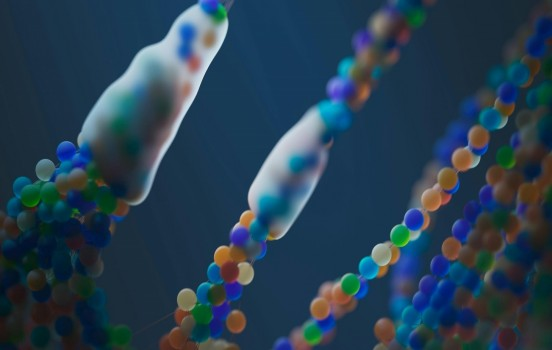

# From Anatomy to Genetics: The Flawed Logic of Evolutionary

- **Category:** 
- **Date:** 16/01/2026
- **Author:** ByA.B. al-Mehri
- **Source:** https://www.quranproject.org/From-Anatomy-to-Genetics-The-Flawed-Logic-of-Evolutionary-698-d

## Content

Anatomical similarities,
embryological patterns, biogeographical distributions, and genetic overlaps
across species, rather than proving evolutionary descent, demonstrate the work
of a common
Designer
who strategically employs recurring design principles to create functional,
purpose-driven organisms adapted to their specific environments.
Similarities in
anatomical structures across species do not point to common ancestry but rather
to a common design strategy. Just as an engineer will use effective design
principles across different machines to achieve optimal functionality, God
employed similar structures in various species to accomplish specific
biological functions. The existence of homologous (1) structures across diverse
species indicates that similar biological challenges or environmental pressures
are solved with similar design solutions, just as different vehicles might use
similar components like wheels, despite being built for different purposes.
Dr. Michael Denton in
his book, "
Evolution: A Theory in Crisis,
" writes,
"The
idea of homology as a result of common descent is far from proven. There are
many examples where similar structures are found in species that are not
closely related in evolutionary terms. The evidence is more consistent with the
idea of a common design than with a common ancestry."
(2)
Shared features across
species point to efficient, purposeful designs tailored to their needs, rather
than to a process driven purely by unguided, random changes over time. The
recurring patterns observed in comparative anatomy are better explained as
evidence of a common Designer than of common descent. Dr. Paul Nelson notes,
"The
fact that we find similar anatomical structures in widely different organisms
can be attributed to an intelligent designer using optimal design principles,
rather than these similarities being the result of random mutations passed down
through common descent."
(3)
Embryology
As with anatomical
similarities, resemblance in embryological development across different species
should be understood not as evidence of a common evolutionary ancestry but
rather as evidence of a common design blueprint. Similarities in early
embryonic stages, referred to as "embryonic recapitulation" - (4
) by
evolutionists, have historically been overstated in support of evolutionary
theory and have now been widely discredited. While different species may share
certain embryonic stages, these features can also be interpreted as efficient
and functional design elements necessary for successful development.
Stephen Jay Gould, a
proponent of evolution, acknowledges in his book
Ontogeny and Phylogeny
,
"The
theory of recapitulation, which claims that ontogeny (the development of an
organism) recapitulates phylogeny (the evolutionary history of the species),
has been largely discredited as a literal explanation of embryonic development.
While there are echoes of evolutionary history in the developmental stages of
embryos, the strict recapitulation hypothesis is overly simplistic and has been
abandoned by most biologists."
(5)
The presence of similar
embryological features can show that these developmental processes are effective
mechanisms for constructing complex organisms, regardless of their final forms.
Regarding so-called
"
vestigial
structures
" (such as the appendix in humans, which is often claimed to
have lost its original function), the assumption that a structure is a remnant
of evolutionary history simply because it serves a different or unclear purpose
in one species compared to another is flawed thinking. The absence of current
understanding does not imply a lack of function. In fact, recent scientific
discoveries have overturned the long-standing belief that the appendix is
useless, revealing that it plays a significant role in the immune system and
contributes to maintaining gut health. (6
) So these structures still serve subtle,
less obvious purposes or simply reflect a design choice that allows for greater
flexibility or adaptability within various organisms. What appears vestigial in
one context may serve a different, still undiscovered, function in another.
Likewise, the similar stages observed in embryology point to a purposeful
design plan, rather than to shared evolutionary ancestry.
Biogeography
Evolutionists often
point to Darwin's finches, a group of bird species found on the Galapagos
Islands, as a
"classic example of adaptive radiation and natural selection
in action."
(7) Charles Darwin observed that the finches had developed
different beak shapes and sizes, depending on their particular feeding habits.
He saw these variations in beak morphology as arising from small, gradual
changes over time, allowing the finches to adapt to different ecological
scenarios.
Evolutionists argue that
this diversification from a common ancestor illustrates how species can evolve
in response to environmental pressures, with natural selection favouring traits
that enhance survival and reproduction. This phenomenon is commonly referred to
as "micro-evolution." It is important to note that micro-evolution
does not demonstrate one species evolving into a completely different species.
The variations in traits such as size, colour, or shape still occur within the
boundaries of the same species.
As Muslims, we believe
that any changes that occur to any species are part of the original design by
God. In addition, it is important to remember the critical point that God
remains actively involved in the maintenance of creation. We do not believe God
is the "Unmoved Mover," as Aristotle believed, a prime cause that
initiated the universe but is not involved in its day-to-day operations or
directly concerned with human affairs. Rather, God created each species and
remains intimately involved in sustaining all their needs. If He wills, He can
bring about subtle adaptations to enable species to meet the demands of
environmental changes, always maintaining His active role in guiding and
nurturing His creation.
Genetic Evidence
This argument often
points to "striking genetic similarities" across the animal kingdom,
particularly the claim that the human and chimpanzee genomes are "99%
identical." Prominent atheists such as Richard Dawkins frequently cite
this high degree of genetic similarity to support arguments for common descent.
Yet what is often missing from mainstream discourse is a more nuanced
understanding of what this "striking genetic similarity" actually
signifies.
When we first encounter
arguments about genetic similarity, it's easy to be persuaded by the simplicity
of a figure like "99% similarity." However, a closer examination of
the scientific literature quickly reveals that this claim is not supported by
the actual evidence. Chris Moran, professor of animal genetics at the
University of Sydney, explains:
"Depending upon
what it is that you are comparing, you can say, 'Yes, there's a very high
degree of similarity, for example, between a human and a pig protein-coding
sequence.' But if you compare rapidly evolving non-coding sequences from a
similar location in the genome, you may not recognise any similarity at all.
This means that blanket comparisons of all DNA sequences between species are
not very meaningful."
(8)
The gap between what is
presented in scientific literature and what is reported to the public can be
vast. Scientific findings are often reduced to simplistic soundbites for public
consumption, shaped by their atheistic worldview. In such cases, these
oversimplifications warrant critical scrutiny, for comparing two genomes is
anything but straightforward.
For instance, no study
has ever compared 100% of the human and chimp genomes. Instead, researchers had
focused on subsections of the genome. In some cases, including the landmark
1975 study by King and Wilson that first reported 99% similarity (9
) the compared
regions account for less than 2% of the total genome. Crucially, studies
only examine proteins, which reflect the "coding portion" of the
genome, while entirely missing non-coding regions, which amount to 98% of the
human genome.
The "coding
portion" of DNA encodes proteins, the fundamental building blocks of
bodily function and less than 2% of DNA is involved in this coding process.
Evolutionists claim that these non-coding regions of the genome (98% of our
DNA) are simply "junk." (10
) They argue that since non-coding regions did
not directly contribute to protein formation, these segments of DNA are assumed
to have no biological function.
This is an acute example
of intellectual arrogance - rejecting what they do not understand. Even if one
were to concede that non-coding regions of the genome serve no biological
function, it is still misleading to claim that human and chimp DNA are 99%
identical. A more accurate rendering of their findings would be:
"Human
and chimp DNA is 99% similar within the 2% of the genome that was actually
compared."
Framed in this way, the headline loses much of its dramatic
appeal and is hardly the earth-shattering revelation it is made out to be.
In fact, many of the key
assumptions the major chimp-human genome research papers made in
determining
99%
similarity have since proved to be erroneous
or misleading. The underlying logic is that we should expect a high amount of
genetic overlap among organisms that have evolved from each other. However, you
will be surprised to learn that there is 60% overlap of human genes with those
of fruit flies (11), 31% is shared with yeast (12) - can we use this as evidence of
common descent?
Furthermore, when
examining mice (13), we find that approximately
99%
of their genes
have human counterparts, with
80%
of human genes overlapping.
Cats (14) exhibit about
90%
genetic similarity to humans, while
dogs (15) share around
85%.
To emphasise this point even further,
humans also share roughly
60%
of their genes with bananas. (16) How
should we interpret these percentages? Would any rational person assert that
the
60%
genetic similarity we share with bananas suggests that
humans, at some point in their evolutionary history, were bananas or that
different species originated from bananas? Surely, no one would make such a
claim.
The reality is that the
shared DNA code across species points to a common Designer. Just as different
computer programs written in the same language reflect a singular source, the
similarities in anatomy, behaviour, and genetic code among living beings
testify to the same Designer.
Finally, a note on
genetic mutations. These are random errors in an organism's DNA, the result of
copying mistakes, radiation, or chemical damage. Evolutionists claim that, over
time, natural selection sifts through these mistakes, keeping the rare beneficial
ones and discarding the harmful, to gradually build new traits and even entire
species. Yet the reality is stark: the vast majority of mutations are either
useless or destructive, breaking systems rather than creating them. To insist
that the slow accumulation of such random errors could assemble the
astonishingly precise and interdependent systems of life, like the human eye or
the immune system, is not science but wishful thinking. Far from being a
creative force, mutations overwhelmingly point to decay, disorder, and death.
The evidence presented for evolution tells a different story when examined critically. Anatomical similarities, embryological patterns, biogeographical distributions, and genetic overlaps point not to random mutations and common ancestry, but to a common Designer. The recurring patterns across species reflect the strategic use of effective design principles by a Creator who brought all life into existence with wisdom, purpose, and perfect knowledge.
Taken from the book: ‘
God: There is No Doubt!
’)
Footnotes
(1) Evolutionary biologists would explain, “Homologous refers to structures or traits in different species that are similar due to shared ancestry. These homologous structures may have different functions in the species they appear in, but their underlying anatomical features are alike because they were inherited from a common ancestor. For example, the forelimbs of humans, bats, whales, and cats all have a similar bone structure (the pentadactyl limb) but serve different purposes such as grasping, flying, swimming, and walking.”
(2) Dr. Michael Denton, Evolution: A Theory in Crisis. Burnett Books.
(3) Dr. Paul Neslon, Intelligent Design and Biology.
(4) Originally proposed by Ernst Haeckel, “embryonic recapitulation” is the idea that the development of an embryo (ontogeny) repeats or mimics the evolutionary history of its species (phylogeny).
(5) Stephen Jay Gould, Ontogeny and Phylogeny. Belknap Press (Harvard University Press).
(6) Bollinger, R. R., Barbas, A. S., Bush, E. L., Lin, S. S., & Parker, W.  Biofilms in the large bowel suggest an apparent function of the human vermiform appendix. Journal of Theoretical Biology, 249(4), 826-831.
(7) Charles Darwin, On the Origin of Species by Means of Natural Selection.
(8) https://muslimskeptic.com/2019/07/14/the-sparsity-of-99-evaluating-human-chimp-genetic-similarity/?fbclid=IwAR1FAKfpaJj-6t41N7AjJvQw8OtWlpw5DNQyB9_8c_fet_dh0cYdOg4bw9c
(9) King, M.C. & Wilson, A.C. (1975). "Evolution at two levels in humans and chimpanzees." Science, 188(4184), 107-116. DOI: 10.1126/science.1090005.
(10) Ohno, S. (1972). "So much 'junk' DNA in our genome." In Evolution of Genetic Systems, Brookhaven Symposia in Biology, 23, 366–370.
(11) Adams, M. D., et al. (2000). "The genome sequence of Drosophila melanogaster." Science, 287(5461), 2185-2195. DOI: 10.1126/science.287.5461.2185.
(12) Kellis, M., et al. (2003). "Sequence and comparative analysis of the yeast genome." Nature, 423, 241-254. DOI: 10.1038/nature01659.
(13) Waterston, R. H., et al. (2002). "Initial sequencing and comparative analysis of the mouse genome." Nature, 420, 520-562. DOI: 10.1038/nature01262.
(14) Sharma, P., et al. (2019). "The cat genome sequence provides insights into feline biology and evolution." Nature, 567, 204-209. DOI: 10.1038/s41586-019-1044-4.
(15) Lindblad-Toh, K., et al. (2005). "Genome sequence, comparative analysis, and haplotype structure of the domestic dog." Nature, 438, 803-819. DOI: 10.1038/nature04338.
(16) D'Hont, A., et al. (2012). "The banana (Musa acuminata) genome and its implications for the evolution of the genus." Nature, 488, 213-218. DOI: 10.1038/nature11241.