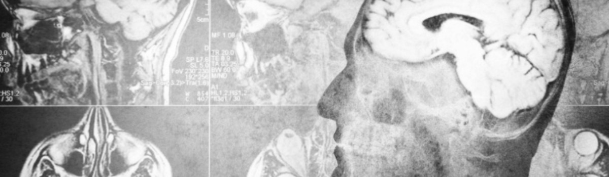

# Frontal Lobe of the Brain

- **Category:** 
- **Date:** 08/11/2023
- **Author:** 
- **Source:** https://www.quranproject.org/Frontal-Lobe-of-the-Brain-646-d

## Content

كَلَّا لَئِنْ لَمْ يَنْتَهِ لَنَسْفَعًا بِالنَّاصِيَةِ
نَاصِيَةٍ كَاذِبَةٍ خَاطِئَةٍ
“No! If he does not desist, We will surely drag him by the forelock - A lying, sinning forelock.”
Qur’ān 96:15-16
Shaykh Zindani writes, “The Holy Qur’ān describes the front of the head being lying and sinful. God says, “
a lying sinful nasiyah (front of the head).
” Since the front of the head does not speak, how can it be described as being lying? It does not commit sins. How is it then said to be sinful?
Professor Muhammad Yusuf Sukkar dispelled my perplexity while he was talking to me about the function of the brain. He said: “The function of the portion of the brain that lies in the front of the human head is to control the human behaviour.” I said: “I have found it.” He said: “what have you found?” I said: “The interpretation of the saying of God, “a lying sinful nasiyah.” He said: “Let me consult my books and references.”
After having done so, he, confirming what he had said, added: “When a person intends to tell a lie, the decision is made in the frontal lobe of the brain, which is the front of the head. If he wants to commit a sin, the decision is made there, too.” Then I discussed the subject with a number of specialized scholars, among whom was Keith L. Moore, who stated that the front of the head is responsible for judging and for directing human behaviour. The working organs of the body (e.g. the limbs) are but tools to carry out the decision made in the front of the head.
The anatomical structure of the upper region of the forehead shows that it consists of one of the bones of the skull, called the fronted bone, which protects one of the lobes of the brain called the frontal lobe, which contains several neural centers in various locations and with various functions.
The prefrontal cortex constitutes the bulk of the frontal lobe of the brain, and its function is involved in the making of one’s personality. It is also considered as a superior center among the centers of concentration, thinking and memory. It plays a significant role in the persons emotion and it is somehow concerned with initiative and discrimination.
The cortex is situated directly behind the forehead; it is hidden deep in the front of the head. Thus the prefrontal cortex directs some of the human behaviour that reflects one’s personality, with respect to being truthful, lying, right, wrong…etc. It also distinguishes between these virtues and vices and urges one to take the initiative whether with good or evil intent.
In a joint research on the scientific miracle of “nasiyah” [frontal lobes]  by Keith L. Moore and me, presented in an international conference held in Cairo in 1980, Keith L. Moore did not talk about the function of the frontal lobe of the human brain only, but talked about the function of the ‘nasiyah’ in the brains of various animals. Demonstrating pictures of the frontal lobes of a number of animals, he said: “The comparative anatomical study of human and animal brains shows that the nasiyah has the same function: It is the center of control and guidance in both man and animals that have brains.”
His saying drew my attention to the saying of God,
مَا مِنْ دَابَّةٍ إِلَّا هُوَ آخِذٌ بِنَاصِيَتِهَا
“...There is no creature but that He holds its forelock...” Qur’ān 11:56
I also called to mind some of the traditions of the Prophet Muhammad, such as:
“O God! I am your servant and the son of your servant and the son of your bondmaid, my nasiyah (front of the head) is in Your Hands…” and: “I seek refuge with you from the evil of everything whose nasiyah is in Your Grasp.”
and:
“Horses have goodness embedded in their nasiyahs, till the Day of Resurrection.”
From the meanings of these texts we can conclude that the nasiyah is the center of control and guidance of both human and animal behaviour.
Professor Keith L. Moore says, “The information we now know about the function of the brain, was not mentioned throughout history, nor do we find anything about it in the medical books. Should we survey all the medical literature during the time of the Prophet  and several centuries thereafter, we would find no mention of the function of the frontal lobe (nasiyah), or an explanation of it or a statement about it except in this Book (Qur’ān).”
The function of the frontal lobe was known for the first time in 1842, when a railway worker in America was hit with a bar that pierced his forehead. That affected his behaviour leaving the other functions of his body intact. Only then doctors came to know the function of the frontal lobe of the brain and its bearing on human behaviour. Doctors, up to then, had thought that this portion of the human brain was a mute region with no function.
Who, then, informed (Prophet) Muhammad that this portion of the brain (nasiyah) is the center of control and guidance in both people and animals and that it is the source of telling lies and committing sins?....Who, then, told (Prophet) Muhammad in particular, of this secret and this fact? It is the Divine Knowledge that no falsehood can approach from before or behind it. It is a witness from God that the Qur’ān is from Him.”
Read more here -
Scientific Truths and the Qur'an