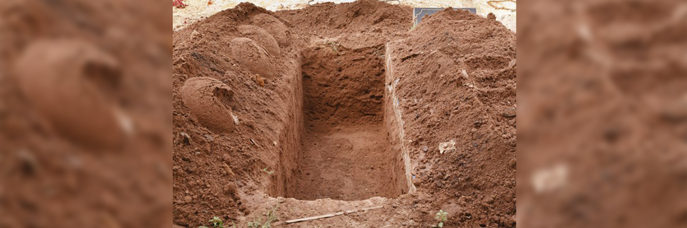

# Funeral Rites and Regulations in Islam

- **Category:** 
- **Date:** 24/02/2013
- **Author:** 
- **Source:** https://www.quranproject.org/Funeral-Rites-and-Regulations-in-Islam-298-d

## Content

All praise is due to Allah All-Mighty, the Ever-Living Who said: "Every soul shall taste death." And may His peace and blessings be upon His slave and final Messenger, our beloved Prophet Muhammad who himself tasted death. The one who said: "Always remember the destroyer of pleasures - Death." The topic between your hands is a very important one, given that most certainly every human being will taste death, just as the prophets, kings, rich, poor, young, old, and nations of the past experienced. By the grace of Allah, Islam has provided a complete set of instructions for the dying individual, those who are present at the time of death, as well as those responsible for burying the deceased. These regulations and exhortations should be common knowledge among Muslims, since death often occurs when it is least expected. This article attempts to provide the reader with a concise compilation of rules and regulations regarding funeral rites in accordance with authentic Islamic teachings.
What to do for a dying and dead person
1. Gently but firmly advise and prompt the dying person to say the Shahaadah - the declaration: Laa ilaaha illa-Allah, which means there is no true god except Allah. This prompting in Arabic is known as Talqeen. The Messenger of Allah (s.a.w) said: "Prompt your dying ones to say 'Laa ilaaha illa-Allah.' Whoever last words at the time of death was Laa ilaaha illa-Allah will enter Jannah (Paradise) one day, irrespective of what happens to him prior to that." The talqeen is necessary only when the dying person is unable to utter the shahaadah.
Muslims are also encouraged to be present when non-Muslims are dying in order to present Islam to them. This permission is conditioned by the absence of any signs of shirk or acts of disobedience to Allah. The Messenger of Allah (s.a.w) visited a Jewish youth who used to serve the Prophet (s.a.w) during his fatal illness. He (s.a.w) sat by his head and said to him: "Embrace Islam, embrace Islam." He looked at his father as if to take his permission. His father said: "Obey Abu Al-Qaasim (i.e. Muhammad)." He took his advice and died immediately thereafter. The Prophet (s.a.w) said: "All praise be to Allah who has saved him from the Fire," and commanded his companions to pray the funeral prayer over him.
2. It is recommended to supplicate and say good words aloud in the presence the one who is dying. These positive words make the process of dying easier, and recovery from illness more bearable. The Prophet (s.a.w) said: "If you are in the presence of a sick or dying person, you should say good things, for verily the Angels say 'Aameen' to whatever you say."
The practice of reciting Surat Yasin in the presence of the dying person or dead person is based on weak prophetic reports, having no basis in the authentic Sunnah. Neither the Prophet (s.a.w) nor his companions did it, or recommended that it be done. Those who observe the practice of reciting Yasin over the dead do so in light of the hadith: "Yasin is the heart of the Qur'an. Whoever recites it seeking the pleasure of Allah and the Hereafter will receive Allah's forgiveness. So recite it to your dead." Concerning this hadith, Ad-Dar al-Qutni is reported to have said: "In the chain of narrators of this hadith there is confusion. Its text is obscure and is not correct." Another practice which has no foundation in the practice of the Prophet (s.a.w) and his companions, is turning the body of one who is dying so that he or she faces the Qiblah (i.e. the Ka'bah in Makkah). Turning the body became a custom after the time of the Prophet's companions, but was objected to by leading scholars of that time.
3. After a person's soul leaves his body, a person from amongst those who are present should close the eyes of the dead person if they were open at the time of death. The Prophet (s.a.w) said: "When the soul is taken, the eyesight follows it." Also, the entire body of the deceased should be covered, except for the one who dies in a state of Ihraam - that is, whilst performing Hajj or 'Umrah, in which case the head and face should not be covered.
4. The relatives of the deceased must hasten in paying back any debts from whatever wealth he or she has left behind, even if it means that all of their wealth will be exhausted. Jabir ibn 'Abdullah reported that after a man once died, he was washed, shrouded, embalmed, and placed where the funerals are usually placed for the prayer.
The Prophet (s.a.w) was invited to perform the funeral prayer. He came in, took a few steps, stopped and asked: "Perhaps your friend owes some debt?" He was told: "Yes, two dinars." So he moved back and said: "You pray for your friend." Abu Qatadah (r.a) said: "O Messenger of Allah, I will take care of the two dinars."… The Prophet (s.a.w) prayed the funeral prayer for him. The following day, the Prophet (s.a.w) met Abu Qatadah and asked him: "What happened with the two dinars?" He replied, "O Allah's Messenger, he only died yesterday." On the next day, he (s.a.w) asked him the same and was informed that they had been paid off. So the Prophet (s.a.w) said: "It is now only that his skin has cooled down (i.e. from the punishment." This hadith indicates that paying the deceased's debts benefit him after death.
Weeping and Mourning over the Dead
Muslim scholars agree that weeping for the dead is permissible, whereas crying out loud and wailing are not. The Prophet (s.a.w) said: "The one who is wailed for is tortured on account of it." Abu Musa is reported to have said: "I declare my disavowal of all that Allah's Messenger disavowed. The Messenger of Allah disavowed publicly a woman who mourns loudly, one who shaves her head, and the one who tears her clothes in mourning." It is permissible for a woman to mourn for a period of three days over the death of a near relative. The Islamic term for mourning is Hidaad. Mourning for more than three days is not permitted except in the case of her husband's death. The Messenger of Allah (s.a.w) said: "It is not permissible for a woman who believes in Allah and the Last Day to mourn over a dead person more than three days, except for her husband, where she mourns for four months and ten days." A women whose husband has must observe what is known as the 'Iddah -
The waiting period before she may remarry, which is four month and ten days. During this period a widow is not permitted to use any adornment, such as jewelry, kohl (eye-makeup), silk, perfume, or henna dye on her hands and feet. A widow during her 'iddah is permitted to leave her home to fulfill her economic and social needs. If for example she works to sustain her family, she may continue to leave her home daily for the period of work. Apart from leaving the house for necessities and social visits to relatives and friends, a widow during her 'iddah should pass the night in her own home until her term lapses, that is, she is not to sleep outside of her house.
Condolences
Offering condolences to the relatives and friends of the deceased is an important act of kindness, which was displayed by the Prophet (s.a.w). When consoling a Muslim, it is important to remind the bereaved of the triviality of this life, that everything belongs to Allah, and that one should submit patiently to the decrees of Allah. It is also beneficent to make him hopeful of Allah's mercy toward the beloved one that he lost, and that by the will of Allah he or she will be united with the deceased on a Day after which there is no parting. What better words to say to the desolated then those taught by Allah's final Messenger (s.a.w): "Innaa lillaahi maa akhathaa wa lillaahi maa A'taa, wa kullu shay-in 'indahoo li ajalin musammaa." This means: "To Allah belongs what He took, and to Him belongs what He gave. Everything is recorded with Him for an appointed term." Offering condolences is not limited to three days, and could be extended for as long as there is a need for it. The Messenger of Allah (s.a.w) consoled Ja'far's family after three days had passed.
A very common practice is gathering to offer condolences to the deceased's family and relatives in the graveyard, house, or mosque. This is a heretical action that has no basis in Islam. Jarir ibn Abdullah al-Bajali said: "We (the companions of the Prophet) considered gathering for visiting the deceased's family, and preparing food after burying them, both acts of wailing." Imaam ash-Shafi said: "I dislike gatherings, even if there is no wailing or crying. For it only renews the family's feelings of sorrow and puts burdens on their food supplies." Some Muslims also commemorate the first, third, seventh, twentieth, or fortieth day following someone's death. This has absolutely no basis from the Qur'an or Sunnah.
Preparing the Body
There are a number of rites that Muslims must hasten to perform as soon as a person dies. The Prophet (s.a.w) said: "Hasten the funeral rites." Preparing the body for burial is a Fard Kifaayah - A communal obligation on Muslims. Washing the dead body prior to shrouding and burial is obligatory, according to numerous recorded instructions given by the Prophet (s.a.w). Preparing the deceased begins with the washing of the body.
As a general rule, males should take the responsibility of washing males, and females should wash females. The only exception to this rule is in the case of husband and wife, or small children. The evidence given that it is permitted for a husband to wash his wife and vice versa is the hadith collected by Ibn Majah and others. Aisha (r.a) reported that when the Prophet (s.a.w) returned from a funeral at al-Baqee', she was suffering from a headache and said: "Oh my head." The Prophet (s.a.w) replied: "No, it is I who am in pain from whatever hurts you. If you were to die before me, I would wash you…" Furthermore, when Abu Bakr (r.a) died, it was his wife Asmaa' along with his son Abdur-Rahmaan who washed him.
Those who take on the responsibility of washing the dead should be the most knowledgeable of the procedures, preferably from amongst the immediate family members and relatives. If relatives are unavailable, it is recommended that those who wash the body be among the pious. Washing a dead person is a meritorious deed that Muslims should be encouraged to take part in. The Prophet (s.a.w) said: "He who washes a Muslim and conceals what he sees (i.e. bad odors, appearance, and anything loathsome), Allah grants him forgiveness forty times (or for forty major sins)…" For this reward to be considered, a Muslim should only seek Allah's pleasure, and not thanks, pay, or any other worldly reward. Taking a bath after washing the body is an important hygienic measure introduced in Islam. However, there is difference of opinion amongst the scholars whether it is wajib (mandatory) or not to perform ghusl (ritual bath).
The correct opinion and Allah knows best is that is not compulsory. This is based on the hadith: "You are not to take a bath after washing your deceased, because he is not najis (filthy). It is sufficient that you wash your hands."
Manner of Washing
Firstly, the body should be carefully laid on its back on a washing table. A large towel should be placed over the 'awrah (private parts, between the navel and the knee) of the deceased. Next, the clothing of the deceased should be removed, cutting whatever is not easy to slide off. The joints should be loosened, and slight pressure may be applied to the abdomen to expel any impurities that are close to exiting.
The private parts of the deceased should be washed very well. A rag or cloth should be used to wash the body and the washing should begin with the places on the side of the body washed during wudu' (ablution). After completing the wudu, the hair should be thoroughly washed. Any tied or braided hair should be undone. Next, the body should be washed a minimum of three times and the water should have some cleaning agent in it, such as soap or disinfectant. The final washing should have some perfume in it, such as camphor or the like. There is no harm in washing the body more than three times if there is a need to do so, however the total number of complete washes should be odd. Umm 'Ateeyah said: "Allah's Messenger (s.a.w) came to us while we were washing his daughter and said, 'Wash her three, or five, or more times, using water with lote-tree leaves, and put camphor in the last washing.'" The body should then be dried and the hair combed. The body is now ready for shrouding.
In the case of a martyr, their body should not be washed at all. Concerning the martyrs, the Prophet (s.a.w) said: "Do not wash them, for verily every wound will emit musk on the Day of Judgement." The following practices are amongst common innovations related to washing: Clipping of the nails and shaving of armpit or pubic hair, pressing hard on the stomach to expel impurities, stuffing cotton into the throat, nose and anus of the deceased (This is only permissible if the body has a continuous leak.), saying a specific phrase for every part of the body that is washed, and the present people making a loud thikr while the body is washed. We seek refuge with Allah from ignorance.
The Kafan - Shroud
The next procedure after washing is the obligatory act of shrouding the entire body. It is allowable for the deceased to be wrapped with one or two sheets. The preferable number is generally considered to be three, given that the Prophet (s.a.w) was shrouded in three. The preferable colour of the shroud is white. The Messenger of Allah (s.a.w) said: "Wear white clothes, for verily it is among the best of your garments, and shroud your dead in it also." It is not permissible to be extravagant in shrouding the dead. The sheets should be ordinary cloth, and the number of sheets should not exceed three. It is recommended that the shroud be perfumed with incense, except in the case of a person who died in a state of ihraam. The clothing of one killed on the battlefield is not to be removed. It is recommended to shroud the martyr with one or two sheets over their clothes as the Prophet (s.a.w) did for Hamzah and others.
The Funeral prayer
The performance of the funeral prayer over a Muslim, known in Arabic as Salaat-ul Janaazah, is a communal obligation - Fard Kifaayah. If someone is buried without it being performed, the whole community incurs a sin for not having fulfilled this obligation. A child born dead or aborted dead after four month, or one that dies before puberty, does not have to have a funeral prayer. This is in light with the hadith of Aishah who said: "The Prophet's son Ibraaheem died when he was eighteen months old, and the Prophet (s.a.w) did not make (funeral) salaat for him." Although it is not obligatory in this case, it is still recommended as it was done by the Prophet (s.a.w) on other occasions. Likewise in the case of those killed on the battlefield, such individuals may be buried without the performance of Salat-ul Janazaah, as was the case with the martyrs of the battle of Uhud. However, the funeral prayer may be performed for martyrs, given that the Prophet (s.a.w) did perform it over those who died in battle on other occasions.
The funeral prayer should also be held for those known to be corrupt, such as drug addicts, alcoholics, adulterers, and the like. In their case it is preferred that the scholars and the pious not take part in the funeral prayer as a punishment for them and deterrent for others like them. It was the practice of the Prophet (s.a.w) not to pray for those who committed major sins, allowing others to partake in it.
It is preferable to pray the funeral prayer outside of the mosque, in a place designated for that, known as the Musallah. This was the most common practice of the Prophet (s.a.w). The funeral prayer may be carried out in the mosque, however praying it outside the mosque was the predominant practice of the Prophet (s.a.w). It is permissible to pray Janaazah (but not other prayers) in a graveyard, either away from the graves, or in an area designated for that. It is also permissible to perform the funeral prayer over a grave, after burial, in two situations: If the dead person was buried before performing the prayer; or if he was buried before giving chance to the Muslims to perform the prayer. This was done by the Prophet (s.a.w) over a black woman who used to clean the mosque.
The reward and benefits for offering the funeral prayer is very great for both the deceased and the one who performs it. Allah's Messenger (s.a.w) said: "Whoever follows a funeral procession and offers the prayer for the deceased, will gain one Qeeraat of reward. And whoever follows it and remains with it until the body is buried, will get two Qeeraats of reward, the least of which is equal in weight to Mount Uhud." And he (s.a.w) also said: "Whenever a Muslim man dies, and forty men pray over his janaazah, none of them joining anything with Allah in worship, Allah grants them intercession for him." The only way the Prophet (s.a.w) and his companions offered the funeral prayer was in congregation.
It is preferable that those behind the Imaam form at least three rows, even though the rows may not be complete, as this is the Sunnah. The Imaam should stand facing the Qiblah behind the head of the dead man and behind the middle of the dead woman.
The Imaam begins the prayer with takbir. It is possible to do either four, five, six, seven, or even nine takbirs, as all of them have been recorded in authentic hadiths and acts of the companions. With the uttering of takbir, it is permissible to either raise one hands with each takbir, or to do so only for the first takbir based on different sound narrations. After each takbir, the hands should be placed on the chest, as one would do in regular prayer. After the first takbir, Surat al-Faatihah should be recited. It is also permissible to recite another small chapter after it. The recitation should be done in a quiet voice. After the second takbir, the prayer for the Prophet (s.a.w) should be made, similar to that said before one ends their salaat.
After each of the remaining two or more takbirs, sincere prayers (du'a) should be made for the dead and their relatives. There are different invocations narrated by the Prophet (s.a.w) found in books of supplication one can choose from to say. After the final takbir comes the tasleem - giving greetings of salaam, as one does in regular prayer (salaat) to conclude their prayer. One may do so by making tasleem to both the right and left sides, or the right side only, as both have been authentically transmitted.
If a Muslim dies in a land where there are no Muslims to pray the funeral prayer over him, then in this case it is permissible to perform the prayer for him in another land. This is known as salat-ul Ghaa-ib - The prayer of an absent person. This is what the Prophet (s.a.w) did when news reached him about the death of an-Najaashi, the ruler of Abyssinia at that time, and a Muslim who concealed his faith. Some scholars took this action of the Prophet (s.a.w) as a sunnah and permission for Muslims to pray for everyone who dies afar. This is the opinion of Shafi and Ahmad. Other scholars took this incident as a special case only applicable to the Prophet (s.a.w) and no one else.
This is the opinion of Abu Hanifah and Maalik. The correct opinion and Allah knows best, is that if the funeral prayer was not performed in the land where the person died, it is permissible to pray salat-ul Ghaib. The Prophet (s.a.w) prayed for an-Najaashi because it is appears that the prayer was not performed for him, given that he died amongst the disbelievers.
Visiting Graves
It is recommended to visit the graves for the purpose of getting admonishment and remembering the hereafter. The Messenger of Allah (s.a.w) said: "I forbade you from visiting graves, but now you may visit them, for in visiting them there is a reminder of the hereafter." It is totally forbidden to associate the visit with anything that would anger Allah (s.w.t), such as supplicating to the dead, invoking their assistance, wailing, or other types of shirk and sinful actions.
Difference of opinion exists amongst Muslim scholars concerning the permissibility of women visiting graves. The soundest opinion and Allah knows best is that they are allowed to visit the graves. This is the opinion of Imam Malik, some Hanafi scholars, al-Hafiz ibn Hajar, al-'Ayni, and according to one report from Ahmad. This view is based on several reports including the above-mentioned hadith, whereby the Prophet's (s.a.w) statement recommending to visit the graves is addressed to both males and females. It is also centered on the hadith of 'Abdullah ibn Abi Mulaikah who said: "Once, 'Aishah returned after visiting the graveyard. I asked, 'O Mother of the Believers, where have you been?' She said: 'I went out to visit the grave of my brother Abdur-Rahmaan.' I asked her: 'Didn't the Messenger of Allah (s.a.w) prohibit visiting graves?' She said: 'Yes, he did forbid visiting graves during the early days, but later on he ordered us to visit them.'"
Another hadith that supports this view is the hadith in which Aishah (r.a) asks the Prophet (s.a.w) about what to say when she visits the graveyard. The Prophet (s.a.w) replies with a supplication to say, and does not advise her otherwise. Also in the hadith collected by Bukhari and Muslim, the Prophet (s.a.w) passed by a woman crying by the grave of her son. He advised her to fear Allah and be patient…Had it been forbidden for women to visit graves, Allah's Messenger (s.a.w) would have told her that, as it is not from the character of the Prophet (s.a.w) to keep silent about prohibited actions. Although it is allowed for women to visit graves, it is not recommended that they visit frequently. The Messenger of Allah (s.a.w) said: "Allah (or Allah's Messenger) curses the women who frequently (visit) the graves." Muslims are allowed to visit the graves of disbelievers for reflection, however they are not allowed to participate in the funeral rites of non-Muslims.
We ask Allah Most High to grant us with authentic beneficial knowledge, and to bestow upon us the understanding of His deen. We ask Him to give us the strength and support to remember Him, praise Him, and to perfect our worship - Aameen.
Source:   missionislam.com  [External/non-QP]