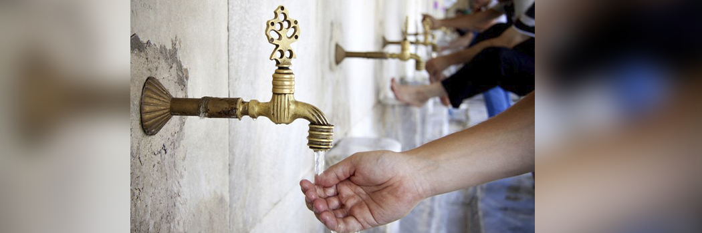

# Guide to Ablution and Prayer

- **Category:** 
- **Date:** 16/02/2013
- **Author:** 
- **Source:** https://www.quranproject.org/Guide-to-Ablution-and-Prayer-13-d

## Content

Wudu: The Ablution
The Wudu is a pre-requisite for the prayer
1. Make intention for the ablution and say, "Bismillah" (In the name of God)
2. Wash your hands
3. Rinse your mouth and nose
4. Wash the face
5. Wash the right arm including hand up to the elbow, then do the same for the left
6. Wipe the head back and forth once
7. Wash the right foot including its ankle, then do the same for the left
All actions of washing can be done once, twice or thrice except for wiping of the head which is done only once.