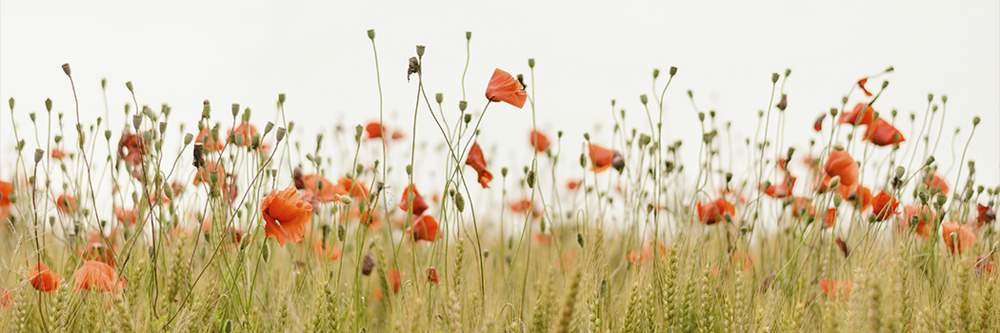

# Islam - Elevation of Women's Status

- **Category:** 
- **Date:** 24/02/2013
- **Author:** 
- **Source:** https://www.quranproject.org/Islam---Elevation-of-Womens-Status-323-d

## Content

The topic that I was asked to discuss here at McGill University is the elevation of the status of women in Islam. Many, upon hearing the title of this lecture, might assume it to be an oxymoron because the prevalent idea - at least in the West - is that Islam. does not elevate the status of women, but that Islam. oppresses and suppresses women. So people might find the title in itself to be shocking or a curiosity at least.
In discussing this topic - since it appears to me that this is a mixed audience of Muslims and non-Muslims - I'd like to make my remarks and comments brief. I will take no more than thirty to forty five minutes, and then allow you an opportunity to ask your questions. Perhaps the question and answer session might be more fruitful in addressing specific accusations, understandings or misunderstandings regarding the status of women in Islam.
As we all know, in the world today, there are - for the overwhelming majority of humanity - basically two world views. These two views are often in conflict - not only on the personal level where individual human beings are making choices, but also on the international level in terms of the debate over the authenticity and correctness of these two world views.
The first world view, which I am sure most of us are aware of, is the Western liberal view. A view which claims to draw its roots from the Judeo-Christian tradition that probably, upon investigation, is more well rooted in the ideas that appeared after the reformation; ideas that are rooted in secularism and the world view that appeared thereafter during the 'era of enlightenment'.
The second view is that of the Muslims - the Islamic world view, and this view says that its roots and ideas lie in the revelation given by God (or Allah in Arabic) to the Prophet Muhammad (sallallaahu`alayhi wa sallam). Those who proclaim this view say that it can be used by humanity during all ages and times, and that its relevance and benefit is not restricted to a certain period of time, geographic area or certain race of human beings. Likewise, the adherents of the first view, that of
Western secularism and the liberal tradition, believe that their world view, ideas, culture and civilization are the best for humanity. Some of you might have read a book that came out a few years ago by an American author of Japanese decent (Francis Fukuyama) called "The End of Time". He basically put forth the theory that human development in terms of its ideas has concluded with this final period of liberal secular thought and nothing more will come to humanity. However in his book he adds that that the only part of the world which has not adopted this secular human view is the Islamic world and proposes that there will be a conflict in terms of this ideology in the Islamic world.
With that brief introduction, one of the topics of contention between these two worlds views, that of the secular liberal humanist in the West and the Islamic tradition, concerns women. What is the position and status of women? How are women looked to? Are women elevated in one culture and oppressed in another?
The Western view is that women are elevated only in the West and that they are getting more and more rights with the passage of time, while their sisters - they say - in the Islamic world are still being suppressed. The Muslims who they encounter say that in actuality it is the Islamic system that provides the true freedoms for men and women alike, and women in the West as well as men, are deceived into an idea of freedom which really doesn't exist.
What I'd like to discuss this evening is exactly how Islam. looks to women. And therefore my discussion will be more upon - what we might say for the lack of a better term - the philosophical basis, rather than the individual practices which vary from one country to the other. How women are understood in Islam. cannot be properly understood - and this is more significant, I feel - unless one understands exactly what we might call the philosophical basis or ideological understanding - since this is really a theological concept.
First, let's review how exactly women were thought of and understood in the western tradition, to compare and contrast perspectives. We know that the western tradition sees itself as the intellectual inheritors of the Greek tradition that existed before the prophet Jesus Christ (peace be upon him), and so therefore many of the intellectual traditions of the West are found to some degree in the writings of the early Greek philosophers like Aristotle, Plato and so forth.
How did they look towards women? What were the ideas of Aristotle and Plato towards women? When one reviews the works of these early Greek philosophers, he finds that they had very disparaging views of women. Aristotle in his writings argued that women were not full human beings and that the nature of woman was not that of a full human person. As a result, women were by nature deficient, not to be trusted and to be looked down upon. In fact, writings describe that the free women in many aspects of the Greek society - except for the very few women of the elite classes - had positions no better than animals and slaves.
This Aristotelian view of women was later carried on into the early Christian tradition of the Catholic church. Saint Thomas of Aquinas in his writings proposed that women were the trap of Satan. The issue of Adam and Eve added a dimension to the earlier Greek ideas of Aristotle; women were the cause of the downfall of man and therefore were Satan's trap and should be looked at with caution and weariness because they caused the first downfall of humanity and all thus evil precedes from women.
This type of thought was persistent within the writings of the Church fathers throughout the Middle Ages. In their writings we find this theme proposed in one aspect or another. However, after the Protestant reformation Europe decided to free itself from the shackles and chains of the Catholic church. Ideas which have been entitled as the Age of Enlightenment or thought of as such, caused them to feel that they needed to free themselves from many of these ideas. Some of these ideas were scientific in nature, that the earth goes around the sun, instead of the sun going around the earth; theological in nature, as in the writings of Martin Luther; and also social in nature, like the position of women in society. However, the writers of the Enlightenment still carried this basic theme that was not much of a switch - women where not full human beings.
French writers during the revolution, like Rousseau, Voltaire and others, looked at women as a burden that needed to be taken care of. This is why I believe it's Rousseau in his book "Emile", which he wrote concerning the education of women, proposed a different form of education for women based upon the fact that women were unable to understand what men were able to understand.
This is the tradition that the West inherited and thereafter we find in the 1800's the first writings appearing by women and some men calling for the change of these ideas. And with this we have the origins of the first feminine movements. One of the first books written was the "Vindication for the Rights of Women" by Mary Walsencraft which appeared in the 1800's. Thereafter the tradition of women receiving certain rights came. The first of these were basically legal rights because until the 1800's women were not able to own property and were not able to dispose of their wealth as men did. It is very well known that the first laws that allowed women to own property in the United States or in Europe appeared only in the last couple of decades of the 1800's.
The Industrial Revolution caused another impetus, another search, to this feminist movement. Women in the Industrial Revolution, especially England, were forced to labor for many hours in the coal mines and so forth, and would receive no pay whatsoever compared to men. So therefore the first calling of the movement was that people who work the same amount of hours deserved the same amount of money or pay.
Finally a break occurred in this century of basically all which is understood from the Western tradition. Coming from the latter feminist movement which appeared after World War II, a new movement called for the emancipation of women not only in terms of legal rights, but it also questioned some of the morals of society and called for greater sexual freedoms for women and men alike. It contended that basically a lot of problems were caused by the institution of marriage and the ideas of family and so forth. People wrote concerning the need to break from these.
And finally in the 1990's, the prevalent argument in the West is that we should discuss genders, not sexes. This idea was expressed recently in a book which came out a year ago called "The Age of Extremes". The author discusses the idea that there is no difference between male or female and that gender is so only due to environment. So therefore we can change the environment so that men could take the roles of women and women take the roles of men by changing the education and climate. This is where it has ended up now.
So we find in this 2500 year old western tradition, we come from the first extreme which was expressed by the Greeks, where women were denied their essential humanity, to this extreme expressed today where there is no differences between the sexes and it is an issue of gender, climate and environment. This is, of course, a very brief summary of the first world view. I didn't do justice to those 2500 years in just those few minutes, but it just gives us an idea.
The other view which I would like to talk about in more detail is the Islamic view. How does Islam. look at the issue of women? Well, first of all, we should understand that Muslims unlike, for instance, the Greek philosophers or the French writers after the French revolution, do not feel that their concepts, ideas and beliefs are those of fellow men. But rather they believe that what they are taught, what they believe, what they practice, and all that is tied to this, is part of a divine revelation given to them by God. And so, its truth and veracity is not questionable because of it being revelation from God.
The argument is that God knows best that which He created. He created human beings, He is a God of wisdom, and a God of all knowledge and so therefore He knows what is best. And He decrees that which is best for humanity, His creatures. Therefore, Muslims try to live by a code of law which is an expression of that belief.
Now I don't want to discuss the various details of the code of law because that, I feel, would not really benefit us in this lecture. Although perhaps some of that might come out in the question and answer session and I'll be glad to entertain any questions you might have. But what I would like to discuss is how does Islam. look at women, i.e. what is womanhood in Islam.? Did Muslims believe like the early Greek writers or early church fathers that women were not full human begins? Did they feel that women where Satan's trap, so therefore should be shunned and looked at as something evil and dangerous?
How did they perceive women? Upon investigating into the traditions of Islam. which is, as I said, based on revelation known as the Qur'an, we find that it becomes very clear that Muslims are taught that men and women share a single humanity - that they are equal in their humanity and that there is no difference in the amount of human nature in them. We might now take that for granted, but as I explained, the initial western civilization was based on the fact that women were not full human beings.
So this being something that was taught 1400 years ago was a revolutionary idea in the sense that it is only within the last 100 years or so that the issue of women being full human beings has come to be accepted in western intellectual circles. Initially, women were not considered full human beings.
The Qur'an in describing the origins of human beings tells them, the translation of which would be something like
"O humanity! Verily we have created you from a single male and a single female, and have made you into tribes and peoples so that you may know one another. Verily the most honorable of you are those who are most pious with God."
[49:13] This verse in the Qur'an teaches that humans come from a single male and a single female.
The indication here is that the male and female in terms of their human nature are at an equal level. Likewise another verse, from a chapter which is known in the Qur'an as the chapter of Women - because most of the issues discussed there are laws dealing with women - starts off with a verse which could be translated as "O humanity! Verily We have created you from a single soul, and have made from it its mate," this is a reference to Adam and Eve, "and have made from both of them many people, men and women, and scattered them throughout the earth." [4:1] So here again is the issue of men and women and all human beings coming from a single source, a single family, a single set of parents. This shows that women share in full humanity with men.
Likewise in the traditions of the Prophet Muhammad (sallallaahu 'alayhi wa sallam) - which is the second source of the Islamic religion - we find that the Prophet Muhammad (sallallaahu `alayhi wa sallam) said in a Hadith that indeed verily women are the twin halves of men. The Arabic word
shaqaa'iq
, which I translated as twin halves, means taking something and splitting it in half. The understanding is that there is a single humanity, a single essence which is shared, and there are twin halves of that - one is man and one is women.
This is repeated often in the Qur'an The words of the Prophet Mohammad (sallallaahu `alayhi wa sallam) also emphasize this. As I said, this is a very important concept to understand when one reflects on how traditional western civilization looked at women as not being full partners and not sharing in humanity. Although now, we might not find much surprise to that because it is a given perhaps that men and women are full human beings. But this is something that is a late occurrence in western traditions.
Let us take it to another step, what is the aim of humanity? What is the purpose for which human beings exist on earth, to what ends do they strive? What will occur to them if they strive to those ends and what will occur to them if they did not strive to those ends? Since Islam. is a religion which sees itself as revelation from God and the truth, Muslims would feel that human beings have a set purpose here on earth; that in everything of God's creation there is wisdom.
There is nothing of God's creation that does not have any wisdom. There is nothing for sport or play and so therefore human beings have a purpose, and that purpose has been elucidated for them in the teaching of Islam. They were created to worship God. A verse from the Qur'an says that God says that He has not created human beings except to worship Him. So therefore, the essence of humanity is the same between male and female, and they also share the same aim and that is to worship God. And that is the most important issue in the Islamic culture and civilization. You know that the Islamic culture and civilization is rooted in religious belief. American civilization is rooted in what?
In the writings of the founding fathers of the United States of America. It is rooted in the Declaration of Independence, the ideals which were placed therein. It is rooted in the Constitution of the United States. It is rooted in some of the arguments between monarchy or democracy which were written by some of the early writers or founding fathers. So it is rooted in a political thought. Yes, it might have some traditions which go back further and extend to certain ideas like in parts of Christianity and so forth, but in its essence it is a political thought, unlike Islam. which is a religion in its essence.
The civilization of Islam. - a civilization which is 1400 years old - is one which is rooted in religion. For a Muslim the greatest aim is to serve God, to worship God alone, and that is what the word Muslim means.
Muslim is not a racial description, it is not an ethnic category, Muslim means one who submits. Islam. means submitting to the will of God - the voluntary submission to God - so Islam. is a religion of submission. Therefore, in the most important aspect of the Islamic religion, we find that men and women share in the same aim and are expected to have the same responsibilities, in that men and women are both required or obligated to testify that there is none worthy of worship but Allah alone - God alone - and that Muhammad is His Messenger. Men and women are both obligated to pray five times a day, which is the second pillar of Islam. They are obligated to fast the month of Ramadan. They are obligated to make pilgrimage to Makkah. They are obligated to give charity. They are obligated to have the same beliefs. They are obligated to have the same type of morality and the same type of code of conduct and behavior.
Men and women share these essential ingredients of Islamic behavior, which define a Muslim from a non-Muslim. And this is of extreme importance because it breaks from the tradition of religions. For instance fifty years before the birth of the prophet Muhammad (sallallaahu `alayhi wa sallam) who was born around 560 CE we find that there was a gathering of bishops in France to discuss whether women possessed souls or not, and that, if they do possess souls, what would be their purpose on earth? Was it to worship God? And if they worshipped God, would they go to paradise? In the end it was decided that, yes, women do possess souls - which was a break from previous tradition - but that their purpose was not just to worship God, but also to serve men.
In Islam., however, the basis of submission is not that women are submitting to men, but that men and women together submit to God. So therefore, when you read the passages of the Qur'an, it becomes very clear that the obedient from among both the believing men and women receive paradise, which is the greatest aim and objective in a Muslim's life, and the basis of that civilization.
Likewise, those who are disobedient and who are renegades, and who do not want to worship God also receive the same punishment whether they are male or female. This is why throughout the Qur'an you find the wording addressed to both males and females. The Arabic language like French has two types of verbs, one representing the feminine and one the masculine. So in the Qur'an you'll find both categories of the human race, both sexes, being addressed. This you find over and over and over. There is no need to now recite all these passages, but they are there if anyone wants to know.
In summary we found three bases: that they share the same humanity, that they have the same aim on this earth, and also, they expect the same reward, which is the goal which they are working for collectively as human beings. And this is a break as I said from the previous religious traditions and also political and social understanding prevalent among the philosophers before the coming of Islam.
And as a result of that, we find that Islam. accorded women rights which perhaps we take for granted now, but were given by God to men and women some 1400 years ago. These rights like the right to own property, the right to dispose of property according to their own wishes as long as they follow the laws of the religion of Islam., which apply the same for men or women and the right to certain what we would call now political rights, like the right to enter into a treaty with combatant, are something very recent relatively speaking in the West.
One of the rights given by Islam. in the time of the prophet Muhammad (sallallaahu `alayhi wa sallam) was that if a woman gives a treaty to a combatant from a non-Muslim attacking force - her treaty would be considered as was the case with a female companion of the Prophet Muhammad (sallallaahu `alayhi wa sallam).
In the Christian church these companions would be called disciples for instance, the disciples of the Prophet Muhammad are the companions as they are called. They were in the hundreds and thousands not just twelve as with Jesus Christ, and there are both men and women amongst them. When the prophet Muhammad came to Mecca, one of the women companions by the name of Umm Hani, who was an inhabitant of Mecca and a believer in the Prophet Muhammad (sallallaahu `alayhi wa sallam), accorded certain relatives of hers protection that they would not be harmed.
Her brother who was one of the main companions of the Prophet Muhammad and married his daughter, Ali Bin Abi Talib, wanted to execute two of these men who were known for harming the Muslims and fighting against them.
So Umm Hani went to the Prophet Muhammad and complained that she had accorded them protection and the Prophet recognized her giving protection to those two individuals.
This is what we might call, in the classification and terminology that we now use, a political right. In the sense of according protection for another person during the state of war is something which is relatively new in the West and was a known tradition in the Islamic world 1400 years ago. Likewise, in terms of what we might call public participation, there are certain acts of worship which are public acts of worship in Islam., and there are certain acts of worship which are private. One of the public acts is the pilgrimage, when men and women all make pilgrimage, and this is one of the pillars of Islam.
Likewise another public act of worship is the two `Eid prayers which occur twice a year, once after the pilgrimage and once after the pass of Ramadan. Men and women both participate in that publicly. Likewise, we have a verse which shows that the social contract between men and women is the same in Islam.
This verse might be translated as the following: "
And the believing men and women are
," what we might translate as, "
awliyaa
" - the word in Arabic for friends or allies or supporters of one another, "
they
" - meaning men and women - "
bid to that which is correct
" i.e. they commend that which is correct, "
and they forbid that which is evil
". And this is a corrective process in society, removing evil and commending that which is good. And then "
they perform the prayer
", both men and women, "
they pay the alms
", or the charity to the poor, "
and they obey God and His Messenger
." And then God shows them the reward and that they are those upon whom God will have mercy and God is Almighty and All-Wise.
So in this verse, we find that the social contract between men and women, as individuals in the society, is the same, that they both go for the highest goal of bidding or commanding that which is correct, forbidding that which is evil, and that they share in the two major acts of worship, which are the prayer and giving charity.
They share in the beliefs and obedience to God and obedience to the Prophet Muhammad (sallallaahu `alayhi wa sallam) and likewise, they share in the reward in the end of obtaining Allah's mercy. This is a very important concept, which is in contradiction with what the western tradition is upon today, and that is as I said as a result of the initial extreme of the Greek philosophers that women did not share in humanity. As the result of that extreme another extreme occurred - at least the Muslims consider it extreme - that there is no difference between men and women.
So therefore, the idea of having genders - this is a term which is not used in a biological sense, as we might use the word sex in a biological sense for male and female, but the understanding today is that the traits that define maleness or femaleness, the social traits and so forth are determined by upbringing, culture, and environment and that there is no inherent difference in the way men and women think or act or what their make up is and so forth. And that is why they use the term gender.
This extreme resulted from the initial extreme that occurred 2000 years ago, when the Greek thought that the women did not posses humanity. So as a result of this 2000 year processes we now come to another extreme - at least this is what Muslims would say - this extreme now is that men and women are the same, that there is no difference.
Islam., although confirming that men and women do share in the same essence of humanity, also confirms that men and women are different. But does this difference mean that men are inherently good or women are inherently evil?
No. And this is why when you look at one of the verses in the Qur'an that sheds light on this aspect, God says, recounting His creation, that He is the One Who created the night, as it envelops, as it comes - if you look at the horizon, it comes like a sheet enveloping the horizon - and He is the One Who created the day as it comes bursting, shining, - that is how Sun rises and He is the One Who created male and female. And then the next verse says, verily, what you strive for - human beings are into different ends, diverse ends - some strive for God's pleasure, some strive for disobedience of God, some strive to do good to humans, some strive to do harm, different ends. But what is the example here?
God mentions night and day and then mentions male and female. The understanding is, yes, night has a purpose, and in the Qur'an you always find verse after verse, describing that night has a wisdom behind it. And also it tells humanity that had it been only night and no day human beings could not live on earth. And this is now shown scientifically that if it was only night and there was no sunlight, certain hormones of body would not be able to reproduce and human beings would die. Life as we know it on earth would not exist. And likewise, day has its wisdoms behind it. But can one argue and say, that night is good and day is evil? No, and no Muslim would believe that. And can one argue and say that day is good and night is evil? No. Likewise, male and female also have their roles to play. But can one say that the role of men is inherently good and the role of women is inherently evil?
No. And can one say the opposite to that - the role of women is inherently good and the role of men is inherently evil? No. But they both have a role.
This is the main contention now between western thought and Islamic belief. Western thought has basically accepted, except for maybe some few corners perhaps in the Vatican or so, that men and women share in their humanity and that they are the same. Muslims have believed this for 1400 years.
But the difference is that in western thought, as a reaction to the initial thought that women did not share humanity fully, the argument is that the roles of men and women in society are only defined by culture, environment and upbringing, therefore there is really no true role for men and no true role for women and that we can switch this, if we just teach the society correctly. But in Islam. there is a defined role for men and a defined role for women. Who is the one who defines this role for men and women? It's their creator. This is the major, if you want to use the term philosophical, even though it is an inaccurate term in that sense, but we can just use if for the lack of
better term, philosophical, ideological or theological difference between the two opposing arguments. Now with that said, it is important to understand that when Islam. gave these roles to men and women alike, it put responsibilities equal to obligations to both. I will give you an example for that: Islam. senses that women have the nature of mother not by cultural tradition or by sociological system but inherently are better in providing and taking care of the offspring, that there is a bond there which goes beyond tradition. A psychological bonding, a physical bonding, something which is more than just traditions of human beings. As a result of that it has placed greater responsibilities upon women towards their children are then those of men.
At the same time, the obligations that children have towards their mother in Islam. is greater than they have towards their fathers, and this is why when the prophet Muhammad (sallallaahu `alayhi wa sallam) was asked by a man one was his companions
"Who should I befriend in this world?" The prophet Muhammad (sallallaahu `alayhi wa sallam) replied "your mother." And then the man asked a second time, and the prophet replied your mother, and then a third time, and again he replied your mother, and on the fourth time, he said "your father".
Likewise in the Qur'an we find that it tells human beings that your mother bore you from one hardship to the other hardship, talking about the labors and difficulties of pregnancy and childhood, and then fed you for two years, suckled you, and tells us to be kind to our parents and reminds us of our mother first before our fathers.
The point is that even though it has defined a role for women with the children which is different than the role of the father, at the same time it gives women honor and respect from their children which is greater than that received by the fathers.
The fathers do receive respect and their honor, they are not just thrown out of the picture, but it is given to them and according to the degree of their responsibility. And likewise, because the mother inherently, not just because of cultural tradition, has something inherent which makes that bond greater between her and her child then the male. She receives a greater honor and respect from the child and at the same time she is required to give a greater obligation.
I only gave that as an example to show you that while Islam. recognizes differences between the sexes, it does not accept the concept that gender is just an issue of upbringing or cultural traditions, for there are inherent differences in males and females, and as a result of that the obligations and responsibilities of each of the two sexes are together.
Imported from that is another matter that even though men and women are different, they are not in opposition to one another, which is the basis of much of the western thought and especially of feminist traditions. That there's a struggle between men and women, "There is a battle of sexes", as it is sometimes said in the popular sort of designation. This doesn't exist in Islam. Men and women work in tandem, just like day and night revolve, and you live in day time and you live in night time.
You cannot live only in night, and you cannot live only in day, likewise, men and women are not against one another, they are not pitted against one another but rather they share in the same aim, the same purpose of being, the same humanity. They have different roles, but these roles complement one another and are needed by one another in order for the success of humanity, not in this world, but also - of course since Muslims believe in the hereafter- in the hereafter, which is the ultimate goal for Muslims.
Now, I would like to make one final comment and then I'll leave it open for questions. Let's look at the applicabilities of both of these programs. We discussed a lot of ideas, thoughts and beliefs and historical concepts, but when they are actually applied, which of the two view points is more successful. Which brings more bliss to humanity? Is it the secular western view or is it the Islamic view? And I have a concrete example which I'd like to share with you.
When I was in Beijing this last summer for the UN 4th world conference on the women, there was a platform for action which was being discussed by the different nations and organizations there. The aim of the platform for action was to upraise, uplift, and to embetter the status of women around the world, which are of course noble and correct aims, there is no contention concerning that. The platform for action was divided into different areas of concentrations, such as poverty, health, finances, conflicts and violence and so forth, and one of it was the girl child. The 12th issue of the 12 concerned areas for the platform for action, the girl child, the status of girls - future women - in the world today.
The country which was hosting the conference, China is known for the practice of killing girls. The reason why is because of their population. You can only have one child per couple and Chinese by their tradition view males as fewer then females and so as a result they will usually kill the female child, in hope that the wife gives birth to a boy.
This is an issue which exists and because the hosts were the Chinese, the United Nations didn't really want to get into this issue. They didn't want to talk about it because it was not politically correct to address that issue in China. Moreover, even though they might have passed certain regulations, platforms for actions and certain commitments which they have required of citizens of the world to follow, they at the end will see that perhaps in twenty-five to fifty years the status of the world child will not have markedly improved.
We can see from other things, one of the major issues which the United Nations was created for after World War II, was the slaughter of so many million human beings, six million Jews in Europe, and yet fifty years later, in the year of the fiftieth celebration of the UN, a genocide has taken place in Europe of the Bosnians.
All the human rights, all of the declarations in the last fifty years has not been able to change anything on the ground. Now when the prophet Muhammad (sallallaahu `alayhi wa sallam) was sent to the Arabs, the Arabs had the same practice. They used to kill their girl children. The Arabs killed their girls for a number of reasons, most of the time due to poverty. Being a desert people without industry or any sort of means of trade, existence was very minimal. And as a result, out of fear of poverty they would kill their girl children, and they would bury them alive. This is a fact which is mentioned in the Qur'an and was well known during the time of the prophet Muhammad (sallallaahu `alayhi wa sallam).
God condemns in the Qur'an with verses, the idea of killing of the girl child, the burying in the ground, and also the attitudes of the Arabs towards girls. One verse in the Qur'an says that "
when he is given the good news that his wife is given birth." God calls it a good news, " - to a female child, a girl - his face becomes blackened and he becomes ashamed. Will he hide the fact "that he has given birth to a girl and not tell the people, because he feels it as a shame. "Or will he bury it in the ground"
, this is a condemnation of the practice of the people. And likewise the companions of the Prophet Muhammad (sallallaahu `alayhi wa sallam) before they accepted Islam., many of them killed their girl children.
One man came to Prophet Muhammad (sallallaahu `alayhi wa sallam) and said I killed ten of my daughters in my lifetime, will I receive paradise? For will God accept my repentance for this sin, now that I have left this pagan religion of before, worshipping idols and killing girl children and so forth. Within one generation, within 23 years this was how long the prophet was amongst the Arabs, the practice of killing girls ended. It no longer existed in Arabia. And likewise, it didn't just stop like that, but a change in attitude came towards women, in educating them and making morally upright people.
People receive no other reward, but paradise. Again that is the greatest aim for the Muslim and that is their motivation and reason of being. So Islam not only tried removing the negative aspect of murdering girls, but also included the positive aspect of educating girls and raising them in society, and this brings me to my final point. This is something of course which we can look at the previous declarations of human rights or whatever, irrespective of whether these being true or false, but they have not been able to achieve the aims which they have stated. As the example of human rights and the UN in Bosnia shows.
Fifty years after the creation of the UN, there is no change in Europe, the same land which killed six million Jews. The same genocide of the Bosnians occurs fifty years later by the same people who started the UN. They are unable to stop their own from this matter, and with this I come to my final point, that I would like to leave you with. Islamic civilization unlike any other civilization is based, of course on revelation, but it is in its essence supported and founded by women.
The first person to believe in Prophet Muhammad (sallallaahu `alayhi wa sallam) was his wife Khadeejah, and it was through her money and through her support of him, her financial backing, and also her encouragement that the prophet was able to spread the message of Islam. in his first year of prophecy. The pagans did not have the ideas of freedom of religion, that you can take your own beliefs. This was not practiced by the pagans of Arabia - they saw this as an insurrection, they saw this as a changing of their ways, so they sought to stop it out by torture, by killing and by all other means that they could. And likewise, they tried to stop the Islamic revelation, this tradition, when the Prophet Muhammad (sallallaahu `alayhi wa sallam) converted only the people of Arabia. But as you know there are about one billion Muslims in the world. They are in every single continent of the world, even in Beijing where the UN was convening.
There was a mosque there which is over a thousand years old. And the neighborhood that lives there is about forty to fifty thousands Muslims. Now the king’s palace, the forbidden city in front of Tien Anh Man square which many of you have heard of, is only 500 years old. This shows how the growth of Islam. and the sprit of Islam. is not just a Middle Eastern phenomenon or an Arabian phenomenon but extends to all people and races throughout the world.
Where is this teaching from, of course when Prophet Muhammad (sallallaahu `alayhi wa sallam) died after twenty three years Islam. only spread in Arabia. This religion of Islam was basically spread by four or five individuals who had the most in teaching. One of them was the Prophet's wife `Aa’isha. She is among the most to have narrated his statements and likewise she is amongst the three, four, five who have mostly given religious pronouncements, who have given religious verdicts, explained what these verses in the Qur'an meant or what the words of the prophet meant.
Look at any other civilization in the history of humanity, you will not find a women playing a role in its establishment where it can be attributed to her efforts for its establishment. The Greeks - look at the philosophers Plato, Aristotle and others - all were men. The early church fathers writings were basically men and until today the idea of women scholarship is limited in some areas of the church.
The French writers at the French revolution and Voltaire and the Russians were men. The founding fathers of the United States were men, and also other civilizations are basically based upon men. Islam is the only civilization which is known by humanity where a leading input in terms of its transmission and establishment was based upon the efforts of women. Central - and this is an historical matter which is not open to interpretation, it is a fact - these are the people who transmitted these teachings these are the people who supported it hereafter. Those are just some thoughts and impressions concerning how Islam. uplifted women.
Source:  missionislam.com  [External/non-QP]