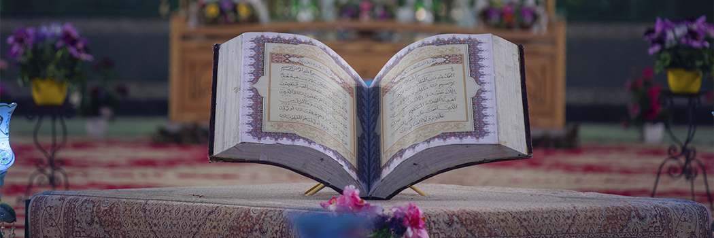

# Islamic Answers to Philosophical Questions: Part II

- **Category:** 
- **Date:** 18/06/2013
- **Author:** 
- **Source:** https://www.quranproject.org/Islamic-Answers-to-Philosophical-Questions-Part-II-487-d

## Content

The Sources of Knowledge
All realities, whatever type they may be, have two sources only, with no third category: existence and revelation, or, let us say, the creation of Allah and revelation of Allah. If a person makes a claim without supporting evidence from one or both of these sources, his claim is false.
Allah the Exalted said:
Say: Have you seen your partner-gods to whom you pray beside Allah? Show Me what they have created of the earth! Or have they any share in the heavens? Or have We given them a scripture so that they act on clear proof therefrom? Nay, the evildoers promise one another nothing but delusions. [I]
The worship of those people which they directed to other than Allah contains the proposition that they are arbab (pl. of rabb). A rabb must necessarily be a creator. Knowledge that someone is a creator may be known either by witnessing what he created in the universe or by revelation from the deity who has been established to be a creator. If this claim has no support either in the observable universe or in the word of the deity who is the creator, it is necessarily false.
The Islamic conception of the sources of knowledge differ, then, from the conception of materialistic atheism, which makes existence its only source and cannot conceive of a methodology of knowledge except that by which the realities of the physical universe became known. However, it also differs from the other religious metaphysical conceptions.
The pivotal difference between it and these other systems is that the latter establishes proofs from the observable universe for its claim that there is a second source of knowledge, i.e. revelation, while the materialists deny this reality, which is indicated by the source of knowledge they acknowledge, which places them in contradiction; the proponents of other religious metaphysical conceptions believe in sources for which they possess no trace of proof for their authenticity.
When Muhammad (pbuh) spoke to his people among the Arabs – and they were very intelligent people – many of them raised objections to his claim, using every objection a person could muster. They left no new objection for a person after them to employ. However, Muhammad (pbuh) answered all those objections with evidence and proofs which were the epitome of logic and rationality.
Here are some examples:
Some said they didn’t believe in his prophethood because they didn’t believe the universe had a creator. The answer was:
The how did you come into being? From pure nothingness? That is impossible. Or did you create yourselves? However, this is also impossible. No other possibility remains except that you have a Creator Who was not created nor did He beget nor was He begotten.
Were they created from nothing, or are they the creators? Or did they create the heavens and the earth? Nay, they are sure of nothing. [II]
Some said they believed in the existence of the Creator, but didn’t believe in the possibility of resurrection after death. The answer was: If you believe that Allah created the human being after a time when he didn’t exist, how can you deny His ability to restore him after death, even though that would be easier? Moreover, you see in this universe before you tat Allah the Exalted brings the earth to life with vegetation, then causes it to die with drought, then He brings it to life again another time. The One Who revives the earth after its death, how could He be incapable of reviving the human being after his death?
And they say: When we are bones and fragments, shall we really be resurrected at a new creation? Say: be you stones or iron, or some created thing that is yet greater in your thoughts. Then they will say: Who will bring us back to life? Say: He Who created you in the first time. [III]
Furthermore, if you believe in Allah, then you no doubt believe that He possesses all the qualities of perfection and is free of every flaw, and you believe that He is eminently Wise and that He doesn’t do anything pointless. However, this wise Deity sent messengers to guide the people to the path of good and warn them against taking the path of evil, and He ordered humanity to obey them.
Some people believed in them and took the path of good; others rejected them and took the path of evil. Do you think wisdom dictates that both parties end up the same? This world we live in is not the place of due reward, as we witness. How many good, kind people have lived hard lives or been killed unjustly? How many evil persons have lived in luxury and died after a long life? If there were no life after this life in which those who did good receive the reward of their deeds and the evildoers receive the punishment of their evil, then the creation of humanity and the sending of prophets would be pointless.
Did you figure that We created you in play (without any purpose), and that you would not be returned unto Us? So exalted be Allah, the True King! None has the right to be worshipped but He, the Lord of the Throne of Grace. [IV]
Or do those who earn evil deeds think that We will hold them equal with those who believe and do good deeds, the same in life and death? Bad is their judgment. And Allah created the heavens and the earth with truth, and that every soul may be repaid what it has earned. And they will not be wronged. [V]
Some of them said – they happened to be Jews – that they believed in Allah but they didn't believe in the message of Muhammad because they didn't believe that Allah sends messengers. The answer was that one who believes that Allah doesn't send messengers has not given Allah His due consideration, because if he had known Allah the Exalted and estimated His power and nature with the estimation due Him he would have realized that it would not be possible for Him to create humanity and bestow upon them all that their bodies require of food, drink, clothing, earth, air, the sun and moon, and then fail to provide them with what their souls require of guidance, but instead leave them confused, groping, disagreeing and anxious.
Moreover, if you don’t believe He sends a person as a messenger, how do you believe in Moses (pbuh) as a messenger? Who sent the scripture he came with?
They did not estimate Allah with an estimation due Him when they said: ‘Allah sent nothing (of revelation) to any human being.’ Say: Who then sent down the Book which Moses brought, a light and a guidance for mankind, which you (Jews) have put on parchments which you show, but you hide much (thereof) and by which you were taught that which neither you nor your fathers knew. Say: ‘Allah,’ then leave them to play in their vain discussions. [VI]
Some of them said, “We believe Allah sends messenger, but we wonder why Allah would send to humanity a messenger like us. Why doesn't He send us angels?” The answer was that angels are only sent to angels. What is appropriate for human beings is to have a human being like themselves sent to them, to address them in their own language and provide them with an example. If an angel were sent to them who did things which they found difficult, then he ordered them to do those things, they could argue that he is an angel who is capable of things they are incapable of.
Say: If there were upon the earth angels walking secure, we would have sent down for them from heaven an angel as messenger. [VII]
Moreover, one of the greatest indicators of the truth of his prophethood was Muhammad’s (pbuh) life. They knew him to be a truthful, trustworthy person. He wouldn’t have refrained from lying to people for forty years and then tell lies about Allah the Exalted. They also knew he was illiterate, being unable to read and write.
Neither did you (Muhammad) read any book before it nor did you write with your right hand. In that case the followers of falsehood would have been suspicious. [VIII]
He informed them that he wanted no worldly reward from them in exchange for what he was calling them to, and they saw him living among them impoverished but generous, merciful and humble; and they saw him making more sacrifices that they, and not showing the least interest in what other people possessed.
I do not desire to do behind your backs that which I ask you not to do. I only desire to reform, so far as I am able. My guidance cannot come except from Allah; in Him I trust, and unto Him I repent. [IX]
Say: I ask you no reward for it; it is only a reminder to His creatures… [X]
He gave them proofs for the veracity of his prophethood from the scripture he brought, since it was a book which reached a level of internal consistency not possible in human speech.
Will they not then consider the Qur’an carefully? Had it been from other than Allah, they would surely have found therein numerous contradictions. [XI]
It is also extraordinarily eloquent; it challenged the Arabs of its time, who had reached the pinnacle of eloquence, to match it or come close to it, as it was in their own language.
Or do they say he forged it? Say, ‘Bring ten forged surahs like it, and call upon whomever you can besides Allah, if you are truthful.’ If they do not answer you, then know it (the Qur’an) is sent down with the knowledge of Allah and that nothing has the right to be worshipped but He. Well you then submit (to Him)? [XII]
It is also extraordinary in the guidance it provides in acquainting humanity with their Lord by discourse they will not find in books of philosophy, nor in the scriptures of other religions, in explaining other ways they should worship that authentic Deity, in explaining the morals they should observe in their interactions with one another, in instructing them in the types of transactions, food and drink that will help them achieve spiritual excellence; these it ordered them with; and those which detract from human dignity and reduce people to the level of animals it prohibited them from.
It is also extraordinary in prescribing a complete system of life: from beliefs and concepts to worship and ethics, to a social system addressing the individual, the family, and the society, to a political system, to relationships with non-Muslims. It calls to all of that with a balanced approach which is responsive to the requirements of logic, physical needs, and spiritual longing.
We say, then, that belief in a source of knowledge other than physical existence, whose authenticity is attested to by logical evidence,doesn'topen the door for every claimant of transcendental source whodoesn'tprovide a logically acceptable proof for its authenticity. Many western writers forget this reality and place all transcendental claims in a single category. They gather magic, astrology and false religions on one side as opposed to scientific, physical realities on the other side. Islam denies the validity of those aforementioned sources, considers them false, and considers one who resorts to them as having committed a sin deserving punishment from Allah the Exalted.
I: SurahAl-Fatir, 35:40
II: SurahAl-Tur, 52:35-36
III: SurahAl-Isra’, 17:49-51
IV: SurahAl-Mu’minun, 23:115-116
V: SurahAl-Jathiyah, 45:21-22
VI: SurahAl-An’am, 6:91
VII: SurahAl-Isra’, 17:95
VIII: SurahAl-‘Ankabut, 29:48
IX: SurahHud, 11:88
X: SurahAl-An’am, 6:90
XI: SurahAl-Nisa’, 4:82
XII: SurahHud, 11:13-14
Source: Dr Jaafar Sheikh Idris/ Translated by Riaz Ansari [External/non-QP]