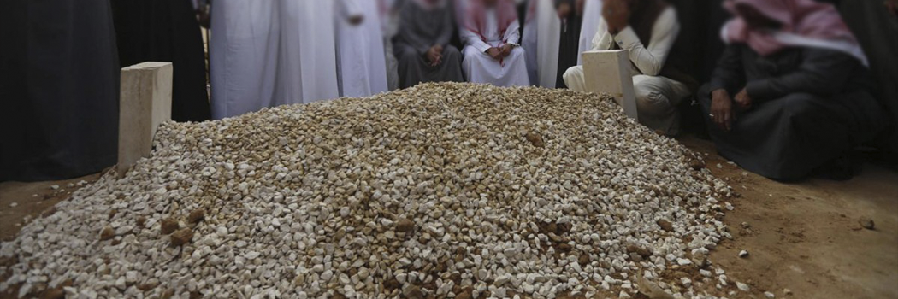

# Keys to Success according to Ibn Qayyim

- **Category:** 
- **Date:** 11/08/2014
- **Author:** 
- **Source:** https://www.quranproject.org/Keys-to-Success-according-to-Ibn-Qayyim-580-d

## Content

In Ibn Qayyim's book on Paradise [Hadi al-Arwah ila Bilad al-Arwah] and he discusses the key to Paradise, without which you cannot enter and made a summary of a few key concepts and the keys to them. Some of the KEYS he mentioned as follows:
The Key to:
Hajj
- is Ihram
Birr
- is Truthfulness
Jannah[heaven]
- is Tawheed [belief in Oneness of God]
Knowledge
- is Good questions and paying attention/listening
Help/victory
- is Sabr [patience]
Increase blessings
- is Shukr [give thanks and gratefulness]
Friendship and Love of God [Allah]
- is Remembrance of God [Dhikr]
Tawfeeq [ability to do good]
- Raghbah and Rahbah [Longing and Fear]
Longing for Akhirah
- is having Zuhd [abstinence of this world]
Iman[faith]
- is Tafaqur [Contemplating on creation of God and His Ayat]
Life in the heart
- is contemplating on the Qur'an
Increase of Rizq[sustenance]
- is Make much Istighfar [seeking forgiveness] and Taqwa
Having Honour
- Obeying God and His Messenger
Key to all good
- is longing to meet God
Key to all evil
- is loving this Dunyah and having long/extending plans/hopes in this world.
Edited by A.B. al-Mehri