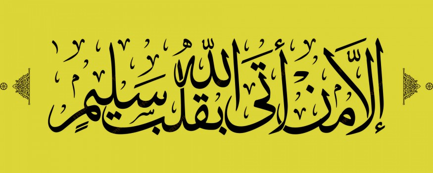

# Love of Allah: Experience the Beauty of Salah - Salute the King & Expel the Intruder

- **Category:** 
- **Date:** 20/11/2023
- **Author:** 
- **Source:** https://www.quranproject.org/Love-of-Allah-Experience-the-Beauty-of-Salah---Salute-the-King--Expel-the-Intruder-652-d

## Content

Salute the King & Expel the Intruder
Now you have officially entered Salah when you proclaimed “Allahu Akbar”.  You lower your gaze to the place of your Sujood [prostration] and you now place your hands right over left and close to your heart/lower chest. Why? Imagine that you have walked into a royal palace and you enter upon a group of people standing in the distance. Some in the group fix their gaze boldly at you with their arms comfortably at their sides. The other group stands with their gaze to the ground and their hands clasped in front of them.
Just from the way they stand; you will easily be able to distinguish the royalty from the palace servants, wouldn’t you? It is not befitting of us, as servants, but to stand in a position of humility when we face Our Lord. It is humbling when we remember who we really are before Him.
But let us remember that the humility due to Allah is a dignifying humility because, in essence, it liberates us from the undue humility to fellow man.  As the Prophet  said, “The one who humbles himself before Allah is elevated [by Allah] in honor!”
It is only proper now, to salute The King:
سُبْحَانَكَ اللَّهُمَّ وَبِحَمْدِكَ وَتَبَارَكَ اسْمُكَ وَتَعَالَى جَدُّكَ وَلاَ إِلَهَ غَيْرُكَ
“How perfect You are O Allah, praise be to You.  Blessed is Your name and lofty is Your position and non has the right to be worshiped except You.”
There are several salutes to choose from which the Prophet has taught us.  Each one adds a unique aspect to our prayer. Varying our salute with each prayer aids in better focus and concentration during these sacred moments.
Expelling the intruder:
As you stand in Allah’s hands, during such sacred moments, during such a grand encounter, no one is more envious of you now than Satan. So his mission is to steal every sweet moment you might have with The One you love, to steal every reward! So that you will finish your prayer, but only 1/3rd or 1/9th or 1/10th has been accepted, or 1/5th since the sobering reality of the matter is: Only the parts of Salah you are mindful of are accepted by Allah. [One will come on the Day of Judgment with over 90 years of Salah under his belt, but to his devastating surprise, only 6 years will have been recorded to his name, or 5, or 4.]
It is because of Satan that we begin to drift. Do you not notice that every worldly thought, matter, issue, predicament suddenly makes its way to your thoughts in Salah? Items you have lost for days or months are suddenly remembered and maybe even found! Even the designs on the prayer rug start to tell all sorts of entertaining stories! What do you do? You try to fight him and refocus. But he comes back. You fight him again. He comes back like a fly that will not leave you alone.
What is the solution for we are so weak!? We seek the help of our Beloved from the evils of His creatures.  With His Name is barakah! [blessing] With His Name is total protection from all harm. Thus, before we proceed in our prayer any further, we formally express with confidence:
أَعُوذُ بِاللهِ مِنَ الشَّيطَانِ الرَّجِيمِ
“I seek Allah’s protection from Satan the accursed”.
Feel its power as you say it!
Read more here -
Love of Allah: Experience the Beauty of Salah