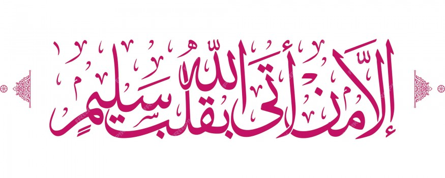

# Love of Allah: Experience the Beauty of Salah - The Greatest Dua [supplication] You Can Ever Make

- **Category:** 
- **Date:** 20/11/2023
- **Author:** 
- **Source:** https://www.quranproject.org/Love-of-Allah-Experience-the-Beauty-of-Salah---The-Greatest-Dua-supplication-You-Can-Ever-Make-658-d

## Content

The Greatest Dua [supplication] You Can Ever Make
اهْدِنَا الصِّرَاطَ الْمُسْتَقِيمَ
“Guide us to the straight path”
And now we come upon the greatest, wisest, most comprehensive Dua [supplication] we can ever make. If Allah guides us to the straight path, then He has helped us to worship Him like we should. [Recall the request for help that we made in the prior verse, “You alone we worship.. and unto You alone we turn for help.”]
If you notice, Surah al-Fatihah teaches us the proper etiquette of how to ask Allah when we have a need. It teaches us the proper way to make Dua so He will listen to us and answer. As befits a Majesty, we begin with the glorification and praise due to our Lord. Then we make our request. Now the path we need to win Allah’s pleasure is called the Siraat - the straight path. But this path is not so easy to follow without assistance:
- There are specifics to this path that we will know, and specifics which we may not know [What is halal, what is haram. What is right, what is wrong.]  In fact, the specifics we don’t have enough knowledge of far outnumber the specifics we know enough about.
- And of these specifics we do know, there will be some we are physically able
to carry out, and some we will not. [Like Hajj, Fasting, etc...]
- And of those requirements which we are physically able to carry out, at times
we will enjoy them, and at times we may find them quite burdensome [Like
waking up for Fajr prayer.]
- And even when we do accomplish that ordained duty, at times we fulfill the sincerity requirement, and at times we may not.  And at times we may perform
it properly according to the Prophetic example necessary for its acceptance, and at times, we may not.
- And even if we fulfill all of the above: the knowledge, the ability, the right attitude, the sincerity, and the adherence to the Prophetic example, we will still
need one more thing - Steadfastness - To perform it properly every time. Do you now see why we are so desperate for Allah’s guidance to the straight path?
Do you see why we can’t do it without His help?  And do you now see how comprehensive this Dua is? Now as you know, there are 2 Siraats. One in this life: the one we spoke of above. The second one, is in the next life -  described to be dangerously thin with a “sword’s edge” sharpness! That is the one that spans over the fires of Hell, over which every one of us must pass if we are to reach Paradise.
وَإِنْ مِنْكُمْ إِلَّا وَارِدُهَا كَانَ عَلَى رَبِّكَ حَتْمًا مَقْضِيًّا
ثُمَّ نُنَجِّي الَّذِينَ اتَّقَوْا وَنَذَرُ الظَّالِمِينَ فِيهَا جِثِيًّا
“And there is none of you except he will come to it. This is upon your Lord an inevitability decreed. Then We will save those who feared Allah and leave the wrongdoers within it, on their knees.”
If we are firm and steadfast on the first Siraat [the one in this life], then we will be firm on the second [in the next life]. So stability on the second is directly related to the degree of faith and good deeds earned in this life. Our strong faith and good deeds will be our guiding light on that dreadful bridge, amidst the darkness of Judgment Day.
“The day you shall see the believing men and the believing women, their light running forward before them and on their right..” And so accordingly, some will cross it with the quickness of lightning!  Some the speed of a shooting star!  Some like the wind, some like a speeding stallion, some at running speed, while others will crawl on it with hands and knees, and others…will fall and never make it...   And the Prophet will stand pleading in desperate prayer, “My Lord, spare them.  My Lord, save them…” The Siraat of this life leads us to Allah. The Siraat of the next life leads us to Paradise. Do you now feel how serious this Dua is?  “Ihdina-Siraat Al-Mustaqeem”- Our entire existence depends on it.  The “Ameen” you’ll pronounce now, after knowing the above, will be much more heartfelt, won’t it?  As a matter of fact, for any dua to be answered by Allah, the condition is that it must come from a focused, attentive heart for “Allah does not answer a supplication that comes from an absent/preoccupied heart.”