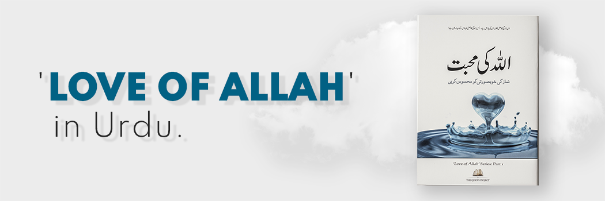

# Love of Allah Experience the Beauty of Salah

- **Category:** 
- **Date:** 12/04/2013
- **Author:** 
- **Source:** https://www.quranproject.org/Love-of-Allah-Experience-the-Beauty-of-Salah-461-d

## Content

'One of the most amazing books on Salah in the English language.'
The Qur'an Project is pleased to present its latest new book-
'Love of Allah - Experience the beauty of Salah'
Worldwide Launch
This is available worldwide for FREE. There are two ways you can obtain your copy:
1) You can order your copy by adding the item to your basket below. The Book is FREE and you will only need to pay for postage [79p for UK mainland and £3.50 for International orders]
2) You can download the entire book in PDF format.
We encourage all to read the book and share it with family and friends - Share the reward!
Dimensions
The book is A5 and is 47 pages.
Sweetness of this Life
As the author notes about our Creator, 'The sweetness of this life lies in remembering Him, the sweetness of the next life lies in seeing Him! The next time you proceed for prayer, go because you love Him, go because you miss Him and long to be with Him. Feel your heart flutter. Only then, will you be on your way to attaining that inner peace and comfort Salah was prescribed for.'
As with all Qur'an Project publications - there is no copyright and no rights reserved. Any part of this publication may be reproduced in any language, stored in a retrieval system or transmitted in any form or by any means, electrical, mechanical, photocopying, recording or otherwise without our permission, as long as no changes are made to the material. Please kindly send us notification for our records.
May Allah [SWT] grant us the most blessed conditions in our Salah and achieve the status of being amongst the most beloved to The Beloved Himself. O Allah, bless us with Your Love, the love of whom You Love and the love of deeds which bring us closer to Your Love. Please save us from the Fire, Forgive us for every sin and bless us and our families to be with You in the highest places of Jannah [ameen].