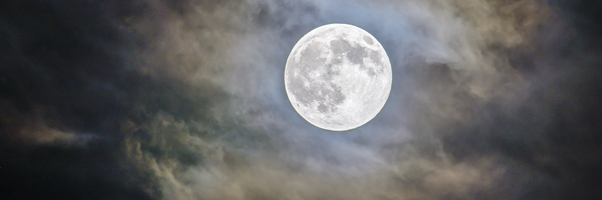

# Miracles Performed

- **Category:** 
- **Date:** 16/02/2013
- **Author:** 
- **Source:** https://www.quranproject.org/Miracles-Performed-220-d

## Content

Apart from the greatest miracle given to him, 
the Qur’ān, the Prophet performed many physical miracles witnessed by 
his contemporaries numbering in hundreds, and in some cases thousands. 
The miracle reports have reached us by a reliable and strong methods of 
transmission unmatched in world history – the hadith. It is as if the 
miracles were performed in front of our eyes. These miracles were 
witnessed by thousands of believers and skeptics, following which 
portions of the Qur’ān were revealed mentioning the supernatural events.
The
 Qur’ān made some miracles eternal by etching them in the conscious of 
the believers. The ancient detractors would simply remain silent when 
these verses were recited.  Through these events, the believers grew 
more certain of the truth of Prophet Muhammad and the Qur’ān.
The
 Prophet Muhammad, through prayer or invoking blessings from God, was 
seen bringing milk to the udders of dry sheep, transforming camels 
virtually too weary to walk into the fastest and most energetic of the 
bunch, transforming a stick of wood into a sword for soldier whose sword
 had broken [Ukashah ibn Mihsan at the Battle of Badr] and feeding and 
watering the masses from miniscule quantities. Scores of hungry poor 
were fed from a bowl of milk which appeared sufficient for only one. An 
entire army numbering more than a thousand were fed from a measure of 
flour and pot of meat so small as to be thought sufficient for only ten 
persons at the ‘Battle of the Trench,’ after which the flour and the 
meat seemed undiminished. So much was left over that a gift of food was 
made to the neighbour of the house in which the meal was prepared. 
Another army of 1,400, headed for the Battle of Tabuk, was fed from a 
few handfuls of mixed foodstuffs, over which the Prophet invoked 
blessings and the increase was sufficient to fill not only the stomachs 
of the army, but their depleted saddlebags as well.
Evil
 spirits [Jinn] were exorcised, the broken leg of Abdullah ibn Ateeq and
 the war-wounded leg of Salama ibn Aqwa were healed on the spot [each on
 separate occasions], the bleeding wound of al-Harith ibn Aws cauterized
 and healed instantly, the poisonous sting of Abu Bakr’s foot quieted 
and the vision of a blind man restored. On a separate occasion, Qatadah 
ibn an-Nu’man was wounded, in the Battle of Badr, so severely that his 
eye prolapsed into his cheek. His companions wanted to cut off the 
remaining attachments, but the Prophet supplicated over the eye, 
replaced it and from that day on Qatadah could not tell which was the 
injured eye and which was not.
When
 called to wrestle Rukanah, an unbeaten champion, the Prophet won 
miraculously. Merely touching Rukanah on the shoulder, he fell down, 
defeated. In rematch, the miracle was repeated. A third challenge 
brought the same result.
When
 asked to call for rain, he did and rain fell. When requested to feed 
the people his supplications brought sustenance, from where, the people 
did not know. When interceding as a healer, wounds and injuries 
disappeared.
In
 short, the prayers and supplications of the Prophet brought relief and 
blessings to the believers and yet, whether being stoned on Ta’if, 
starved at Makkah, beaten in front of the Ka’bah, or humiliated amidst 
his tribe and loved ones, the Prophet’s example appears to have been one
 of facing personal trials, of which there was an abundance, by relying 
upon internal patience to calling for divine intervention.
Splitting of the Moon: A Miracle
“The Hour has come near, and the moon has split [in two]. And if they see a sign
[i.e., miracle], they turn away and say, “Passing magic.”
Qur’ān 54:1-2
During
 the time of the Prophet, the pagans of Makkah had asked Prophet 
Muhammad for a miracle. In response, the Prophet split the moon, one 
part remaining over the mountain and the other part disappearing behind 
it [the mountain]. However, the pagans said, ‘Muhammad has enchanted us,
 but he cannot bewitch the world; so let us wait for people to come from
 the neighbouring parts of the land and hear what they have to say.’
Historical Evidence
A
 skeptic might ask, do we have any independent historical evidence to 
suggest the moon was ever split?  After all, people around the world 
should have seen this marvellous event and recorded it. The answer to 
this question is twofold.
First,
 people around the world could not have seen it as it would have been 
daytime, late night, or early morning many parts of the world.  The 
following table will give the reader some idea of corresponding world 
times to 9:00 pm Makkah time:
Country
Time
Makkah
9:00 pm
India
11:30 pm
Perth
2:00 am
Reykjavik
6:00 pm
Washington D.C.
2:00 pm
Rio de Janeiro
3:00 pm
Tokyo
3:00 am
Beijing
2:00 am
Also,
 it is not likely that a large number of people in lands close by would 
be observing the moon at the exact same time.  They had no reason to.  
Even if someone did, it does not necessarily mean people believed him 
and kept a written record of it, especially when many civilisations at 
that time did not preserve their own history in writing.
Second,
 we actually have an independent, and quite amazing, historical 
corroboration of the event from an Indian king of that time.
Kerala
 is a state of India.  The state stretches for 360 miles along the 
Malabar Coast on the southwestern side of the Indian peninsula. King 
Chakrawati Farmas of Malabar was a Chera king, Cheraman perumal of 
Kodungallure.  He is recorded to have seen the moon split.  The incident
 is documented in a manuscript kept at the India Office Library, London,
 reference number:  Arabic, 2807, 152-173.
A
 group of Muslim merchant’s passing by Malabar on their way to China 
spoke to the king about how God had supported the Arabian prophet with 
the miracle of the splitting of the moon.  The shocked king said he had 
seen it with his own eyes as well, deputised his son, and left for 
Arabia to meet the Prophet in person.
The
 Malabari king met the Prophet, and bore the two testimonies of faith, 
learned the basics of faith, but passed away on his way back and was 
buried in the port city of Zafar, Yemen.
It
 is said that the contingent, led by a Muslim, Malik bin Dinar, 
continued to Kodungallure, the Chera capital, and built the first, and 
India’s oldest, mosque in the area in 629 C.E. which exists today. The 
news of his accepting Islam reached Kerala where people accepted Islam. 
 The people of Lakshadweep and the Moplas [Mapillais] from the Calicut 
province of Kerala are converts from those days. The king was also 
considered a ‘companion’ – a term used for a person who met the Prophet 
and died as a Muslim – his name registered in the mega-compendiums 
chronicling the Prophet’s companions. Abu Sa’id al-Khudri, a companion 
of Prophet Muhammad, states: “The Indian king gifted the Prophet with a 
jar of ginger.  The companions ate it piece by piece.  I took a bite as 
well.”
Moon Split – Visible Today
Dr.
 Zaghloul El-Naggar, professor of earth science and geology, recalls, 
‘[firstly] the Indian and Chinese calendars have recorded the incident 
of the splitting of the moon…. While I was giving a lecture at the 
Faculty of Medicine at Cardiff University, in Wales, a Muslim asked me a
 question about the verses....about the splitting of the moon, and 
whether it is considered as one of the scientific signs which are 
mentioned in the Qur’ān and whether there is any scientific evidence 
discovered to explain this incident. My answer was that this incident is
 considered one of the most tangible miracles, which took place to 
support the Prophet when he was challenged by the polytheists and 
disbelievers of Quraysh, showing them this miracle to prove that he is a
 Messenger of God. Anyway, miracles take place as unusual incidents that
 break all regular laws of nature. Therefore, conventional science is 
unable to explain how miracles take place, and if they were not 
mentioned in the Qur’ān and in the Sunnah of the Prophet we would not 
have been obliged to believe in them…When I finished my speech, a 
British man from the audience…asked to add something to my answer.
He
 said:
“It is these verses, at the beginning of Sūrah al-Qamar that made
 me embrace Islam in the late seventies.”
This occurred while he was 
doing extensive research in comparative religion, and one of the Muslims
 gave him a copy of translation of the meanings of the Qur’ān. When he 
opened this copy for the first time, he came across Surat al-Qamar, and 
he read the verses at the beginning of the Sūrah, and could not believe 
that the moon had split into two distinct parts and they were rejoined, 
so he closed the copy of the translation and kept it aside.’
In
 1978, the British man was destined by God’s Will to watch a program on 
BBC, where the host was talking with three American space scientists and
 accusing the USA of over spending and wasting millions of dollars on 
space projects while millions of people were in a state of poverty here 
on Earth. The scientist responded,
“We were studying the moon surface to
 examine the extent of similarities with the Earth’s surface...we were 
astonished to find a belt of melted rocks that cuts across the surface 
and deep into the core of the moon. This information was promptly given 
to our geologists, where they were shocked by their findings and stated 
that this phenomenon could never happen unless the moon at one time was 
split and brought back together and the surface rocky belt is the 
resulting collision at the moment of this occurrence.”
He
 went on to say,
“When I heard this, I jumped off my chair"
, and said 
this is a miracle which took place fourteen hundred years ago to support
 Muhammad and the Qur’ān narrates it in such a detailed way. After this 
long period and during the age of science and technology, God employs 
people (non-Muslims) who spent all this money for nothing but to prove 
that this miracle had actually happened. Then, I said to myself, this 
must be the true religion, and I went back to the translation of the 
meanings of the Qur’ān, reading it eagerly. It was these verses at the 
opening of Sūrah al-Qamar that lie behind my…[conversion] to Islam.”