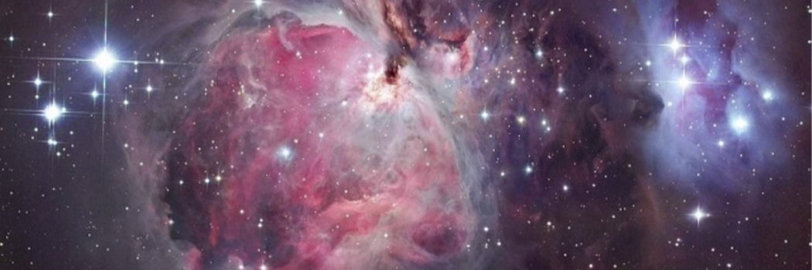

# New BBC Article affirms Ayat of the Quran

- **Category:** 
- **Date:** 24/02/2013
- **Author:** 
- **Source:** https://www.quranproject.org/New-BBC-Article-affirms-Ayat-of-the-Quran-359-d

## Content

New BBC Article affirms Ayat of the Qur’an –
Animals Guided by Stars
.
In the Qur’an, Allah [swt] informs us that one of the wisdoms behind the creation of the stars is their usage in guiding.
In a BBC article dated 24th Jan 2013 entitled ‘
Dung beetles guided by Milky Way
’
“Scientists have shown how insects will use the Milky Way to orientate themselves as they roll their balls of muck along the ground. Humans, birds and seals are all known to navigate by the stars.” Whilst I was reading the article, certain Ayat of the Qur’an sprung up in my mind immediately and I was just amazed upon the truthfulness and accuracy of the Words of the Qur’an. Simply put, there are two things we learn from the Ayat which the article confirms – Firstly, that [as in so many aspects – but this context specifically] species behave in communities like Humans and secondly, stars are used to help navigate and guide not only us but animals too.
Please reflect on these ayat deeply – look and study each word
First Ayat:  Behavioural Patterns of Species are like Humans
“And  there  is  no  creature  on  [or  within]  the  earth  or  bird  that  flies  with  its  wings  except [that  they  are]  communities  like  you”
[al-An’am 6:38]
Key words  –
‘communities like you [i.e. humans]’
– Here The Creator informs us  that the community structure and behavioural patterns of every single set of species in existence [as Allah [swt] does not exclude any] is similar to how we as human beings are –  some of us live as married couples, single parents, groups of small family, large tribes, etc you see this amongst the various manifestations in species on land, sea and air.
Second Ayat: Function of Stars as a guide
“And  it  is  He  who  placed  for  you  the  stars  that  you  may  be  guided  by  them  through  the darknesses  of  the  land  and  sea.  We  have  detailed  the  signs  for  a  people  who  know”.
[al-An’am 6:97]
Key words –
‘that you  may  be  guided  by  them’
– Hence on land and on sea during the darkness of the night stars function as means to guide – and one of the reasons why The Creator has placed these stars in their positions within the galaxy is to function as a means to guide us.
Finally - In describing The Creator of all that exists in the Galaxies and Earth, the Qur’an says that He is
“...He  who  gave  everything its  creation  and  then  guided  [it].”
[Taha 20:50]
Note  –
every single entity
– From the stars in the galaxies to every living species, to every different type of cell in an organism to the molecular level of an atom – every single entity has its function and role that is inherent within it – i.e. created and then guided. Is this not a sign of a miraculous truth only known by the Creator Himself?
Anyone who studies how species behave, will know that in their own ecosystems, every animal from the bee, the pigeon to the butterfly – each of them has been born with inherent and instinctive patterns of behaviour that drives and guides them in all aspects of their lives from seeking food to seeking a mate – take for example a monarch butterfly – born never meeting even its parents but knows exactly what to eat, where to fly to, how to attract a mate – examples like these are endless –
Now with these reflections from the blessed Ayat of the Qur’an - read the full article below -
Dung beetles guided by Milky Way
By Jonathan Amos - 24 January 2013 – (For full article click
Here
)
They may be down in the dirt but it seems dung beetles also have their eyes on the stars.
Scientists have shown how the insects will use the Milky Way to orientate themselves as they roll their balls of muck along the ground.
Humans, birds and seals are all known to navigate by the stars. But this could be the first example of an insect doing so.
The study by Marie Dacke is reported in the journal Current Biology.
"The dung beetles are not necessarily rolling with the Milky Way or 90 degrees to it; they can go at any angle to this band of light in the sky. They use it as a reference," the Lund University, Sweden, researcher told BBC News.
Dung beetles like to run in straight lines. When they find a pile of droppings, they shape a small ball and start pushing it away to a safe distance where they can eat it, usually underground.
Getting a good bearing is important because unless the insect rolls a direct course, it risks turning back towards the dung pile where another beetle will almost certainly try to steal its prized ball.
Dr Dacke had previously shown that dung beetles were able to keep a straight line by taking cues from the Sun, the Moon, and even the pattern of polarised light formed around these light sources.
But it was the animals' capacity to maintain course even on clear Moonless nights that intrigued the researcher.
So the native South African took the insects (Scarabaeus satyrus) into the Johannesburg planetarium where she could control the type of star fields a beetle might see overhead.
Importantly, she put the beetles in a container with blackened walls to be sure the animals were not using information from landmarks on the horizon, which in the wild might be trees, for example.
The beetles performed best when confronted with a perfect starry sky projected on to the planetarium dome, but coped just as well when shown only the diffuse bar of light that is the plane of our Milky Way Galaxy.
Dr Dacke thinks it is the bar more than the points of light that is important.
"These beetles have compound eyes," she told the BBC. "It's known that crabs, which also have compound eyes, can see a few of the brightest stars in the sky. Maybe the beetles can do this as well, but we don't know that yet; it's something we're looking at. However, when we show them just the bright stars in the sky, they get lost. So it's not them that the beetles are using to orientate themselves."
And indeed, in the field, Dr Dacke has seen beetles run in to trouble when the Milky Way briefly lies flat on the horizon at particular times of the year.
The question is how many other animals might use similar night-time navigation.
It has been suggested some frogs and even spiders are using stars for orientation. The Lund researcher is sure there will be many more creatures out there doing it; scientists just need to go look.
"I think night-flying moths and night-flying locusts could benefit from using a star compass similar to the one that the dung beetles are using," she said.
But for the time being, Dr Dacke is concentrating on the dung beetle. She is investigating the strange dance the creature does on top of its ball of muck. The hypothesis is that this behaviour marks the moment the beetle takes its bearings.
Source: A.B. al-Mehri [Official/QP]