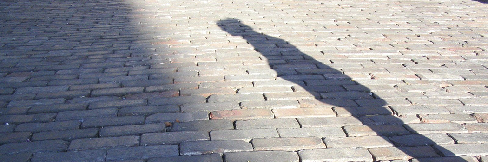

# Our Humanness: Unalterable Essence and Changeable Actuality

- **Category:** 
- **Date:** 08/01/2014
- **Author:** 
- **Source:** https://www.quranproject.org/Our-Humanness-Unalterable-Essence-and-Changeable-Actuality-524-d

## Content

Developments in the science of genetics have aroused the interest of scientists, as well as the rest of us in some fundamental questions of our life and given them some urgency.
What does our humanity consist in?
Do we have an unalterable nature in virtue of which we can be considered the humans we are, or is our nature a tabula rasa on which culture, the environment and now genetic engineering dictate what they want?
Do we have a soul, and if so what is the difference between it and our bodies? What is its relationship with the body?
It was natural for believers in God to be more concerned with such questions, and to give answers to them based on the teachings of their religions.  I am glad to be given the honor of participating in this vital discussion and to be given the opportunity to present what I consider to be an authentic Islamic view on these important issues.
I am concerned here mainly with the question of human nature.  If the nature of a thing is the collection of qualities which make it the thing that it is, then everything must necessarily have a nature. We might differ about some of the qualities of a thing, whether they can be counted among those that form its nature, but we cannot say of something that we know and deal with that it has no nature at all, or that its nature is constantly changing. This is a matter of logic. There should therefore be no dispute about the fact that human beings have a nature that makes them the beings they are. There should also be no dispute about the fact that this nature must be fixed, because if it changes then the thing that has the new nature must be something different from a human being, just as water or oxygen must be something different from the water or oxygen that we know and deal with if their nature changes.
The question should not therefore be about whether or not humans have a nature, or whether or not that nature is changing: it should be about the kind of qualities that make them the beings they are.
We are all agreed that we have bodies, and that these bodies have a nature in virtue of which they need for example certain things for their existence. We are also agreed on the fact that we have certain mental qualities without which we cannot be the human beings that we are. A being that is intrinsically unable to think, or will, or know, cannot be a human being even if it had a body that looked exactly like that of a human, and even if it had some of the other mental qualities of humans. Thus if genetic engineering could bring some being like these, we should not say that it changed the nature of humans, but that it came up with a new being that has nothing to do with us. Assuming this to happen, it will not abolish human beings; normal humans will continue to exist and be reproduced in the natural way they have always been.
The question would then be: is it in our interest, as normal humans, to allow something like this to happen?
The answer of a believer in God would be an emphatic no!  Why? Because he believes that no being can have a nature that is even equal, let alone superior, to that of a human being. Anyway, this should be the position of a Muslim.
Humans, according to Islam, have many qualities that distinguish them from other creation, but these qualities are not of equal importance. Let us start with what, according to Islam, is "spiritually" common to all creation and then deal with humans as a special creation.
All Creation is Muslim
Every created thing worships its Lord; each according to its special makeup. The Qur'an gives us some details of this worshipping that is common to all creation.
Submission. (Islam)
"
Seek they other than the religion of God, when to Him submit (aslama) whosoever is in the heavens and the earth, willingly or unwillingly, and to Him they will be returned
."
Glorification
"
All that is in the heavens and all that is in the earth glorifies God." [
59:1]
Prostration.
"
Have you not seen that to God prostrate whosoever is in the heavens and whosoever is in the earth, and the sun, and the moon, and the stars, and the hills, and the trees, and the beasts, and many of mankind"
Obedience.
"
To Him belongs whosoever is in the heavens and the earth. All
are obedient to Him"
Humans, a Special Creation
Human beings are a special creation; but they are no exception to the fact that their essence is that of being servants of God. They are however distinguished from all other creation by certain qualities that make them the special beings they are with a degree above other created things.
First, Adam, the father of all human beings was created in a special way. God tells us that He created him with his own hands (38:75  )
Second, He told the angels to prostrate themselves to him once he was created (2:34)
Third, He breathed into him a spirit (called in Arabic rooh) with which He did not endow any other animal. (38:71-2 )
Fourth, He made all that is on the earth subservient to humans:
"
He it is Who created for you all that is in the earth"
Fifth, He endowed them with dignity:
"Verily we have honored the Children of Adam. We carry them on the land and the sea, and have made provision of good things for them, and have preferred them above many of those whom We created with a marked preferment.
"
Sixth, He taught him what the Qur'an calls the names of things in virtue of which he became more knowledgeable than the angels:
"
And He taught Adam all the names, then showed them to the angels,
saying: "
Inform Me of the names of these, if you are truthful." They said: Be glorified! We have no knowledge saving that which You have taught us. Lo! You, only You are the Knower, the Wise.
"He said: O Adam! Inform them of their names, and when he had informed them of their names, He said: Did I not tell you that I know the secret of the heavens and the earth ? And I know that which you disclose and which you hide."
Body and Soul
The human body and the human soul are two different entities with different sets of attributes and functions, but they are in many ways connected and interdependent.
The fact that they are distinct is stated in many Islamic texts:
First, in the creation of Adam, the soul, rooh, was breathed into an already created body:
"
So, when I have made him and have breathed into him of My Spirit, do ye fall down, prostrating yourselves unto him."
Second, when a human child is born it is born as a living thing but without a soul. The soul is breathed into it when it is about forty days old[1]
Third, when a person dies, his soul leaves his body.
"
God receives souls at the time of their death, and that (soul) which dies not (yet) in its sleep. He keeps that (soul) for which He has ordained death and dismisses the rest till an appointed term. Lo! herein verily are portents for people who take thought."
[39.42]
Fourth, if a person goes to paradise he will have a body with a nature different from his present worldly body, though he will continue to have the same soul.
The Human Soul
Human beings, according to Islam, are born good. This goodness is an attribute of the human soul; it consists in being born with a natural capacity to be aware of the fact that they are servants of God, their sole Creator who alone is to be worshipped. All the other good human qualities are related to this basic quality. I mean the qualities of cognition and volition, of morality and prudence, of rationality and of the aesthetic taste, and so on. They are related to it in the sense that they are strengthened by it, in the sense that they are justified by it, and in the sense that they act as avenues that lead to it. They are thus used in the Qur'an as standards on which it bases its arguments for inviting people to its truths created with a wholesome soul, given the capacity to distinguish between what is morally good , and what is morally bad:
"And by the soul and Him Who perfected it"
[91:7]
"And inspired it (with conscience of) what is wrong for it and (what is) right for it."
[91:8]
"He is indeed successful who causes it to grow,"
[91:9]
"And he is indeed a failure who stuns it."
[91:10]
All of God's commands and prohibitions in Scripture have their foundation in this original good nature of the human soul. It is because of this that the religion to which Prophets like Muhammad invite people is called the religion of human nature:
"So direct your face toward the religion, (thus) turning to the truth, a religion that is the fitra (original good nature) upon which he created human beings; there is no changing of God's creation. That is the true religion but most people know"
[30:30]
And it is because of this Divine commands and prohibitions are justified in the Qur'an in terms of their compatibility with the good qualities of this  original human nature. Gambling and alcoholic drinks are for example prohibited because Satan, the archenemy of human beings, uses them to create enmity and hatred among people (5:90-91) who are born to be faithful brothers. The justification that is given for killing the killer is that it saves life (2:179).The relatives of the killed person are given the right to forgive or take ransom, because in this way even more lives are saved. Prayer helps to prevent them from committing grave sins. Being mindful of God gives peace to their hearts. And so on and so forth.
Humans, however, are created as willful beings; they are therefore given the choice either to live an actual life that is a reflection of their natural humanness, or to rebel against their human essence and live a life of alienation. God likes for them to choose to worship Him, and He helps them in many ways to make this right choice:
First, He does not create them neutral between these alternatives, but makes this choice the natural thing for them to prefer; it is the one that makes them live in peace with themselves.
Second, He makes His whole creation consist of signs of His existence and His attributes of perfection, and provides in it evidence for the truthfulness of the Prophets whom He sends, and the Messages with which they come.
Third, He makes belief in God the only alternative that is compatible with all the good qualities they have: reason, the moral values of justice, mercy, wisdom and so on.
Fourth, He sends Prophets with messages that describe for them in detail the good life that is compatible with their good essence, give them reasons for their being so, and adduces arguments against the alternative of rebelling against their Creator and therefore their own human essence.
Fifth, If they make the wrong choice, still however much their actual life is perverted, their essence remains   incorrigible; they always have the chance to make the decision to come back to their it so long as they are alive, and their all-Merciful God will always accept them.
It seems from this that no external factor can change or corrupt the human soul and deprive it of some or all of its good qualities. Only the person himself can corrupt himself by his willful acts.
The Human Body
The soul, we said, is of a nature that is completely different from that of the body. But it needs a body to make the actual life of the human person an expression of the humanness of his soul. The body that it needs is not however any body; it is a special body that is designed to suit that soul.
Though this body is in many ways like that of animals, it is the one with the best form, as the Qur'an says. Because it is a special body it is to be treated with respect even when it is dead. To cut off part of a dead human body, the Prophet tells us, is (as sinful as) cutting it off a living body. When a person dies and his soul leaves his body, that dead body is to be washed and cleaned; it is to be wrapped in clean cloth, and be berried. People are told to stand up when a funeral passes by irrespective of whose funeral it is.
Human bodies are not to be mutilated even in war. Because the soul uses the body, many of its acts are attributed  to some bodily parts, especially the heart. But the language used leaves one in no doubt that what is meant is not the physical body part.
Human beings are advised not to degrade themselves by behaving like animals especially when performing acts of worship. We are told not to raise our voices the way donkeys do. The Prophet saw someone leading another by a rope; he cut the rope and told him to lead him by his hand. He tells us that, when performing prayer, we should not make any act that looks like that of an animal. We are thus told not to come down for prostration as a camel does, not to make our acts of prostration like the pecking of a crow, not to sit as a dog sits, and so on. We are even told by the Prophet not to wear beast hide that makes us look like them
This is not to be taken as unfair prejudice against animals; it is only meant to advise the human to behave in the way that suits his human nature. He is however encouraged and even ordered to care for animals and show mercy towards them. The Prophet tells us of a prostitute whom God forgave and even caused to enter paradise because she descended into a well and brought water in her shoes to quench the thirst of an almost dying dog. He tells us on the other hand of a woman who went to hell-fire because she kept a cat that she neither fed nor allowed to seek food for itself. Animal bodies are not to be maimed, neither are their faces to be branded. When the Prophet saw a brand on the face of a donkey, he cursed the person who branded it.
Genetic Engineering
There are in Islam, some general principles that help to guide us in our dealings with God's creation, and that can thus help us in the position we take regarding genetic engineering.  These include the fact that Everything God creates He creates in the best of ways.(32:7)
All of God's creation around us is created to serve human beings. This creation should not therefore be altered. There are close relations and links not only among the constituents of an individual creation, but also among all creation experience tells us that the results of all such alterations have been harmful.
You might say that we do, we have to, till the land, plant crops, kill animals, dig wells and canals, build bridges, and so on. Yes indeed but in doing all this we are working within the natural order not disrupting it. We do the same when we fix something that goes wrong; we seek cures for our ailments and the ailments of our animals; we might to that end even have to cut off some parts of our bodies. This is because though God's creation is the best, it cannot, in the nature of things, be as perfect as its Creator is.
Genes should be dealt with in the same way. There is no harm in replacing genes that are not working properly with better ones. Genetic engineering should not aim at perfecting nature; it will only distort it.
If the human person, body and soul, is the best of God's creation, any tampering with it will only make it worse. We are warned in the Qur'an of making any alterations in God's creation. One reason for this might be the fact  :that there are close relations and links not by only among the constituents of an individual creation, but also among almost all kinds of God's creation.
Genetic engineering should not therefore aim at perfecting nature; it will only distort it. It should only be resorted to for therapeutic purposes.
As to human cloning there is in my view nothing that justifies it and much that is against it. The way a human being is naturally reproduced is a way is a way that is very well connected to nature; it involves sexual urge, close intimacy between two individuals, growth in the  uterus of a natural mother, love, suckling, caring and the joy of childish behavior; it has father and mother, brothers and sisters and relatives. But a cloned being lacks many of these qualities and relations.
What kind of a creature is that going to be? And what is the need for it? Isn't it really odd that while we try to control natural birth, we encourage un-natural production of creatures that, to say the least, lack some of the qualities of naturally reproduced humans?
Source: http://jaafaridris.com [External/non-QP]