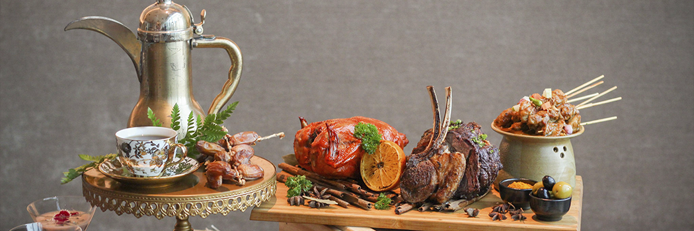

# Over-Eating During Iftar

- **Category:** 
- **Date:** 15/05/2017
- **Author:** 
- **Source:** https://www.quranproject.org/Over-Eating-During-Iftar-620-d

## Content

One should not overeat while breaking the fast to the point that he fills his stomach, as there is not any container that Allah hates more than a full stomach. How can one benefit from fasting and subdue this enemy and break this desire if he breaks his fast by making up for it through eating everything that he missed out on during the day. In fact, some even eat more than they usually would during the day! This habit has continued to the point that so many types of food are prepared for Ramadan that more food is eaten in this month than in any other month.
It is known that the whole point of fasting is discipline and to break one's desire in order to strengthen the soul with taqwa. So, if you prevent your digestive system from food all day long until night such that its desire and longing for food goes wild, and you then feed it what it wants until it is fully satisfied, this will only increase its desire and multiply its energy, and it will manifest a longing that wouldn't have been there had it been left to its usual intake.
So, the essence and secret of fasting is to weaken this energy that provides means for Satan to pull you towards what is bad, and this can't happen unless you reduce your food intake. When you break your fast, eat only what you would normally eat at that specific time when not fasting. But to break your fast by combining the amount you wouldn't eaten during the day with the amount you usually eat at night will leave you having gained nothing at all from your fast.
In fact, from the etiquette of fasting is to not sleep much during the day in order to feel the hunger and thirst, and in order to weaken this energy. This will clean out the heart and keep this energy weakened every night so that it will be easier to pray at night and do your sets of Qur'an recitation and dhikr of Allah. Maybe this will prevent Satan from approaching your heart and allow you to look to what is in the kingdom of the heavens, and the Night of Qadr is basically the night in which some of what is contained in this kingdom is shown, and this is what is meant by Allah's Saying:
"Indeed, We have descended it on the Night of Qadr"
[97:1]
And whoever puts a barrier of food between his heart and his chest will have a barrier put between him and what is shown from this kingdom, and to keep your stomach free isn't enough to lift this barrier if your mind isn't free from anything other than Allah - and this is the entire point.
The starting point of all this is to reduce your intake of food.
Source: Al Ghazzali [External/non-QP]