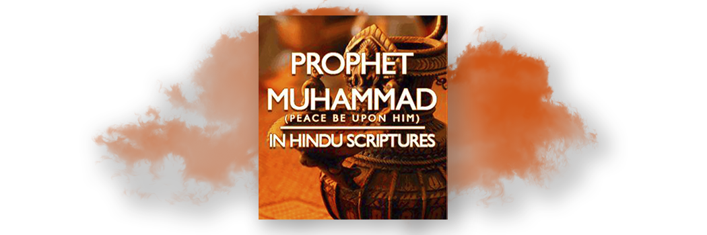

# Prophet Muhammad in Hindu scriptures

- **Category:** 
- **Date:** 26/02/2013
- **Author:** 
- **Source:** https://www.quranproject.org/Prophet-Muhammad-in-Hindu-scriptures-398-d

## Content

I. Muhammad (pbuh) prophesied in Bhavishya Purana
According to Bhavishya Purana in the Prati Sarag Parv III Khand 3 Adhay 3 Shloka 5 to 8.
"A malecha (belonging to a foreign country and speaking a foreign language) spiritual teacher will appear with his companions."
His name will be Mohammad. Raja (Bhoj) after giving this Maha Dev Arab (of angelic disposition) a bath in the Panchgavya and the Ganga water (i.e. purifying him of all sins) offered him the present of his sincere devotion and showing him all reverence said, "I make obeisance to thee. O ye! The pride of mankind, the dweller in Arabia, Ye have collected a great force to kill the Devil and you yourself have been protected from the malecha opponents."
The Prophecy clearly states:
The name of the Prophet as Mohammad. He will belong to Arabia.
The Sanskrit word Marusthal means a sandy track of land or a desert. Special mention is made of the companions of the Prophet, i.e. the Sahabas. No other Prophet had as many companions as Prophet Muhammad (pbuh). He is referred as the pride of mankind (Parbatis nath). The Glorious Qur’an reconfirms this
"And thou (standest) on an exalted standard of character"
[Qur'an 68:4]|
"Ye have indeed in the Messenger of Allah, a beautiful pattern (of conduct)"
.[Qur'an 33:21]
He will kill the devil, i.e. abolish idol worship and all sorts of vices. The Prophet will be given protection against his enemy.
Some people may argue that ‘Raja’ Bhoj mentioned in the prophecy lived in the 11th century C.E. 500 years after the advent of Prophet Muhammad (pbuh) and was the descendant in the 10th generation of Raja Shalivahan.
These people fail to realise that there was not only one Raja of the name Bhoj. The Egyptian Monarchs were called as Pharaoh and the Roman Kings were known as Caesar, similarly the Indian Rajas were given the title of Bhoj. There were several Raja Bhoj who came before the one in 11th Century C.E.
The Prophet did not physically take a bath in the Panchgavya and the water of Ganges. Since the water of Ganges is considered holy, taking bath in the Ganges is an idiom, which means washing away sins or immunity from all sorts of sins. Here the prophecy implies that Prophet Muhammad (pbuh) was sinless, i.e. Maasoom.
According to Bhavishya Purana in the Pratisarag Parv III Khand 3 Adhay 3 Shloka 10 to 27 Maharishi Vyas has prophesised:
The Malecha have spoiled the well-known land of the Arabs. Arya Dharma is not to be found in the country. Before also there appeared a misguided fiend whom I had killed; he has now again appeared being sent by a powerful enemy.
To show these enemies the right path and to give them guidance, the well-known Muhammad (pbuh), is busy in bringing the Pishachas to the right path. O Raja, You need not go to the land of the foolish Pishachas, you will be purified through my kindness even where you are.
At night, he of the angelic disposition, the shrewd man, in the guise of Pishacha said to Raja Bhoj, "O Raja! Your Arya Dharma has been made to prevail over all religions, but according to the commandments of Ishwar Parmatma, I shall enforce the strong creed of the meat eaters.
My followers will be men circumcised, without a tail (on his head), keeping beard, creating a revolution announcing the Aadhaan (the Muslim call for prayer) and will be eating all lawful things. He will eat all sorts of animals except swine.
They will not seek purification from the holy shrubs, but will be purified through warfare. On account of their fighting the irreligious nations, they will be known as Musalmaans. I shall be the originator of this religion of the meat-eating nations."
The Prophecy states that:
The evil doers have corrupted the Arab land.
Arya Dharma is not found in that land.
The Indian Raja need not go the Arab land since his purification will take place in India after the musalmaan will arrive in India.
The coming Prophet will attest the truth of the Aryan faith, i.e. Monotheism and will reform the misguided people.
The Prophet’s followers will be circumcised. They will be without a tail on the head and bear a beard and will create a great revolution.
They will announce the Aadhaan, i.e. ‘the Muslim call for prayer’.
He will only eat lawful things and animals but will not eat pork. The Qur’an confirms this in no less than 4 different places:
In Surah Al-Baqarah chapter 2 verse 173
In Surah Al-Maidah chapter 5 verse 3
In Surah Al-Anam chapter 6 verse 145
In Surah Al-Nahl chapter 16 verse 115
"Forbidden to you for food are dead meat, blood, flesh of swine, and that on which hath been invoked the name of other than Allah".
They will not purify with grass like the Hindus but by means of sword they will fight their irreligious people.
They will be called musalmaan.
They will be a meat-eating nation.
The eating of herbivorous animals is confirmed by the Qur’an in Surah Maidah, chapter 5 verse 1 and in Surah Muminun chapter 23 verse 21
According to Bhavishya Purana, Parv - III Khand 1 Adhay 3 Shloka 21-23:
"Corruption and persecution are found in seven sacred cities of Kashi, etc. India is inhabited by Rakshas, Shabor, Bhil and other foolish people. In the land of Malechhas, the followers of the Malechha dharma (Islam) are wise and brave people."
All good qualities are found in Musalmaans and all sorts of vices have accumulated in the land of the Aryas. Islam will rule in India and its islands. Having known these facts, O Muni, glorify the name of thy lord".
The Qur’an confirms this in Surah Taubah chapter 9 verse 33 and in Surah Al Saff chapter 61 verse 9:
"It is He who hath sent His Messenger with Guidance and the Religion of Truth, to proclaim it over all religion, even though the Pagans may detest (it)".
A similar message is given in Surah Fatah chapter 48 verses 28 ending with,
"and enough is Allah as a witness".
II. Prophet Muhammad (pbuh) Prophesised in Atharvaveda
In the 20th book of Atharvaveda Hymn 127 Some Suktas (chapters) are known as Kuntap Sukta. Kuntap means the consumer of misery and troubles. Thus meaning the message of peace and safety and if translated in Arabic means Islam.
Kuntap also means hidden glands in the abdomen. These mantras are called so probably because their true meaning was hidden and was to be revealed in future.
Its hidden meaning is also connected with the navel or the middle point of this earth. Makkah is called the Ummul Qur’a the mother of the towns or the naval of the earth. In many revealed books it was the first house of Divine worship where God Almighty gave spiritual nourishment to the world. The Qur’an says in Surah Ali-Imran chapter 3, verse 96:
"The first house (of worship) appointed for men was that at Bakkah (Makkah) full of blessings and of guidance and for all kinds of beings". Thus Kuntap stands for Makkah or Bakkah.
Several people have translated these Kuntap Suktas like M. Bloomfield, Prof. Ralph Griffith, Pandit Rajaram, Pandit Khem Karan, etc.
The main points mentioned in the Kuntap Suktas i.e. in Atharvaveda book 20 Hymn 127 verses 1-13 are:
Mantra 1
He is Narashansah or the praised one (Muhammad). He is Kaurama: the prince of peace or the emigrant, who is safe, even amongst a host of 60,090 enemies.
Mantra 2
He is a camel-riding Rishi, whose chariot touches the heaven.
Mantra 3
He is Mamah Rishi who is given a hundred gold coins, ten chaplets (necklaces), three hundred good steeds and ten thousand cows.
Mantra 4
Vachyesv rebh. ‘Oh! ye who glorifies’.
The Sanskrit word Narashansah means ‘the praised one’, which is the literal translation of the Arabic word Muhammad (pbuh).
The Sanskrit word Kaurama means ‘one who spreads and promotes peace’. The holy Prophet was the ‘Prince of Peace’ and he preached equality of human kind and universal brotherhood. Kaurama also means an emigrant. The Prophet migrated from Makkah to Madinah and was thus also an Emigrant.
He will be protected from 60,090 enemies, which was the population of Makkah. The Prophet would ride a camel. This clearly indicates that it cannot be an Indian Rishi, since it is forbidden for a Brahman to ride a camel according to the Sacred Books of the East, volume 25, Laws of Manu pg. 472. According to Manu Smirti chapter 11 verse 202, "A Brahman is prohibited from riding a camel or an ass and to bathe naked. He should purify himself by suppressing his breath".
This mantra gave the Rishi's name as Mamah. No rishi in India or another Prophet had this name Mamah which is derived from Mah which means to esteem highly, or to revere, to exalt, etc. Some Sanskrit books give the Prophet’s name as ‘Mohammad’, but this word according to Sanskrit grammar can also be used in the bad sense.
It is incorrect to apply grammar to an Arabic word. Actually shas the same meaning and somewhat similar pronunciation as the word Muhammad (pbuh).
He is given 100 gold coins, which refers to the believers and the earlier companions of the Prophet during his turbulent Makkan life. Later on due to persecution they migrated from Makkah to Abysinia. Later when Prophet migrated to Madinah all of them joined him in Madinah.
The 10 chaplets or necklaces were the 10 best companions of the Holy Prophet (pbuh) known as Ashra-Mubbashshira (10 bestowed with good news).
These were foretold in this world of their salvation in the hereafter i.e. they were given the good news of entering paradise by the Prophet’s own lips and after naming each one he said "in Paradise". They were Abu Bakr, Umar, Uthman, Ali, Talha, Zubair, Abdur Rahman Ibn Auf, Saad bin Abi Waqqas, Saad bin Zaid and Abu Ubaidah (May Allah be well-pleased with all of them).
The Sanskrit word Go is derived from Gaw which means ‘to go to war’. A cow is also called Go and is a symbol of war as well as peace.
The 10,000 cows refer to the 10,000 companions who accompanied the Prophet (pbuh) when he entered Makkah during Fateh Makkah which was a unique victory in the history of mankind in which there was no blood shed. The 10,000 companions were pious and compassionate like cows and were at the same time strong and fierce and are described in the Holy Quran in Surah Fatah:
"Muhammad is the Messenger of Allah; and those who are with him are strong against unbelievers, (but) compassionate amongst each other."
[Qur'an 48:29]
This mantra calls the Prophet as Rebh which means one who praises, which when translated into Arabic is Ahmed, which is another name for the Holy Prophet (pbuh).
Battle of the Allies described in the Vedas.
It is mentioned in Atharvaveda Book XX Hymn 21 verse 6, "Lord of the truthful! These liberators drink these feats of bravery and the inspiring songs gladdened thee in the field of battle. When thou renders vanquished without fight the ten thousand opponents of the praying one, the adoring one."
This Prophecy of the Veda describes the well-known battle of Ahzab or the battle of the Allies during the time of Prophet Muhammed. The Prophet was victorious without an actual conflict which is mentioned in the Qur’an in Surah Ahzab:
"When the believers saw the confederate forces they said, "This is what Allah and His Messenger had promised us and Allah and His Messenger told us what was true." And it only added to their faith and their zeal in obedience."
[Qur'an 33:22]
The Sanskrit word karo in the Mantra means the ‘praying one’ which when translated into Arabic means ‘Ahmed’, the second name of Prophet Muhammed (pbuh).
The 10,000 opponents mentioned in the Mantra were the enemies of the Prophet and the Muslims were only 3000 in number.
The last words of the Mantra aprati ni bashayah means the defeat was given to the enemies without an actual fight.
The enemies’ defeat in the conquest of Makkah is mentioned in Atharvaveda book 20 Hymn 21 verse no 9:
"You have O Indra, overthrown 20 kings and 60,099 men with an outstripping Chariot wheel who came to fight the praised one or far famed (Muhammad) orphan."
The population of Makkah at the time of Prophet’s advent was nearly 60,000
There were several clans in Makkah each having its own chief. Totally there were about 20 chiefs to rule the population of Makkah.
An Abandhu meaning a helpless man who was far-famed and ‘praised one’. Muhammad (pbuh) overcame his enemies with the help of God.
III. Muhammad (pbuh) prophesised in the Rigveda
A similar prophecy is also found in Rigveda Book I, Hymn 53 verse 9:
The Sanskrit word used is Sushrama, which means praiseworthy or well praised which in Arabic means Muhammad (pbuh).
IV. Muhummad (pbuh) is also prophesised in the Samveda
Prophet Muhammad (pbuh) is also prophesised in the Samveda Book II Hymn 6 verse 8:
"Ahmed acquired from his Lord the knowledge of eternal law. I received light from him just as from the sun."
The Prophecy confirms:
The name of the Prophet as Ahmed since Ahmed is an Arabic name. Many translators misunderstood it to be Ahm at hi and translated the mantra as "I alone have acquired the real wisdom of my father". Prophet was given eternal law, i.e. the Shariah. The Rishi was enlightened by the Shariah of Prophet Muhammad. The Qur’an says in Surah Saba chapter 34 verse 28
"We have not sent thee but as a universal (Messenger) to men, giving them glad tidings and warning them (against sin), but most men understand not."
[Al-Qur'an 34:28]
Source: Dr. Zakir Naik  [External/non-QP]