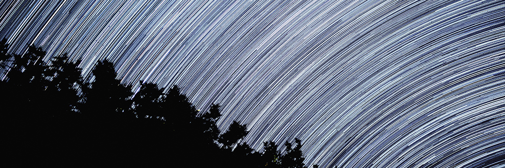

# Pseudoscientific Theories to Promote Atheism: Steady State Cosmology

- **Category:** 
- **Date:** 22/02/2013
- **Author:** 
- **Source:** https://www.quranproject.org/Pseudoscientific-Theories-to-Promote-Atheism-Steady-State-Cosmology-268-d

## Content

To scientists who do not assign any purpose to the universe, its origin is an accident. Nevertheless, the scientific community gives a lot of significance and spends a lot of time to find out how that accident occurred! A lot of theories have been proposed on the way. Whenever they develop a theory more convincing and suitable, they also find that it implies the need of Creator.
This is the case with big bang theory. That is something unthinkable and unacceptable to them; so they sidelined that theory initially and tried to develop another one. Thus they developed a theory to explain the big accident with lot of fanfare. That was steady state theory. However, to their dismay they found that the theory could not be supported by evidence. So they had to reluctantly reject it. Thus as of today, the theory that indicates the need of Creator survives and all others remain in hiding.
In 1917, Albert Einstein described the universe based on General Theory of Relativity, which inspired many scientists including Russian mathematician Alexander Friedmann. Much of today’s cosmology is based on Friedmann’s solutions to the mathematical equations in Einstein’s theory. In 1922 and 1924, Friedmann published papers that used solutions to Einstein’s general theory of relativity, to predict the expansion of the universe. The general theory of relativity implied a non-static universe which was however modified by Einstein himself by introducing a cosmological constant into the theory to bring in anti-gravity effect and thereby avoiding the prediction of a non-static universe.
It was perhaps that Einstein was so much influenced by the then prevalent view of a static universe that he made such a modification. Einstein regretted this modification later stating that it was the greatest blunder in his life. On the contrary, Friedmann preferred to explain the non-static implication of the theory in an elegant manner. Friedmann’s models predicted that all galaxies were moving away from each other. In other words, the universe has been expanding ever since it began. His models thus indicated that the galaxies were at some point of time (between ten and twenty thousand million years ago), together and compressed into a tiny mass of infinite density. This point of infinite density is known in physics as “singularity” to which Cambridge astrophysicist Fred Hoyle gave the fashionable epithet ‘big-bang’ [1]. Time had a beginning at the big bang. Later, Roger Penrose, a British physicist and Stephen Hawking showed that the general theory of relativity implied that the universe had a beginning and possibly, it would have an end too [2].
Discoveries in astronomy and physics have shown beyond a shadow of doubt that our universe had a beginning. Before that there was nothing. Scientific proofs validating predictions of the big bang model have been obtained. Direct scientific evidence to the predictions made by Friedmann’s models came in 1924, when the American astronomer Edwin Hubble demonstrated that ours (Milky Way) was not the only galaxy; there were some hundred thousand million galaxies spaced far between. The spectral analysis of the radiations coming from them revealed that most galaxies were redshifted, that is, they were moving away from us. In other words, the universe was expanding (which the Quran referred to in verse 51:47).
Another prediction of the theory was the existence of a cosmic background radiation. This also has been proved correct. The strongest evidence supporting this prediction came in 1965 when Arno Penzias and Robert Wilson of the Bell Laboratories, U.S.A., reported the presence of a microwave radiation (3 K radiation) pervading the whole universe. The universe was hot and dense in the beginning which implied an ionized plasma (which the Quran mentioned as ‘smoke’ in verse 41:11) where matter and radiation were inseparable. As the expansion and cooling of gas cloud continued, a stage was reached when the radiation (photons) decoupled from the matter. It would have been cooled now to 2.7 K. This radiation is believed to be the relic of the big bang and the one which Arno Penzias and Robert Wilson discovered [3].
A third proof in favour of the hot big bang model is the relative abundances of light elements. The abundances of deuterium (2H), tritium (3H), helium (4H) and lithium (7Li) in the universe are consistent with the predicted reactions occurring in the first three minutes following the big bang.
The big bang theory implied divine intervention since there was a beginning for the universe. The Catholic Church officially announced in 1951 that the big bang theory was in accordance with the Bible [2]. While discussing the big bang model, Stephen Hawking wrote: “Many people do not like the idea that time has a beginning, probably because it smacks of divine intervention.…There were therefore a number of attempts to avoid the conclusion that there had been a big bang. The proposal that gained widest support was called the steady state theory….Another attempt to avoid the conclusion that there must have been a big bang, and therefore a beginning of time, was made by two Russian scientists, Evangenii Lifshitz and Isaac Khalatnikov, in 1963.” [2].
In 1949 Hermann Bondi and Thomas Gold (two Austrian scientists) along with British astronomer Fred Hoyle proposed the steady state model. According to this theory, the universe does not evolve or change with time. There was no beginning in the past and there will be no change in the future. This model is based on the perfect cosmological principle which states that the universe is the same everywhere on the large scale, at all times. This theory attracted a lot of attention as it avoided the big bang event and hence a beginning for the universe which implied divine hand.
The steady state universe postulates creation of matter out of vacuum so that the perfect cosmological principle (i.e., density is constant) is satisfied. The theory held the centre stage for nearly two decades. The prediction of continual matter creation from nothing is a violation of the law of conservation of the mass and energy. Added to that, discovery of the cosmic microwave background strengthening the validity of the big bang cosmology came as a fatal blow to the theory [4]. There are, however, efforts to revive the theory. The Quasi-Steady State Cosmology proposed by Fred Hoyle, Jeffrey Burbidge, and Jayanth V. Narlikar is such an attempt in order to allow for the evolution of the cosmic microwave background temperature and to explain the faint radio sources in a universe that is always the same over the very long term. All these have been, however, found to be inconsistent with the observations
[5]. Thus the big bang theory, which upholds existence of God, remains as the acceptable theory in cosmology despite the efforts of atheist lobby to overthrow it.
References
1.
http://www.phyast.pitt.edu/Resources/Education/classes/astro88/0088u23.htm
. Accessed May 13, 2004.
2. Hawking, S. 1988. A Brief History of Time: From the Big Bang to Black Holes. Bantam Press, London.
3.
http://ssscott.tripod.com/BigBang.html
4.
http://cosmology.berkeley.edu/Eduction/cosprinc.html
. Accessed May 13, 2004.
5.
http://www.astro.ucla.edu/
~wright/stdystat.htm. Accessed May 13, 2004.