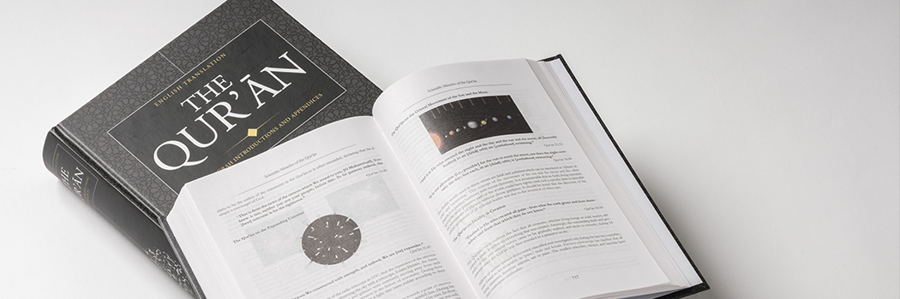

# Quran Project - Appendix - Introduction to the Study of the Quran

- **Category:** 
- **Date:** 16/02/2013
- **Author:** 
- **Source:** https://www.quranproject.org/Quran-Project---Appendix---Introduction-to-the-Study-of-the-Quran-222-d

## Content

Introduction to the Study of the Qur’ān
We are accustomed to reading books which present information, ideas and arguments systematically and coherently. So, when we embark on the study of the Qur’ān, we expect that this book too will revolve around a definite subject, that the subject matter of the book will be clearly defined at the beginning and will then be neatly divided into sections and chapters, after which discussion will proceed in a logical sequence. We likewise expect a separate and systematic arrangement of instruction and guidance for each of the various aspects of human life.
However, as soon as we open the Qur’ān we encounter a hitherto completely unfamiliar genre of literature. We notice that it embodies precepts of belief and conduct, moral directives, legal prescriptions, exhortation and admonition, censure and condemnation of evildoers, warnings to deniers of the Truth, good tidings and words of consolation and good cheer to those who have suffered for the sake of God, arguments and corroborative evidence in support of its basic message, allusions to anecdotes from the past and to signs of God visible in the universe. Moreover, these myriad subjects alternate without any apparent system; quite unlike the books to which we are accustomed, the Qur’ān deals with the same subject over and over again, each time couched in a different phraseology.
The reader also encounters abrupt transitions between one subject matter and another. Audience and speaker constantly change as the message is directed now to one and now to another group of people. There is no trace of familiar division into chapters and sections. Likewise, the treatment of different subjects is unique. If a historical subject is raised, the narrative does not follow the pattern familiar in historical accounts. In discussions of philosophical or metaphysical questions, we miss the familiar expressions and terminology of formal logic and philosophy. Cultural and political matters, or questions pertaining to man’s social and economic life, are discussed in a way very different from that usual in works of social sciences. Juristic principles and legal injunctions are elucidated, but quite differently from the manner of conventional works. When we come across an ethical instruction, we find its form differs entirely from anything to be found elsewhere in the literature of ethics.
The reader may find all this so foreign that the notion of what a book should be - that they may become so confused as to feel that the Qur’ān is a piece of disorganised, incoherent and unsystematic writing, comprising nothing but a disjointed conglomeration of comments of varying lengths put together arbitrarily. Hostile critics use this as a basis for their criticism, while those more favourably inclined resort to far-fetched explanations, or else conclude that the Qur’ān consists of unrelated pieces, thus making it amenable to all kinds of interpretations, even interpretations quite opposed to the intent of God Who revealed the Book.
What kind of a book is the Qur’ān? In what manner was it revealed? What underlies its arrangement? What is the subject? What is its true purpose? What is the central theme to which its diverse topics are intrinsically related? What kind of reasoning and style does it adopt in elucidating its central theme? If we could obtain clear, lucid answers to these and other related questions we might avoid some dangerous pitfalls, thus making it easier to reflect upon and to grasp the meaning and purpose of the Qur’ānic verses. If we begin studying the Qur’ān in the expectation of reading a book on religion we shall find it hard, since our notions of religion and of a book are naturally circumscribed by our range of experience. We need, therefore, to be told in advance that this Book is unique in the manner of its composition, in its theme and in its contents and arrangement. We should be forewarned that the concept of a book which we have formed from our previous readings is likely to be a hindrance, rather than a help, towards a deep understanding of the Qur’ān. We should realise that as a first step towards understanding it we must empty our minds of all preconceived notions.
The student of the Qur’ān should grasp, from the outset, the fundamental claims that the Qur’ān makes for itself. Whether one ultimately decides to believe in the Qur’ān or not, one must recognise the fundamental statements made by the Qur’ān and the man to whom it was revealed, the Prophet Muhammad, to be the starting point of one’s study. These claims are:
1. The Lord of the creation, the Creator and Sovereign of the entire universe, created man on earth (which is merely a part of His boundless realm). He also endowed man with the capacity for cognition, reflection, and understanding, with the ability to distinguish between good and evil, with the freedom of choice and volition, and with the power to exercise his latent potentialities. In short, God bestowed upon man a kind of autonomy and appointed him His vicegerent on earth.
2. Although man enjoys this status, God made it abundantly plain to him that He alone is man’s Lord and Sovereign, even as He is the Lord and Sovereign of the whole universe. Man was told that he was not entitled to consider himself independent and that only God was entitled to claim absolute obedience, service and worship. It was also made clear to man that life in this world, for which he had been placed and invested with a certain honour and authority, was in fact a temporary term, and was meant to test him; that after the end of the earthly life man must return to God, who will judge him on the basis of his performance, declaring who has succeeded and who has failed.
The right way for man is to regard God as his only Sovereign and the only object of his worship and adoration, to follow the guidance revealed by God, to act in this world in the consciousness that earthly life is merely a period of trial, and to keep his eyes fixed on the ultimate objective - success in God’s final judgment. Every other way is wrong.
It was also explained to man that if he chose to adopt the right way of life - and in this choice he was free - he would enjoy peace and contentment in this world and be assigned on his return to God the abode of eternal bliss and happiness known as Paradise. Should man follow any other way - although he was free to do so - he would experience the evil effects of corruption and disorder in the life of this world and be consigned to eternal grief and torment when he crosses the borders of the present world and arrives in the Hereafter.
3. Having explained all this, the Lord of the universe placed man on earth and communicated to Adam and Eve, the first human beings to live on the earth, the guidance which they and their offspring were required to follow. These first human beings were not born in a state of ignorance and darkness. On the contrary, they began their life in the broad daylight of Divine Guidance. They had intimate knowledge of reality and the Law which they were to follow was communicated to them. Their way of life consisted of obedience to God (i.e. Islām) and they taught their children to live in obedience to Him (i.e. to live as Muslims)
In the course of time, however, men gradually deviated from their true way of life and began to follow various erroneous ways. They allowed true guidance to be lost through heedlessness and negligence and sometimes, even deliberately, distorted it out of evil perversity. They associated with God a number of beings, human and non-human, real as well as imaginary, and adored them as deities. They adulterated the God-given knowledge of reality with all kinds of fanciful ideas, superstitions and philosophical concepts, thereby giving birth to innumerable religions. They disregarded or distorted the sound and equitable principle of individual morality and of collective conduct and made their own laws in accordance with their base desires and prejudices. As a result, the world became filled with wrong and injustice.
4. It was insistent with the limited autonomy conferred upon man by God that He should exercise His overwhelming power and compel man to righteousness. It was also inconsistent with the fact that God had granted a term to the human species in which to show their worth that He should afflict men with catastrophic destruction as soon as they showed signs of rebellion. Moreover, God had undertaken from the beginning of creation that true guidance would be made available to man throughout the term granted to him and that his guidance would be available in a manner consistent with man’s autonomy. To fulfill this self-assumed responsibility God chose to appoint those human beings whose faith in Him was outstanding and who followed the way pleasing to Him. God chose these people to be His envoys. He had His messages communicated to them, honoured them with an intimate knowledge of reality, provided them with the true laws of life and entrusted them with the task of recalling man to the original path from which he had strayed.
5. These Prophets were sent to different people in different lands and over a period of time covering thousands and thousands of years. They all had the same religion; the one originally revealed to man as the right way for him. All of them followed the same guidance; those principles of morality and collective life prescribed for man at the very outset of his existence. All these Prophets had the same mission - to call man to his true religion and subsequently to organise all who accepted this message into a community which would be bounded by the Law of God, which would strive to establish its observance and would seek to prevent its violation. All the Prophets discharged their missions creditably in their own time. However, there were always many who refused to accept their guidance and consequently those who did accept it and became a “Muslim” (Muslim would be anyone obeying God) community gradually degenerated, causing the Divine Guidance either to be lost, distorted or adulterated.
6. At last the Lord of the Universe sent Muhammad to Arabia and entrusted him with the same mission that He had entrusted to the earlier Prophets. This last Messenger of God addressed the followers of the earlier Prophets as well as the rest of humanity. The mission of each Prophet was to call men to the right way of life, to communicate God’s true guidance afresh and to organise into one community all who responded to his mission and accepted the guidance revealed to him. Such a community was to be dedicated to the two-fold task of moulding its own life in accordance with God’s guidance and striving for the reform of the world. The Qur’ān is the Book which embodies this mission and guidance, as revealed by God to Prophet Muhammad.
If we remember these basic facts about the Qur’ān it becomes easy to grasp its true subject, its central theme and the objective it seeks to achieve. Insofar as it seeks to explain the ultimate causes of man’s success or failure the subject of the Book is MAN.
Its central theme is that concepts relating to God, the universe and man which have emanated from man’s own limited knowledge run counter to reality. The same applies to concepts which have been either woven by man’s intellectual fancies or which have evolved through man’s obsession with animal desires. The ways of life which rest on these false foundations are both contrary to reality and ruinous for man. The essence of true knowledge is that which God revealed to man when He appointed him his vicegerent. Hence, the way of life which is in accordance with the reality and conducive to human good is that which we have characterised above as “the right way.” The real objective for the Book is to call people to this “right way” and to illuminate God’s true guidance, which has often been lost either through man’s negligence and heedlessness or distorted by his wicked perversity.
If we study the Qur’ān with these facts in mind it is bound to strike us that the Qur’ān does not deviate one iota from its main subject, its central theme and its basic objective. All the various themes occurring in the Qur’ān are related to the central theme; just as beads of different sizes and colour may be strung together to form a necklace. The Qur’ān speaks of the structure of the heavens and the earth and of man, refers to the signs of reality in the various phenomena of the universe, relates anecdotes of bygone nations, criticises the beliefs, morals, and deeds of different peoples, elucidates supernatural truths and discusses many other things besides. All this the Qur’ān does, not in order to provide instruction in physics, history, philosophy or any other particular branch of knowledge, but rather to remove the misconception people have about reality and to make that reality manifest to them.
It emphasises that the various ways men follow, which are not in conformity with reality, are essentially false, and full of harmful consequences for mankind. It calls on men to shun all such ways and to follow instead the way which both conforms to reality and yields best practical results. This is why the Qur’ān mentions everything only to the extent and in the manner necessary for the purpose it seeks to serve. The Qur’ān confines itself to essentials thereby omitting any irrelevant details. Thus all its contents consistently revolve around this call.
Likewise, it is not possible to fully appreciate either the style of the Qur’ān, the order underlying the arrangement of its verses or the diversity of the subjects treated in it, without fully understanding the manner in which it was revealed.
The Qur’ān, as we have noted earlier, is not a book in the conventional sense of the term. God did not compose and entrust it in one piece to Prophet Muhammad so that he could spread its message and call people to adopt an attitude to life consistent with its teachings. Nor is the Qur’ān one of those books which discusses their subjects and main themes in the conventional manner. Its arrangement differs from that of ordinary books, and its style is correspondingly different. The nature of this Book is that God chose a man in Makkah to serve as His Messenger and asked him to preach His message, starting in his own city and with his own tribe (Quraysh). At this initial stage, instructions were confined to what was necessary at this particular juncture of the mission. Three themes in particular stand out:
1. Directives were given to the Prophet on how he should prepare himself for his great mission and how he should begin working for the fulfillment of his task.
2. A fundamental knowledge of reality was furnished and misconceptions commonly held by people in that regard - misconceptions which gave rise to wrong orientations in life - were removed.
3. People were exhorted to adopt the right attitude towards life. Moreover, the Qur’ān also elucidated those fundamental principles which, if followed, lead to man’s success and happiness.
In keeping with the character of the mission at this stage the early revelations generally consisted of short verses, couched in language of uncommon grace, and clothed in a literary style suited to the taste and temperament of the people to whom they were originally addressed. The rhythm, melody and vitality of these verses drew rapt attention, and such was their stylistic grace and charm that people began to recite them involuntarily.
The local colour of these early messages is conspicuous, for while the truths they contained were universal, the arguments and illustration used to elucidate them were drawn from the immediate environment familiar to the first listeners. Allusions were made to their history and traditions and to the visible traces of the past which had crept into the beliefs, and into the moral and social life of Arabia. All this was calculated to enhance the appeal the message held for its immediate audience. This early stage lasted for four or five years, during which period the following reactions to the Prophet’s message manifested themselves:
1. A few people responded to the call and agreed to join the Ummah (nation) committed, of its own volition, to submit to the Will of God.
2. Many people reacted with hostility, either from ignorance or egotism, or because of chauvinistic attachment to the way of life of their forefathers.
3. The call of the Prophet did not remain confined to Makkah, it began to meet with favourable response beyond the borders.
In spite of the strong and growing resistance and opposition, the Islāmic movement continued to spread. There was hardly a family left in Makkah one of whose members at least had not embraced Islām.
During the Prophet’s long and arduous struggle God continued to inspire him with revelations. These messages instructed the Believers in their basic duties, inculcated in them a sense of community and belonging, exhorted them to piety, moral excellence and purity of character, taught them how to preach the true faith, sustained their spirit by promises of success and Paradise in the Hereafter, aroused them to struggle in the cause of God with patience, fortitude and high spirits, and filled their hearts with such zeal and enthusiasm that they were prepared to endure every sacrifice, brave every hardship and face every adversity.
This stage was unfolded in several phases. In each phase, the preaching of the message assumed ever wider proportions, as the struggle for the cause of Islām and opposition to it became increasingly intense and severe, and as the Believers encountered people of varying outlooks and beliefs. All these factors had the effect of increasing the variety of the topics treated in the messages revealed during this period. Such, in brief, was the situation forming the background of the Makkan Sūrahs (chapters) of the Qur’ān.
It is now clear to us that the revelation of the Qur’ān began and went hand in hand with the preaching of the message. This message passed through many stages and met with diverse situations from the very beginning and throughout a period of twenty-three years. The different parts of the Qur’ān were revealed step by step according to the various, changing needs and requirements of the Islāmic movement during these stages. It therefore could not possibly possess the kind of coherence and systematic sequence expected of a doctoral dissertation. Moreover, the various fragments of the Qur’ān which were revealed in harmony with the growth of the Islāmic movement were not published in the form of written treatises, but were spread orally. Their style, therefore, bore an oratorical flavour rather than the characteristics of literary composition.
Furthermore, these orations were delivered by one whose task meant he had to appeal simultaneously to the mind, to the heart and to the emotions, and to people of different mental levels and dispositions. He had to revolutionise people’s thinking, to arouse in them a storm of noble emotions in support of his cause, to persuade his companions and inspire them with real devotion and with the desire to improve and reform their lives. He had to raise their morale and steel their determination, turn enemies into friends and opponents into admirers, disarm those out to oppose his message and show their position to be morally untenable. In short, he had to do everything necessary to carry his movement through to a successful conclusion. Orations revealed in conformity with requirements of a message and movement will inevitably have a style different from that of a professional lecture.
This explains the repetitions we encounter in the Qur’ān. The interests of a message and a movement demand that during a particular stage emphasis should be placed only on those subjects which are appropriate at that stage, to the exclusion of matters pertaining to later stages. As a result, certain subjects may require continual emphasis for months or even years. On the other hand, constant repetition in the same manner becomes exhausting. Whenever a subject is repeated, it should therefore be expressed in different phraseology, in new forms and with stylistic variations so as to ensure that the ideas and beliefs being put over find their way into the hearts of the people.
At the same time, it was essential that the fundamental beliefs and principles on which the movement was based should always be kept fresh in people’s minds; a necessity which dictated that they should be repeated continually through all stages of the movement. If these ideas had lost their hold on the hearts and minds of people, the Islāmic movement could not have moved forward in its true spirit. If we reflect on this, it also becomes clear that the Prophet did not arrange the Qur’ān in the sequence in which it was revealed. As we have noted, the context in which the Qur’ān was revealed in the course of twenty-three years was the mission and movement of the Prophet; the revelations correspond with the various stages of this mission and movement. Now, it is evident that when the Prophet’s mission was completed, the chronological sequence of the various parts of the Qur’ān - revealed in accordance with the growth of the prophet’s mission - could in no way be suitable to the changed situation. What was now required was a different sequence in tune with the changed context resulting from the completion of the mission.
Initially, the Prophet’s message was addressed to people totally ignorant of Islām. Their instruction had to start with the most elementary things. After the mission had reached its successful completion, the Qur’ān acquired a compelling relevance for those who had decided to believe in the Prophet. By virtue of that belief they had become a new religious community - the Muslim Ummah. Not only that, they had been made responsible for carrying on the Prophet’s mission, which he had bequeathed to them, in a perfected form on both conceptual and practical levels. It was no longer necessary for the Qur’ānic verses to be arranged in chronological sequence. In the changed context, it had become necessary for the bearers of the mission of the Prophet to be informed of their duties and of the true principles and laws governing their lives. They also had to be warned against the deviations and corruptions which had appeared among the followers of earlier Prophets.
It would be foreign to the very nature of the Qur’ān to group together in one place all verses relating to a specific subject; the nature of the Qur’ān requires that the reader should find teachings revealed during the Madīnan period interspersed with those of the Makkan period, and vice versa. It requires the scrutiny of early discourses with instructions from the later period of the life of the Prophet. This blending of the teachings from different periods helps to provide an overall view and an integrated perspective of Islām, and acts as a safeguard against lop-sidedness. Furthermore, a chronological arrangement of the Qur’ān would have been meaningful to later generations only if it had been supplemented with explanatory notes and these would have had to be treated as inseparable appendices to the Qur’ān. This would have been quite contrary to God’s purpose in revealing the Qur’ān; the main purpose of its revelation was that all human beings - children and young people, old men and women, town and country dwellers, laymen and scholars - should be able to refer to the Divine Guidance available to them in composite form and providentially secured against adulteration. This was necessary to enable people of every level of intelligence and understanding to know what God required of them. This purpose would have been defeated had the reader been obliged solemnly to recite historical notes and explanatory comments along with the Book of God.
Those who object to the present arrangement of the Qur’ān appear to be suffering from a misapprehension as to its true purpose. Sometimes, they almost seem to be under the illusion that it was revealed merely for the benefit of students of history and sociology!
The present arrangement of the Qur’ān is not the work of later generations, but was made by the Prophet under God’s direction. Whenever a Sūrah was revealed, the Prophet summoned his scribes, to whom he carefully dictated its contents, and instructed them where to place it in relation to the other Sūrahs. The Prophet followed the same order of Sūrahs and verses when reciting during ritual Prayer as on other occasions, and his Companions followed the same practice in memorising the Qur’ān. It is therefore a historical fact that the collection of the Qur’ān came to an end on the very day that its revelation ceased.
Since Prayers were obligatory for the Muslims from the very outset of the Prophet’s mission, and recitation of the Qur’ān was an obligatory part of those prayers, Muslims were committing the Qur’ān to memory while its revelation continued. Thus, as soon as a fragment of the Qur’ān was revealed, it was memorised by some of the Companions. Hence the preservation of the Qur’ān was not solely dependent on its verses being inscribed on palm leaves, pieces of bone, leather and scraps of parchment - the materials used by the Prophet’s scribes for writing down Qur’ānic verses. Instead the verses came to be inscribed upon scores, then hundreds, then thousands, then hundreds of thousands of human hearts, soon after they had been revealed, so that no scope was left for any devil to alter so much as one word of them.
After the death of the Prophet, the storm of apostasy convulsed Arabia and the companions had to plunge into bloody battles to suppress it, many companions who had memorised the Qur’ān had become martyrs. This led Umar to plead that the Qur’ān ought to be preserved in writing, as well as orally. He therefore impressed the urgency of this upon Abu Bakr (The first Caliph). After slight hesitation, the latter agreed and entrusted that task to Zayd ibn Thabit, who had worked as a scribe of the Prophet.
The Qur’ān that we possess today corresponds exactly to the edition which was prepared on the orders of Abu Bakr and copies of which were officially sent, on the orders of Uthman, to various cities and provinces. Several copies of this original edition of the Qur’ān still exist today [see chapter - Preservation and Literary Challenge of the Qur’ān.]
The Qur’ān is a Book to which innumerable people turn for innumerable purposes. It is difficult to offer advice appropriate to all. The readers to whom this work is addressed are those who are concerned to acquire a serious understanding of the Book, and who seek the guidance it has to offer in relation to the various problems of life. For such people we have a few suggestions to make, and we shall offer some explanations in the hope of facilitating their study of the Qur’ān. Anyone who really wishes to understand the Qur’ān, irrespective of whether or not he believes must divest his mind, as far as possible, of every preconceived notion, bias and prejudice, in order to embark upon his study with an open mind. Anyone who begins to study the Qur’ān with a set of preconceived ideas is likely to read those very ideas into the Book. No book can be profitably studied with this kind of attitude, let alone the Qur’ān which refuses to open its treasure-house to such readers.
For those who want only a superficial acquaintance with the doctrines of the Qur’ān one reading is perhaps sufficient. For those who want to fathom its depths several readings are not even enough. These people need to study the Qur’ān over and over again, taking notes of everything that strikes them as significant. Those who are willing to study the Qur’ān in this manner should do so at least twice to begin with, so as to obtain a broad grasp of the system of beliefs and practical prescriptions that it offers. In this preliminary survey, they should try to gain an overall perspective of the Qur’ān and to grasp the basic ideas which it expounds, and the system of life that it seeks to build on the basis of those ideas. If, during the course of this study, anything agitates the mind of the reader, he should note down the point concerned and patiently persevere with his study. He is likely to find that, as he proceeds, the difficulties are resolved. (When a problem has been solved, it is advisable to note down the solution alongside the problem). Experience suggests that any problems still unsolved after a first reading of the Qur’ān are likely to be resolved by a careful second reading.
Only after acquiring a total perspective of the Qur’ān should a more detailed study be attempted. Again the reader is well advised to keep noting down the various aspects of the Qur’ānic teachings. For instance, he should note the human model that the Qur’ān extols as praiseworthy, and the model it denounces. It might be helpful to make two columns, one headed ‘praiseworthy qualities’, the other headed ‘blameworthy qualities’, and then to enter into the respective columns all that is found relevant in the Qur’ān. To take another instance, the reader might proceed to investigate the Qur’ānic point of view on what is conducive to human success and felicity, as against what leads to man’s ultimate failure and perdition. In the same way, the reader should take down notes about Qur’ānic teachings on questions of belief and morals, man’s rights and obligations, family life and collective behaviour, economic and political life, law and social organisation, war and peace, and so on. Then he should use these various teachings to try to develop an image of the Qur’ānic teachings vis-à-vis each particular aspect of human life. This should be followed by an attempt at integrating these images so that he comes to grasp the total scheme of life envisaged by the Qur’ān.
Moreover, anyone wishing to study in depth the Qur’ānic viewpoint on any particular problem of life should, first of all, study all the significant strands of human thought concerning that problem. Ancient and modern works on the subject should be studied. Unresolved problems where human thinking seems to have got stuck should be noted. The Qur’ān should then be studied with these unresolved problems in mind, with a view to finding out what solutions the Qur’ān has to offer. Personal experience again suggests that anyone who studies the Qur’ān in this manner will find his problem solved with the help of verses which he may have read scores of times without it ever crossing his mind that they could have any relevance to the problems at hand.
It should be remembered, nevertheless, that full appreciation of the spirit of the Qur’ān demands practical involvement with the struggle to fulfill its mission. The Qur’ān is neither a book of abstract theories and cold doctrines which the reader can grasp while seated in a cosy armchair, nor is it merely a religious book like other religious books, the secrets of which can be grasped in seminaries and oratories. On the contrary, it is the blueprint and guidebook of a message, of a mission, of a movement. As soon as this Book was revealed, it drove a quiet, kind-hearted man from his isolation and seclusion, and placed him upon the battlefield of life to challenge a world that had gone astray. It inspired him to raise his voice against falsehood, and pitted him in grim struggle against the standard-bearers of unbelief, of disobedience of God, of waywardness and error.
One after the other, it sought out everyone who had a pure and noble soul, mustering them together under the standard of the Messenger. It also infuriated all those who by their nature were bent on mischief and drove them to wage war against the bearers of the Truth. This is the Book which inspired and directed that great movement which began with the preaching of a message by an individual, and continued for no fewer than twenty three years, until the Kingdom of God was truly established on earth. In this long and heart-rending struggle between Truth and Falsehood, this Book unfailingly guided its followers to the eradication of the latter and the consolidation and enthronement of the former. How then could one expect to get to the heart of the Qur’ānic truths merely by reciting its verses, without so much as stepping upon the field of battle between faith and unbelief, between Islām and ignorance? To appreciate the Qur’ān fully one must take it up and launch into the task of calling people to God, making it one’s guide at every stage.
Then, and only then, does one meet the various experiences encountered at the time of its revelation. One experiences the initial rejection of the message of Islām by the city of Makkah, the persistent hostility leading to the quest for a haven in the refuge of Abyssinia, and the attempt to win a favourable response from Tā’if which led, instead, to cruel persecution of the bearer for the Qur’ānic message. One experiences also the campaigns of Badr, of Uhud, of Hunayn and of Tabuk. One comes face to face with Abu Jahl and Abu Lahab, with hypocrites and with Jews, with those who instantly respond to this call as well as those who, lacking clarity of perception and moral strength, were drawn into Islām only at a later stage.
This will be an experience different from any so-called “mystic-experience.” I designate it the “Qur’ānic mystic experience.” One of the characteristics of this ‘experience’ is that at each stage one almost automatically finds certain Qur’ānic verses to guide one, since they were revealed at a similar stage and therefore contain the guidance appropriate to it. A person engaged in this struggle may not grasp all the linguistic and grammatical subtleties, he may also miss certain finer points in the rhetoric and semantics of the Qur’ān, yet it is impossible for the Qur’ān to fail to reveal its true spirit to him.
It is well known that the Qur’ān claims to be capable of guiding all mankind. Yet the student of the Qur’ān finds that it is generally addressed to the people of Arabia, who lived in the time of its revelation. Although the Qur’ān occasionally addresses itself to all mankind - its contents are, on the whole, vitally related to the taste and temperament, the environment and history, and the customs and usages of Arabia. When one notices this, one begins to question why a Book which seeks to guide all mankind to salvation should assign such importance to certain aspects of a particular people’s life, and to things belonging to a particular age and time. Failure to grasp the real cause of this may lead one to believe that the Book was originally designed to reform the Arabs of that particular age alone, and that it is only an altogether novel interpretation. If, while addressing the people of a particular area at a particular period of time, attempting to refute their polytheistic beliefs and adducing arguments in support of its own doctrine of the Oneness of God, the Qur’ān draws upon facts with which those people were familiar, this does not warrant the conclusion that its message is relevant only for that particular people or for that particular period of time.
What ought to be considered is whether or not the Qur’ānic statements in refutation of the polytheistic beliefs of the Arabs of those days apply as well to other forms of polytheism in other parts of the world. Can the arguments advanced by the Qur’ān in that connection be used to rectify the beliefs of other polytheists? Is the Qur’ānic line of argument for establishing the Oneness of God, with minor adaptations, valid and persuasive for every age? If the answers are positive, there is no reason why a universal teaching should be dubbed exclusive to a particular people and age merely because it happened to be addressed originally to that people and at that particular period of time.
Indeed, what marks out a time-bound doctrine from an eternal one, and a particularistic national doctrine from a universal one, is the fact that the former either seeks to exalt a people or claims special privileges for it or else comprises ideas and principles so vitally related to that people’s life and traditions as to render it totally inapplicable to the conditions of other people. A universal doctrine, on the other hand, is willing to accord equal rights and status to all, and its principles have an international character in that they are equally applicable to other nations. Likewise, the validity of those doctrines which seek to come to grips merely with the questions of a transient and superficial nature is time-bound. If one studies the Qur’ān with these considerations in mind, can one really conclude that it has only a particularistic national character, and that its validity is therefore time-bound?
Those who embark upon a study of the Qur’ān often proceed with the assumption that this Book is, as it is commonly believed to be, a detailed code of guidance. However, when they actually read it, they fail to find detailed regulations regarding social, political and economic matters. In fact, they notice that the Qur’ān has not laid down detailed regulations even in respect of such oft-repeated subjects as Prayers and Zakāh. The reader finds this somewhat disconcerting and wonders in what sense the Qur’ān can be considered a code of guidance.
The uneasiness some people feel about this arises because they forget that God did not merely reveal a Book, but that he also designated a Prophet. Suppose some laymen were to be provided with the bare outlines of a construction plan on the understanding that they would carry out the construction as they wished. In such a case, it would be reasonable to expect that they should have very elaborate directives as to how the construction should be carried out. Suppose, however, that along with the broad outline of the plan of construction, they were also provided with a competent engineer to supervise the task. In that case, it would be quite unjustifiable to disregard the work of the engineer, on the expectation that detailed directives would form an integral part of the construction plan, and then to complain of imperfection in the plan itself. The Qur’ān, to put it succinctly, is a Book of broad general principles rather than of legal minutiae. The Book’s main aim is to expound, clearly and adequately, the intellectual and moral foundations of the Islāmic programme for life. It seeks to consolidate these by appealing to both the person’s mind and to his/her heart. Its method of guidance for practical Islāmic life does not consist of laying down minutely detailed laws and regulations. It prefers to outline the basic framework for each aspect of human activity, and to lay down certain guidelines within which man can order his life in keeping with the Will of God. The mission of the Prophet was to give practical shape to the Islāmic vision of the good life, by offering the world a model of an individual character and of a human state and society, as living embodiments of the principles of the Qur’ān.
Source: M. Mawdudi, Introduction – Towards Understanding the Qur’ān, (complete tafsir [explanation] of the Qur’ān), available in full online: www.quranproject.org