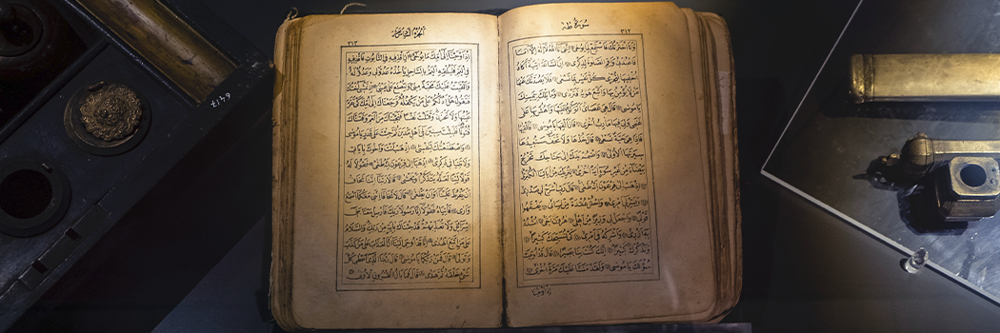

# Quran Project - Appendix - Old and New Testament Prophecies of Muhammad

- **Category:** 
- **Date:** 16/02/2013
- **Author:** 
- **Source:** https://www.quranproject.org/Quran-Project---Appendix---Old-and-New-Testament-Prophecies-of-Muhammad-227-d

## Content

Old and New Testament Prophecies of Muhammad
Old Testament Prophecies
God promises the lineage of Abraham to be named through both Ishmael and Isaac
“…through Isaac shall your descendants be named. And I will make a nation of the son of the slave woman [Ishmael] also, because he is your offspring.” (Genesis 21:13-14)
The descendants of Ishmael to be a great nation
Abraham had left Hagar and their newborn, Ishmael in Makkah (or Paran). “..when the water in the skin was gone, she cast the child under one of the bushes. Then she went, and sat down over against him a good way off, about the distance of a bowshot; for she said, "Let me not look upon the death of the child." And as she sat over against him, the child lifted up his voice and wept. And God heard the voice of the lad; and the angel of God called to Hagar from heaven, and said to her, "What troubles you, Hagar? Fear not; for God has heard the voice of the lad where he is. Arise, lift up the lad, and hold him fast with your hand; for I will make him a great nation.” (Genesis 21:16-19)
Ishmael settles in Makkah (referred to as Paran)
“And God was with the lad [Ishmael], and he grew up; he lived in the wilderness, and became an expert with the bow.  He lived in the wilderness of Paran;” (Genesis 21:21)
Reference to Moses, Jesus and Muhammad (in order)
“This is the blessing with which Moses the man of God blessed the children of Israel before his death. He said, "The LORD came from Sinai, and dawned from Se'ir upon us; he shone forth from Mount Paran, he came from the ten thousands of holy ones…..” (Deuteronomy 33:1-3)
Sinai - is reference to Moses. It is an obvious reference to Mount Sinai where Moses received revelation. Se’ir – is reference to Jesus. It is usually associated with the chain of mountains west and south of the Dead Sea extending through Jerusalem and Bethlehem, the birthplace of Jesus.  Paran – is reference to the location where Ishmael settled. The Prophet Muhammad was born in Paran (Makkah) and having migrated from Makkah, he returned to conquer the city with 10,000 of his companions.
Prophet just like Moses
Deuteronomy 18:18  “I (God) will raise them up a Prophet from among their brethren, like unto thee (Moses), and will put my words in his mouth; and he shall speak unto them all that I shall command him.”
Many Christians believe this prophecy foretold by Moses to be in regards to Jesus.  Indeed Jesus was foretold in the Old Testament, but as will be clear, this prophecy does not fit him, but rather is more deserving of Muhammad, may the blessing and mercy of God be upon him.  Moses foretold the following:
1. The Prophet Will Be Like Moses
Areas of Comparison
Moses
Jesus
Muhammad
Birth
normal birth
miraculous, virgin birth
normal birth
Mission
prophet only
said to be Son of God
prophet only
Parents
father & mother
mother only
father & mother
Family Life
married with children
never married
married with children
Acceptance by own people
Jews accepted him
Jews rejected him
Arabs accepted him
Political Authority
Moses had it (Num 15:36)
Jesus refused it
Muhammad had it
Victory Over Opponents
Pharaoh drowned
said to be crucified
Makkans defeated
Death
natural death
claimed to be crucified
natural death
Burial
buried in grave
empty tomb
buried in grave
Divinity
not divine
divine to Christians
not divine
Began Mission at age
40
30
40
Resurrection on Earth
not resurrected
resurrection claimed
not resurrected
2. The Awaited Prophet will be from the Brethren of the Jews
The verse in discussion is explicit in saying that the prophet will come amongst the Brethren of the Jews. Abraham had two sons: Ishmael and Isaac.  The Jews are the descendants of Isaac’s son, Jacob. The Arabs are the children of Ishmael.  Thus, the Arabs are the brethren of the Jewish nation. The Bible affirms:
‘And he (Ishmael) shall dwell in the presence of all his brethren.’ (Genesis 16:12)
‘And he (Ishmael) died in the presence of all his brethren.’ (Genesis 25:18)
The children of Isaac are the brethren of the Ishmaelites.  Likewise, Muhammad is from among the brethren of the Israelites, because he was a descendant of Ishmael the son of Abraham.
3. God will Put His Words in the Mouth of the Awaited Prophet
The Qur’ān says of Prophet Muhammad:
“Nor does he speak from [his own] inclination. It is not but a revelation revealed.”
Qur’ān 53:3-4
This is quite similar to the verse in Geneses 18:15:
“I will raise them up a Prophet from among their brethren, like unto thee, and will put my words in his mouth; and he shall speak unto them all that I shall command him” (Geneses 18:18)
The Prophet Muhammad came with a message to the whole world, and from them, the Jews.  All, including the Jews, must accept his prophethood, and this is supported by the following words:
“The Lord thy God will raise up unto thee a Prophet from the midst of thee, of thy brethren, like unto me; unto him ye shall hearken.” (Deuteronomy 18:15)
4. A Warning to Rejecters
The prophecy continues:
Deuteronomy 18:19  “And it shall come to pass, [that] whosoever will not hearken unto my words which he shall speak in my name, I will require [it] of him.” (in some translations: “I will be the Revenger”).
Interestingly, Muslims begin every chapter of the Qur’ān in the name of God by saying:
Bismillah ir-Rahman ir-Raheem - “‘In the Name of God, the Most Gracious Most Merciful.”
Abdul-Ahad Dawud, was the former Rev. David Benjamin Keldani, BD, a Roman Catholic priest of the Uniate-Chaldean sect.  After accepting Islām, he wrote the book, ‘Muhammad in the Bible.’  He writes about this prophecy:
“If these words do not apply to Muhammad, they still remain unfulfilled.  Jesus himself never claimed to be the prophet alluded to.  Even his disciples were of the same opinion: they looked to the second coming of Jesus for the fulfillment of the prophecy (Acts 3: 17-24).  So far it is undisputed that the first coming of Jesus was not the advent of the Prophet like unto thee and his second advent can hardly fulfill the words.  Jesus, as is believed by his Church, will appear as a Judge and not as a law-giver; but the promised one has to come with a “fiery law” in his right hand.”
Isaiah 42 – Makkah and Madinah
The Book of Isaiah foretells the sending of a Prophet with the following details:
This Prophet will be “His Servant.”
He shall bring a new law and establish justice in the world.
He shall be a light for all peoples, Jews and Gentiles [non-Jews].
His demeanour will be soft natured, not one who shouts in the streets.
The towns of Makkah [where Kedar lives] and Madinah [Sela] should rejoice for the arrival of this Prophet.
His opponents in this mission would specifically be idol worshippers.
Extract from the Book of Isaiah 42:1-17: The Servant of the Lord
42 “Here is my
servant
, whom I uphold,
my
chosen
one in whom I delight;
I will put my
Spirit
on him,
and he will bring justice to the nations.
2 He will
not shout or cry out
,
or
raise his voice in the streets.
3 A bruised reed he will not break,
and a smoldering wick he will not snuff out.
In faithfulness he will bring forth justice;
4  he will not falter or be discouraged
till he
establishes justice on earth
.
In his teaching the islands will put their hope.”
5 This is what God the Lord says—
the Creator of the heavens, who stretches them out,
who spreads out the earth with all that springs from it,
who gives breath to its people,
and life to those who walk on it:
6 “I, the Lord, have called you in righteousness;
I will take hold of your hand.
I will keep you and will make you
to be a covenant for the people
and a light for the Gentiles
,
7 to open eyes that are
blind
,
to free captives from prison
and to release from the dungeon those who sit in darkness.
8 “I am the Lord; that is my name!
I will not yield my glory to another
or my praise to idols.
9 See, the former things have taken place,
and new things I declare;
before they spring into being
I announce them to you.”
Song of Praise to the Lord
10 Sing to the Lord a
new song
,
his praise from the ends of the earth,
you who go down to the sea, and all that is in it,
you islands, and all who live in them.
11 Let the
desert
and its towns raise their voices;
let the settlements where
Kedar
lives rejoice.
Let the people of
Sela
sing for joy;
let them shout from the mountaintops.
12 Let them give glory to the Lord
and proclaim his praise in the islands.
13 The Lord will march out like a champion,
like a warrior he will stir up his zeal;
with a shout he will raise the battle cry
and will triumph over his enemies.
14 “For a long time I have kept silent,
I have been quiet and held myself back.
But now, like a woman in childbirth,
I cry out, I gasp and pant.
15 I will lay waste the mountains and hills
and dry up all their vegetation;
I will turn rivers into islands
and dry up the pools.
16 I will lead the blind by ways they have not known,
along unfamiliar paths I will guide them;
I will turn the darkness into light before them
and make the rough places smooth.
These are the things I will do;
I will not forsake them.
17 But those who trust in
idols
,
who say to images, ‘You are our gods,’
will be turned back in utter shame.”
“My Servant”
The word in Hebrew and Arabic Christian bibles used is עַבְדִּי֙ [
avdi
] and عَبدِي [
abdi
] meaning “My Slave/Servant.” In the Qur’ān, God refers to the Prophet Muhammad as His ‘
abd
’ [slave] in a number of places, e.g. 17:1, 18:1, 25:1, 53:10, 57:9.
“I will put my Spirit on him…”
Here the “Spirit” [in Hebrew רוּחִי֙ [
rū-ḥî]
is divine revelation sent to those chosen to be Prophets and Messengers by God. The Qur’ān mentions the
Ruh
[Spirit] sent down to the Prophet Muhammad;
“We have thus revealed a Spirit [Ruh] to you [Prophet] by Our command: you knew neither the Book nor the faith, but We made it a light, guiding with it whoever We will of Our servants. You are indeed guiding to the straight path.”
[Qur’ān 42:52]
“He will not shout or cry out, or raise his voice in the streets.”
It is interesting to note that the personality and character of the Prophet Muhammad is exactly as this verse describes and those around him bore witness to how soft in speech he was. A companion of the Prophet was asked about the prophecies about him in the Torah. He replied,
“… by God, he is described in the Torah with some of the qualities attributed to him in the Qur’ān as follows… You are
My slave
and My messenger. I have named you “Al-Mutawakkil” [who depends upon God]. You are neither discourteous, harsh nor one who shouts in the markets. And you do not do evil to those who do evil to you, but you deal with them with forgiveness and kindness. God will not let him [the Prophet] die till he makes straight the crooked people by making them say: “None has the right to be worshipped but God,” with which will be opened blind eyes and deaf ears and enveloped hearts.”
“…make you to be a covenant for the people and a light for the Gentiles”
Here the passage emphasises the universal mission of this forthcoming Prophet. He will be sent to all people Jews and Gentiles [non-Jews]. In the Qur’ān God tells us:
“We have sent you [O Prophet] as a bearer of glad tidings and a warner for the whole of mankind, but most people have no knowledge.”
[Qur’ān 34:28]
“Let the desert and its towns raise their voices; let the settlements where Kedar lives rejoice. Let the people of Sela sing for joy, let them shout from the mountaintops”
Of all the places on earth that this prophecy could have mentioned, it chose to highlight the location of where the houses of ‘Kedar’ are and the location of ‘Sela.’ Together these two locations pinpoint an exact location for this special person.
Who is Kedar?
The Bible tells us that Kedar was the son of Ishmael [son of Abraham] and he lived in Arabia.
“These are the names of the sons of Ishmael, listed in the order of their birth: Nebaioth the firstborn of Ishmael, Kedar, Adbeel, Mibsam”
[Genesis 25:13]
The Old Testament also tells us that Ishmael dwelt in a place called Paran:
“While he (Ishmael) was living in the Desert of Paran…”
[Genesis 21:21]
It is unanimously agreed that Paran is in Arabia and more specifically the location of Makkah. The Arabs, throughout history, have had no difference of opinion that Ishmael was raised and lived in the city of Makkah.
Many Christian interpreters of the Bible also acknowledge that Paran is in Arabia. From Clarke’s Commentary on the Bible,
“He dwelt in the wilderness of Paran – This is generally allowed to have been a part of the desert belonging to Arabia Petraea…”
Strong’s Bible Dictionary also tells us,
“Paran, a desert of Arabia.”
In two passages, the Bible emphatically associates Kedar with Arabia;
“A prophecy against Arabia: You caravans of Dedanites, who camp in the thickets of Arabia...all the splendour of Kedar will come to an end.....”
[Isaiah 21:13-17]
“Arabia and all the princes of Kedar were your customers; they did business with you in lambs, rams and goats.”
[Ezekiel 27:21]
In conclusion, we are left with little doubt that Ishmael, and his descendants including Kedar, lived and dwelt in Arabia.
The Great Isaiah Scroll is one of the original seven Dead Sea Scrolls discovered in Qumran in 1947. “It is the largest (734 cm) and best preserved of all the biblical scrolls, and the only one that is almost complete.”
“Let the people of Sela sing for joy, let them shout from the mountaintops”
After specifying the location of the “homes of Kedar”, the passage continues with another location, “Sela.” The place being spoken of is actually the city of Madinah, because “Sela” is the name of a famous mountain in Madinah. In fact, it is the closest mountain to the Prophet Muhammad’s house, at a distance of approximately 1,000 yards in the northwest direction.
If you enter “Sela Mountain” in Google Maps, you will find the below result. The white building in the middle is the Prophet’s Mosque with the Sela Mountain marked to the left of it.
Mount Sela or in Arabic, سلع [seen, laam, ayn] is mentioned in a number of prophetic traditions. An example,
Ka’b ibn Malik, the companion of the Prophet said,
“…there I heard the voice of one who had ascended the Mountain of Sela [سَلْعٍ جَبَلِ ] calling with his loudest voice,
‘O Ka’b bin Malik! Be happy [by receiving good tidings].’ I fell down in prostration before God, realizing the relief that had come.”
If we also refer to the Christian Arabic Bible for the Isaiah:42 text, we find that “Sela” is mentioned as “Madinah of Sela” which translates as “City of Sela.”
Jewish tribes in Madinah
An important point worth mentioning is the presence of thousands of Jews living in Madinah before the advent of the Prophet Muhammad. Jewish historians, secular historians and Islamic history testify to this fact. Alexander Marx, an American historian, and Max Margolis, an American philologist, wrote the following in their book, “A History of the Jewish People”:
“In the northwest of the peninsula the Jews occupied the oases on the line of the caravan route running from north to south. Taima, Fadak, Khaibar, Wadi-i-Kura [Vale of Villages] were in their hands and Yathrib [later Madinah] was in all probability founded by them…”
Salo Baron, the most noted historian of the Jews of his generation, recorded the following in his book “Social and Religious History of the Jews”:
“Judaic presence and influence throughout the region burgeoned steadily throughout the first few centuries of the Common Era. The process is substantiated by solidly sympathetic references to Jews and Judaism in pre-Islamic Arabic literature. By the sixth century, it is clear that “Jewish tribes dominated Yathrib [Madinah]….Among some twenty Jewish tribes mentioned in later Arabic literature stand out the Aramaic-sounding Banu Zaghura. More important were the Banu Nadhir, Banu Quraidah and Banu Qainuqa, who between them occupied at one time fifty-nine strongholds and practically the entire fertile countryside.”
The question therefore arises; why were there numerous Jewish tribes within Madinah? The answer is that the learned Jews were aware of this prophecy in Isaiah and were anxiously awaiting at the prophesized location. Indeed, we find in a number of Hadith, the Jews warning the Arabs of the coming of a Prophet of God – especially during internal conflicts. Hence, the Arabs of Madinah were far more familiar regarding the advent of the Prophet and this was partially the reason why they were so quick to invite and accept him as their religious and political leader.
“But those who trust in idols, who say to images, ‘You are our gods,’ will be turned back in utter shame.”
It is clear that the special person that God is talking about will be sent to a people who worship idols. This perfectly describes pre-Islamic Arabs, as the whole of Arabia at the start of Muhammad’s Prophethood consisted of idol worshippers.
How beautifully does this verse in Isaiah summarise the conclusion of the Prophet Muhammad’s mission in Arabia. Not only did Prophet Muhammad conquer Makkah, the pagan capital of Arabia, but by the end of his life, Arabia had shunned idol worship and worshipped the One true God.
In conclusion, it is clear that the person spoken of in Isaiah:42 is Prophet Muhammad.
New Testament Prophecy
John 14:16  “And I will pray the Father, and he shall give you another Comforter, that he may abide with you for ever.”
In this verse, Jesus promises that another “Comforter” will appear, and thus, we must discuss some issues concerning this “Comforter.”
The Greek word paravklhtoß,
ho parakletos
, has been translated as ‘Comforter.’
Parakletos
more precisely means ‘one who pleads another’s cause, an intercessor.’  The
ho parakletos
is a person in the Greek language, not an incorporeal entity.  In the Greek language, every noun possesses gender; that is, it is masculine, feminine or neutral.  In the Gospel of John, Chapters 14, 15 and 16 the
ho parakletos
is actually a person.  All pronouns in Greek must agree in gender with the word to which they refer and the pronoun “he” is used when referring to the
parakletos
.  The New Testament uses the word pneuma, which means “breath” or “spirit,” the Greek equivalent of ruah, the Hebrew word for “spirit” used in the Old Testament.  Pneuma is a grammatically neutral word and is always represented by the pronoun “it.”
All present day Bibles are compiled from “ancient manuscripts,” the oldest dating back to the fourth century C.E.  No two ancient manuscripts are identical. All Bibles today are produced by combining manuscripts with no single definitive reference.  The Bible translators attempt to “choose” the correct version.  In other words, since they do not know which “ancient manuscript” is the correct one, they decide for us which “version” for a given verse to accept.
Take John 14:26 as an example.  John 14:26 is the only verse of the Bible which associates the
Parakletos
with the Holy Spirit.  But the “ancient manuscripts” are not in agreement that the
“Parakletos”
is the ‘Holy Spirit.’  For instance, the famous Codex Syriacus, written around the fifth century C.E., and discovered in 1812 on Mount Sinai, the text of 14:26 reads;
“Paraclete
, the Spirit”; and not “Paraclete, the
Holy Spirit
.”
Muslim scholars state that what Jesus actually said in Aramaic represents more closely the Greek word
periklytos
which means the ‘admired one.’ In Arabic the word ‘Muhammad’ means the ‘praiseworthy, admired one.’ In other words,
periklytos
is “Muhammad” in Greek.  We have two strong reasons in its support.  First, due to several documented cases of similar word substitution in the Bible, it is quite possible that both words were contained in the original text but were dropped by a copyist because of the ancient custom of writing words closely packed, with no spaces in between.  In such a case the original reading would have been, “and He will give you another comforter (
parakletos
), the admirable one (
periklytos)
.”  Second, we have the reliable testimony of at least four Muslim authorities from different eras who ascribed ‘admired, praised one’ as a possible meaning of the Greek or Syriac word to Christians scholars.
The following are some who attest that the Paraclete is indeed an allusion to Prophet Muhammad,
The First Witness
Anselm Turmeda (1352/55-1425 C.E.), a priest and Christian scholar, was a witness to the prophecy.  After accepting Islām he wrote the book, “
Tuhfat al-arib fi al-radd ‘ala Ahl al-Salib.
”
The Second Witness
Abdul-Ahad Dawud, was the former Rev. David Abdu Benjamin Keldani, BD, a Roman Catholic priest of the Uniate-Chaldean sect..  After accepting Islām, he wrote the book, ‘Muhammad in the Bible.’  He writes in this book: “There is not the slightest doubt that by “Periqlyte,” Prophet Muhammad, i.e. Ahmad, is intended.”
The Third Witness
Commenting on the verse where Jesus predicts the coming of Prophet Muhammad:
“…a messenger who shall come after me, whose name shall be Ahmad…”
Qur’ān 61:6
M. Asad [formerly a Jew] explains that the word Parakletos:
“…[it] is almost certainly a corruption of Periklytos (‘the Much-Praised’), an exact Greek translation of the Aramaic term or name Mawhamana.  (It is to be borne in mind that Aramaic was the language used in Palestine at the time of, and for some centuries after Jesus and was thus undoubtedly the language in which the original - now lost - texts of the Gospels were composed.) In view of the phonetic closeness of Periklytos and Parakletos it is easy to understand how the translator - or, more probably, a later scribe - confused these two expressions.  It is significant that both the Aramaic Mawhamana and the Greek Periklytos have the same meaning as the two names of the Last Prophet, Muhammad and Ahmad, both of which are derived from the Hebrew verb hamida (‘he praised’) and the Hebrew noun hamd (‘praise’).”
Holy spirit or Prophet?
Why is it important?  It is significant because in biblical language a “spirit,” simply means “a prophet.”
“Beloved, believe not every spirit, but try the spirits whether they are of God: because many false prophets are gone out into the world.”
It is instructive to know that several biblical scholars considered parakletos to be an ‘independent salvific (having the power to save) figure,’ not the Holy Ghost.
Let us further study whether Jesus’ parakletos, Comforter, was a ‘Holy Ghost’ or a person (a prophet) to come after him?  When we continue reading beyond chapter 14:16 and chapter 16:7, we find that Jesus predicts the specific details of the arrival and identity of the parakletos.  Therefore, according to the context of John 14 & 16 we discover the following facts.
1. Jesus said the parakletos is a human being:
John 16:13 “He will speak.”
John 16:7 “…for if I go not away, the Comforter will not come unto you.”
It is impossible that the Comforter be the “Holy Ghost” because the Holy Ghost was present long before Jesus and during his ministry.
John 16:13 Jesus referred to the paraclete as ‘he’ and not ‘it’ seven times, no other verse in the Bible contains seven masculine pronouns.  Therefore, paraclete is a person, not a ghost.
2. Jesus is called a parakletos:
“And if any man sin, we have an advocate (parakletos) with the Father, Jesus Christ the righteous.” (1 John 2:1)
Here we see that parakletos is a physical and human intercessor.
3. The Divinity of Jesus a later innovation:
Jesus was not accepted as divine until the Council of Nicea, 325 C.E., but everyone, except Jews, agree he was a prophet of God, as indicated by the Bible:
Matthew 21:11 “...This is Jesus the prophet of Nazareth of Galilee.”
Luke 24:19 “...Jesus of Nazareth, which was a prophet mighty in deed and word before God and all the people.”
4. Jesus prayed to God for another parakletos:
John 14:16 “And I will pray the Father, and he shall give you another parakletos.”
5. Jesus describes the function of the other Parakletos:
John 16:13 “He will guide you into all the truth.”
God says in the Qur’ān:
“O mankind!  The Messenger has now come unto you with the truth from your Lord, so believe; it is better for you…”
Qur’ān 4:170
John 16:14 “He will glorify Me.”
The Qur’ān brought by Muhammad glorifies Jesus:
“[And mention] when the angels said, "O Mary, indeed God gives you good tidings of a word from Him, whose name will be the Messiah, Jesus, the son of Mary – distinguished in this world and the Hereafter and among those brought near [to God].”
Qur’ān 3:45
The Prophet Muhammad also glorified Jesus, He  said “Whoever testifies that none deserves worship except God, who has no partner, and that Muhammad is His servant and Messenger, and that Jesus is the servant of God, His Messenger, and His Word which He bestowed in Mary, and a spirit created from Him, and that Paradise is true, and that Hell is true, God will admit him into Paradise, according to his deeds.”
John 16:8 “he will convince the world of its sin, and of God’s righteousness, and of the coming judgment.”
The Qur’ān announces:
“They have certainly disbelieved who say, "God is the Messiah, the son of Mary" while the Messiah has said, "O Children of Israel, worship God, my Lord and your Lord." Indeed, he who associates others with God - God has forbidden him Paradise, and his refuge is the Fire. And there are not for the wrongdoers any helpers.”
Qur’ān 5:72
John 16:13 “he shall not speak of himself; but whatsoever he shall hear, [that] shall he speak.”
The Qur’ān says of Prophet Muhammad:
“Nor does he speak from [his own] inclination. It is not but a revelation revealed.”
Qur’ān 53:3-4
John 14:26  “and bring all things to your remembrance, whatsoever I have said unto you.”
The words of the Qur’ān:
“…while the Messiah has said, ‘O Children of Israel, worship God, my Lord and your Lord.’”
Qur’ān 5:72
…reminds people of the first and greatest command of Jesus they have forgotten: “The first of all the commandments is, ‘Hear, O Israel; the Lord our God is one Lord.’” (Mark 12:29)
John 16:13 “…and He will disclose to you what is to come.”
The Qur’ān states:
“That is from the news of the unseen which We reveal, [O Muhammad], to you…”
Qur’ān 12:102
Hudhaifa, a companion of Prophet Muhammad, tells us: “The Prophet once delivered a speech in front of us wherein he left nothing but mentioned everything that would happen till the Hour (of Judgment).”
John 14:16 “that he may abide with you for ever.”
…meaning his original teachings will remain forever. Muhammad was God’s last prophet to humanity. His teachings are perfectly preserved. He lives in the hearts and minds of his adoring followers who worship God in his exact imitation. No man, including Jesus or Muhammad, has an eternal life on earth. Parakletos is not an exception either. This cannot be an allusion to the Holy Ghost, for present day creed of the Holy Ghost did not exist until the Council of Chalcedon, in 451 C.E., four and half centuries after Jesus.
John 14:17 “he will be the spirit of truth”...meaning he will be a true prophet, see 1 John 4: 1-3.
John 14:17 “the world neither sees him...”
Many people in the world today do not know Muhammad.
John 14:17 “...nor knows him”
Fewer people recognise the real Muhammad, God’s Prophet of Mercy.
John 14:26 “the Advocate (parakletos)”
Prophet Muhammad will be the advocate of humanity at large and of sinful believers on Judgment Day. People will look for those who can intercede on their behalf to God to reduce the distress and suffering on the Day of Judgment.  Adam, Noah, Abraham, Moses and Jesus will excuse themselves. Then they will come to the Prophet Muhammad and he will say, “I am the one who is able.”  So he will intercede for the people in the Great Plain of Gathering, so judgment may be passed.  This is the ‘Station of Praise’ God promises Him in the Qur’ān:
“…It may be that your Lord will raise you to the Station of Praise (the honour of intercession on the Day of Resurrection)”
Qur’ān 17:79
The Prophet Muhammad said:
“My intercession will be for those of my nation who committed major sins.”  and “I shall be the first intercessor in Paradise.”
Gospel of Barnabas
“And [mention] when Jesus, the son of Mary, said, “O children of Israel, indeed I am the messenger of God to you confirming what came before me of the Torah and bringing good tidings of a messenger to come after me, whose name is Ahmad [another name of the Prophet Muhammad]. But when he came to them with clear evidences, they said, “This is obvious magic.”
Qur’ān 61:6
The Gospel of Barnabas is attributed to Barnabas, one of the twelve disciples of Jesus. The complete authenticity of this Gospel has not been established, but it is nevertheless startling, that there are many references explicitly naming the Prophet Muhammad in it. In chapter 163 of the Gospel we read;
“Jesus went into the wilderness beyond Jordan with his disciples, and when the midday prayer was done he sat down near to a palm tree, and under the shadow of the palm-tree his disciples sat down. Then Jesus said: ‘So secret is predestination, O brethren, that I say to you, truly, only to one man shall it be clearly known. He it is whom the nations look for, to whom the secrets of God are so clear that, when he comes into the world, blessed shall they be that shall listen to his words, because God shall overshadow them with his mercy even as this palm-tree overshadows us. Yes, even as this tree protects us from the burning heat of the sun, even so the mercy of God will protect from Satan them that believe in that man.’ The disciples answered, “O Master, who shall that man be of whom you speak, who shall come into the world?” Jesus answered with joy of heart: ‘He is Muhammad; Messenger of God, and when he comes into the world, even as the rain makes the earth to bear fruit when for a long time it has not rained, even so shall he be occasion of good works among men, through the abundant mercy which he shall bring. For he is a white cloud full of the mercy of God, which God shall sprinkle upon the faithful like rain.”
Recommended Reading:
‘The Cross and the Crescent’ by Dr. Jerald Dirks
‘What did Jesus Really Say?’ by Misha’al ibn Abdullah
‘Izhar ul-Haq’ [Truth Revealed] by Rahmatullah Kairanvi
‘The Choice’ by Ahmed Deedat
‘The First and Final Commandment – A Search for Truth in Revelation within 
Abrahamic Religions’ by Dr. Laurence B. Brown
‘Muhammad in the Bible’ by Prof. Abdul-Ahad Dawud
‘The Bible’s Last Prophet’ by Faisal Siddiqui
‘The Dead Sea Scrolls, The Gospel of Barnabas and the New Testament’ 
by M.A. Yussuff
‘Al-Jawab as-Sahih’ by Ibn Taymiyyah