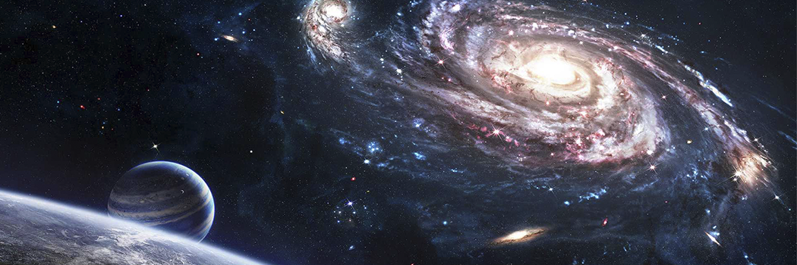

# Quran Project - Appendix - Scientific Miracles of The Quran

- **Category:** 
- **Date:** 16/02/2013
- **Author:** 
- **Source:** https://www.quranproject.org/Quran-Project---Appendix---Scientific-Miracles-of-The-Quran-225-d

## Content

How
 could Prophet Muhammad, may the blessing and mercy of God be upon him, 
have possibly know nall this 1400 years ago, when scientists have only 
recently discovered this using advanced equipment and powerful 
microscopes which did not exist at that time?  Hamm and Leeuwenhoek were
 the first scientists to observe human sperm cells (spermatozoa) using 
an improved microscope in 1677 (more than 1000years after Prophet 
Muhammad).  They mistakenly thought that the spermcell contained a 
miniature preformed human being that grew when it was deposited in the 
female genital tract.
Professor
 Emeritus Keith L. Moore is one of the worlds most prominent scientists
 in the fields of anatomy and embryology and is the author of the book 
entitled The Developing Human, which has been translated into eight 
languages.  This book is ascientific reference work and was chosen by a 
special committee in the United States as the best book authored by one 
person.  Dr. Keith Moore is Professor Emeritus of Anatomy and Cell 
Biology at the University of Toronto,Toronto, Canada.  There, he was 
Associate Dean of Basic Sciences at the Faculty of Medicine and for 8 
years was the Chairman of the Department of Anatomy.  In 1984, he 
received the most distinguished award presented in the field of anatomy 
in Canada, the J.C.B. Grant Award from the Canadian Association of 
Anatomists.  He has directed many international associations, such asthe
 Canadian and American Association of Anatomists and the Council of the 
Union of Biological Sciences.
In 1981, during the Seventh Medical Conference in Dammam, Saudi Arabia, Professor Moore said:
It
 has been a great pleasure for me to help clarify statements in the 
Qurān about human development.  It is clear tome that these statements 
must have come to Muhammad from God, because almost all of this 
knowledge was not discovered until many centuries later.  This proves to
 me that Muhammad must have been a messenger of God.
Consequently, Professor Moore was asked the following question:
Does this mean that you believe that the Qurān is the word of God
?  He replied:
I find no difficulty in accepting this
.
During one conference,Professor Moore stated:
....Because
 thestaging of human embryos is complex, owing to the continuous process
 of change during development, it is proposed that a new system of 
classification could be developed using the terms mentioned in the 
Qurān and Sunnah (what Muhammad,may the blessing and mercy of God be 
upon him, said, did, or approved of).  The proposed system is simple, 
comprehensive, and conforms withpresent embryological knowledge.  The 
intensive studies of the Qurān and hadeeth (reliably transmitted 
reports by the Prophet Muhammads companions of what he said, did, or 
approved of) in the last four years have revealed a system for 
classifying human embryos that is amazing since it was recorded in the 
seventh century C.E.  Although Aristotle, the founder of the science of 
embryology, realised that chick embryos developed in stages from his 
studies of hens eggs in the fourth century B.C., he did not give any 
details about these stages.  As far as it is known from the history of 
embryology,little was known about the staging and classification of 
human embryos until the twentieth century.  For this reason, the 
descriptions of the human embryo in the Qurān cannot be based on 
scientific knowledge in the seventh century.  The only reasonable 
conclusion is: these descriptions were revealed to Muhammad from God.  
He could not have known such details because he was an illiterate man 
with absolutely no scientific training
.
"
The Qur'ān is not a book of Science, Philosophy, Geology, History, etc - It is revelation from God as guidance for  Mankind. However, if experts from any of the human sciences were to read it, they would conclude beyond doubt, that the words of the Qur'ān are  not from any human being but from God Almighty.  The field of Science is no different. The Qur'ān contains countless scientific facts which were unknown to man even a hundred years ago, and considering it was  revealed fourteen hundred years ago, clearly and absolutely proves its  divine origin.
The Quran on the Origin of the Universe
The science of modern cosmology, observational and theoretical, clearly  indicates that, at one point in time, the whole universe was nothing but a cloud of smoke (i.e. an opaque highly dense and hot gaseous  composition).   This is one of the undisputed principles of standard  modern cosmology.  Scientists now can observe new stars forming out of  the remnants of that smoke (see figures 1 and 2).
Figure 1: A new star forming out of a cloud of gas and dust (nebula), which is one of the remnants of the smoke that was the origin of the whole  universe. (The Space Atlas, Heather and Henbest, p. 50.)
Figure 2: The Lagoon nebula is a cloud of gas and dust, about 60 light years  in diameter.  It is excited by the ultraviolet radiation of the hot  stars that have recently formed within its bulk. (Horizons, Exploring  the Universe, Seeds, plate 9, from Association of Univer-sities for  Research in Astronomy, Inc.)
The illuminating stars we see at night were, just as was the whole  universe, in that smoke material. God has said in the Qurān:
Then He directed Himself to the heaven while it was smoke...
Qurān 41:11
Because the earth and the heavens above (the sun, the moon, stars, planets,  galaxies, etc.) have been formed from this same smoke, we conclude  that the earth and the heavens were one connected entity.  Then out of  this homogeneous smoke, they formed and separated from each other. God has said in the Qurān:
Have those who disbelieved not considered that the heavens and the earth  were a joined entity, and We separated them and made from water every  living thing? Then will they not believe?
Qurān 21:30
We know that our world, the sun and the stars did not come about  immediately after the primeval explosion. For the universe was in a  gaseous state before the formation of the stars. This gaseous state was  initially made of hydrogen and helium. Condensation and compression  shaped the planets, the earth, the sun and the stars that were but  products of the gaseous state. The discovery of these phenomena has been rendered possible thanks to successive findings as a result of  observations and theoretical developments.
The knowledge of all contemporary communities during the time of the  Prophet would not suffice for the assertion that the universe had once  been in a gaseous state. The Prophet himself did not claim to be the  author of the statements in the Qurān as it often reminded, declaring  that he is simply a messenger of God.
That is from the news of the unseen which We reveal to you, [O Muhammad].  You knew it not, neither you nor your people, before this. So be  patient; indeed, the [best] outcome is for the righteous.
Qurān 11: 49
Dr. Alfred Kroner is one of the worlds renowned geologists from Johannes Gutenberg University in Germany. He said:
Thinking where Muhammad came from . . . I think it is almost impossible that he  could have known about things like the common origin of the universe,  because scientists have only found out within the last few years, with  very complicated and advanced technological methods, that this is the  case.Somebody who did not know something about nuclear physics fourteen hundred years ago could not, I think, be in a position to find out from his own mind, for instance, that the earth and the heavens had the same origin.
[1]
The Quran on the 'Big Bang' Theory
Have those who disbelieved not considered that the heavens and the earth  were a [ratq] joined entity, and We [fataqa] separated them.Then will  they not believe?
Qurān 21:30
The word
ratq
translated as sewn to means mixed in each, blended in Arabic. It is used to refer to two different substances that make up a whole. The  phrase
fataqa
is unstitched and implies that something comes into being by tearing  apart or destroying the structure of things that are sewn to one  another.
In the verse, heaven and earth are at first subject to the status of
ratq.
They are separated (
fataqa
) with one coming out of the other. Intriguingly, when we think about the first moments of the Big Bang we see that the entire matter of the  universe collected at one single point. In other words, everything  including the heavens and earth which were not created yet were in an  interwoven and inseparable condition. Then, this point exploded  violently, causing its matter to disunite.
The Big Bang theory holds that about 20,000,000,000 years ago the  universe began with the explosive expansion of a single, extremely  condensed state of matter. The Nobel Prize for science in 1977 was  awarded for this discovery, whereas it was stated by the Qurān  centuries before.
The Quran on the Expanding Universe
And the heaven We constructed with strength, and indeed, We are [its] expander.
Qurān 51: 47
It was only after the development of the radio telescope in 1937 that the  expansion of the universe was observed and established. While observing  the sky with a telescope, Edwin Hubble, the American astronomer,  discovered that the stars and galaxies were constantly moving away from  each other. This discovery is regarded as one of the greatest in the  history of astronomy. During these observations, Hubble established that the stars emit a light that turns redder according to their distance.
That is because according to the known laws of physics, light heading  towards a point of observation turns violet, and light moving away from  that point assumes a more reddish hue. During his observations, Hubble  noted a tendency towards the colour red in the light emitted by stars.  In short, the stars were moving further and further away, all the time.  The stars and galaxies were not only moving away from us, but also from  each other. A universe where everything constantly moves away from  everything else implied a constantly expanding universe.
The Quran on the Orbital Movement of the Sun and the Moon
And it is He who created the night and the day and the sun and the moon;  all [heavenly bodies] in an [falak] orbit are [yasbahoon] swimming.
Qurān 21: 33
It is not allowable [i.e., possible] for the sun to reach the moon, nor  does the night overtake the day, but each, in an [falak] orbit, is  [yasbahoon] swimming.
Qurān 36: 40
The Arabic words used in these verses are
falak
and
yasbahoon
which can be translated as sphere or orbit and swimming. This concept of  the movement of the sun and the moon and the other planets is in perfect harmony with recent discovery. It is inconceivable that an Arab, living centuries ago in the most primitive part of the world, could have  rightly used such a specific term to describe the movements of planets  without divine guidance. It should be noted that the discovery of the  orbital movement of all celestial bodies was due to the invention of  telescopes.
The Quran on Duality in Creation
Exalted is He who created all pairs - from what the earth grows and from them-selves and from that which they do not know.
Qurān 36: 36
This Qurānic verse outlines the fact that all creatures, whether living  beings or solid matter, are created in pairs. It refers to everything  that was created. Amazingly, the outstanding truth and generality of  this and similar verses came to be gradually realised, and more so  recently, during 14 centuries since the Qurān was first revealed in a  primitive world.
Millions of animal species discovered, classified and investigated only during  the last two centu-ries, were found to be invariably in "pairs," male  and female. Electron microscopy has clarified that all living creatures, however minute, are in pairs. The smallest microbes, viruses, and  bacteria have their counterpart antibodies.
Take for example DNA  it is made up of thousands of different genes, and  genes are made up of base pairs. These "base pairs" are made of two  paired up nucleotides. In order to form a base pair, we need to pair up  specific nucleotides. Each type of nucleotide has a specific shape, so  only certain combinations fit.
The sequence, composition, and orientation of these "pairs" of nucleotides  control the genetic information carried by the DNA. A chromosome  consists of different types of protein bound tightly with a single DNA  molecule chain.
The DNA is a large long (up to 1 meter long) amino acid chain. It consists  of a "pair" of spiral strands, connected with steps. Each step consists  of a "pair" of chemical components, so-called nucleotides.
There are 4 nucleotides. Adenine, Thymine, Guanine and Cytosine represented  respectively by the letters A,T,G and C. Due to their shapes only A and T or G and C fit into one another.
Base Pairs
[A-T, G-C] (billions of these
matching pairs
) --->
Genes
(thousands of these) -->DNA -->
Chromosomes
-->Nucleotides -->
Nucleus
(the �brain� of the cell). [1]
All life systems including plant, animal and human consist of different  types of cells. A cell consists of a nucleus surrounded with cytoplasm  which is usually enclosed, within a cell wall. The cell nucleus, carries the chromosomes that control all the cell functions. All cells of a  particular organism have exactly the same number of chromosomes; the  number varies widely between different species. Proteins are formed from various combinations of amino acids. Specifically, 20 types of amino  acid are used in different combinations to form more than a million  types of protein, present in a human being. Every type of amino acid can exist in either of a pair of structures (right-handed isomer or  left-handed isomer), with opposite polarised light rotation direction.  The same applies to the proteins formed thereof.
The wide variety of creatures including living species, solid matter,  liquids and gases are marvellous combinations of the same list of  building blocks: atoms. These basic units, were long known to consist of a "pair" of a positively charged nucleus surrounded by negative  electrons. The nucleus consists of protons that carry the positive  charge, together with neutrons. Even the neutral neutrons have their  counterpart, the anti-neutrons. Later advances in nuclear physics has  demonstrated that each of these particles is, in effect, a complex  structure of much smaller nuclear particles. Over 200 of such elementary particles are now known.
At the atomic level, atoms can, literally, ionise i.e. either lose or gain electrons to form positive cations or negative anions. "Pairs" of  cations/anions combine to produce the wide variety of chemical  (inorganic) compounds. This is one of the conclusions made by British  physicist Paul Dirac, winner for Nobel Prize for Physics in 1933. His  finding, known as "parity," revealed the duality known as matter and  anti-matter.
Another example of duality in creation is plants. Botanists only discovered  that there is a gender distinction in plants some 100 years ago. Yet,  the fact that plants are created in pairs was revealed in the verses of  the Qurān 1,400 years ago. It was only after the discovery of  microscopes that human beings knew that plants have male organs  (stamens) and female organs (ovaries) and that the wind, together with  other factors, carries the pollen from one type to the opposite one so  that reproduction can take place.
Every animal species of the wide animal kingdom reproduce sexually. Sexual  reproduction results from the combination of a female ovum and a male  sperm. The formation of this zygote "pair" is the starting point in the  reproduction cycle. The sperms, in turn are of "two" kinds, the first  carries the hereditary male characteristics, while the other carries the female ones. Flowering plants, of which more than 250,000 have been  discovered so far, also reproduce sexually. They have both female  (ovaries containing eggs) and male (stamens carrying pollens); either  combined in the same flower or in different flowers. In the latter case, fertilization occurs when pollens are transferred by wind or insects to an adjacent flower.
Non-flowering plants, on the other hand, amounting to 150,000 species, reproduce in a double-stage cycle of sexual and asexual reproduction. Yet, the asexual reproduction stage is essentially a process of breaking up the DNA  "pair" of strands into two; followed by each of which re-forming its  complementary strand. Thus, a new "pair" of identical DNA molecules  results in the cell, just before it divides into a "pair" of identical  cells. The same applies to the asexual reproduction of bacteria.
Each bacterium consists of a single cell, the smallest biological unit able  to function independently. A single bacterium reproduces the same way  explained above, i.e. by splitting into a pair of identical cells. As we have seen, cell division occurs through the process of DNA replication, in which the two strands of the DNA molecules are separated; and each  strand resynthesises a complementary strand to itself. So, "asexual"  reproduction of bacteria involves the DNA "pair" of strands splitting  and reformation into a new "pair" of cells.
The Quran on the Origin of Life in Water
Have those who disbelieved not considered that the heavens and the earth  were a joined entity, and We separated them and made from water every  living thing? Then will they not believe?
Qurān 21:30
The origin of life is now such a basic scientific fact that it is accepted  without hesitation. This could lessen ones appreciation for these  verses. Yet it must be borne in mind that the Arabian peninsula is a  desert land without a single lake or river, these verses describe  something unimaginable to those at the time of the Prophet Muhammad.
A point to note - animals in dry regions have been created with  mechanisms to protect their metabolisms from water loss and to ensure  maximum benefit from water use. If water loss takes place in the  body  for any reason, and if that loss is not made good, death will result in a few days.
The Quran on Seas and Rivers
Modern Science has discovered that in the places where two different seas meet, there is a barrier between them.  This  barrier divides the two seas so that each sea has its own temperature,  salinity, and density.  For example, Mediterranean sea water is warm,  saline, and less dense, compared to Atlantic ocean water.  When  Mediterranean sea water enters the Atlantic over the Gibraltar sill, it  moves several hundred kilometers into the Atlantic at a depth of about  1000 meters with its own warm, saline, and less dense characteristics.   The Mediterranean water stabilises at this depth  (see figure 1).
Figure 1:
The Mediterranean sea water as it enters the Atlantic over the  Gibraltar sill with its own warm, saline,and less dense characteristics, because of the barrier that distinguishes between them.  Temperatures  are in degrees Celsius (C�). (Marine Geology, Kuenen, p. 43, with a  slight enhancement.)
Although there are large waves, strong currents and tides in these seas, they do not mix or transgress this barrier.
The Qurān mentioned that there is a barrier between two seas that meet and that they do not transgress.  God has said:
He released the two seas, meeting [side by side]; Between them is a barrier [so] neither of them transgresses.
Qurān 55:19-20
But when the Qurān speaks about the divider between fresh and salt water,  it mentions the existence of a forbidding partition with the barrier.  God has said in the Qurān:
And it is He who has released [simultaneously] the two seas, one fresh and  sweet and one salty and bitter, and He placed between them a barrier and prohibiting partition.
Qurān
25:53
One may ask, why did the Qurān mention the partition when speaking about  the divider between fresh and salt water, but did not mention it when  speaking about the divider between the two seas?
Modern science has discovered that in estuaries, where fresh (sweet) and salt  water meet, the situation is somewhat different from what is found in  places where two seas meet.  It has been discovered that what  distinguishes fresh water from salt water in estuaries is a pycnocline  zone with a marked density discontinuity separating the two layers. This partition (zone of separation) has a different salinity from the  fresh water and from the salt water (see figure 2).
Figure 2: Longitudinal section showing salinity (parts per thousand �) in an  estuary.  We can see here the partition (zone of separation) between the fresh and the salt water.
This information has been discovered only recently, using advanced equipment to measure tem-perature, salinity, density, oxygen dissolubility, etc.  The human eye cannot see the difference be-tween the two seas that  meet, rather the two seas appear to us as one homogeneous sea.   Likewise, the human eye cannot see the division of water in estuaries  into the three kinds: fresh water, salt water and the partition (zone of separation).
God has said in the Qurān:
Or [they are] like darknesses within an unfathomable sea which is covered  by waves, upon which are waves, over which are clouds - darknesses, some of them upon others. When one puts out his hand [therein], he can  hardly see it.
Qurān 24:40
This verse mentions the darkness found in deep seas and oceans, where if a  man stretches out his hand, he cannot see it.  The darkness in deep seas and oceans is found around a depth of 200 meters and below.  At this  depth, there is almost no light (see figure 3).  Below a depth of 1000  meters there is no light at all.   Human beings are not able to dive  more than forty meters without the aid of submarines or special  equipment.  Human beings cannot survive unaided in the deep dark part of the oceans, such as at a depth of 200 meters.
Figure 3: Between 3 and 30 percent of the sunlight is reflected at the sea  sur-face. Then almost all of the seven colours of the light spectrum are absorbed one after another in the first 200 meters, except the blue  light. (Oceans, Elder and Pernetta, p. 27.)
Scientists have recently discovered this darkness by means of special equipment  and submarines that have enabled them to dive into the depths of the  oceans.
We can also understand from the following sentences in the previous verse, ...in a deep sea.  It is covered by waves, above which are waves,  above which are clouds...., that the deep waters of seas and oceans are covered by waves, and above these waves are other waves.  It is clear  that the second set of waves are the surface waves that we see, because  the verse mentions that above the second waves there are clouds.  But  what about the first waves?  Scientists have recently discovered that  there are internal waves which occur on density interfaces between  layers of different densities.  (see figure 4).
Figure 4: Internal waves at interface be-tween two layers of water of  different den-sities.  One is dense (the lower one), the other one is  less dense (the upper one).
The internal waves cover the deep waters of seas and oceans because the  deep waters have a higher density than the waters above them.  Internal  waves act like surface waves.  They can also break, just like surface  waves.  Internal waves cannot be seen by the human eye, but they can be  detected by studying temperature or salinity changes at a given  location.
Miracle of Iron
Iron is one of the elements highlighted in the  Qurān. In the chapter known Al-Hadeed, meaning Iron, we are informed:
And We sent down iron, wherein is great military might and benefits for the people, and so that God may make evident those who support Him and His  messengers unseen. Indeed, God is Powerful and Exalted in Might.
Qurān 57:25
The word anzalna, translated as sent down and used for iron in the  verse, could be thought of having a metaphorical meaning to explain that iron has been given to benefit people. But, when we take into  consideration the literal meaning of the word, which is, being  physically sent down from the sky, as this word usage had not been  employed in the Qur�ān except literally, like the descending of the rain or revelation, we realise that this verse implies a very significant  scientific miracle. Because, modern astronomical findings have disclosed that the iron found in our world has come from giant stars in outer  space.
Not only the iron on earth, but also the iron in the entire Solar System,  comes from outer space, since the temperature in the Sun is inadequate  for the formation of iron. The sun has a surface temperature of 6,000  degrees Celsius and a core temperature of approximately 20 million  degrees. Iron can only be produced in much larger stars than the Sun,  where the temperature reaches a few hundred million degrees. When the  amount of iron exceeds a certain level in a star, the star can no longer accommodate it and it eventually explodes in what is called a "nova" or a "supernova." These explosions make it possible for iron to be given  off into space.
One scientific source provides the following information on this subject:
There is also evidence for older supernova events: Enhanced levels of iron-60 in deep-sea sediments have been interpreted as indications that a  supernova explosion occurred within 90 light-years of the sun about 5  million years ago. 60 is a radioactive isotope of iron, formed in  supernova explosions, which decays with a half life of 1.5 million  years. An enhanced presence of this isotope in a geologic layer  indicates the recent nucleosynthesis of elements nearby in space and  their subsequent trans-port to the earth (perhaps as part of dust  grains).
All this shows that iron did not form on the Earth, but was carried from  Supernovas, and was "sent down," as stated in the verse. It is clear  that this fact could not have been known in the 7th century, when the  Qurān was revealed. Nevertheless, this fact is related in the Qurān,  the Word of God, Who encompasses all things in His infinite knowledge.  The fact that the verse specifically mentions iron is quite astounding,  considering that these discoveries were made at the end of the 20th  century. In his book Natures Destiny, the well-known microbiologist  Michael Denton emphasises the importance of iron:
Of all the metals there is none more essential to life than iron. It is  the accumulation of iron in the center of a star which triggers a  supernova explosion and the subsequent scattering of the vital atoms of  life throughout the cosmos. It was the drawing by gravity of iron atoms  to the center of the primeval earth that generated the heat which caused the initial chemical differentiation of the earth, the out-gassing of  the early atmosphere, and ultimately the formation of the hydrosphere.  It is molten iron in the center of the earth which, acting like a  gigantic dynamo, generates the earths magnetic field, which in turn  creates the Van Allen radiation belts that shield the earths surface  from destructive high-energy-penetrating cosmic radiation and preserve  the crucial ozone layer from cosmic ray destructionWithout the iron  atom, there would be no carbon-based life in the cosmos; no supernova,  no heating of the primitive earth, no atmosphere or hydrosphere. There  would be no protective magnetic field, no Van Allen radiation belts, no  ozone layer, no metal to make hemoglobin [in human blood], no metal to  tame the reactivity of oxygen, and no oxidative metabolism The  intriguing and intimate relationship between life and iron, between the  red colour of blood and the dying of some distant star, not only  indicates the relevance of metals to biology but also the bio-centricity of the cosmos.
This account clearlyindicates the importance of the iron atom. The fact that particular attentionis drawn to iron in the Qurān also emphasises the  importance of the element.
And We sent down iron, wherein is great military might and benefits for the people, and so that God may make evident those who support Him and His  messengers unseen. Indeed, God is Powerful and Exalted in Might.
Qurān 57:25
Zaghloul El-Naggar, professor of earth science and geology, has an interesting  theory. He con-cludes that the Qurānic account of the celestial origin  of iron is coupled by another miraculous aspect which is represented by  the fact that the number of both the Qurānic chapter on iron and of the verse that mentions this element in the same chapter precisely  correspond to both the atomic weight (55.847 or roughly 56) and the  atomic number (26) of iron, respectively.
Indeed the number of sūrah al-Hadeed (the Qurānic Chapter on Iron) is "57"  and the number of the verse is "25, but the Qurān in its text  separates its introduction (Surat Al-Fātihah or the Opening) from the  rest of the Book, and considers the "Basmalah" (In the Name of God, the  Most Compassionate, the Most Merciful) as a Qurānic verse at the  beginning of this sūrah (Al-Fātihah) and of every other Qurānic sūrah  where it is mentioned.
Taking this Qurānic direction into consideration, the number of sūrah  al-Hadeed becomes "56" which is the closest figure to the atomic weight  of the most abundant iron isotope (55.847), and the number of the verse  becomes "26" which is the exact atomic number of iron. The existence of  an iron isotope with the atomic weight of 57 also fits very well with  the current numbering of the chapter on iron in the Glorious Qurān.  [God knows better]
The Quran on Mountains
The book entitled Earth is a basic reference  textbook in many universities around the world.  One of its two authors  is Professor Emeritus Frank Press.  He was the Science Advisor to former US President Jimmy Carter, and for 12 years was the President of the  National Academy of Sciences, Washington, DC. His book says that  mountains have underlying roots.  These roots are deeply embedded in the ground, thus, mountains have a shape like a peg (see figures 1, 2 and  3).
Figure 1
: Mountains have deep roots underthe surface of the ground.
Figure 2:
Schematic section. The mountains, like pegs, have deep roots embedded in the ground
.
Figure3:
Another illustration shows how the mountains are peg-like in shape, dueto their deep roots.
This is how the Qurān has described mountains. God has said in the Qurān:
Have We not made the earth a resting place? And the mountains as stakes (pegs)?
Qurān 78: 6-7
Modern earth sciences have proven that mountains have deep roots under the  surface of the ground (see figure 3) and that these roots can reach  several times their elevations above the surface of the ground.  So the  most suitable word to describe mountains on the basis of this  information is the word peg, since most of a properly set peg is  hidden under the surface of the ground.  The history of science tells us that the theory of mountains having deep roots was introduced only in  the latter half of the nineteenth century.
Mountains also play an important role in stabilising the crust of the earth.   They hinder the shaking of the earth.  God has said in the Qurān:
And He has cast [fi] into the earth firmly set mountains, lest it shift  with you, and [made] rivers and roads, that you may be guided.
Qurān 16: 15
Likewise, the modern theory of plate tectonics holds that mountains work as  stabilisers for the earth. This knowledge about the role of mountains as stabilisers for the earth has just begun to be understood in the  framework of plate tectonics since the late 1960s.
Could anyone during the time of the Prophet Muhammad have known of the true  shape of mountains?  Could anyone imagine that the solid massive  mountain which he sees before him actually extends deep into the earth  and has a root, as scientists assert?  A large number of books of  geology, when discussing mountains, only describe that part which is  above the surface of the earth.  This is because these books were not  written by specialists in geology.  However, modern geology has  confirmed the truth of the Qurānic verses.
The Quran on Human Embryonic Development
In the Holy Qurān, God speaks about the stages of mans embryonic development:
And certainly did We create man from an extract of clay.  Then We placed  him as a sperm-drop [nutfah] in a firm lodging [i.e., womb].  Then We  made the sperm-drop into a clinging clot [alaqah], and We made the clot  [alaqah] into a lump [of flesh], and We made [from] the lump, bones, and We covered the bones with flesh; then We developed him into another  creation. So blessed is God, the best of creators."
Qurān 23:12-14
Nutfah and Manii
The Nutfah literally means a [single] drop of fluid whereas Manii means semen.
In the Qurān and hadith, Nutfah is used in three different but interwoven connotations:
1.    The Male Nutfah
2.    The Female Nutfah
3.    Nutfah Amshaj  mixed or mingled Male and Female Nutfah
In the male context, the Nutfah is a single particle from the Manii when  it is ejaculated  i.e. a single cell [sperm] from amongst the 200-300  million sperm cells. The word Nutfah was mentioned twelve different  times in the Qurān and the word Manii was mentioned thrice.
The Male Nutfah
Does man think that he will be left neglected? Had he not been a sperm  [nutfah] from semen [manii] emitted? Then he was a clinging clot  [alaqah], and [God] created [his form] and proportioned [him]. And made  of him two mates, the male and the female. Is not that [Creator] Able to give life to the dead?
Qurān 75:36-40
And that He creates the two mates - the male and female - From a sperm-drop [nutfah] when it is emitted.
Qurān 53:45-46
In these ayats, there are a lot of facts that require careful  consideration. We know the sex of the new born is determined by the male - it is definitively stated that the male and female are fashioned from a sperm-drop from the semen that has been ejaculated. We know that the  sex of the new born is determined by the sperm which will fertilise the  ovum. If the sperm carrying an X chromosome fertilises an ovum [which  always contains an X chromosome], the offspring will be a girl, while if the fertilising sperm contains a Y chromosome, the offspring will be a  boy.
The Qurān has stated this fact 1400 years ago, before anybody knew anything about X and Y chromosomes.
The Female Nutfah
The Female Nutfah [ovum] per se is not mentioned explicitly in the Qurān  but is inferred in the term Nutfah Amshaj  i.e. mingled from both male  and female. However, it is clearly stated in the hadith from the  Prophet.
A Jew came to the Prophet and asked, O Muhammad. Tell me from what thing man is created. The Prophet said, O Jew. From both Male and Female  Nutfah man is created. [Musnad Ahmad]
This is a very astonishing revelation, as it is only recently that we came  to know that both male and female cells [sperm and ovum] join together  to form the human zygote  a fact not known before the 19th century.
The Role of Genes
From what substance did He create him? From a sperm-drop
[nutfah]
He created him and destined
[qadr]
for him.
Qurān 80:18-19
In a single Male Nutfah [sperm cell], which measures 60 microns [1 micron = 1/1000 mm], there are 23 Chromosomes  long spiral double strand helix. They contain the genes which determine every type of characteristics  the body has like hair colour, skin type, etc.
Hence, it is within this Nutfah that God has determined and destined all the  physical character-isitics that an individual has. It is amazing that  the description of these realities are so accurately stated by God in  the Qurān.
The Prophet said, God has ordained an angel that accompanies the different stages of development of the Nutfah. The Alaqa, the Mudgha and in every stage he asks God, O God, what to do next? If God determines its full development, the angel asks, Is it a boy or a girl? Happy or unhappy,  his livelihood and his life span. All is written [determined] while he  is in mothers womb. [Bukhari]
Alaqah
And certainly did We create man from an extract of clay. Then We placed him as a sperm-drop [nutfah] in a firm lodging [womb]. Then We made the  sperm-drop [nutfah] into a clinging clot [alaqah], and We made the clot  [alaqah] into a lump [of flesh - mudghah], and We made [from] the lump  [mudghah], bones, and We covered the bones with flesh; then We developed him into another creation. So blessed is God, the best of creators.
Qurān 23:12-14
Literally, the Arabic word
alaqah
has three meanings:
(1) leech,
(2) suspended thing and :
(3) blood clot.
In comparing a leech to an embryo in the
alaqah
stage, we find similarity between the two  as we can see in figure 1.  Also, the embryo at this stage obtains nourishment from the blood of the mother, similar to the leech, which feeds on the blood of others.
Figure 1: Drawings illustrating the similarities in appearance between a leech and a
human embryo at the alaqah stage.
X-ray of
alaqah
on day 23
The second meaning of the word alaqah is suspended thing.  This is what  we can see above the suspension of the embryo, during the alaqah stage,  in the womb of the mother.
Figure 2: We can see in this diagram the suspension of an embryo during the
alaqah stage in the womb (uterus) of the mother.
Figure 3: In this photomicrograph, we can see the suspension of an embryo  (marked B) during the alaqah stage (about 15 days old) in the womb of  the mother.  The actual size of the embryo is about 0.6 mm.
The third meaning of the word alaqah is blood clot.  We find that the  external appearance of the embryo and its sacs during the alaqah stage  is similar to that of a blood clot.  This is due to the presence of  relatively large amounts of blood present in the embryo during this  stage (see figure 4). Also during this stage, the blood in the embryo  does not circulate until the end of the third week. Thus, the embryo at  this stage is like a clot of blood.
Figure 4: Diagram of the primitive cardiovascular system in an embryo during  the alaqah stage.  The external appearance of the embryo and its sacs is similar to that of a blood clot, due to the presence of relatively  large amounts of blood present in the embryo.
So the three meanings of the word alaqah correspond accurately to the  descriptions of the embryo at the alaqah stage.
Mudghah
The next stage mentioned in the verse is the mudghah stage.  The Arabic  word mudghah means chewed substance.  If one were to take a piece of  gum and chew it in his or her mouth and then compare it with an embryo  at the mudghah stage, we would conclude that the embryo at the mudghah  stage acquires the appearance of a chewed substance.  This is because of the somites at the back of the embryo that somewhat resemble  teeth-marks in a chewed substance.  (see figures 5 and 6).
Figure 5: Top left photograph of an embryo at the mudghah stage (28 days  old).  The embryo at this stage acquires the appearance of a chewed  substance, because the somites at the back of the embryo somewhat  resemble teeth marks in a chewed substance.  The actual size of the  embryo is 4 mm.
Figure 6: When comparing the  ap-pearance of an embryo at the mudghah stage  with a piece of gum that has been chewed, we find similarity between the two.
A. Drawing of an embryo at the mudghah stage. We can see here the somites  at the back of the embryo that look like teeth marks. ( Moore and  Persaud, The Developing Human, 5th ed., p. 79.)
B.  Photograph of a piece of gum that has been chewed
.