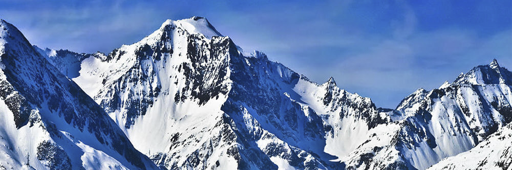

# Qur'anic Verses with Basic Geologic Concepts of Mountains

- **Category:** 
- **Date:** 31/03/2013
- **Author:** 
- **Source:** https://www.quranproject.org/Quranic-Verses-with-Basic-Geologic-Concepts-of-Mountains-445-d

## Content

In 12 distinctive verses, the Qur’an (which is principally a book of divine guidance) outlines the basic geologic concepts of mountains as follows:
That mountains are not just the lofty elevations seen on the surface of the Earth, but their downward extensions in the Earth’s lithosphere (in the form of pegs or pickets) is highly emphasized. In as much as most of the picket (or peg) is hidden in either soil or rock to hold one end of the tent to the ground surface, most of the mountain must be hidden in the Earth’s lithosphere. The term “picket” or “peg” is both literally and scientifically more correct than the term “root” which is currently used for mountains. In Chapter 78 (I), verses nos. 6 and 7, the Qur’an reads:
"Have We not made the earth as a bed, And the mountains as pegs?"
In 10 other verses, the Qur’an emphasizes the role of mountains as stabilizers for the Earth’s outer surface (or lithosphere). These verses read:
" And it is He Who spread out the earth, and placed therein firm mountains and rivers and of every kind of fruits He made Zawjain Ithnain (two in pairs-may mean two kinds or it may mean: of two varieties, e.g. black and white, sweet and sour, small and big).He brings the night as a cover over the day. Verily, in these things, there are Ayat (proofs, evidences, lessons, signs, etc.) for people who reflect." (II);
"And the earth We have spread out, and have placed therein firm mountains, and caused to grow therein all kinds of things in due proportion." (Surat Al-Hijr (III);
"And He has affixed into the earth mountains standing firm, lest it should shake with you; and rivers and roads, that you may guide yourselves." (Surat An-Nahl (IV);
"And We have placed on the earth firm mountains, lest it should shake with them, and We placed therein broad highways for them to pass through, that they may be guided." (V);
"Is not He (better than your gods) Who has made the earth as a fixed abode, and has placed rivers in its midst, and has placed firm mountains therein, and has set a barrier between the two seas (of salt and sweet water).Is there any ilah (god) with Allah? Nay, but most of them know not." (VI);
"He has created the heavens without any pillars, that you see and has set on the earth firm mountains, lest it should shake with you. And He has scattered therein moving (living) creatures of all kinds. And We send down water (rain) from the sky, and We cause (plants) of every goodly kind to grow therein." (VII);
"He placed therein (i.e. the earth) firm mountains from above it, and He blessed it, and measured therein its sustenance (for its dwellers) in four Days equal (i.e. all these four days were equal in the length of time) for all those who ask (about its creation)." (VIII);
"Have they not looked at the heaven above them, how We have made it and adorned it, and there are no rifts in it?" (IX);
"Have We not made the earth a receptacle? For the living and the dead. And have placed therein firm, and tall mountains; and have given you to drink sweet water?" (X);
"And after that He spread the earth; And brought forth therefrom its water and its pasture; And the mountains He has fixed firmly; (To be) a provision and benefit for you and your cattle." (XI);
To elaborate on this function of mountains as stabilizers for the Earth, Prophet Muhammad (Pbuh) is reported to have said,
“When Allah created the Earth, its surface started to move and shake and then Allah stabilized it by mountains."
(Imam Ahmad, Musnad 3/124)
In the twelfth verse of this group, the Qur’an is asking people to contemplate a number of phenomena in Allah’s creation, including how mountains are set up. Such speculation has led to the theory of Isostasy which can explain how mountains are made to stand on the surface of the Earth. The Qur’an reads:
"Do they not look at the camels, how they are created? And at the heaven, how it is raised? And at the mountains, how they are rooted and fixed firm? And at the earth, how it is spread out? And at the earth, how it is spread out?"(XII);
In another verse
"See you not that Allah sends down water (rain) from the sky, and We produce therewith fruits of various colors, and among the mountains are streaks white and red, of varying colors and (others) very black." (XIII)
, the Qur’an describes mountains as being composed of white and red tracts of various shades of colors and of others that are black and intense in hue. This is probably referring to both continental mountains, (which are dominantly granitic in composition, with overwhelming white and red colors of various shades) and oceanic mountains that are dominantly composed of black colored, basic and ultra basic rocks. Each of these mountain types has got its specific rock (chemical and mineralogical) composition, as well as its specific origin. The Qur’an reads:
"See you not that Allah sends down water (rain) from the sky, and We produce therewith fruits of various colours, and among the mountains are streaks white and red, of varying colours and (others) very black. And likewise of men and Ad-Dawabb {moving (living) creatures, beasts}, and cattle are of various colours. It is only those who have knowledge among His slaves that fear Allah. Verily, Allah is All-Mighty, Oft-Forgiving." (XIV);
In the last verse of this group, the Qur'an emphasizes the fact that mountains are non-stationary bodies that follow the movements of the Earth, as it reads:
"And you will see the mountains and think them solid, but they shall pass away as the passing away of the clouds. The Work of Allah, Who perfected all things, verily! He is Well-Acquainted with what you do." (XV);
(I) (Surat an- Naba’ or The Great News)
(II) (Surat Ar-Ra'd (The Thunder): 3)
(III) (The Rocky Tract): 19)
(IV) (The Bees):15)
(V) (Surat Al-Anbiya (The Prophets):31)
(VI) (Surat An-Naml (The Ants):61)
(VII) (Surat Luqman: 10)
(VIII) (Surat Fussilat (They are explained in detail):10)
(IX) (Surat Qaf: 6)
(X) (Surat Al-Mursalat (Those sent forth):25-27)
(XI) (Surat An-Nazi'at (Those Who Pull Out):30-32)
(XII) (Surat Al-Ghashiyah (The Overwhelming):18-21)
(XIII) (Surat Fatir (The Originator of Creation, or The Angels):27)
(XIV) (Surat Fatir (The Originator of Creation, or The Angels):27-28)
(XV) (Surat An-Naml (The Ants):88)
Source: Dr. Zaghloul El-Naggar [External/non-QP]