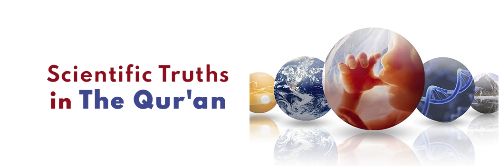

# Scientific Truths in The Qur'an

- **Category:** 
- **Date:** 28/10/2013
- **Author:** 
- **Source:** https://www.quranproject.org/Scientific-Truths-in-The-Quran-518-d

## Content

"And it was not [possible] for this Qur'an to be produced by other than God....there is no doubt [it is] from the Lord of the worlds" -
Qur'an 10:37
Worldwide Launch: Scientific Truths in the Qur'an
In this latest publication from The Qur'an Project we analyse some of the most significant scientific miracles foretold in the Qur'an over 1400 years ago including:
Qur’anic Integrity and Scientific Advancement.
The ‘Big Bang Theory’ - Historic Preamble
The Expanding Universe
Early Universe in a state of ‘Smoke’
The Orbital Movement of the Sun and the Moon
The Spherical Shape of the Earth
The Lowest Point on Earth
The Qur’an on Mountains
The Qur’an on the Origin of Life in Water
The Qur’an on Seas and Rivers
Light and Levels of Darkness in the Oceans
The Qur’an on Duality in Creation
Chlorophyll – The Green Pigment
The Uniqueness of Fingertips
The Skin – Sensation of Pain
Frontal Lobe of the Brain
Behavioural Patterns of Species are like Humans
The Qur’an on Human Embryonic Development
To obtain your copy please click on the download link below
We encourage all to read the book and share it with family and friends - Share the reward!