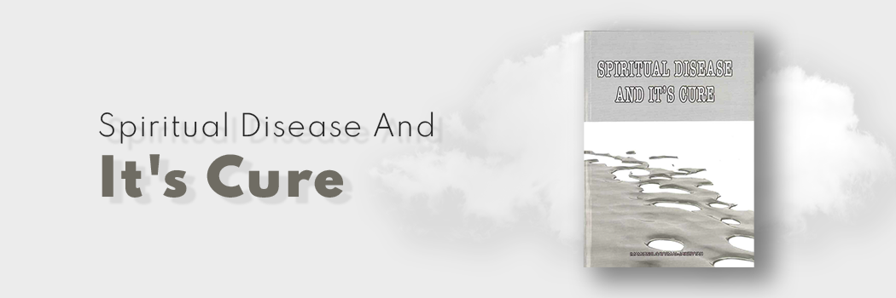

# Spiritual Disease And It's Cure

- **Category:** 
- **Date:** 30/10/2015
- **Author:** 
- **Source:** https://www.quranproject.org/Spiritual-Disease-And-Its-Cure-606-d

## Content

The Imam was asked a long question of which a part was - What is the opinion of the scholars regarding a man who is afflicted by a disease, and knows that if it should continue it would damage his life? The Imam Quoted the Hadith from Sahih Bukhari The prophet (pbuh) said:
"Allah has appointed a remedy for every disease He has sent down"
Imam Ahmad reported on the authority of Usamah bin Shareek that the Prophet said
"Allah has not made a disease without providing a remedy for it, wih the exception of one disease, namely old age"
This Applies to the medicine for the heart, soul and body. The well being of the servant's heart, is far more important than that of his body, for while the well being of his body enables him to lead a life that is free from illnesses in this world, that of the heart ensures him both a fortunate life in this world and eternal bliss in the next.
Imam Ibn al-Qayyim al-Jawziyya was born into a scholarly and virtuous family in 691 AH/ 1292 A.D. At that time Damascus was a centre of literature and thought. Many schools were located there and he studied and graduated under the protection, direction and sponsorship of his father. He was particularly influenced by his Shaykh and teacher Imam Ibn Taymiyyah, and also by Ibn ash-Shirazi amongst others. Ibn al-Qayyim al-Jawziyya died in the city of Damascus the year 751 AH/1350 C.E.,when he was scarcely 60 years old, and was buried at the cemetery of Bab- al-Saghir, near the grave of his father - Rahimahuma Allah.