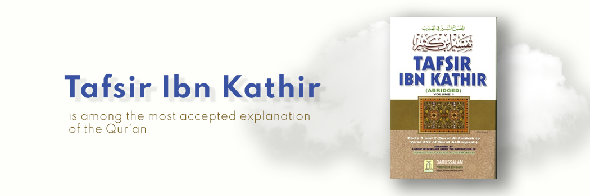

# Tafsir Ibn Kathir

- **Category:** 
- **Date:** 16/02/2013
- **Author:** 
- **Source:** https://www.quranproject.org/Tafsir-Ibn-Kathir-191-d

## Content

The Qur'an is the revelation of Allah's Own Words for the guidance of His creatures. Since the Qur'an is the primary source of Islamic teachings, the correct understanding for the Qur'an is necessary for every Muslim.
The Tafsir of Ibn Kathir is among the most renowned and accepted explanation of the Qur'an in the entire world. In it one finds the best presentation of Hadiths, history, and scholarly commentary.