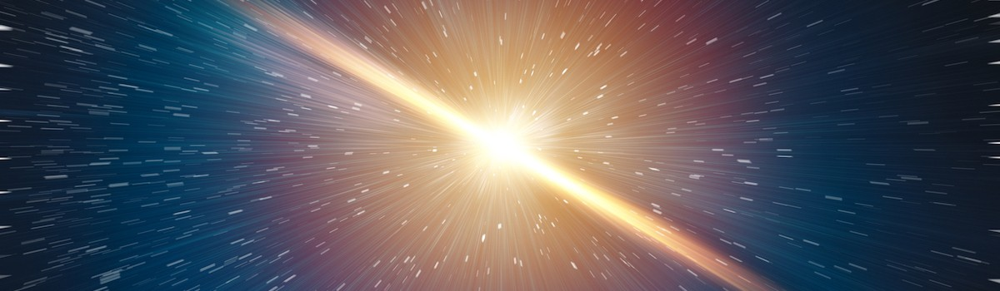

# The Big Bang Theory - Historic Preamble

- **Category:** 
- **Date:** 30/10/2023
- **Author:** 
- **Source:** https://www.quranproject.org/The-Big-Bang-Theory---Historic-Preamble-630-d

## Content

The ‘Big Bang Theory’ - Historic Preamble
The enormously vast universe has been the object of curiosity since time immemorial. Greek philosophers, including Aristotle, believed that the Universe had always existed and would continue to do so eternally. This was also the mainstream view in scientific circles at the beginning of the 20th century, aptly known as the ‘steady state theory’. An eternal state of the universe meant that there was no inherent need for a Creator – for what does not have a beginning does not necessitate a need for a cause. However, advancements in science would shatter this view and fundamentally prove that the Universe had a beginning.
In 1922, physicist Alexander Friedmann, produced computations showing that the structure of the universe was not static and that even a tiny impulse might be sufficient to cause the whole structure to expand or contract according to Einstein’s ‘Theory of General Relativity’. George Lemaitre was the first to recognise the implications of what Friedmann concluded. Lemaitre formulated that the universe had begun in a cataclysmic explosion of a small, primeval atom. He also proposed that the amount of cosmic radiation are the leftover remnants of the initial “explosion.”
The theoretical musings of these two scientists did not attract much attention and probably would have gone ignored except for new observational evidence that rocked the scientific world in 1929. That year, American astronomer Edwin Hubble, made one of the most important discoveries in the history of astronomy. He discovered that galaxies were moving away from us at speeds directly relative to their distance from us and from each other. A universe where everything constantly moves away from everything else implied a constantly expanding universe.
Stephen Hawking writes, ‘The expansion of the universe was one of the most important intellectual discoveries of the 20th century, or of any century.’  Since the universe is constantly expanding, were we to rewind a film [of its history], then necessarily we would find the entire universe was in a joint state, referred to by some as the ‘Primordial Atom’. Many scientists and philosophers resisted the idea of a beginning to the universe because of the many questions that it raised – primarily what or who caused it. However, with Penzias and Wilson’s discovery of microwave radiation emanating from all directions, possessing the same physical characteristics - namely petrified light which came from a huge explosion during the first seconds after the birth of the universe – left little doubt about the fact that the universe had a beginning.
For fourteen hundred years, since the revelation of the Qur’ān, sceptics had trouble understanding the verse, ‘...the heavens and the earth were a joined entity and We separated them...’ [21:30]. However, with the assistance of scientific advancements, we can now understand these verses in a new light which help us piece together the cosmological puzzle. The miraculous nature of the Qur’ān lies in the knowledge it contains. Its verification of scientific facts shows that its message is as applicable to the scientist in his laboratory today as it was to the Bedouin in the desert.
Linguistic Analysis
أَوَلَمْ يَرَ الَّذِينَ كَفَرُوا أَنَّ السَّمَاوَاتِ وَالْأَرْضَ كَانَتَا رَتْقًا فَفَتَقْنَاهُمَا وَجَعَلْنَا
مِنَ الْمَاء كُلَّ شَيْءٍ حَيٍّ أَفَلَا يُؤْمِنُونَ
“Have those who disbelieved not considered that the heavens and the earth were a [ratq] joined entity, and We [fataqa] separated them….Then will they not believe?”
Qur’ān 21:30
The word ‘
ratq
’ translated as ‘sewn to’ means ‘mixed in each, blended’ in Arabic. It is used to refer to two different substances that make up a whole. The phrase ‘
fataqa
’ is ‘unstitched’ and implies that something comes into being by tearing apart or destroying the structure of things that are sewn to one another. In the verse, heaven and earth are at first subject to the status of ‘
ratq
.’ They are separated [
fataqa
] with one coming out of the other. Intriguingly, when we think about the first moments of the ‘Big Bang’ we see that the entire matter of the universe collected at one single point. In other words, everything including ‘the heavens and earth’ which were not created yet were in an interwoven and inseparable condition. Then, this point exploded violently, causing its matter to disunite.