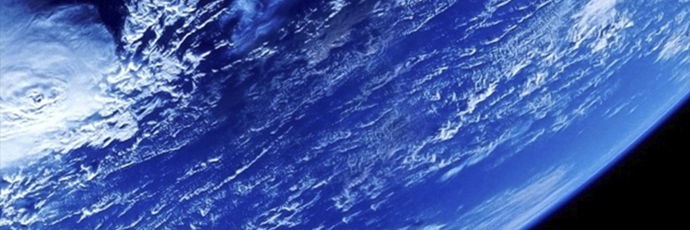

# The Earth, A Living Planet

- **Category:** 
- **Date:** 23/02/2013
- **Author:** 
- **Source:** https://www.quranproject.org/The-Earth-A-Living-Planet-276-d

## Content

The earth has been designed specially for human life, and the intricate balances found on earth and in the universe prove the existence of God, but only for those who truly reflect.
The earth is a living planet where many complex systems run perfectly and continuously, without pause.  When compared to other planets, it is evident that in all its aspects the earth is specially designed for human life.  Built on delicate balances, life prevails in every spot of this planet, from the atmosphere to the depths of the earth.
Exploring only a few of the millions of these delicate balances would be sufficient to show that the world we live in is specially designed for us.
One of the most important balances in our planet is revealed in the atmosphere that surrounds us.  The atmosphere of the earth holds the most appropriate gasses in the most appropriate ratio needed for the survival not only of human beings, but also of all the living beings on the earth.
The 77% of nitrogen, 21% of oxygen and 1% of carbon dioxide as well as other gasses readily available in the atmosphere represent the ideal figures necessary for the survival of living beings.  Oxygen, a gas that is vital for living beings, helps to burn up food and convert it into energy in our bodies.
If the oxygen quantity in the atmosphere were greater than 21%, the cells in our body would soon start to suffer great damage.  The vegetation and hydrocarbon molecules needed for life would also be destroyed.  If this quantity were less, then this would cause difficulties in our respiration, and the food we eat would not be converted into energy.  Therefore, the 21% of oxygen in the atmosphere is the most ideal quantity determined for life.
No less than oxygen, other gasses like nitrogen and carbon dioxide are also arranged in the ideal quantity for the needs of living beings and the continuity of life.  The amount of nitrogen in the atmosphere has the ideal ratio to balance the harmful and burning effects of oxygen.  This ratio represents the most appropriate value required for photosynthesis, which is essential for life’s energy supply on the earth.  Moreover, the amount of carbon dioxide has the most appropriate value needed to maintain the stability of the surface temperature of the earth and to prevent heat loss especially at night time.  This gas, comprising 1% of the atmosphere, covers the earth like a quilt and prevents the loss of heat to space.  If this amount were greater, the temperature of the earth would increase excessively, causing climatic instability and posing a serious threat to the  living beings.
These proportions remain constant thanks to a perfect system.  The vegetation covering the earth converts carbon dioxide to oxygen, producing 190 billion tons of oxygen every day.  The proportion of other gasses is always kept constant on the earth by the help of interconnected complex systems.  Life is thus sustained.
In addition to the establishment of the ideal gas mixture required for life on earth, the mechanisms needed to preserve and maintain this order are created alongside with it.  Any break in the balance, though instantaneous, or any change in the ratios even for a very short time period, would mean the total destruction of life.  Yet, this does not happen.  The formation of these gasses in the atmosphere just in the amount people need, and the constant preservation of these ratios indicate a planned creation.
At the same time, the earth has the ideal size in terms of magnitude to possess an atmosphere.  If the mass of the earth were a little less, then its gravitational force would be insufficient and the atmosphere would be dispersed into space.  If its mass were a little greater, then the gravitational force would be too much and the earth would absorb all gasses in the atmosphere.  There is an incredibly high number of conditions required for the formation of an atmosphere such as the one our world currently has and all of these conditions should exist altogether to be able to talk of life.
The creation of these delicate proportions and balances in the sky is mentioned in the Quran:
“He erected heaven and established the balance.”
(Quran 55:7)
The majority of people spend their lives without being aware of the delicate balances and subtle adjustments in the gas composition of the atmosphere, the distance of the world from the sun or the movements of planets.  They are ignorant of the great significance of these balances and adjustments to their own lives.  However, even a minor deviation in any one of these arrangements would create very severe problems regarding the existence and survival of humankind.
There are many other balances established on earth for the continuity of life:
For instance, if the surface gravity were stronger than its current value, the atmosphere would retain too much ammonia and methane gasses, which would mean the end of life.  If it were weaker, the planet’s atmosphere would lose too much water, and life on earth would be impossible.
The thickness of the earth’s crust constitutes another one of the delicate balances in the earth.  If the earth’s crust were thicker, too much oxygen would be transferred from the atmosphere to the crust and this would have severe effects on human life.
If the opposite were true, that is, if the earth’s crust were thinner, volcanic and tectonic activity would be too great to permit life on earth.
Another crucial balance for human life is the ozone level in the atmosphere.  If it were greater than its current value, the surface temperatures would be too low.  If it were less, surface temperatures would be too high, and there would be too much ultraviolet radiation at the surface.
In fact, the absence of even a single one of these balances would herald the end to life on earth.  However, God has created the universe with infinite wisdom and power and designed the earth especially for human life.  Despite this fact, the majority of people lead their lives in total ignorance of these events.  In the Quran, God reminds people of His:
“(God) makes night merge
into day and day merge into night
, and He has made the sun and moon subservient,
each one running until a specified time.
That is God, your Lord.  The Kingdom is His.  Those you call on besides Him have no power over even the smallest speck.”
(Quran 35:13)
It is sufficient to look at millions of dead planets in space in order to understand that the delicate balances required for life on earth is not a result of random coincidences.  The conditions essential for life are too complicated to have been formed “on their own” and at random, and these conditions are specially created for life alone.
These balances we have briefly described so far are only a few of the millions of intricate, interrelated balances and orders established so that people can live in peace and safety on the earth.
Examining only a part of the balances and harmony on the earth is enough to comprehend the superior being of God and grasp the existence of a planned creation in every detail of the universe.  It is no doubt impossible for a person or any other living being to build such an enormous balance and order.  Nor are the components of this order such as atoms, elements, molecules, and gasses, capable of establishing an order based on such intricate and extremely delicate calculations and measurements, and such fine tunings.  This is because activities like planning, ordering, arranging, calculating, and proportioning can only be realized by beings that possess wisdom, knowledge and power.  The Exalted Being Who orders, plans and balances the entire universe to be fit for life of human beings on a planet like earth and Who sustains it with dramatically delicate measures and balances is God, Who has Infinite Wisdom, Knowledge and Power.
In the Quran, it is stated that those people who are able to realize these facts are the only “people with intelligence”:
“Indeed in the creation of the heavens and the earth, and the alternation of night and day, there are Signs for people with intelligence: those who remember God, standing, sitting and lying on their sides, and reflect on the creation of the heavens and the earth: [They say] ‘Our Lord, You have not created this for nothing.  Glory be to You!  So safeguard us from the punishment of the Fire.”
(Quran 3:190-191)
Source:  www.islamreligion.com [External/non-QP]