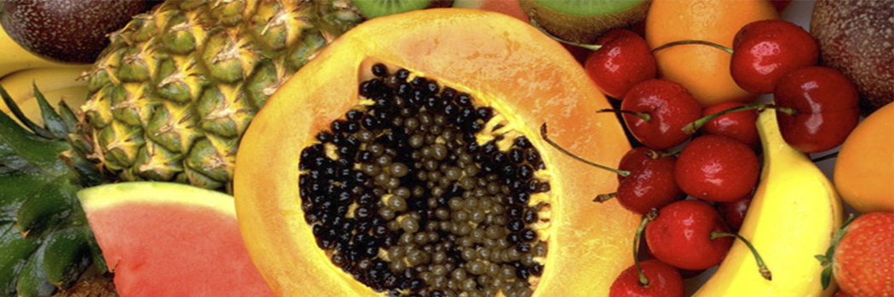

# The Fruits' Colour

- **Category:** 
- **Date:** 20/04/2013
- **Author:** 
- **Source:** https://www.quranproject.org/The-Fruits-Colour-476-d

## Content

“See you not that Allah sends down water (rain) from the sky, and We produce therewith fruits of various colours” (I)
This ayah appears in the second half of Surah Fatir, which was revealed in Makkah. The Surah gets its name, Fatir (Originator), from the opening ayahs which praise Allah (swt), the Originator of the heavens and the earth who made the angels His Messengers, as He is Able to do all things. He is most Gracious in the heavens and the earth; He is the most Merciful, the All-mighty and the All-Wise.
Signs of creation in Surah Fatir:
In Surah Fatir Allah mentions many signs of creation, including the following. The ayahs can be translated as:
"And it is Allah Who sends the winds, so that they raise up the clouds, and We drive them to a dead land, and revive therewith the earth after its death. As such (will be) the Resurrection!" (2)
"And Allah did create you (Adam) from dust, then from Nutfah (male and female discharge semen drops i.e. Adam’s offspring), then He made you pairs (male and female). And no female conceives or gives birth but with His Knowledge. And no aged man is granted a length of life nor is a part cut off from his life (or another man’s life), but is in a Book (Al-Lauh Al-Mahfûz) Surely, that is easy for Allah. And the two seas (kinds of water) are not alike: this is palatable, sweet and pleasant to drink, and that is salt and bitter. And from them both you eat fresh tender meat (fish), and derive the ornaments that you wear. And you see the ships cleaving (the sea-water as they sail through it), that you may seek of His Bounty, and that you may give thanks. He merges the night into the day (i.e. the decrease in the hours of the night is added to the hours of the day), and He merges the day into the night (i.e. the decrease in the hours of the day is added to the hours of the night). And He has subjected the sun and the moon: each runs its course for a term appointed. Such is Allah, your Lord; His is the kingdom. And those, whom you invoke or call upon instead of Him, own not even a Qitmîr (the thin membrane over the date-stone)" (3)
"See you not that Allah sends down water (rain) from the sky, and We produce therewith fruits of various colours, and among the mountains are streaks white and red, of varying colours and (others) very black. And likewise of men and Ad-Dawâbb [moving (living) animals, beasts], and cattle, are of various colours. It is only those who have knowledge among His slaves that fear Allah. Verily, Allah is All-Mighty, Oft-Forgiving" (4)
"Verily! Allah grasps the heavens and the earth lest they should move away from their places, and if they were to move away from their places, there is not one that could grasp them after Him. Truly, He is Ever Most Forbearing, Oft-Forgiving" (V)
Each of the signs mentioned in these ayahs need to be contemplated and considered separately, thus I will limit this discussion to the first part of ayah 27 of this chapter.
I shall start with a brief review of the comments made by a number of scholars commenting on this ayah “See you not that Allah sends down water (rain) from the sky, and We produce therewith fruits of various colours"
Interpretation of this ayah by some scholars
Fi Zilal Al-Qur’an (In the Shade of the Qur’an) states:
“This is only one of the spectacular implications about creation proving the divine origin of this scripture. This particular implication takes in the whole of the earth, including its colours and hues, whether they are found in fruits, mountains, people or animals. It basically encompasses everything on earth and overwhelms the heart with this divine infusion of colours; from the rainfall to the harvest of fruits of different colours. As Allah says what can be translated as: 'We produce therewith fruits of various colours'. The colour of fruit covers a wide range of shades that no artist could ever create. There is no such thing as a fruit species of identical colour, nor do two pieces of fruit from the same tree have exactly the same colour. On closer inspection, we would see there is a slight difference in the colour of the two”
Scientific implications in this ayah
Fruits and botany
The fruit of flowering plants is the fully developed ovary which carries the seeds. It is not affected by changes in the environment around it.
There are different classifications of flowering plants, depending on their fruit structures: some plants have only either male or female reproductive organs and others have both male and female reproductive organs. When the flower is fertilized, the male part merges with the female one. Once they have successfully merged, a plant embryo forms inside the seeds where it is surrounded by the nourishment it requires to grow and is enclosed by a protective shell. Once the fertilized ovum, the seeds or the individual seed it holds inside are fully grown, the tissues of the ovary start to expand. Sometimes other tissues in the flower expand as well, resulting in fruit formation. In order to form the fruit skin, which appears right after the flower petals start to fall, the ovary wall may thicken, harden or remain delicate.
In most flowering plants, after the flower is fertilized and the fruit is formed, other organs start to wither. There are, however, a few exceptions.
The main function of the fruit is to protect the plant’s embryos inside the seeds, providing them with the nourishment they require to grow, enabling these seeds to spread after the fruit ripens or is consumed by people or animals who then discard them on the ground where they start to grow again. Unconsumed fruit may rot or spontaneously open in order to release the seeds which are then carried by the wind, water, man or animals to distant places in order to propagate the plant species.
The difference in the colours of fruits means that they are of different types:
Commenting on Allah’s words that can be translated as "We produce therewith fruits of various colours", Az-Zamakhshari said:
This difference in colours includes differences in types and shapes”. The different types of fruits are too numerous to count, although we may categorize them hierarchically as follows:
1. Simple fruits
These are fruits that develop essentially from a single ovary in a single flower, either from one carpel or from many carpels. Each of these simple fruits contains the embryo of the plant which is surrounded by the nourishment that will suffice it until it is ripe. The remainder is saved for future germinations. The embryo is often surrounded by a number of protective membranes. The embryo, the nourishment surrounding it and the protective coverings are collectively known as the seed or the stone. These embryos stored inside the seeds, pits or stones of plants exist by the will of Allah. Simple fruits are of two types: fleshy and dry. In the former, the embryo is surrounded by three layers: from the inside out they are, a ligneous covering surrounding the seed (or the stone) called the endocarp, a mesocarp, the fleshy covering of the endocarp; this covering is the edible part of the fruit and finally, a delicate outer skin covering the whole fruit which can become thick and waxy when the fruit has fully ripened. These sorts of fruits, such as apricots, peaches, plums, cherry olives, etc., are often called ‘drupes’.
Some simple fleshy fruits are known as ‘pepos’. In this type of fruit, the three layers protecting the embryo maintain their softness even after the fruit is ripe, such as the cucumber, whereas in grapes and tomatoes, the seed coverings are hard. Pepo fruits are of a sebaceous nature; they have numerous seeds inserted within the endocarp substance of the fruit, such as melons, watermelons, oranges and the likes.
Sometimes, organs other than the ovary, such as the receptacle, calyx, the stem or carpels assist in forming the fruit. These fruits can be simple like apples, pears or quinces. In these plants, the receptacle tissue develops and becomes the edible part of the fruit. These are simple accessory fruits because the edible part is the developed receptacle of the flower. These fruits can also be complex as will be mentioned later.
As for the simple dry fruits, the membranes surrounding the embryo are all dry, and the fruits are either dehiscent (they split open when mature) or indehiscent. The castor-oil plant has dehiscent fruit. There is also the primulaceae fruit, which opens in the form of a lid covering a capsule or in the form of pores that penetrate the fruit wall such as the poppy seed, carnation fruit which opens in the form of a capsule with intertwined teeth, cotton fruit with two or more carpels and violets which have sharp, cutting edges. Some of them open on one side lengthwise (brambles) and some of them open on both sides, like vegetables, which is more common. Some take the shape of the mustard family fruits, like watercress and gillyflowers.
As for indehiscent fruits or simple dry fruits, the excerpt of the fruit remains closed and the seeds cannot be exposed unless the wall of the fruit splits or decays. The wall could be of wood, such as hazelnuts, almonds, walnuts, and pecans. Sometime the wall of the fruit is attached to the seed, as one finds in wheat. The outer layer is sometimes leathery and is not joined with the seed as is the case of roses.
2. Multiple Fruits
These fruits consist of the matured ovaries of several to many flowers united in a cluster. Among this group we have strawberries, raspberries and custard apples.
3. Aggregate Fruits
This group contains fruits that develop from multiple flowers aggregated over the surface of a single receptacle. These complex fruits contain leaves, stems, and ovaries that contain the plant embryos. Examples of these compound fruits are figs, berries, sycamores and pineapples. They are considered to be “false” fruits because the fruit is formed by a combination of many parts of the flower along with the ovaries.
The term “fruit” can be expanded to include any part of the plant that can be consumed without the flower, for example, roots such as carrots and turnips, tubercles such as potatoes and yams, stems such as sugar canes and reeds and leaves such as mint, watercress and parsley.
Fruits, whether coming from real flowers, non-real flowers or from no flowers are the main sources of food for human beings and for herbivore animals that people raise to benefit from their milk, meat, fat and skin. These fruits are an important source of carbohydrates, proteins, vitamins, organic acids, oils, fats, wax, medicine and dyes. They are also an important source for the fibres used in the manufacture of fabrics like cotton.
The difference in the colours of fruits shows the difference in their pigmentation
Just as fruits differ in their growth patterns, they differ also in their colours, smell and taste. These differences are a result of their chemical composition, their natural characteristics and the amounts of nutrients and water they contain. This is a result of the ability that Allah (SWT) has given to each plant to use a prescribed amount of elements and components in the earth from the ground in which it grows.
The internal and external colours of fruit differ distinctively; this is due to the different ratios of pigments that each contains in its skin and inside the fruit.
These plant pigments are made up of primary and secondary colours; the final colour of the fruit, internally and externally, depends on the ratios of these pigments. With the different combinations of these ratios, the number of colours of fruits is almost infinite.
The Basic Plant Pigmentation Group
This group comprises many shades of pigments that can be classified as follows:
Green Pigments: known as chlorophyll, they provide the different tones of green in all green plants. They are considered the most important pigment in plants due to their role in the process of photosynthesis. They are found in leaves and concentrated in the form of very tiny plastids. They attract the sun rays and use it to dissolve water (rising to the leaves with the nutritional fluids extracted from the soil by capillarity) and carbon dioxide (absorbed by the plants). They are broken down to form the main elements in plants. These elements are then transformed into carbohydrates and sugars, releasing oxygen into the air. This process, known as photosynthesis, produces most of the energy needed by the plant and is usually stored in the form of chemical compounds and carbohydrates needed by the plant. These carbohydrates are also vital for the lives of people and animals. The green plastids usually include a number of other pigments (as well as green ones); when the green pigments decrease in number, these other hidden pigments show up and that is how green plastids change into coloured plastids. There are also plastids with no pigments which help to store nutritional substances like carbohydrates, proteins and fats (needed by plants for vitality and fruit growth). The chlorophyll molecule is formed by a ring of carbon and nitrogen molecules around an atom of magnesium and a long chain of hydrogen molecules
Yellow Pigments: known as carotenoids. They give plants various shades of yellow colouring. They are a group of carbohydrates that have many chains, starting with yellow and ending with brown. The most famous of these is the yellow pigment known as carotene, which is formed of four carbon atoms and 56 hydrogen atoms.
Red Pigments: known as phycobilin, they give plants various tones of red colouring. They are a group of carbohydrates that have many chains made partially of proteins and carotenoids that, in turn, have long chains of carbon together with molecules of chlorophyll starting with bright red and ending with deep violet. The most famous of these are phycoerythrin (red) and phycocyanin (a shade between indigo and violet). Fruit, in general, start off green in colour and as they approach maturity, the green starts to clear away gradually and is replaced by the natural colour of the fruit itself. This colour is naturally dependent on the amount of pigment and the chemical formation of the plant, especially in the excerpt of each fruit.
By the time fruits reach maturity, the green pigment fades away gradually or totally. Fruits then start to acquire their natural colour. Fruits such as citrus fruit, apricots, apples and yellow plums acquire different shades of yellow. Fruits such as strawberries, cherries, red plums and red apples acquire varying shades of red. Dates, for instance, start off green and then become yellow, orange or red; when ripe, the excerpt becomes brown or black. Mangoes are green to start off with and change as they mature to either yellow or orange or remain green as they originally were. Berries start out green or white, then mature into various shades of white, red, black, etc.
Supplementary Plant Pigmentation Groups
In addition to the basic group of pigments, there is another group of pigments known as “sensor pigments”. These pigments are present in smaller amounts in plant tissues than the basic pigments. Yet, they play a fundamental role in the life of plants; among them are:
The group of pigments affecting the overall colour of the plant, the phytochrome pigment group.
The group of invisible pigments, known as the cryptochrome pigment group.
The group of pigments sensitive to ultraviolet rays, known as the ultraviolet photosensor pigment group. Such pigments are present in plants like sunflowers. They play an important role in the life of the plant. They also mix with other basic pigments (in varying amounts) to provide unlimited numbers of colours for flowers and fruits and, in some cases, leaves.
The role of pigments (basic and supplementary) is not limited to providing colour to flowers and fruits as each of these pigments has a role directly related to what happens inside plant cells and tissues, including vital chemical reactions such as photosynthesis and sensation in plants. They have many other functions of which we are unaware. This is a sign of Allah’s divine ability to give plants wonderful colours to attract insects that help in fertilization and pollination. They are also attractive to people and animals who take them, eat them and throw their seeds on the ground, allowing the plant to grow anew. This process continues eternally in a cycle that will end only when Allah wills it to.
The ayah we have discussed here started by mentioning the water falling to the earth, showing the role of this magnificent fluid in dissolving the many elements and compounds found in the earth to make them fit for the nourishment and growth of plants.
Mention of the different colours and pigments shows Allah’s supreme ability to give these plants a special DNA code that is suitable for every single plant so that it chooses suitable compounds that are dissolved in the water, so that each flower or fruit is of the right colour, even though they all grow in the same soil and are irrigated by the same water.
These facts have only been discovered recently in the last century and have only been understood in the last few decades. However, they have been mentioned in the Qur’an, which was revealed more than fourteen centuries ago to the Prophet Muhammad (PBUH), to a nation of people who were mostly illiterate, providing clear evidence that such words can never originate from a man but rather from a Creator who revealed them and preserved them in the form in which they were first revealed; this form will remain unaltered until the Day of Judgement is confirmed in Allah’s words that can be translated as:
"Verily, We, it is We Who have sent down the Dhikr (i.e. the Qur’ân) and surely, We will guard it (from corruption)"(VI)
We thank Allah for the blessing of Islam and the Qur’an, from now until eternity. May the peace and blessings of Allah be upon his Prophet, Muhammad, his family, his companions and his followers until the Day of Judgement.
(I): Surah Fatir (The Originator): V 27
(II): Surah Fatir (The Originator): V 9
(III): Surah Fatir (The Originator): V 11-13
(IV): Surah Fatir (The Originator): V 27 - 28
(V): Surah Fatir (The Originator): V 41
Source: Dr. Zaghloul El-Naggar [External/non-QP]