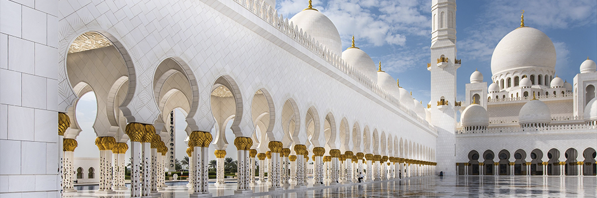

# The Future Is For Islam

- **Category:** 
- **Date:** 27/01/2014
- **Author:** 
- **Source:** https://www.quranproject.org/The-Future-Is-For-Islam-566-d

## Content

The day Islam gave a new concept of values and standards to mankind and showed the way to learn these values and standards, it also provided it with a new concept of human relationships. Islam came to return man to his Sustainer and to make His guidance the only source from which values and standards are to be obtained, as He is the Provider and Originator. All relationships ought to be based through Him, as we came into being through His will and shall return to Him.
Relationship with God
Islam came to establish only one relationship which binds men together in the sight of God, and if this relationship is firmly established, then all other relationships based on blood or other considerations become eliminated;
"You will not find the people who believe in God and the Hereafter taking as allies the enemies of God and His Prophet, whether they be their fathers or sons or brothers or fellow tribesmen."
(58:22)
In the world there is only one party of God; all others are parties of Satan and rebellion;
"Those who believe fight in the cause of God, and those who disbelieve fight in the cause of rebellion. Then fight the allies of Satan; indeed, Satan's strategy is weak."
(3:78)
There is only one way to reach God; all other ways do not lead to Him;
"This is My straight path. Then follow it, and do not follow other ways which will scatter you from His path."
(6:153)
The True System
For human life, there is only one true system, and that is Islam; all other systems are Jahiliyyah;
"Do they want a judgement of the Days of Ignorance? Yet who is better in judgment than God, for a people having sure faith?"
(5:50)
There is only one law which ought to be followed, and that is the Shari'ah from God; what is other than this is mere caprice;
"We have set thee on a way ordained (by God); then follow it, and do not follow the desires of those who have no knowledge."
(45:18)
The truth is one and indivisible; anything different from it is error;
"Is anything left besides error, beyond the truth? Then whither do you go?"
(10:32)
Home of Islam
There is only one place on earth which can be called the home of Islam (Dar-ul-Islam), and it is that place where the Islamic state is established and the Shari'ah is the authority and God's limits are observed, and where all the Muslims administer the affairs of the state with mutual consultation. The rest of the world is the home of hostility (Dar-ul-Harb). A Muslim can have only two possible relations with Dar-ul-Harb: peace with a contractual agreement, or war. A country with which there is a treaty will not be considered the home of Islam.
"Those who believed, and migrated, and strove with their wealth and their persons in the cause of God, and those who gave them refuge and helped them, are the protectors of each other. As to those who believed but did not emigrate, you have no responsibility for their protection until they emigrate; but if they ask your help in religion, it is your duty to help them, except against a people between whom and you there is a treaty; and God sees whatever you do. Those who disbelieve are the allies of each other. If you do not do this, there will be oppression in the earth and a great disturbance. Those who believe, and migrate, and fight in the cause of God, and those who give them refuge and help them, are in truth Believers. For them is forgiveness and generous provision. And those who accept Faith afterwards and migrate and strive along with you, they are of you."
(8:72-75)
Relationships within Islam
Islam came with this total guidance and decisive teaching. It came to elevate man above, and release him from the bonds of the earth and soil. A Muslim has no country except that part of the earth where the Shari'ah of God is established and human relationships are based on the foundation of relationship with God; a Muslim has no nationality except his belief, which makes him a member of the Muslim community in Dar-ul-Islam; a Muslim has no relatives except those who share the belief in God, and thus a bond is established between him and other Believers through their relationship with God.
A Muslim has no relationship with his mother, father, brother, wife and other family members except through their relationship with the Creator, and then they are also joined through blood;
"O mankind, remain conscious of your Sustainer, Who created you from one soul and created from it its mate, and from the two of them scattered a great many men and women. Remain conscious of God, from Whose authority you make demands, and reverence the wombs which bore."
(4:1)
However, Divine relationship does not prohibit a Muslim from treating his parents with kindness and consideration, in spite of differences of belief, as long as they do not join the front lines of the enemies of Islam. However, if they openly declare their alliance with the enemies of Islam, then all the filial relationships of a Muslim are cut off and he is not bound to be kind and considerate to them. Abdullah, son of Abdullah bin Ubayy, has presented us with a bright example in this respect.
Ibn Jarir, on the authority of Ibn Ziad, has reported that the Prophet called Abdullah, son of Abdullah bin Ubayy, and said, "Do you know what your father said?" Abdullah asked, "May my parents be a ransom for you; what did my father say?" The Prophet replied, "He said, "If we return to Medina (from the battle), the one with honour will throw out the one who is despised." Abdullah then said, "O Messenger of God, by God, he told the truth. You are the one with honour and he is the one who is despised. O Messenger of God, the people of Medina know that before you came to Medina, no one was more obedient to his father than I was. But now, if it is the pleasure of God and His Prophet that I cut off his head, then I shall do so." The Prophet replied, "No". When the Muslims returned to Medina, Abdullah stood in front of the gate with his sword drawn over his father's head, telling him, "Did you say that if we return to Medina then the one with honour will throw out the one who is despised? By God, now you will know whether you have honour, or Allah's Messenger, By God, until God and His Messenger give permission, you cannot enter Medina, nor will you have refuge from me!? Ibn Ubayy cried aloud and said twice, "People of Khazraj, see how my son is preventing me from entering my home!" But his son Abdullah kept repeating that unless the Prophet gave permission, he would not let him enter Medina. Hearing this noise, some people gathered around and started pleading with Abdullah, but he stood his ground. Some people went to the Prophet and reported this incident. He told them, "Tell Abdullah to let his father enter". When Abdullah got this message, he then told his father, "Since the Prophet has given permission, you can enter now."
Brotherhood
When the relationship of the belief is established, whether there be any relationship of blood or not, the Believers become like brothers. God Most high says;
"Indeed, the Believers are brothers", which is a limitation as well as a prescription. He also says: "Those who believed and migrated and strove with their wealth and their persons in the cause of God, and those who gave them refuge and helped them, are the protectors of each other."
(8:72)
The protection which is referred to in this verse is not limited to a single generation, but encompasses future generations as well, thus linking the future generations with the past generation in a sacred and eternal bond of love, loyalty and kindness;
"Those who lived (in Medina) before the Emigrants and believed, love the Emigrants and do not find in their hearts any grudge when thou givest them something, but give them preference over themselves, even though they may be poor. Indeed, the ones who restrain themselves from greed, achieve prosperity. Those who came after them (the Emigrants) say: 'Our Lord forgive us and our brothers who entered the faith before us, and leave not in our hearts any grievance against those who believed. Our Lord Thou art indeed Most Kind, Most Merciful.'"
(59:10)
God Most High has related the stories of earlier Prophets in the Qur'an as an example for the Believers. In various periods the Prophets of God lighted the flame of faith and guided the Believers;
"And Noah called upon his Lord and said, 'O my Lord, surely my son is of my family, and thy promise is true, and thou art the Justest of Judges'. He said, 'O Noah, he is not of thy family, as his conduct is unrighteous; so do not ask of me that of which thou hast no knowledge. I give thee the counsel not to act like the ignorant.' Noah said, 'O my Lord, I seek refuge with Thee lest I ask Thee for that of which I have no knowledge, and unless Thou forgive me and have mercy on me, I shall be lost'".
(1:124)
"And when Abraham said, 'My Lord! Make this a city of peace and feed its people with fruits, such of them as believe in God and the Last Day'. He said, 'And those who reject faith, I will grant them their pleasure for a while, but will eventually drive them to the chastisement of the Fire. What an evil destination!"
(2:126)
When the Prophet Abraham saw his father and his people persistent in their error, he turned away from them and said;
"I leave thee and those upon whom thou callest besides God. I will only call upon my Sustainer, and hope that my Lord will not disappoint me."
(19:48)
In relating the story of Abraham and his people, God has highlighted those aspects which are to be an example for the Believers;
"Indeed, Abraham and his companions are an example for you, when they told their people, We have nothing to do with you and with whatever you worship besides God. We reject them; and now there is perpetual enmity and danger between you and us, unless you believe in One God."
(60:4)
When those young and courageous friends who are known as the Companions of the Cave found it impossible to live, with their faith, among their family and tribe, they left them all, migrated from their country, and ran toward their Sustainer so that they could live as His servants;
"They were youths who believed in their Lord, and We advanced them in guidance. We gave strength to hearts, so that they stood up and said, 'Our Lord is the Lord of the heavens and the earth. We shall not call upon any god apart from Him. If we did, we should indeed have said an awful thing. These our people have taken for worship gods other than Him. Why do they not bring a clear proof for what they do? Who can be more wrong than such as invent a falsehood against God? So, when you turn away from them and the things they worship other than God, take refuge in the cave. Your Lord will shower mercies on you and will provide ease and comfort for your affairs!"
(18:13-16)
The wife of Noah and the wife of Lot were separated from their husbands only because their beliefs were different;
"God gives as an example for the unbelievers the wife of Noah and the wife of Lot. They were married to two of Our righteous servants; but they were false to their husbands, and they profited nothing before God on their account, but were told, 'Enter you both into the fire along with those who enter it."
(66:10)
Then there is another kind of example in the wife of Pharaoh;
"And God gives as an example to those who believe the wife of Pharaoh. Behold, she said, 'My Lord, build for me in nearness to Thee a mansion in heaven, and save me from Pharaoh and his doings, and save me from those who do wrong.'"
(66:11)
Similarly, the Qur'an describes examples of different kinds of relationships. In the story of Noah we have an example of the paternal relationship; in the story of Abraham, an example of the son and of the country; in the story of the Companions of the Cave, a comprehensive example of relatives, tribe and home country. In the stories of Noah, Lot and Pharaoh there is an example of marital relationships.
After a description of the lives of the great Prophets and their relationships, we not turn to the Middle Community, that is, that of the early Muslims. We find similar examples and experiences in this community in great numbers. This community followed the Divine path which God has chosen for the Believers. When the relationship of common belief was broken-in other words, when the very first relationship joining one man with another was broken-then persons of the same family or tribe were divided into different groups. God Most High says in praise of the Believers: "You will not find any people who believe in God and the Last Day loving those who fight god and His Messenger, even though they be their fathers or their sons, or their brothers, or their kindred. These are the people on whose hearts God has imprinted faith and strengthened them with a spirit from Himself;
"And He will admit them to Gardens beneath which rivers flow, to dwell therein. God will be well-pleased with them and they with Him. They are the party of God; truly the party of God will prosper."
(58:22)
We see that the blood relationships between Muhammad-peace be on him-and his uncle Abu Lahab and his cousin "Amr bin Hisham (Abu Jahl) were broken and that the Emigrants from Mecca were fighting against their families and relatives and were in the front lines of Badr, while on the other hand, their relations with the Helpers of Medina became strengthened on the basis of a common faith. They became like brothers, even more than blood relatives. This relationship established a new brotherhood of Muslims in which were included Arabs and non-Arabs. Suhaib from Rome and Bilal from Abyssinia and Salman from Persia were all brothers. There was no tribal partisanship among them. The pride of lineage was ended, the voice of nationalism was silenced, and the Messenger of God addressed them:
"Get rid of these partisanships; these are foul things" and "He is not one of us who calls toward partisanship, who fights for partisanship, and who dies for partisanship."
Nationalism
Thus this partisanship-the partisanship of lineage-ended; and this slogan-the slogan of race-died; and this pride-the pride of nationality-vanished; and man's spirit soared to higher horizons, freed from the bondage of flesh and blood and the pride of soil and country. From that day, the Muslim's country has not been a piece of land, but the homeland of Islam (Dar-ul-Islam)-the homeland where faith rules and the Shari'ah of Gold holds sway, the homeland in which he took refuge and which he defended, and in trying to extend it, he became martyred. This Islamic homeland is a refuge for any who accepts the Islamic Shari'ah to be the law of the state, as is the case with the Dhimmies. But any place where the Islamic Shari'ah is not enforced and where Islam is not dominant, becomes the home of hostility (Dar-ul-Harb) for both the Muslim and the Dhimmi. A Muslim will remain prepared to fight against it, whether it be his birthplace or a place where his relatives reside or where his property or any other material interests are located.
Thus Muhammad-peace be on him-fought against the city of Mecca, although it was his birthplace, and his relatives lived there, and he and his Companions had houses and property there, which they had left when they migrated; yet the soil of Mecca did not become Dar-ul-Islam for him and his followers until it surrendered to Islam and the Shari'ah became operative in it.
This, and only this is Islam. Islam is not a few words pronounced by the tongue or birth in a country called Islamic or an inheritance from a Muslim father;
"No, by they Sustainer, they have not believed until they make thee the arbiter of their disputes, and then do not find any grievance against thy decision, but submit with full submission."
(4:65)
Only this is Islam, and only this is Dar-ul-Islam- not the soil, not the race, not the lineage, not the tribe, and not the family.
Islam freed all humanity from the ties of the earth, so that they might soar toward the skies and freed them from the chains of blood relationships-the biological chains- so that they might rise above the angels.
The homeland of the Muslim, in which he lives and which he defends, is not a piece of land; the nationality of the Muslim, by which he is identified, is not the nationality determined by a government; the family of the Muslim, in which he finds solace and which he defends, is not blood relationships; the flag of the Muslim, which he honours and under which he is martyred, is not the flag of a country; and the victory of the Muslim, which he celebrates and for which he is thankful to God, is not a military victory. It is what God has described;
"When God's help and victory comes, and thou seest people entering into God's religion in multitudes, then celebrate the praises of thy Lord and ask His forgiveness. Indeed. He is the Acceptor of Repentance."(110:1-3)
Banner of Faith
The victory is achieved under the banner of faith, and under no other banners; the striving is purely for the sake of God, for the success of His religion and His law, for the protection of Dar-ul-Islam, the particulars of which we have described above, and for no other purpose. It is not for the spoils or for fame, nor for the honour of the country or nation, nor for the mere protection of one's family except when supporting them against religious persecution. Abu Musa relates: "The Prophet-peace be upon him-was asked about one, who fights for bravery, another for honor and another for fame, which one of these is in the cause of God? The Prophet replied, "Only he is for the cause of God who fights so that the word of God may remain supreme."
The honour of martyrdom is achieved only when one is fighting in the cause of God, and if one is killed for any other purpose, this honour will not be attained. Any country which fights the Muslim because of his belief and prevents him from practising his religion, and in which the Shari'ah is suspended is Dar-ul-Harb, even though his family or his relatives or his people live in it, or his capital is invested and his trade or commerce is in that country; and any county where the Islamic faith is dominant and its shari'ah is operative is Dar-ul-Islam, even though the Muslim's family or relatives or his people do not live there, and he does not have any commercial relations with it.
The fatherland is that place where the Islamic faith, the Islamic way of life and the Shari'ah of God is dominant; only this meaning of 'fatherland' is worth of the human being. Similarly, 'nationality' means belief and a way of life, and only this relationship is worth of man's dignity. Grouping according to family and tribe and nation, and race and colour and country are residues of the primitive state of man; these jahili groupings are from a period when man's spiritual values were at a low stage. The Prophet-peace be on him-has called them "dead things" against which man's spirit should revolt. When the Jews claimed to be the chosen people of God, on the basis of their race and nationality, God Most High rejected their claim and declared that in every period, in every race and in every nation, there is only one criterion; that of faith.
"And they say: 'Be Jews, or Christians; then you will be guided'. Say: 'Not so: the way of Abraham, the pure in faith; and he was not among the polytheists.' Say: 'We believe in God, and what has come down to us, and what has come down to Abraham, Ismail and Isaac and Jacob and the Tribes (of Israelites), and what was given to Moses and Jesus and to other Prophets by their Sustainer. We do not make any distinction among the, and we have submitted to Him. If then they believe as you have believed, they are guided; but if they turn away, then indeed they are stubborn. Then God suffices for you, and He is All-Hearing, All-Knowing. The baptism of God and who can baptise better than God? And we worship Him alone."
(2:135-138)
The people who are really chosen by God are the Muslim community which has gathered under God's banner without regard to differences of races, nations, colours and countries;
"You are the best community raised for the good of mankind. You enjoin what is good and forbid what is evil and you believe in God."
(3:110)
This is that community in the first generation of which there were Abu Bakr from Arabia, Bilal from Abyssinia, Suhaib from Syria, Salman from Persia, and their brothers in faith. The generations which followed them were similar. Nationalism here is belief, homeland here is Dar-ul-Islam, the ruler here is God, and the constitution here is the Qur'an. This noble conception of homeland, of nationality and of relationship should become imprinted on the hearts of those who invite others toward God. They should remove all influences of Jahiliyyah which make this concept impure and which may have the slightest element of hidden shirk, such as shirk in relation to homeland, or in relation to race or nation, or in relation to lineage or material interests. All these have been mentioned by God Most High in one verse, in which He has placed them in one side of the balance and the belief and its responsibilities in the other side, and invites people to choose;
"Say: if your fathers and your sons and your brothers and your spouses and your relatives, and the wealth which you have acquired, and the commerce in which you fear decline, and the homes in which you take delight are dearer to you than God and His Messenger and striving in His cause, then wait until God brings His judgement; and God does not guide the rebellious people."
(9:24)
Callers to Islam
Similarly, the callers to Islam should not have any superficial doubts in their hearts concerning the nature of Jahiliyyah and the nature of Islam, and the characteristics of Dar-ul-Harb and of Dar-ul-Islam, for through these doubts many are led to confusion. Indeed, there is no Islam in a land where Islam is not dominant and where its Shari'ah is not established; and that place is not Dar-ul-Islam where Islam's way of life and its laws are not practised. There is nothing beyond faith except unbelief, nothing beyond Islam except Jahiliyyah, nothing beyond the truth except falsehood.
By al-Ustaath Sayyid Qutb
Courtesy Of: Islaam.com