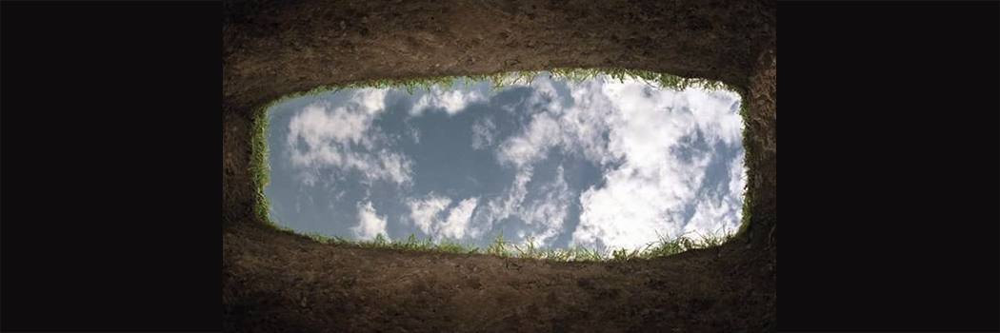

# The Grave

- **Category:** 
- **Date:** 24/02/2013
- **Author:** 
- **Source:** https://www.quranproject.org/The-Grave-297-d

## Content

Just close your eyes and imagine,
You have just one more day to live;
One more day to show Allah,
What "Jannah" He should give?
To say goodbye to your family,
And all your closest friends;
To ask for forgiveness,
And try to make amends;
Just close your eyes and imagine,
Did you miss a prayer or two?
Did you please Allah, and do the things,
He asks every Muslim to do?
Just close your eyes and imagine,
Tomorrow you will be gone;
No more second chances,
To smell the mist of dawn;
Just close your eyes and imagine,
The angels are going to come,
To take your soul and ask,
In your life "what have you done"?
Just close your eyes and imagine,
The words you want to say;
Will not come out you may realize,
For all your deeds you'll pay;
You want to speak out, to cry out,
In Allah I believe;
But, silence beckons you,
No more can u deceive;
Just close your eyes and imagine,
Finally,
Your silence breaks away;
You tell the angels you believe in Allah,
And for Him, you did pray;
You say as tears are pouring down your face
Please, Allah, forgive me,
For the sins that I committed,
Have mercy is my plea!
Just close your eyes and imagine,
That the smell of musk surrounds you,
From your head down to your feet;
You realize Allah forgave you,
Hell fire you did defeat;
But we all know as Muslims,
When it's time for you to die;
You'll not be given a second chance,
To say a last goodbye;
So live each day as If it's your last,
And never forget to pray;
So when the angels come to ask,
You'll know the words to say.
Brother Aboo 'Abdil-Fattaah (hafithahullah)
Source:   missionislam.com  [External/non-QP]