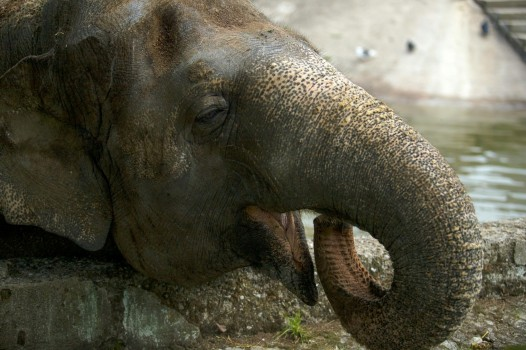

# The Ingenious Design of Animals - Part 1

- **Category:** 
- **Date:** 19/01/2026
- **Author:** ByA.B. al-Mehri
- **Source:** https://www.quranproject.org/The-Ingenious-Design-of-Animals---Part-1-704-d

## Content

The remarkable anatomical precision found in nature's creatures, from the honeybee's electrostatically charged hairs to the earthworm's soil-enriching digestive system, reveals not evolutionary accident but deliberate design, a truth increasingly acknowledged even by former atheists like Antony Flew, who recognized that the integrated complexity of life points unmistakably to an Intelligent Creator.
For most of his career,
Antony Flew was a staunch atheist, famously arguing against the existence of
God. His 1950 essay,
Theology and Falsification
, introduced the
"falsification principle," a key philosophical concept. In this
essay, Flew asserted that religious statements are meaningless unless they can
be tested or potentially falsified, challenging the validity of theological
claims. In a surprising shift, Flew announced in 2004 that he had revised his
beliefs. After examining scientific evidence, particularly in the field of
cosmology, he concluded that he now believes in the existence of God. He then
penned the book,
There Is a God: How the World's Most Notorious Atheist
Changed His Mind.
He writes,
"To the surprise of all
concerned, I announced at the start that I now accepted the existence of a God.
What might have been an intense exchange of opposing views ended up as a joint
exploration of the developments in modern science that seemed to point to a
higher Intelligence. In the video of the symposium, the announcer suggested
that of all the great discoveries of modern science, the greatest was God...
The important point is not merely that there are regularities in nature, but
that these regularities are mathematically precise, universal, and "tied
together." Einstein spoke of them as "reason incarnate." The
question we should ask is how nature came packaged in this fashion. This is
certainly the question that scientists from Newton to Einstein to Heisenberg
have asked and answered. Their answer was the Mind of God…
There were two factors
in particular that were decisive. One was my growing empathy with the insight
of Einstein, and another noted scientists that there had to be an Intelligence
behind the integrated complexity of the physical Universe. The second was my
own insight that the integrated complexity of life itself - which is far more
complex than the physical Universe - can only be explained in terms of an
Intelligent Source. I believe that the origin of life and reproduction simply
cannot be explained from a biological standpoint, despite numerous efforts to
do so. With every passing year, the more that was discovered about the richness
and inherent intelligence of life, the less it seemed likely that a chemical
soup could magically generate the genetic code. The difference between life and
non-life, it became apparent to me, was ontological and not chemical. The best
confirmation of this radical gulf is Richard Dawkins' comical effort to argue
in The God Delusion that the origin of life can be attributed "to a lucky
chance." If that's the best argument you have, then the game is over. No,
I did not hear a Voice. It was the evidence itself that led me to this
conclusion."
(1)
The truth is that,
increasingly for many in the Western scientific community, of all the
discoveries of modern science - the greatest was
God
. Founder of
NASA's Goddard Institute for Space Studies, Robert Jastrow, remarks,
"For the scientist who
has lived by his faith in the power of reason, the story ends like a bad dream.
He has scaled the mountains of ignorance; he is about to conquer the highest
peak; as he pulls himself over the final rock, he is greeted by a band of
theologians who have been sitting there for centuries."
(2)
The Ingenious Design of
Animals
الَّذِي أَحْسَنَ كُلَّ شَيْءٍ خَلَقَهُ
"Who perfected everything which He created..."
(3)
God has created all the
animals on Earth, and a comprehensive study of the internal and external
characteristics reveals a remarkable level of purpose and precision in their
design. Each species displays an anatomy meticulously suited to its unique
role, from the intricate functions of internal organs to the specialised
structures of external limbs. Whether it's through specialised feeding
structures, reproductive systems, or sensory organs, each species interacts in
a web of symbiotic relationships that collectively support the greater good of
the ecosystem. This interconnectedness highlights an extraordinary level of
design that cannot be denied. Symbiosis is the intricate and essential
interdependence between different species and demonstrates how organisms are
designed for each other. Each of the species listed below plays a vital role in
its ecosystem, engages in symbiotic relationships, and has biological traits
finely tuned to fulfil its ecological purpose. Such unity and mutual dependence
simply cannot be attributed to chance or randomness. They point unmistakably to
deliberate design - to God whose wisdom and power encompasses every living
being.
Honeybee
Pollinates plants, which is vital for food
production and the health of ecosystems.
Anatomy:
Honeybees are anatomically specialised to
pollinate
plants
efficiently, with several unique physical features that enable them to collect
and transfer pollen between flowers, supporting food production and ecosystem
health.
Body Hair:
Honeybees
     are covered in branched, feather-like hairs called plumose hairs, which increase
     surface area and make them exceptionally effective at capturing pollen.
     When they land on a flower, these hairs trap pollen grains from the
     flower's anthers (the part that produces pollen).
Electrostatic Charge:
As
     bees fly, their bodies become positively charged through the movement of
     their wings, which attracts the negatively charged pollen grains. This
     electrostatic effect helps pollen stick to the bee's body, enhancing its
     ability to collect and carry pollen.
Pollen Baskets (Corbiculae):
On their hind legs, honeybees have specialised
     structures called pollen baskets, or corbiculae. These are concave areas
     surrounded by a fringe of stiff hairs, which bees use to pack collected
     pollen for transport. They gather the pollen from their body hairs using
     their forelegs, transferring it to the baskets on their hind legs.
Long Proboscis:
Honeybees
     have a specialised, elongated mouthpart called a proboscis, which allows
     them to drink nectar from flowers. While feeding, their body comes into
     contact with the flower's reproductive organs, thereby transferring pollen
     from one flower to another.
Leg Anatomy for Grooming:
Honeybees have unique structures on their legs,
     including the tibial comb and auricle, which they use to groom and
     transfer pollen to the pollen baskets. These anatomical features help bees
     efficiently collect pollen from their body, facilitating their role as
     pollinators.
Compound Eyes and UV Vision:
Honeybees' compound eyes are sensitive to
     ultraviolet light, which helps them locate flowers more easily. Many
     flowers have UV patterns that guide bees to the centre of the flower,
     where the reproductive organs are located, ensuring efficient pollen
     transfer. (4)
Reflection:
The honeybee is far more than a simple
pollinator; it is a living system of precision engineering. Every part of its
anatomy - from its electrostatically charged hairs to the ultraviolet-sensitive
eyes that detect floral patterns. Its design is not just efficient; it is
interdependent. The bees' existence directly supports the flowering plants it
visits, which in turn sustain entire food chains, including humanity itself.
Such an arrangement cannot be reduced to mere coincidence. The bee's branched
hairs, pollen baskets, and proboscis form a sequence of mechanisms that operate
as a unified system - nonmeaningful without the others, yet all necessary for
pollination to occur. This interlocking functionality mirrors the logic of
design found throughout the natural world: features that make sense only in
relation to their purpose and design. When one considers the honeybee within
the broader ecological network, the illusion of randomness falls apart. It is
not only that the bee fits its role perfectly, but that the ecosystem relies on
its fulfilment of that role. The precise compatibility between the bee's
biology and the needs of flowering plants reveals a coherence that defies
chance - clear signs of design by God.
Earthworm
Aerates (introduces air) and enriches soil
by breaking down organic matter, which improves soil fertility.
Anatomy:
Earthworms have segmented muscular bodies
covered in tiny bristles (setae) that help them burrow through soil. As they
tunnel, they create channels that aerate the ground. Their digestive system
processes organic matter, breaking it down and releasing nutrient-rich
castings, which significantly enhance soil structure and fertility.
Segmented, Muscular Body:
Earthworms have a long, segmented body composed
     of circular and longitudinal muscles, which allows them to burrow through
     soil. By contracting and expanding these muscles, earthworms push and pull
     their way through the soil, creating tunnels that improve aeration and
     soil structure.
Bristles (Setae):
Tiny
     bristles called setae, located on each segment, provide traction as they
     move through the soil. These bristles help earthworms grip and push
     against the soil, making their burrowing more efficient. This process
     loosens compacted soil, improving aeration and drainage.
Moist Skin for Gas Exchange:
Earthworms breathe through their skin, which must
     stay moist to facilitate gas exchange. As they move through the soil, they
     introduce moisture, aiding in the breakdown of organic matter and making
     nutrients more accessible to plants.
Digestive System for Organic Matter Breakdown:
Earthworms consume soil and organic matter, which
     is broken down in a specialised digestive system that includes a crop and
     gizzard. The gizzard grinds the ingested material, while enzymes in the
     intestines further decompose it. This process transforms organic matter
     into nutrient-rich castings, which are expelled as a form of natural
     fertiliser, enhancing soil fertility.
Ability to Ingest Large Quantities of Soil:
Earthworms can process large volumes of soil and
     organic material daily. As they ingest and process soil, they mix organic
     and mineral layers, distributing nutrients throughout the soil profile and
     creating a more fertile environment for plants. (5)
Reflection -
Every aspect of the earthworm's anatomy is
precisely suited for its role in sustaining life beneath the surface. Its
segmented, muscular body and tiny bristles work together to aerate the soil,
creating the very channels that allow air and water to reach plant roots. Its
moist skin enables gas exchange, while its digestive system transforms decaying
organic matter into nutrient-rich fertiliser that restores and enriches the
earth. The worm's design forms a seamless chain of interdependent functions -
burrowing, breathing, digesting, and fertilising - each relying on the other to
complete the process of soil renewal. The earthworm does not simply exist in
the ecosystem; it sustains it. Its unseen labour turns death into life, maintaining
the fertility on which entire ecosystems depend. The coherence between its
anatomy and its ecological function is unmistakable - a silent signature of
deliberate design by God.
Elephant
Acts as a
"keystone
species" (6)
by dispersing seeds, clearing vegetation, and creating
water access points, benefiting various ecosystems.
Anatomy:
Elephants possess strong trunks that allow
them to uproot trees, strip bark, and dig for water, reshaping landscapes for
other species. Their large molars grind tough vegetation, aiding seed dispersal
through dung that fertilises the soil. Their massive size and padded feet
enable them to create pathways and open spaces in dense habitats, directly
influencing ecosystem structure and biodiversity.
Large Trunk:
The
     elephant's trunk, an extended fusion of the upper lip and nose, has over
     40,000 muscles and is highly dexterous. It allows elephants to reach high
     branches, strip leaves, break branches, and even uproot small trees,
     effectively shaping the vegetation in their habitat. The trunk's strength
     and flexibility enable elephants to manipulate their environment, making
     it possible to open up landscapes and create pathways that benefit other
     species.
Digestive System Adapted for Bulk Feeding:
Elephants have a simple, non-ruminant digestive
     system that processes a large amount of plant material quickly. They eat
     hundreds of pounds of vegetation daily, including fruits, leaves, bark,
     and grasses, which they only partially digest. Seeds that pass through
     their digestive system are left in nutrient-rich droppings, enhancing seed
     germination and supporting plant diversity across large distances.
Massive Body Size and Strength:
Their powerful legs and robust bodies allow
     elephants to push over trees and clear vegetation. This action opens up
     forested areas, making way for grasslands and providing food sources for
     other herbivores. Their size also enables them to dig water holes during
     dry seasons, using their tusks and trunks to access underground water,
     creating valuable water sources for other animals.
Large Feet Adapted for Diverse Terrains:
Elephants have large, padded feet that distribute
     their weight effectively, allowing them to traverse various terrains
     without sinking, even when digging for water. These feet also help compact
     soil around trails and waterholes, creating well-worn paths that benefit
     smaller animals. (7)
Reflection -
Every part of the Elephant is precisely
suited for shaping and sustaining ecosystems. Its trunk acts as both a delicate
instrument and a tool of immense power - designed for uprooting trees, digging
for water, and clearing pathways that create access for countless other
species. Its vast body and padded feet reshape landscapes as it moves, while
its digestive system disperses and fertilises seeds over huge distances,
renewing plant life wherever it travels. Its molars contribute to its mobility,
aligning perfectly with this ecological purpose. The elephant's design operates
not in isolation but in sync with its surroundings.
(Taken
from the book:
‘God: There is
No Doubt!’
)
Footnotes
(1) Antony Flew, There is A God: How the World's Most Notorious Atheist Changed His Mind, HarperOne and “Exclusive Flew Interview,” by Benjamin Wiker, To The Source.
(2) Robert Jastrow, God and the Astronomers. Founder of NASA’s Goddard Institute for Space Studies. Werner Heisenberg, theoretical physicist and one of the key pioneers of quantum mechanics (best known for the 'Heisenberg Uncertainty Principle') is reported to have said “The first gulp from the glass of natural sciences will turn you into an atheist, but at the bottom of the glass God is waiting for you.”
(3) Surah as-Sajdah 32:7.
(4) A. M. Klein, Importance of Pollinators in Changing Landscapes for World Crops and M. L. Winston, The Biology of the Honey Bee. Harvard University Press.
(5) Clive A. Edwards and Patrick J. Bohlen, Biology and Ecology of Earthworms. Springer Science.
(6) A keystone species is a species that has a disproportionately large impact on its ecosystem relative to its abundance. These species play a critical role in maintaining the structure, diversity, and functioning of their environment. The presence or absence of a keystone species can significantly affect other species and the overall ecosystem dynamics.
(7) C. J. Moss, H. Croze, and P. Lee, The Amboseli Elephants: A Long-Term Perspective on a Long-Lived Mammal. University of Chicago Press.