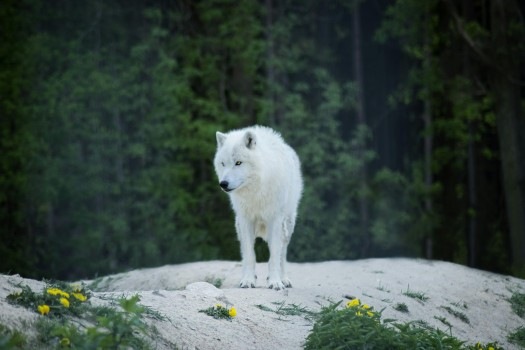

# The Ingenious Design of Animals - Part 2

- **Category:** 
- **Date:** 23/01/2026
- **Author:** ByA.B. al-Mehri
- **Source:** https://www.quranproject.org/The-Ingenious-Design-of-Animals---Part-2-705-d

## Content

The intricate anatomical designs of wolves, vultures, and beavers reveal how each species is purposefully equipped to fulfill critical ecological roles, demonstrating that the harmony between form, function, and environmental impact points to intelligent design rather than random chance.
Wolf
Regulates prey populations, like deer and elk, which prevents
overgrazing and maintains plant diversity.
Anatomy:
Wolves have powerful
jaws with sharp carnassial teeth designed to tear flesh, supported by strong
jaw muscles that allow them to bring down large prey. Their lean, muscular
bodies and long legs enable endurance hunting over vast territories, while
acute senses of smell and hearing help track animals. This anatomy equips
wolves to control herbivore populations effectively, indirectly protecting
vegetation and overall
ecosystem
balance.
Powerful Muscles and Limbs:
Wolves have strong, muscular legs that allow them to
     run at high speeds (up to 40 mph) for short bursts and endure long
     distances while tracking prey. This endurance and speed enable them to
     pursue large animals, like deer and elk, through rough terrains and across
     vast areas, making them effective hunters capable of impacting prey
     populations.
Sharp Teeth and Strong Jaws:
Wolves have 42 teeth, including long canine teeth and
     carnassials (sharp, scissor-like molars), which are specially adapted for
     tearing and cutting flesh. Their jaw muscles are powerful, allowing them
     to deliver a strong bite force to take down and efficiently consume large
     prey. This dental structure supports their role as apex predators, helping
     control populations of large herbivores.
Senses of Smell and Hearing:
Wolves have an acute sense of smell - estimated to be
     100 times stronger than that of humans - and highly developed hearing.
     These senses allow them to detect prey from miles away, aiding in tracking
     and coordinating group hunts, which are crucial for managing populations
     of large and agile animals like elk.
Pack Structure and Social Coordination:
Wolves are social animals that hunt in packs, allowing
     them to take down prey much larger than a single wolf could manage alone.
     Each pack member has a role, and their cooperative hunting strategy
     increases hunting success. This social structure enables wolves to control
     populations of herbivores that would otherwise contribute to overgrazing,
     helping to preserve plant diversity. (1)
Reflection -
When wolves were reintroduced to Yellowstone National Park, US, in 1995 after a
seventy-year absence, the ecosystem underwent a remarkable change. By preying
on overabundant elk, wolves reduced overgrazing, allowing vegetation such as
willows to recover. This regrowth stabilised riverbanks, leading to clearer
streams and the return of beavers, birds, and fish. As prey behaviour changed -
avoiding certain areas - plants and trees flourished once more, attracting
insects and smaller mammals. What began as the return of a single species
sparked a chain reaction of restoration, demonstrating how one well-designed
predator can revive the balance and health of an entire ecosystem.
Vulture
Scavenges carcasses, which helps prevent disease spread by quickly
disposing of dead animals.
Anatomy:
Vultures have bald
heads and necks that prevent feathers from becoming soiled with blood while
feeding, reducing infection risk. Their strong, hooked beaks are adapted to
tear through tough hides, and their highly acidic stomachs can safely digest
decaying flesh and kill dangerous pathogens. With keen eyesight and broad wings
for soaring long distances, vultures are perfectly equipped to locate and clean
up carrion, protecting ecosystems from disease outbreaks.
Strong, Hooked Beak:
Vultures have powerful, hooked beaks that are
     specifically adapted to tear through tough skin, muscle, and other tissues
     of carcasses. This beak structure allows them to access meat on even
     larger animals efficiently and quickly, breaking down remains that would
     otherwise attract pathogens.
Highly Acidic Stomach:
Vultures possess one of the most acidic stomachs in
     the animal kingdom, with stomach acid strong enough to kill many harmful
     bacteria and pathogens found in rotting carcasses, such as anthrax,
     botulism, and rabies. This adaptation allows them to consume decomposing
     animals without getting sick and prevents the spread of disease into the
     environment.
Featherless Head and Neck:
Most vulture species have bare skin on their heads and
     necks, an adaptation that helps them stay clean when feeding on carcasses.
     By reducing the amount of feathers in contact with blood and decaying
     matter, they can avoid contamination and minimise the build-up of bacteria
     on their bodies.
Keen Eyesight:
Vultures have excellent eyesight, allowing them to spot carcasses from
     high in the sky, often over several miles. This sharp vision helps them
     locate food sources quickly, contributing to their efficiency as
     scavengers and enabling them to dispose of dead animals before pathogens
     spread.
Long, Broad Wings:
Vultures have large, broad wings adapted for soaring at great heights with
     minimal energy expenditure. This allows them to cover vast distances in
     search of carrion, further enhancing their role in ecosystem clean up. (2)
Reflection -
The vulture is far more than a scavenger; it is nature's sanitation system,
designed to protect life through death. Every part of its anatomy serves a
precise hygienic function. Its bald head and neck prevent the build-up of
bacteria while feeding on carcasses, its hooked beak tears through hide and
tissue with surgical precision, and its highly acidic stomach neutralises
deadly pathogens such as anthrax and rabies. What would otherwise spread
disease and decay is swiftly transformed into renewal through this remarkable
design. Its broad wings allow it to soar effortlessly across vast distances,
scanning the ground below with extraordinary vision to locate the remains of
the dead before they can become a source of infection. This ensures that
disease does not take hold and that the cycle of life continues unbroken. The
vulture does not merely consume, it purifies. Such refinement of purpose cannot
be reduced to chance. Every aspect of the vulture's anatomy and behaviour
functions toward a greater good, maintaining the delicate health of the
ecosystem. Did it evolve itself to fulfil this purpose?
Beaver
Constructs dams that create wetlands, supporting biodiversity by
providing habitat for many species.
Anatomy:
Beavers have strong,
chisel-like incisors that grow continuously, perfectly adapted for gnawing
through wood to cut down trees and branches for dam building. Their powerful
jaws and muscular bodies allow them to transport heavy logs, while their broad,
flat tails provide balance on land and propulsion in water. Webbed hind feet
make them efficient swimmers, enabling them to construct and maintain dams and
lodges that transform landscapes into rich wetland ecosystems.
Strong Incisors:
Beavers have large, continuously growing incisors with
     hard, orange enamel on the front surface and softer dentin on the back.
     This unique structure sharpens their teeth as they gnaw, enabling them to
     cut down trees and branches with ease. These powerful teeth are essential
     for gathering the wood and building materials needed for dam construction.
Robust Jaw Muscles:
Beavers have exceptionally strong jaw muscles that allow them to exert the
     necessary force to gnaw through wood efficiently. Their jaws are designed
     to withstand the stress of constant chewing, making them effective at
     modifying their environment by felling trees and manipulating large
     branches.
Webbed Hind Feet:
Beavers' hind feet are webbed, which makes them strong swimmers. This
     adaptation is crucial for their ability to move materials and navigate
     aquatic environments where they build their dams and lodges. Their
     swimming ability allows them to carry heavy branches and other building
     materials across water to the dam site.
Large, Flat Tail:
The broad, flat tail of the beaver serves multiple purposes. It acts as a
     rudder while swimming, provides balance while gnawing on trees, and can be
     used to slap the water as an alarm signal to warn other beavers of danger.
     The tail's versatility supports beavers in their roles as builders and
     aquatic engineers.
Waterproof Fur:
Beavers have dense, waterproof fur that insulates them in cold water. This
     design allows them to work in waterlogged environments comfortably and
     spend extended periods in the water to gather materials and build their
     structures without suffering from exposure. (3)
Reflection -
The beaver is far more than a builder - it is an ecological engineer, designed
to transform barren landscapes into thriving wetlands. Every part of its
anatomy serves this purpose. Its ever-growing incisors, strengthened by
iron-rich enamel, cut cleanly through wood, while its powerful jaws and
muscular body enable it to transport heavy logs with ease. Its broad, flat tail
provides balance on land and functions as both a rudder and a warning signal in
water, while its webbed feet and waterproof fur make it perfectly designed for
an aquatic lifestyle. Through these traits, the beaver performs one of nature's
most extraordinary feats of environmental design - the construction of dams and
lodges that reshape entire ecosystems. By slowing water flow, its dams create
wetlands that become sanctuaries for fish, birds and countless other species.
These wetlands filter water, prevent floods, and sustain biodiversity,
demonstrating that the beaver's instinctive engineering achieves what even
advanced human planning often struggles to accomplish: stable, self-renewing
ecosystems. Can such harmony between anatomy, instinct, and ecological impact
be attributed to mere accident?
(Taken from the book:
‘
God: There is
No Doubt!
’
)
Footnotes
(1) Mech, L. D., & Boitani, L. Wolves: Behaviour, Ecology, and Conservation. University of Chicago Press.
(2) D. C. Houston, Vultures and Condors. Facts on File.
(3) Dietland Müller-Schwarze and Lixing Sun, The Beaver: Natural History of a Wetlands Engineer. Cornell University Press, p. 45.