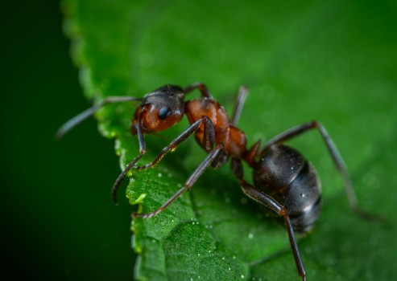

# The Ingenious Design of Animals - Part 3

- **Category:** 
- **Date:** 23/01/2026
- **Author:** ByA.B. al-Mehri
- **Source:** https://www.quranproject.org/The-Ingenious-Design-of-Animals---Part-3-706-d

## Content

The intricate anatomical designs and behavioral patterns of ants, tigers, and monarch butterflies, along with the precise coordination of symbiotic relationships in nature, demonstrate purposeful engineering that sustains ecosystem balance and reveals the wisdom of an intelligent Creator.
Ant
Aerates and enriches soil, disperses seeds, and
controls pest populations, promoting healthy ecosystems.
Anatomy:
Ants have strong mandibles that allow them to dig intricate
tunnel systems, which aerate and mix the soil, improving its fertility. Many
species collect and transport seeds, some of which are left behind to
germinate, aiding
plant reproduction
. Their cooperative colonies can overwhelm
and control pest populations, while their small, segmented bodies and jointed
legs make them agile movers through soil and vegetation. Ants' social
organisation and specialised castes further enhance their ability to maintain
ecosystem balance.
Strong
     Mandibles:
Ants have powerful mandibles
     (jaws) that they use to dig intricate tunnel networks underground. These
     tunnels aerate the soil by allowing air and water to penetrate deeper
     layers, which benefits root systems and microbial activity. The mandibles
     also allow ants to carry soil particles, seeds, and prey, supporting their
     role as ecosystem engineers.
Jointed Legs and Compact Body:
Ants' bodies are segmented with three main parts:
     head, thorax, and abdomen. Their jointed legs give them agility and
     strength relative to their size, enabling them to move through narrow
     tunnels and manipulate objects much larger than themselves. This strength
     and flexibility are crucial for digging, constructing nests, and
     relocating soil particles, all of which contribute to soil aeration.
Petioles (Waist Segments):
Many ant species have one or two petiole segments
     between the thorax and abdomen, creating a flexible "waist" that
     allows greater movement and control. This adaptability enables ants to
     maneuver through tunnels and narrow spaces while carrying items, making
     them efficient at transporting seeds and prey.
Mouthparts for Seed Handling
     and Grooming:
Ants possess specialised
     mouthparts designed for grasping, cutting, and carrying. Many ant species
     collect seeds and carry them to underground storage chambers, contributing
     to seed dispersal and plant diversity. Their grooming abilities also help
     control pest populations, as ants meticulously clean their bodies and
     nests, reducing disease spread within the colony.
Chemical Communication
     (Pheromones):
Ants use chemical signals, or
     pheromones, to communicate with colony members and coordinate tasks like
     foraging and defence. These pheromones are essential for organizing
     large-scale pest control operations and for guiding other ants to specific
     seeds or food sources, enhancing their efficiency in seed dispersal and
     pest management. (1)
Reflection -
Ants are essential architects of healthy ecosystems by tunnelling
through the ground, ants aerate the soil, allowing water and nutrients to
penetrate more deeply and promoting root development. Their constant activity
helps decompose organic matter and recycle nutrients that enrich the earth.
Their anatomy and behaviour all demonstrating signs of pure design and purpose.
Tiger
Maintains prey populations, which influences
vegetation and overall forest health in its habitat.
Anatomy:
Tigers possess powerful jaws with long canines and sharp
carnassial teeth designed to pierce and shear flesh. Their muscular bodies,
retractable claws, and padded paws enable silent stalking and explosive bursts
of speed to ambush prey. Striped fur provides camouflage in forested habitats,
enhancing hunting efficiency. These anatomical adaptations make the tiger an
apex predator, regulating herbivore numbers and sustaining the ecological
balance of its ecosystem.
Powerful
     Muscular Build:
Tigers are highly muscular,
     especially in their forelimbs, which allows them to tackle and overpower
     large prey such as deer, wild boar, and antelope. This muscular build
     enables them to deliver powerful blows and maintain a strong grip on their
     prey, essential for hunting large herbivores that would otherwise
     overgraze vegetation.
Sharp Retractable Claws:
Tigers have sharp, retractable claws that they use to
     grip and immobilize prey. These claws help them capture and hold onto prey
     animals, making them effective hunters. Retractability also ensures that
     their claws stay sharp by minimizing wear, which is vital for their
     hunting efficiency.
Strong Jaws and Sharp Teeth:
Tigers possess large canines and strong jaw muscles
     that enable them to deliver a killing bite to the neck or throat of prey.
     This is essential for subduing and killing large animals quickly, making
     them efficient predators that can impact prey populations and prevent
     overgrazing.
Keen Senses of Sight and
     Hearing:
Tigers have excellent night
     vision, which allows them to hunt effectively in low light conditions when
     many prey animals are active. They also have highly developed hearing,
     helping them detect even slight movements in dense forests, which is
     crucial for stalking and ambushing prey.
Camouflaged Fur (Stripes):
A tiger's coat features distinctive stripes that help
     it blend into the forest and grassland environments, breaking up its
     outline and making it difficult for prey to spot them. This camouflage is
     essential for ambushing prey, as it allows them to get close before
     attacking, conserving energy and ensuring hunting success. (2)
Reflection
- Tigers are critical to the environment because they serve as
apex predators by maintaining balance of the entire ecosystems. By preying on
herbivores such as deer, tigers prevent overgrazing and allow vegetation to
regenerate, which in turn supports a wide range of species and preserves
healthy forests. The tiger's role reveals an ecological intelligence embedded
in its very form with its physical power, stealth, and instincts - these are not
random traits but elements of a perfectly integrated design. Where tigers
thrive, forests remain vibrant; where they vanish, ecosystems deteriorate. This
delicate interdependence between predator, prey, and vegetation speaks to a
purposeful order - manifests the wisdom of God who engineered it with
precision, foresight, and intent.
Monarch Butterfly
Pollinates many wildflowers and serves as an
indicator species for the health of ecosystems.
Anatomy:
Monarch butterflies have long, coiled proboscises adapted for
sipping nectar from deep within flowers, making them efficient pollinators.
Their lightweight wings with distinctive orange and black patterns (3) enable
long-distance migration, a rare trait among insects, allowing them to connect
ecosystems across continents. Sensitive to environmental changes, their
delicate exoskeletons and reliance on specific host plants (like milkweed) make
them key indicators of ecosystem health and stability.
Long,
     Coiled Proboscis:
Monarchs have a specialised mouthpart called a proboscis, which they
     uncoil to drink nectar from flowers. This proboscis allows them to reach
     deep into various flowers, coming into contact with pollen. As they move
     from flower to flower, they transfer pollen, aiding in the pollination of
     wildflowers, which is essential for biodiversity in many ecosystems.
Lightweight, Flexible Wings:
Monarchs have large, lightweight wings with a high
     surface area that allows for long-distance migration. These wings make
     them agile fliers, enabling them to visit numerous flowers over large
     distances, which increases their role in pollinating diverse plant species
     along their migratory route. Their migratory patterns also make them an
     excellent indicator species, as they respond to changes in climate,
     habitat quality, and food availability across their route.
Scaly Legs and Body for Pollen
     Transfer:
The scales on monarchs' legs
     and body can pick up and transfer pollen grains as they feed on flowers.
     Monarchs contribute to the pollination of various plant species,
     especially milkweeds, which are crucial to their life cycle and are
     ecologically significant in their habitats.
Bright Coloration as a Warning
     Signal:
Monarch butterflies' distinct
     orange and black colouring serves as an aposematic (warning) signal to
     predators, indicating their toxicity due to milkweed ingestion. This
     bright coloration allows them to thrive in open, flower-rich habitats
     without significant predation, facilitating their role in pollination.
     Additionally, as indicator species, their population health and migration
     success reflect environmental factors that impact other species and
     overall ecosystem health.
Monarch Butterfly
An example of generational instinct
The monarch butterfly is an amazing example of
generational design and instinct. In one season of the year, four generations
of monarchs travel up to 3,000 miles from Mexico to Canada and back. It begins
in early spring, when monarchs from the super generation (which overwintered in
Mexico) begin the journey northward. They lay eggs in the southern United
States, and these eggs hatch into the first generation. Then for the second and
third generation, they continue moving northward covering around 500 miles each
generation living for about 2-6 weeks as adults. Then in late summer the fourth
generation is born, called "super generation." Unlike its
predecessors, this generation doesn't reproduce immediately but instead embarks
on the epic journey back to Mexico, where its great-grandparents once resided.
This "super generation" lives for about eight months, completing the
cycle and laying the groundwork for the next year's migration. (4)
Symbiotic Relationships
Symbiotic relationships involve mutually
beneficial relationships between two different species. For example, certain
flowers have specific colours, shapes, and nectar rewards to attract specific
bees, butterflies, or birds, while the pollinators have specialised feeding
structures suited to these floral features.
The flower's stigma gently brushes against the
top of the hummingbird's head, ensuring that pollen is deposited as the bird
reaches for its reward - the nectar deep within. The flower's structure is
designed so that it would be nearly impossible for the bird to access the
nectar without making direct, intentional contact with its reproductive parts,
thereby facilitating effective pollination.
Evolutionists attempt to explain the symbiotic
relationships in nature as, "the process by which two or more species
influence each other's evolutionary pathways over time, often resulting in
mutually beneficial adaptations or closely linked survival strategies." (5) Yet,
this explanation attributes to animals a kind of awareness and creative
intelligence that borders on science fiction. Are we really to believe that an
animal somehow decides to change itself - altering its colour or developing a
new feature, and then miraculously encoding that modification into its DNA? How
could a creature with no foresight or plan anticipate that another species
would also evolve in perfect synchrony to sustain the relationship? And how
could this change be coordinated, communicated, and preserved through countless
generations? If one pauses to think about this, realises how irrational this
claim is - "the works of God plainly argue the vileness and perverseness
of the atheist"
. (6)
Conclusion
From the microscopic tunnels of the ant to the three-thousand-mile journey of the Monarch, we see a world that is not merely "surviving," but one that is exquisitely choreographed. The tiger’s stealth, the butterfly’s generational memory, and the "locked-and-key" symbiosis between flower and bird all point to a singular truth: nature is a unified tapestry. These are not the disjointed products of blind mutations; they are the intentional expressions of a Creator whose wisdom encompasses the smallest insect and the vastest forest. When we see such perfect coordination between species that cannot speak to one another, we realize they are all following the script of the One who created them. God exists, and there is no doubt!
(Taken from the book
:
‘
God: There is No Doubt!
’)
Footnotes
(1) B. Hölldobler and E. O. Wilson, The Ants. Harvard University Press, p. 240.
(2) M. Sunquist and F. Sunquist, Wild Cats of the World. University of Chicago Press.
(3) Their distinctive orange and black wing pattern is more than ornamental - it serves as a warning signal to predators that monarchs are toxic due to compounds absorbed from milkweed. The black pigmentation also aids in thermoregulation during flight, while the coloration helps individuals recognise their own species during migration and mating.
(4) F. A. Urquhart, and N. R. Urquhart, Autumnal Migration Routes of the Eastern Population of the Monarch Butterfly in North America to the Overwintering Site in the Neo-Volcanic Plateau of Mexico.
(5) J.N. Thompson, The Coevolutionary Process.
(6) Nick Spencer, Atheists: The Origin of the Species. Bloomsbury Publishing.