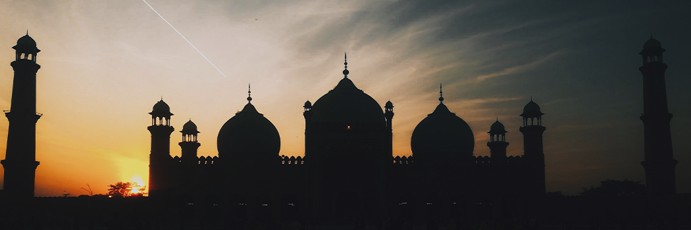

# The Inner Secrets of Fasting

- **Category:** 
- **Date:** 26/02/2013
- **Author:** 
- **Source:** https://www.quranproject.org/The-Inner-Secrets-of-Fasting-395-d

## Content

Indeed, the fast is only virtuous due to two significant concepts. Firstly, it is a secret and hidden action thus, no one from the creation is able to see it. Therefore showing off cannot enter into it. Secondly, it is a means of subjugating the enemies of Allah. This is because the road that the enemies (of Allah) embark upon (in order to misguide the Son of Adam) is that of desires..
Know that in the fast is a special quality that is not found in anything else. And that is its close connection to Allah, such that He says:
"The fast (Sawm) is for Me and I will reward it."
This connection is enough to show the high status of fasting. Similarly, the Ka`bah is highly dignified due to its close connection to Him, as occurs in His statement,
"And sanctify My House."
Indeed, the fast is only virtuous due to two significant concepts. Firstly, it is a secret and hidden action thus, no one from the creation is able to see it. Therefore showing off cannot enter into it. Secondly, it is a means of subjugating the enemies of Allah.
This is because the road that the enemies (of Allah) embark upon (in order to misguide the Son of Adam) is that of desires. And eating and drinking strengthens the desires. There are many reports that indicate the merits of fasting, and they are all well known.
The recommended acts of fasting
The pre-dawn meal (suhur) and delaying in taking it are preferable, as well as hastening to break the fast and doing so with dates. Generosity in giving is also recommended during Ramadan, as well as doing good deeds and increasing in charity. This is in accordance with the way of the Messenger of Allah (peace be upon him).
It is also recommended to study the Qur'an and perform i`tikaaf during Ramadan, especially in the last ten days, as well as increasing upon the exertion (towards doing good deeds) in it.
In the two Sahihs, `Aa'ishah said,
"When the (last) ten days (of Ramadan) would come, the Prophet would tighten his waist-wrapper, spend the night in worship, and wake his family up (for prayer)."
The scholars have mentioned two views concerning the meaning of "tighten his waist-wrapper": The first: It means the turning away from women.
The second: It is an expression denoting his eagerness and diligence in doing good deeds. They also say that the reason for his (peace be upon him) exertion in the last ten days of Ramadaan was due to his (peace be upon him) seeking of the Night of Power (Lailatul-Qadr).
An explanation of the inner secrets of fasting and its characteristics
There are three levels of fasting: The general fast, the specific fast, and the further specific fast. As for the general fast, then it is the refraining of the stomach and the private parts from fulfilling their desires. The specific fast is the refraining of one’s gaze, tongue, hands, feet, hearing and eyes, as well as the rest of his body parts from committing sinful acts.
As for the more specific fast, then it is the heart's abstention from its yearning after the worldly affairs and the thoughts which distance one away from Allah, as well as its (the heart's) abstention from all the things that Allah has placed on the same level.
From the characteristics of the specific fast is that one lowers his gaze and safeguards his tongue from the repulsive speech that is forbidden, disliked, or which has no benefit, as well as controlling the rest of his body parts.
In a hadith reported by al-Bukhari:
"Whosoever does not abandon false speech and the acting upon it, Allah is not in need of him leaving off his food and drink."
Another characteristic of the specific fast is that one does not overfill himself with food during the night.
Instead, he eats in due measure, for indeed, the son of Adam does not fill a vessel more evil than his stomach. If he were to eat his fill during the first part of the night, he would not make good use of himself for the remainder of the night. In the same way, if he eats to his fill for suhur, he does not make good use of himself until the afternoon. This is because excessive eating breeds laziness and lethargy.
Therefore, the objective of fasting disappears due to one's excessiveness in eating, for what is intended by the fast is that one savours the taste of hunger and becomes one who abandons desires.
Recommended Fasts
As for the recommended fasts, then know that preference for fasting is established in certain virtuous days. Some of these virtuous days occur every year, such as fasting the first six days of the month of Shawwal after Ramadan, fasting the day of `Arafah, the day of `Ashura, and the ten days of Dhul-Hijjah and Muharram.
Some of them occur every month, such as the first part of the month, the middle part of it, and the last part of it. So whoever fasts the first part of the month, the middle part of it, and the last part of it, then he has done well. Some fasts occur every week, and they are every Monday and Thursday.
The most virtuous of the recommended fasts is the fast of Dawud (peace be upon him). He would fast one day and break his fast the next day. This achieves the following three objectives: The soul is given its share on the day the fast is broken.
And on the day of fasting, it completes its worship in full. The day of eating is the day of giving thanks and the day of fasting is the day of having patience. And Faith is divided into two halves - that of thankfulness and that of patience. It is the most difficult struggle for the soul. This is because every time the soul gets accustomed to a certain condition, it transfers itself to that.
As for fasting every day, then it has been reported by Muslim, from the hadith of Abu Qatadah, `Umar (may Allah be pleased with him) asked the Prophet (peace be upon him):
'What is the case if one were to fast every day?' So he (peace be upon him) said: "He did not fast nor did he break his fast - or - he did not fast and he did not break his fast." This is concerning the one who fasts continuously, even during the days in which is forbidden
Characteristics of the most specific fast
Know that the one who has been given intellect, knows the objective behind fasting. Therefore, he burdens himself to the extent that he will not be unable to do that which is more beneficial than it. Ibn Mas`ood would fast very little and it is reported that he used to say:
"When I fast, I grow weak in my prayer. And I prefer the prayer over the (optional) fast." Some of them (the Sahabah) would weaken in their recitation of the Qur'an whilst fasting.
Thus, they would exceed in breaking their fast (i.e. by observing less optional fasts), until they were able to balance their recitation. Every individual is knowledgeable of his condition and of what will rectify it
Source:  Ibn Qudamaah al-Maqdisi [External/non-QP] [External/non-QP]