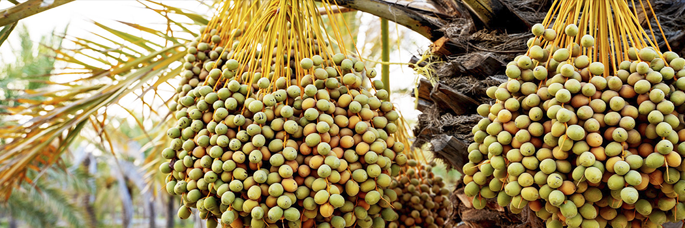

# The Likeness of Ramadan and Prophet Yusuf

- **Category:** 
- **Date:** 11/07/2013
- **Author:** 
- **Source:** https://www.quranproject.org/The-Likeness-of-Ramadan-and-Prophet-Yusuf-499-d

## Content

"The month of Ramadan to the other months is like Yusuf to his brothers. So, just like Yusuf was the most beloved son to Ya'qub, Ramadan is likewise the most beloved month to Allah.''
A nice point for the nation of Muhammad (saw) to ponder over is that if Yusuf had the mercy and compassion to say
"There is no reproach for you today..."
[I]
Ramadan is likewise the month of mercy, blessing, goodness, salvation from the Fire, and Forgiveness from the King that exceeds that of all the other months and what can be gained from their days and nights.
Another nice point to think about is that Yusuf's brothers came to rely on him to fix their mistakes after all those they had made. So, he met them with kindness and helped them out, and he fed them while they were hungry and allowed them to return, and he told his servants:
"Carry their belongings with you so that they don't lose them."
So, one person filled the gaps of eleven others, and the month of Ramadan is likewise one month that fills the gaps of our actions over the other eleven months. Imagine the gaps and shortcoming and deficiency we have in obeying Allah!
We hope that in Ramadan, we are able to make up for our shortcomings in the other months, to rectify our mistakes, and to cap it off with happiness and firmness on the Rope of the Forgiving King.
Another point is that Ya'qub had eleven sons who were living with him and whose actions he would see at all times, and his eyesight did not return because of any of their clothing. Instead, it returned due to Yusuf's shirt. His eyesight came back strong, and he himself became strong after he was weak, and seeing after he was blind.
Likewise, if the sinner smells the scents of Ramadan, sits with those who remind him of Allah, recites the Qur'an, befriends on the condition of Islam and faith, and avoids backbiting and vain talk, he will (by Allah's Will) become forgiven after he was a sinner, he will become close after he was far, he will be able to see with his heart after it was blind, his presence will be met with happiness after it was met with repulsion, he will be met with mercy after he was met with disdain, he will be provided for without limit or effort on his part, he will be guided for his entire life, he will have his soul dragged out with ease and smoothness when he dies, he will be blessed with Forgiveness when he meets Allah, and he will be granted the best levels in the Gardens of Paradise.
So, by Allah, take advantage of this greatness during these few days and you will soon see abundant blessing, high levels of reward, and a very long period of rest and relaxation by the Will of Allah.
By Allah, this is the true relaxation..."
I: Surah Yusuf: 92
Source: Ibn al-Jawzi [External/ Non-QP]
'Bustan al-Wa'idhin wa Riyad as-Sami'in' (p. 213-214).