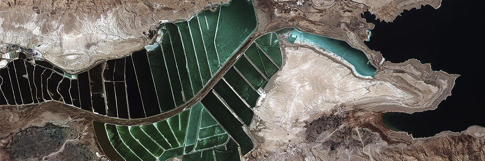

# The Lowest area on Earth

- **Category:** 
- **Date:** 13/04/2013
- **Author:** 
- **Source:** https://www.quranproject.org/The-Lowest-area-on-Earth-462-d

## Content

Allah, the Almighty, says:
“Alif­ Lam­ Mim, The Romans have been defeated in the lowest land, and they, after their defeat, will be victorious within three to nine years. The decision of the matter, before and after (these events) is only with Allah, (before the defeat of the Romans by the Persians, and after, i.e. the defeat of the Persians by the Romans). And on that Day, the believers (i.e. Muslims) will rejoice (at the victory given by Allah to the Romans against the Persians). With the help of Allah, He helps whom He wills, and He is the Almighty, the Most Merciful. (It is) a Promise of Allah (i.e. Allah will give victory to the Romans against the Persians), and Allah fails not in His Promise, but most of men know not”(I)
The Historical Facts:
History books tell us about a battle between the Persian and the Byzantine empires – the latter signifies the eastern part of the Roman Empire - which was located in the area between Adhra`at and Basra, near the Dead Sea. The battle, which occurred in 619 A.C., ended with the victory of the Persians.
The Romans received a severe blow in that battle and everyone at that time expected their kingdom to fall. Surprisingly, they were engaged in another battle in 627 A.C. in the area of Nineveh where they defeated the Persians and occupied many areas. Some months later, the Byzantines signed an agreement with the Persians according to which they returned all previously occupied areas.
Geographical atlases show that the lowest spot on the surface of the earth is the area near the Dead Sea where the surface of the earth is as low as 395 meters below sea level. Photos taken by satellites support this fact.
Facets of Historic Inimitability:
There are two miracles in these verses:
1. The Ever-Glorious Qur'an gave glad tidings of victory to the Romans in a course of three to nine years. After seven years, the prophecy of the Ever-Glorious Qur'an came true. This Roman victory coincided with the victory of the Muslims in the Battle of Badr. To the Arab disbelievers, the victory of the Romans seemed impossible and they started mocking the Muslims and ridiculing them about these Qura’nic words. When the prophecy came true, they were disappointed and humbled.
2. They told us about a geographical fact that was not known to anyone at that time. The verses said that the Romans would lose the battle in the lowest area of land which means that it is the nearest place to the Arabian Peninsula and is the lowest spot on earth; it is 1,312 feet (around 400 meters) below sea level. According to the Encyclopaedia Britannica, satellites have recorded that it is indeed the lowest spot on earth. Historical facts testify that the battle took place at the lowest spot on earth; near to the Dead Sea. At that time, it was impossible for anyone to know this was the lowest area on earth.
Does this not provide even more evidence that the Ever-Glorious Qur'an is the word of Allah? Almighty Allah says:
"And say [(O Muhammad) to these polytheists and pagans etc.: All the praises and thanks be to Allah. He will show you His Ayat (signs, in yourselves, and in the universe or punishments, etc.), and you shall recognize them. And your Lord is not unaware of what you do"(II)
I: Surah Ar-Rum: V 1-6
II: Surah An-Naml: V 93
Source: International Commission on Scientific Signs in the Qur'an and the Sunnah [External/non-QP]