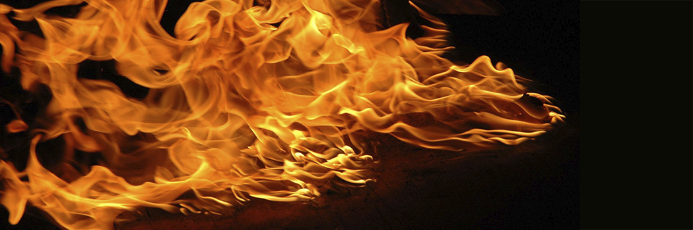

# The Major Sins

- **Category:** 
- **Date:** 24/02/2013
- **Author:** 
- **Source:** https://www.quranproject.org/The-Major-Sins-304-d

## Content

The major sins are those acts which have been forbidden by Allah in the Quran and by His Messenger (SAW) in the Sunnah (practise of the Prophet), and which have been made clear by the actions of of the first righteous generation of Muslims, the Companions of the Prophet (SAW).
Allah Most High says in His Glorious Book:
"If you avoid the major (part) of what you have been forbidden (to do), We will cancel out for you your (other) evil deeds and will admit you (to Paradise) with a noble entry."
(Qur'an al-Nisa 4:31)
Thus by this verse, Allah Most High has guaranteed the Garden of Paradise to those who avoid the major sins. And Allah Most High also says:
"
Those who avoid the greatest of sins and indecencies, and forgive when they are angry"
(Qur'an 42:37)
Those who avoid the greatest sins and indecencies, except for oversights, (will find that) surely your Lord is ample in forgiveness." Qur'an Al-Najm 53:32
The Messenger of Allah (s.a.w) said:
"The five [daily] prayers, Friday to Friday, and Ramadan to Ramadan make atonement for what has happened since the previous one when major sins have been avoided."
It is therefore very important to determine exactly what the greatest vices, technically called "the major sins" (Kaba'ir), are, in order that Muslims should avoid them.
There is some difference of opinion among scholars in this regard. Some say these major sins are seven, and in support of their position they quote the tradition: "Avoid the seven noxious things"- and after having said this, the propeht (SAW) mentioned them:
"associating anything with Allah; magic; killing one whom Allah has declared inviolate without a just case, consuming the property of an orphan, devouring usury, turning back when the army advances, and slandering chaste women who are believers but indiscreet."
(Bukhari and Muslim)
'Abdullah ibn 'Abbas said:
"Seventy is closer to their number than seven,"
and indeed that is correct. The above tradition does not limit the major sins to those mentioned in it. Rather, it points to the type of sins which fall into the category of "major." These include those crimes which call for a prescribed punishment; plural, such as theft, fornication or adultery, and murder; those prohibited acts for which a warning of a severe punishment in the Next is given in the Qur'an or the tradition; and also those deeds which are cursed by our Prophet (s.a.w). These are all major sins.
Of course, there is a gradation among them, since some are more serious than others. We see that the Prophet (s.a.w) has included Shirk (associating someone or something with Allah) among them, and from the text of the Qur'an we know that a person who commits Shirk will not his sin be forgiven and will remain in Hell forever.
Allah Most High says:
"Surely, Allah does not forgive associating anything with Him, and He forgives whatever is other than that to whomever He wills"(
Qur'an al-Nisa 4:48 see 116)
01. Associating anything with Allah
02. Murder
03. Practising magic
04. Not Praying
05. Not paying Zakat
06. Not fasting on a Day of Ramadan without excuse
07. Not performing Hajj, while being able to do so
08. Disrespect to parents
09. Abandoning relatives
10. Fornication and Adultery
11. Homosexuality(sodomy)
12. Interest(Riba)
13. Wrongfully consuming the property of an orphan
14. Lying about Allah and His Messenger
15. Running away from the battlefield
16. A leader's deceiving his people and being unjust to them
17. Pride and arrogance
18. Bearing false witness
19. Drinking Khamr (wine)
20. Gambling
21. Slandering chaste women
22. Stealing from the spoils of war
23. Stealing
24. Highway Robbery
25. Taking false oath
26. Oppression
27. Illegal gain
28. Consuming wealth acquired unlawfully
29. Committing suicide
30. Frequent lying
31. Judging unjustly
32. Giving and Accepting bribes
33. Woman's imitating man and man's imitating woman
34. Being cuckold
35. Marrying a divorced woman in order to make her lawful for the husband
36. Not protecting oneself from urine
37. Showing-off
38. Learning knowledge of the religion for the sake of this world and concealing that knowledge
39. Betrayal of trust
40. Recounting favours
41. Denying Allah's Decree
42. Listening (to) people's private conversations
43. Carrying tales
44. Cursing
45. Breaking contracts
46. Believing in fortune-tellers and astrologers
47. A woman's bad conduct towards her husband
48. Making statues and pictures
49. Lamenting, wailing, tearing the clothing, and doing other things of this sort when an affliction befalls
50. Treating others unjustly
51. Overbearing conduct toward the wife, the servant, the weak, and animals
52. Offending one's neighbour
53. Offending and abusing Muslims
54. Offending people and having an arrogant attitude toward them
55. Trailing one's garment in pride
56. Men's wearing silk and gold
57. A slave's running away from his master
58. Slaughtering an animal which has been dedicated to anyone other than Allah
59. To knowingly ascribe one's paternity to a father other than one's own
60. Arguing and disputing violently
61. Withholding excess water
62. Giving short weight or measure
63. Feeling secure from Allah's Plan
64. Offending Allah's righteous friends
65. Not praying in congregation but praying alone without an excuse
66. Persistently missing Friday Prayers without any excuse
67. Unsurping the rights of the heir through bequests
68. Deceiving and plotting evil
69. Spying for the enemy of the Muslims
70. Cursing or insulting any of the Companions of Allah's Messenger
Source: missionislam.com [External/non-QP]