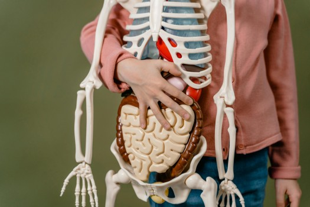

# The Miraculous Design of Human Biology

- **Category:** 
- **Date:** 23/01/2026
- **Author:** ByA.B. al-Mehri
- **Source:** https://www.quranproject.org/The-Miraculous-Design-of-Human-Biology-707-d

## Content

The intricate design and seamless coordination of biological organs, from the brain's computational power to the precision of human reproduction, reveal a level of complexity and
purposeful engineering
that points unmistakably to an intelligent Creator rather than random evolutionary processes.
Biological organs – functions
سَنُرِيهِمْ آيَاتِنَا
فِي الْآفَاقِ وَفِي أَنفُسِهِمْ حَتَّىٰ يَتَبَيَّنَ لَهُمْ أَنَّهُ الْحَقُّ
"We shall show them Our signs in the
horizons and within themselves until it becomes clear to them that this is the
truth."
(1)
Every organ in the body works in seamless,
coordinated perfection. The heart pumps blood, the lungs oxygenate it, the
brain directs responses, the digestive system breaks down food, and the
endocrine system regulates metabolism through finely-tuned hormones. Each
system is specialized yet interdependent—a masterpiece of biological design
that points toward an intelligent Creator.
The Brain
is arguably the most complex structure in existence, performing
an estimated one quintillion (10^18) calculations per second using only about
20 watts of power—less than a light bulb. It contains over 80 billion neurons (2),
each forming thousands of connections, creating trillions of synaptic links.
Electrical impulses travel along nerve fibers at speeds up to 270 mph (3), relaying
messages without delay. No human-made communication network even comes close to
the brain’s sophistication.
The Eye
is an engineering marvel with an effective resolution of several
hundred megapixels, distinguishing around 10 million colors. It self-cleans,
lubricates, and protects itself with tears containing antibacterial enzymes.
The retina captures up to 15 images per second—over a million per day—and
refreshes instantly (4). Charles Darwin himself admitted the seeming absurdity of
such an organ evolving by chance:
"To suppose that the eye, with all its
inimitable contrivances ... could have been formed by natural selection, seems,
I freely confess, absurd in the highest possible degree."
(5)
The Ear
mastered wireless sound reception long before human technology.
The cochlea contains about 15,000 hair cells, each tuned to specific
frequencies, creating a detailed sound map for the brain to interpret. (6)
The Heart
beats around 100,000 times per day—2.5 billion times in a
lifetime—without stopping. It pumps about 1.5 gallons of blood per minute
through 60,000 miles of vessels, enough to circle the Earth twice. (7)
Digestion
works like a precision factory: food is tasted, crushed,
moistened, and directed to the stomach, where millions of cells produce enzymes
and acids to break it down. The stomach holds about 5 million such cells, the
intestines 40 million, and the liver over 3.5 billion. These not only digest
but also defend against diseases like cholera and dysentery. (8)
The Lungs
fill over 300 million tiny alveoli with each breath—covering
about 100 square yards if laid flat. Capillaries wrap around each air sac,
exchanging oxygen and carbon dioxide with remarkable efficiency, processing
over 7,000 liters of blood daily. (9)
DNA
is the ultimate blueprint of life, storing vast information in a
microscopic structure. It functions like advanced computer code, using just
four nucleotide bases (A, T, G, C) to encode instructions for building
proteins. Richard Dawkins called it
"uncannily computer-like,"
(10) and Bill Gates said it is
"far, far more advanced than any software
we've ever created."
(11) Francis Collins, who led the Human Genome
Project, wrote:
"When you have for the first time in front
of you this 3.1 billion-letter instruction book that conveys all kinds of
information, and you realize it's about you, it is a moment of awe. It is a
moment that brings you closer to God."
(12)
Anthony Flew also acknowledged:
"What I think the DNA material has done is
that it has shown ... that intelligence must have been involved in getting
these extraordinarily diverse elements to work together."
(13)
Reproduction – A Treasury of Signs
وَمِن كُلِّ شَيْءٍ
خَلَقْنَا زَوْجَيْنِ لَعَلَّكُمْ تَذَكَّرُونَ
"And of everything We created pairs, so
that you may be mindful."
(14)
Across species—birds, fish, mammals—life is
divided into male and female, each anatomically and physiologically designed to
complement the other. This universal reproductive design reflects a unifying
blueprint from one Creator.
During fertilization, sperm and egg each
contribute 3 billion DNA base pairs, aligning perfectly to form a complete
genome. The probability of such precise alignment by chance is practically
zero. The male and female reproductive organs are anatomically and physiologically
matched in form and function, coordinated even in arousal responses—clear
evidence of intentional design.
Human cells contain 46 chromosomes, except sex
cells (sperm and egg), which have 23 each. The sperm is uniquely designed with
a tail for motility, guided by structures in the female reproductive tract.
Sperm are stored in the testes at a temperature 2–4°C lower than body
temperature—a precise adaptation for viability.
Atheists must ask: How could such a
synchronized, interdependent system arise by chance? If reproduction evolved
gradually, how did species survive while male and female systems were still
incompatible? The harmony and precision point unmistakably to design.
Programmed Cell Death
After fertilization, stem cells multiply
rapidly. At a critical stage, apoptosis (programmed cell death) sculpts
the embryo—for example, separating fingers and toes from webbed structures. Who
programmed this death process?
During pregnancy, the placenta allows nutrient
and oxygen transfer without mixing maternal and fetal blood—a protective
design. As birth approaches, the hormone
relaxin
loosens pelvic
ligaments, the cervix softens and dilates, and the baby’s skull remains
partially unfused with soft spots (
fontanelles
) to ease passage through
the birth canal.
A mother’s breasts prepare to produce milk only
after birth, perfectly timed to nourish the newborn. Each step—from conception
to delivery to lactation—unfolds in precise, interdependent sequence, defying
random chance.
Conclusion
From the digital code of DNA to the precision of the beating heart, human biology is not a collection of accidents, but a sanctuary of Divine signs. We carry within ourselves a level of technology that humbles the most advanced supercomputers and engineering feats of man. As the Qur’an suggests, these signs are placed within us so that the truth becomes clear. When we look at the seamless coordination required for a single breath or the miracle of a new life, we find that the body does not just function—it speaks. It testifies to a Creator whose knowledge is infinite and whose design is perfect. Indeed, God exists, and there is no doubt!
(Taken from the book:
‘God: There is
No Doubt!
’
)
Footnotes
(1) Surah Fussilat 41:53.
(2) E. R. Kandel, Schwartz, J. H., & Jessell, T. M. Principles of Neural Science. McGraw-Hill Education.
(3) M. F. Bear, B. W. Connors and M. A. Paradiso, Neuroscience: Exploring the Brain. Wolters Kluwer
(4) R. L. De Valois, and K. K. De Valois, Spatial Vision. Oxford University Press.
(5) Charles Darwin, On the Origin of Species, Ch. 6, “Difficulties on Theory,” p. 186.
(6) E. R. Kandel, J. H. Schwartz and T. M. Jessell, Principles of Neural Science. McGraw-Hill.
(7) R. E. Klabunde, Cardiovascular Physiology Concepts. Lippincott Williams & Wilkins.
(8) W. F. Boron and E. L. Boulpaep, Medical Physiology. Elsevier, p. 912.
(9) E. R. Weibel, The Pathway for Oxygen: Structure and Function in the Mammalian Respiratory System. Harvard University Press.
(10) Richard Dawkins, River Out of Eden: A Darwinian View of Life.
(11) Bill Gates, The Road Ahead, p. 188.
(12)  Francis S. Collins, The Language of God: A Scientist Presents Evidence for Belief. Free Press, p. 3.
(13) Anthony Flew and Roy Abraham Varghese, There Is a God: How the World's Most Notorious Atheist Changed His Mind. HarperOne, p. 75.
(14) Surah adh-Dhariyat 51:49.